## Información General

|Campo|Detalle|
|---|---|
|Máquina|El Archivero|
|Plataforma|whoami-labs|
|Sistema Operativo|Linux (Debian 13, "trixie")|
|Dirección IP|172.17.0.2|
|Servicios expuestos|22/tcp (SSH), 80/tcp (HTTP - SimpleHTTPServer)|
|Dificultad|Fácil|
|Vector de acceso inicial|Credenciales en texto plano expuestas en un log de acceso listado por directory listing|
|Vector de escalada|Capability `cap_dac_read_search` en `/usr/bin/tar`|

## Resumen del Ataque

El servicio web no es una aplicación real, sino un `SimpleHTTPServer` de Python sirviendo un directory listing sin restricciones. Navegando por las carpetas expuestas se llega a un fichero `access.log` que, en lugar de registrar solo métodos y códigos de estado como cabría esperar de un log bien configurado, incluye en texto plano el cuerpo de una petición `POST /api/auth` con usuario y contraseña. Estas credenciales permiten el acceso por SSH. Al igual que en casos anteriores, no hay `sudo` ni binarios SUID aprovechables, pero la enumeración de Linux Capabilities revela que `/usr/bin/tar` tiene asignada `cap_dac_read_search`, lo que permite leer cualquier archivo del sistema empaquetándolo con `tar` y extrayendo su contenido a stdout, sin pasar por los controles de permisos habituales.

## Técnicas Usadas

- Escaneo de puertos y detección de servicios/versiones con Nmap
- Explotación de directory listing sin protección (Apache/SimpleHTTPServer mal configurado)
- Extracción de credenciales desde un log de aplicación expuesto públicamente
- Reutilización de credenciales para acceso SSH
- Enumeración de binarios SUID (`find -perm -4000`)
- Enumeración de Linux Capabilities (`getcap -r /`)
- Abuso de `cap_dac_read_search` en `tar` para lectura arbitraria de archivos (bypass de permisos vía empaquetado y extracción a stdout)

## Desarrollo

### 1. Escaneo inicial de puertos

```
nmap -p- -sS --min-rate 5000 -n -vvv -Pn -oN ports 172.17.0.2
```

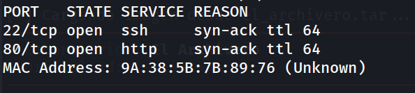

Dos puertos abiertos: SSH (22) y HTTP (80).

### 2. Enumeración de servicios y versiones

```
nmap -p 22,80 -sC -sV -oN allports 172.17.0.2
```

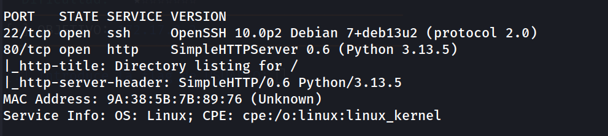

El servicio web es un `SimpleHTTPServer` de Python, cuyo título ya delata un directory listing activo. Se procede a navegar la raíz del servidor.

### 3. Directory listing de la raíz

```
http://172.17.0.2/
```

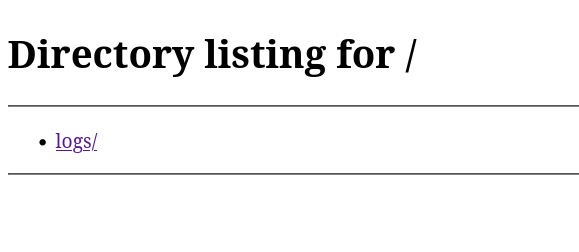

Hay un único directorio expuesto: `logs/`.

### 4. Directory listing de /logs/

```
http://172.17.0.2/logs/
```

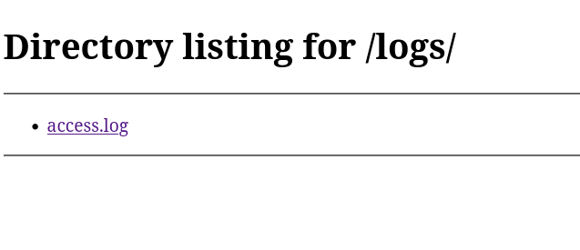

Dentro se encuentra `access.log`, un fichero de logs accesible sin ninguna restricción.

### 5. Descarga e inspección del log

Se descarga `access.log` y se identifica el tipo de fichero antes de visualizarlo:

```
file access.log       
```

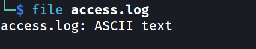

```
cat access.log       
```

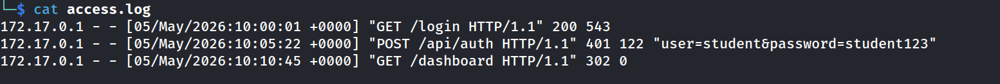

La segunda línea del log registra el cuerpo completo de una petición `POST /api/auth`, incluyendo usuario y contraseña en texto plano:

```
user=student
password=student123
```

Un fallo de logging clásico: la aplicación (o un proxy delante de ella) está registrando el payload completo de las peticiones de autenticación, incluidas las credenciales, en lugar de redactarlas o excluir ese endpoint del logging detallado.

### 6. Acceso por SSH

```
ssh-keygen -f '/home/kali/.ssh/known_hosts' -R '172.17.0.2'
ssh student@172.17.0.2
```

```
student@80aeec976ef0:~$ whoami
```

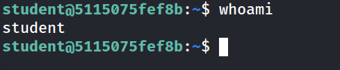

Acceso inicial confirmado como el usuario `student`.

### 7. Enumeración de usuarios del sistema

```
student@80aeec976ef0:~$ grep bash /etc/passwd
```

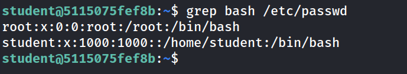

Solo `root` y `student` tienen shell interactiva.

### 8. Intento de escalada vía sudo (descartado)

```
student@80aeec976ef0:~$ sudo -l
```

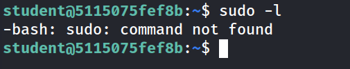

`Sudo` no está instalado en el sistema. Se descarta esta vía.

### 9. Enumeración de binarios SUID (sin hallazgos explotables)

```
student@80aeec976ef0:~$ find / -perm -4000 -type f 2>/dev/null
```

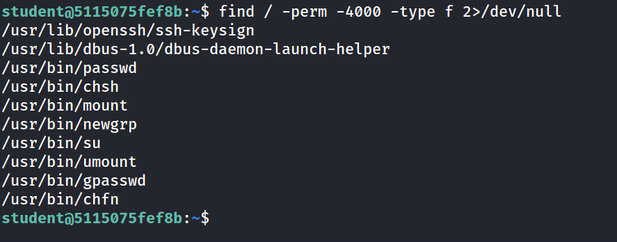

Binarios SUID estándar, sin ninguna vía de escalada evidente. Se pivota nuevamente a Linux Capabilities.

### 10. Enumeración de Linux Capabilities

```
student@5115075fef8b:~$ getcap -r / 2>/dev/null
```

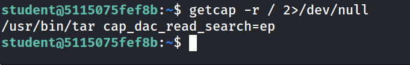

`/usr/bin/tar` tiene asignada `cap_dac_read_search`, que permite saltarse las comprobaciones de permisos de lectura sobre archivos y directorios. Esto es explotable empaquetando el archivo objetivo y extrayéndolo a stdout.

### 11. Lectura de la flag de root abusando de tar

```
student@80aeec976ef0:~$ tar -cvf root.tar /root/root.txt
```

```
student@80aeec976ef0:~$ tar -xvf root.tar -O
```

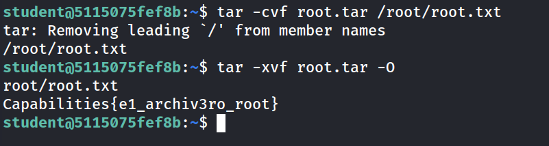

Al tener `tar` la capability activa, el propio proceso puede leer `/root/root.txt` pese a que `student` no tendría permisos directos sobre ese archivo, y volcar su contenido a stdout con la opción `-O`.

### 12. Flag de usuario

```
student@80aeec976ef0:~$ cat user.txt 
```

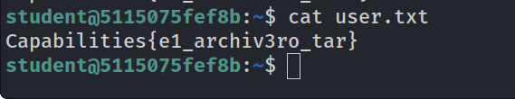

## Flags

```
Capabilities{e1_archiv3ro_tar}
Capabilities{e1_archiv3ro_root}
```

## Lecciones Aprendidas

- Un directory listing abierto convierte cualquier archivo "olvidado" en el document root en un activo expuesto públicamente; los logs de aplicación son especialmente peligrosos porque a menudo contienen datos de peticiones completas.
- El logging de peticiones de autenticación debe redactar explícitamente campos sensibles (contraseñas, tokens, cabeceras de autorización); registrar el body completo de un `POST /api/auth` es un antipatrón grave incluso en entornos de desarrollo.
- La ausencia de `sudo` y de binarios SUID explotables no cierra la puerta a la escalada: `tar` con `cap_dac_read_search` es un vector tan efectivo como cualquier SUID clásico, y es una técnica que se repite en este tipo de entornos.
- Herramientas de uso muy común (`tar`, `vim.tiny`, etc.) con capabilities de lectura/escritura arbitraria son, en la práctica, equivalentes a un shell con permisos elevados para acceso a archivos.

## Medidas de Mitigación

- Deshabilitar el directory listing en el servidor web (o, mejor aún, no exponer directorios de logs bajo el document root en absoluto).
- Redactar o excluir explícitamente del logging cualquier campo sensible en peticiones de autenticación (contraseñas, tokens, cookies de sesión).
- Rotar y almacenar los logs fuera del árbol servido por el servidor web, con permisos restringidos y, si es necesario retenerlos, cifrados en reposo.
- Auditar periódicamente las capabilities asignadas a binarios del sistema (`getcap -r /`) y retirar `cap_dac_read_search`, `cap_dac_override` u otras capabilities de lectura/escritura arbitraria de cualquier binario que no las necesite explícitamente.


