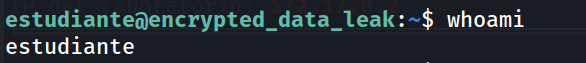
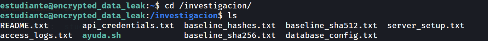
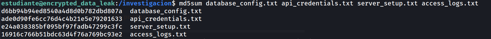
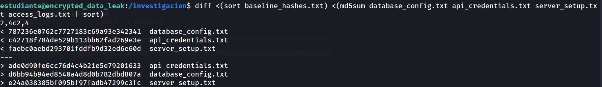
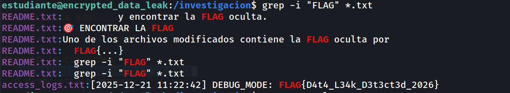
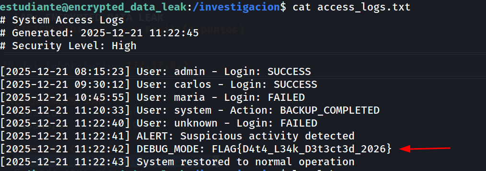

## Información General

|Campo|Valor|
|---|---|
|**Plataforma**|whoami-labs|
|**Dificultad**|Fácil|
|**IP Objetivo**|172.17.0.2|
|**Autor**|elc0ket|

**Credenciales SSH proporcionadas:**

```
Usuario:   estudiante
Password:  student2026
```

```
ssh estudiante@localhost -p 2222
```

---

## Resumen del Ataque

Este laboratorio simula un escenario de **respuesta a incidentes / detección de manipulación de archivos** más que una explotación activa. Se parte de acceso SSH ya proporcionado y un directorio `/investigacion/` con 4 archivos de configuración/logs y sus respectivos hashes de referencia (baseline) en MD5, SHA256 y SHA512.

El objetivo es detectar cuál(es) de los 4 archivos fueron alterados comparando sus hashes actuales contra el baseline, y localizar dentro del archivo modificado una flag que un atacante dejó oculta camuflada como una línea de log de depuración (`DEBUG_MODE`).

**Vector del "ataque" simulado:** Manipulación de un archivo de logs (`access_logs.txt`) para insertar una entrada falsa de depuración conteniendo la flag, evadiendo una revisión superficial pero detectable mediante verificación de integridad por hash.

---

## Técnicas Usadas

|Fase|Técnica|Herramienta|
|---|---|---|
|Acceso|Conexión autenticada por credenciales provistas|`ssh`|
|Verificación de integridad|Generación de hashes actuales de los archivos|`md5sum`|
|Verificación de integridad|Comparación masiva contra baseline (detección de alteraciones)|`diff` + `sort`|
|Búsqueda de indicadores|Búsqueda de patrones de flag en todos los archivos de texto|`grep -i`|
|Análisis de log|Inspección manual de la entrada anómala en el log|`cat`|

---

## Desarrollo

### 1. Acceso y enumeración inicial

```
ssh estudiante@localhost -p 2222
```




```
cd /investigacion/
ls
```



### 2. Generación de hashes actuales

```
md5sum database_config.txt api_credentials.txt server_setup.txt access_logs.txt
```


### 3. Comparación contra el baseline

En lugar de comparar archivo por archivo, se ordena y compara todo el bloque contra `baseline_hashes.txt` en una sola pasada:

```
diff <(sort baseline_hashes.txt) <(md5sum database_config.txt api_credentials.txt server_setup.txt access_logs.txt | sort)
```



**Interpretación clave:** el `diff` muestra 3 líneas del lado del baseline (`<`) frente a 3 líneas del lado actual (`>`) para `database_config.txt`, `api_credentials.txt` y `server_setup.txt` — es decir, esos 3 archivos cambiaron de hash. **`access_logs.txt` no aparece en ninguno de los dos bloques**, lo que significa que su hash coincide exactamente con el baseline y por tanto, según el `diff`, no fue modificado en apariencia... pero el propio README advertía que 4 archivos habían sido "tocados" y solo uno contenía la flag, así que se procede a inspeccionar todos igualmente en vez de descartar por descarte.
### 4. Búsqueda dirigida de la flag

```
grep -i "FLAG" *.txt
```



### 5. Confirmación en contexto

```
cat access_logs.txt
```



La flag aparece justo entre una alerta de "actividad sospechosa" y la restauración del sistema — consistente con un atacante insertando una entrada falsa de depuración durante una ventana de acceso no autorizado detectada por el propio sistema.

**Flag:** `FLAG{D4t4_L34k_D3t3ct3d_2026}`

---

## Lecciones Aprendidas

- **El hash coincidente no siempre significa "no tocado" en el sentido que se espera.** Aunque `access_logs.txt` no apareció en el `diff` de discrepancias frente a `baseline_hashes.txt`, la flag estaba precisamente ahí. Esto refuerza que la verificación por hash detecta _si el archivo cambió respecto a una foto anterior_, pero no dice nada por sí sola sobre _cuándo_ fue generado ese baseline — si el baseline se tomó **después** de que el atacante insertara la flag, el archivo "coincide" y aun así contiene la manipulación. La lección práctica: nunca asumas que un baseline es confiable sin verificar también su fecha/origen de generación.
- **No descartar archivos "limpios" en un análisis forense.** El README avisaba que los 4 archivos habían sido "tocados"; confiar ciegamente en que el `diff` señalaría el único culpable habría hecho pasar por alto el archivo correcto si no se hubiera lanzado igualmente el `grep -i FLAG` sobre todos.
- **Combinar múltiples técnicas de verificación (hash + búsqueda de patrones + revisión manual de contexto)** es más robusto que confiar en una sola señal. El `diff` de hashes dio la primera pista de qué archivos cambiaron, pero fue el `grep` dirigido el que realmente localizó el indicador de compromiso.
- **Las entradas de log con nombres "inocentes" como `DEBUG_MODE` son un vector clásico de camuflaje** para dejar datos sensibles o mensajes de un atacante en sistemas de producción; en una investigación real, cualquier entrada de depuración inesperada en logs de producción merece revisión inmediata.

---

## Medidas de Mitigación

|Hallazgo|Riesgo|Recomendación|
|---|---|---|
|Modo de depuración (`DEBUG_MODE`) activo/loggeado en producción|Alto|Deshabilitar logging de depuración en entornos de producción; separar niveles de log (`DEBUG` nunca debe escribirse en logs accesibles en producción).|
|Baseline de integridad generado sin control de procedencia/temporalidad verificable|Medio|Firmar criptográficamente los baselines de integridad (ej. con GPG) y almacenarlos en un sistema de solo lectura o WORM, generados en el momento del despliegue, no después.|
|Alerta de "actividad sospechosa" registrada pero sin respuesta automática|Medio|Integrar alertas de logs con un SIEM o sistema de respuesta automática (ej. bloqueo temporal de IP, notificación inmediata) en vez de solo quedar registradas.|
|Ausencia de monitorización de integridad de archivos en tiempo real|Medio|Implementar herramientas como `AIDE`, `Tripwire` o `auditd` para detectar cambios de archivos en el momento en que ocurren, no solo bajo análisis forense posterior.|