## Información General

|Campo|Valor|
|---|---|
|**Plataforma**|whoami-labs|
|**Máquina**|Integrity Breach|
|**Dificultad**|Fácil|
|**IP Objetivo**|172.17.0.2|
|**Tipo de reto**|Análisis forense de tráfico de red (pcap)|
|**Archivo analizado**|`network_capture.pcap`|
|**Autor**|elc0ket|

## Resumen del Ataque

Esta máquina no requiere explotación activa contra un objetivo, sino análisis forense de una captura de tráfico de red. El reconocimiento inicial revela un servidor web (Apache 2.4.52) que aloja un "Network Analysis Lab": una página que plantea el reto y ofrece para descarga un archivo `network_capture.pcap`. El objetivo es identificar información sensible filtrada en texto plano a través de dos protocolos distintos: HTTP y FTP. Tras reconstruir ambos streams TCP, se descubre que la flag ha sido **fragmentada deliberadamente en dos partes**, cada una escondida en un protocolo diferente: la primera mitad viaja como parámetro `password` en una petición `POST` HTTP, y la segunda mitad como contraseña en el comando `PASS` de una sesión FTP. Uniendo ambos fragmentos se reconstruye la flag completa.

**Nota:** este análisis se realiza de forma **pasiva y offline** sobre una captura ya existente (Scapy/tshark/tcpdump/Wireshark), a diferencia de herramientas de intercepción activa como Burp Suite, que operan como proxy en tiempo real sobre tráfico en vivo.

## Técnicas Usadas

- Escaneo de puertos completo con Nmap (`-p-`)
- Escaneo de versión y scripts por defecto (`-sC -sV`)
- Reconocimiento de aplicación web y descarga de archivo de reto
- Análisis de tráfico de red offline (pcap)
- Reconstrucción de streams TCP con Scapy (script propio)
- Verificación cruzada con tshark, tcpdump y Wireshark (GUI)
- Inspección de tráfico HTTP en texto plano (credenciales en parámetros POST)
- Inspección de tráfico FTP en texto plano (comandos `USER`/`PASS`)
- Correlación de fragmentos de datos entre protocolos distintos

## Desarrollo

### 1. Escaneo inicial de puertos

```bash
nmap -p- -sS --min-rate 5000 -n -vvv -Pn -oN ports 172.17.0.2
```

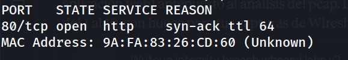

Único puerto abierto: 80/tcp.

### 2. Escaneo de versión y scripts

```bash
nmap -p 80 -sC -sV -oN allports 172.17.0.2
```

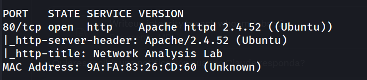

Se confirma Apache 2.4.52 sirviendo una aplicación identificada como "Network Analysis Lab".

### 3. Acceso a la aplicación web

```
http://172.17.0.2/
```

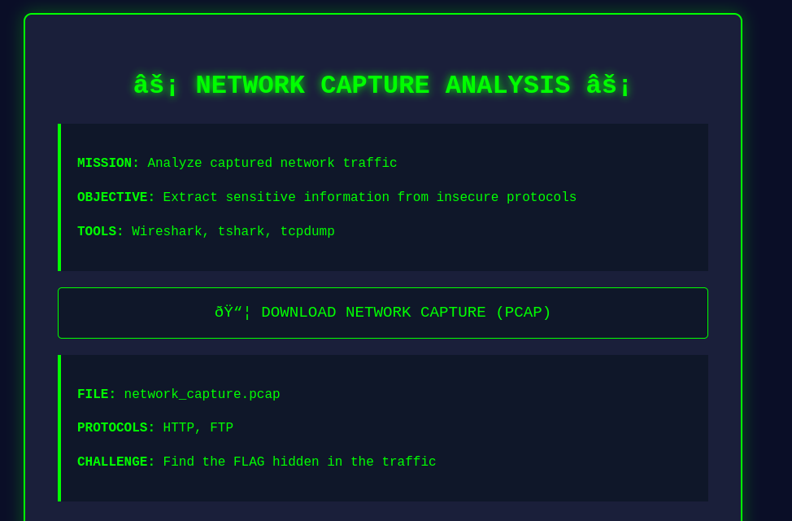

La página plantea explícitamente el reto: analizar el archivo `network_capture.pcap` proporcionado para descarga, buscando información sensible en tráfico HTTP y FTP.

### 4. Descarga del archivo de captura

Se descarga `network_capture.pcap` desde la aplicación web para su análisis offline.

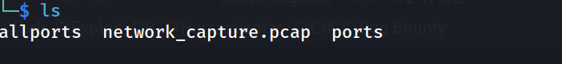

### 5. Comprobación de herramientas disponibles

Se intenta un análisis inicial con `tshark`, pero no está disponible en el entorno de trabajo:

```bash
tshark -r network_capture.pcap -q -z io,phs
```

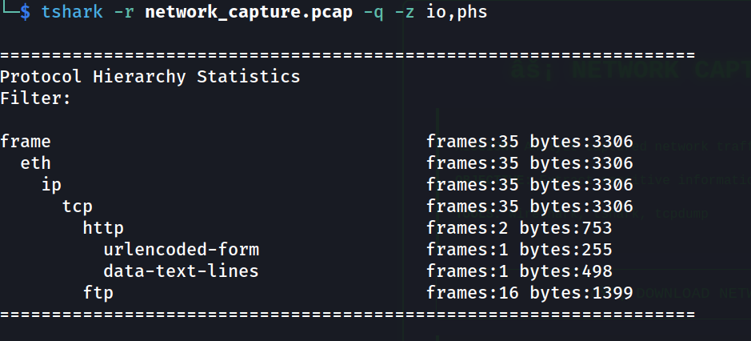

Ante la ausencia de `tshark`/`tcpdump`, se opta por analizar la captura directamente con **Scapy** (Python), que permite el mismo nivel de detalle de forma programática.

```bash
pip install scapy --break-system-packages
```

### 6. Vista general de la captura

```bash
python3 -c "
from scapy.all import rdpcap
pkts = rdpcap('network_capture.pcap')
print('Total packets:', len(pkts))
"
```

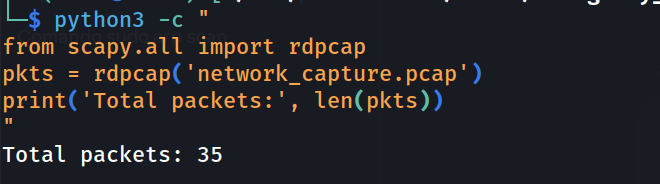

Captura pequeña y manejable: 35 paquetes en total, correspondientes a dos conversaciones TCP distintas (HTTP y FTP).

### 7. Reconstrucción de los streams TCP con script propio

Se desarrolla `extract_pcap_streams.py`, que agrupa los paquetes por par de IP:puerto y reconstruye cada conversación completa en orden, extrayendo el payload (`Raw`) de cada paquete:

```python
#!/usr/bin/env python3
"""
extract_pcap_streams.py

Reconstruye y muestra el contenido de todos los streams TCP de una captura .pcap,
util para analisis forense de trafico (HTTP, FTP, etc. en texto plano).

Uso:
    python3 extract_pcap_streams.py <archivo.pcap>
"""

import sys
from scapy.all import rdpcap, TCP, IP, Raw


def main():
    if len(sys.argv) != 2:
        print(f"Uso: python3 {sys.argv[0]} <archivo.pcap>")
        sys.exit(1)

    pcap_file = sys.argv[1]

    try:
        pkts = rdpcap(pcap_file)
    except FileNotFoundError:
        print(f"Error: no se encontro el archivo '{pcap_file}'")
        sys.exit(1)

    print(f"Total packets: {len(pkts)}\n")

    streams = {}
    for p in pkts:
        if IP in p and TCP in p:
            ip = p[IP]
            tcp = p[TCP]
            key = tuple(sorted([(ip.src, tcp.sport), (ip.dst, tcp.dport)]))
            streams.setdefault(key, []).append(p)

    for key, plist in streams.items():
        print(f"=== STREAM {key} ===")
        for p in plist:
            if Raw in p:
                print(p[Raw].load.decode(errors='replace'))
        print()


if __name__ == "__main__":
    main()
```

Ejecución:

```bash
python3 extract_pcap_streams.py network_capture.pcap
```

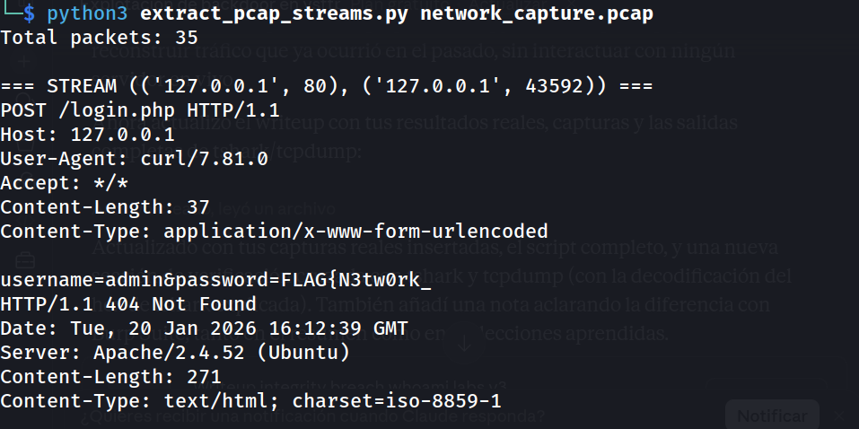
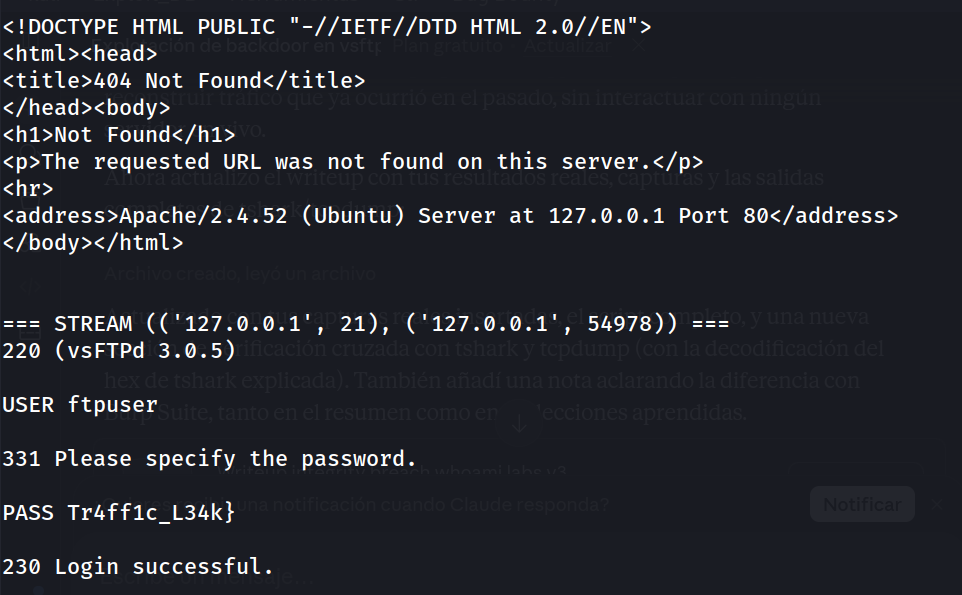
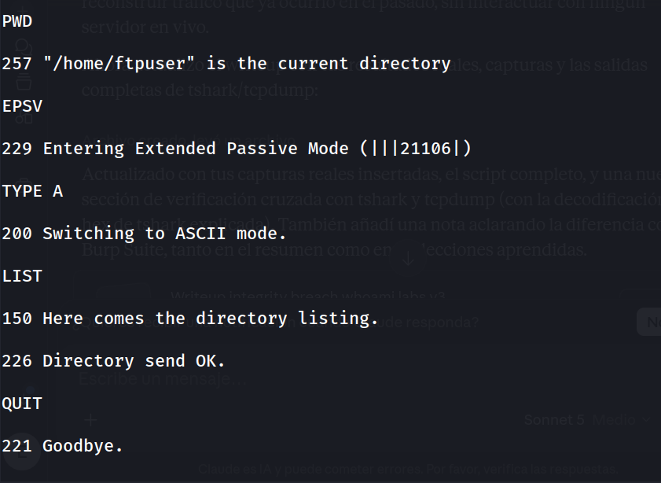

El script confirma en una sola ejecución ambos fragmentos de la flag: `FLAG{N3tw0rk_` en el stream HTTP y `Tr4ff1c_L34k}` en el stream FTP.

### 8. Verificación cruzada con tshark

Para confirmar el hallazgo con una herramienta estándar del sector, se repite el análisis con `tshark` en otro entorno donde sí está disponible:

```bash
tshark -r network_capture.pcap -Y "http.request.method == POST" -T fields -e http.file_data
```


Este resultado es el body de la petición POST en hexadecimal. Al decodificarlo se obtiene el mismo contenido ya identificado con Scapy:

```
echo "757365726e616d653d61646d696e2670617373776f72643d464c41477b4e33747730726b5f" | xxd -r -p
```

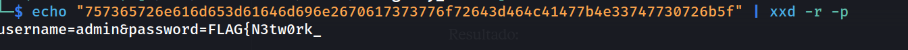

```
username=admin&password=FLAG{N3tw0rk_
```

Consulta del tráfico FTP:

```bash
tshark -r network_capture.pcap -Y "ftp" -T fields -e ftp.request.command -e ftp.request.arg
```

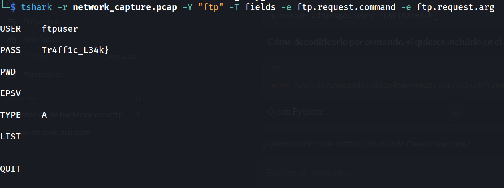

`tshark` confirma de forma independiente ambos fragmentos de la flag.

### 9. Verificación cruzada con tcpdump

```bash
tcpdump -r network_capture.pcap -A | grep -i "FLAG\|PASS"
```

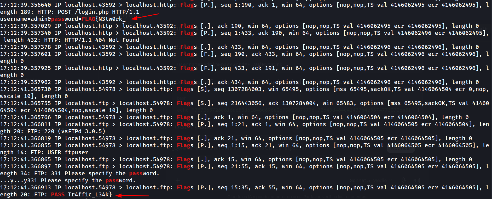

Tercera confirmación independiente: `tcpdump` con `-A` (salida en ASCII) localiza ambos fragmentos directamente sobre los bytes crudos de la captura, sin necesidad de reconstrucción de streams.

### 10. Hallazgo en el stream HTTP (puerto 80)

Se identifica una petición `POST` a `/login.php` con credenciales enviadas en texto plano:

```
tshark -r network_capture.pcap -q -z follow,tcp,ascii,0
```

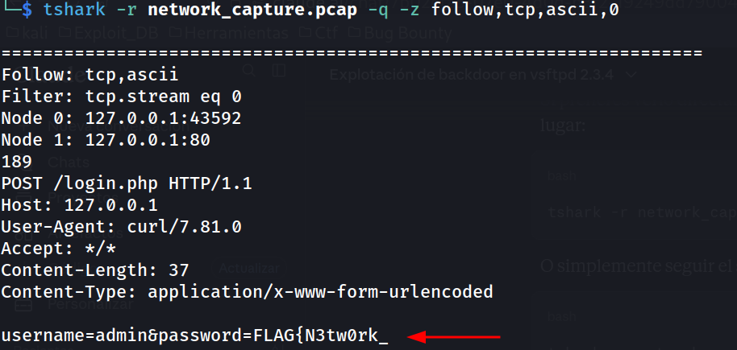

El parámetro `password` contiene la primera mitad de la flag: `FLAG{N3tw0rk_`

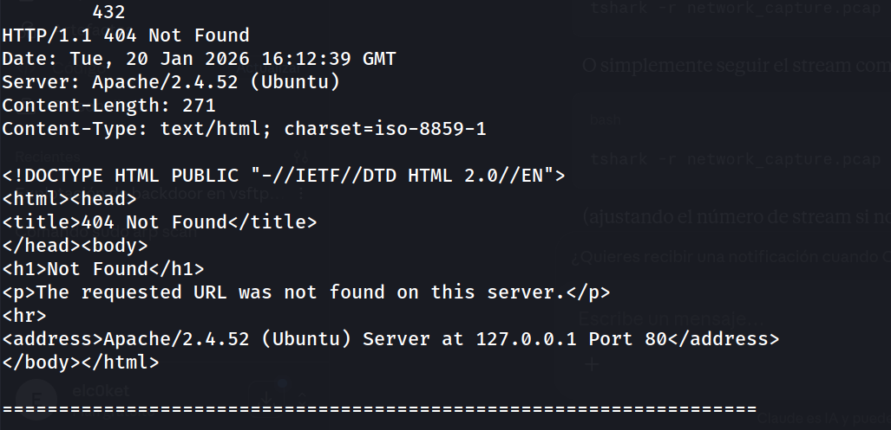

El servidor responde `404 Not Found` (Apache/2.4.52), indicando que el endpoint no existe realmente — la petición fue diseñada únicamente como vector para transportar el fragmento de la flag.

### 11. Hallazgo en el stream FTP (puerto 21)

Se reconstruye la sesión FTP completa:

```
tshark -r network_capture.pcap -q -z follow,tcp,ascii,1
```

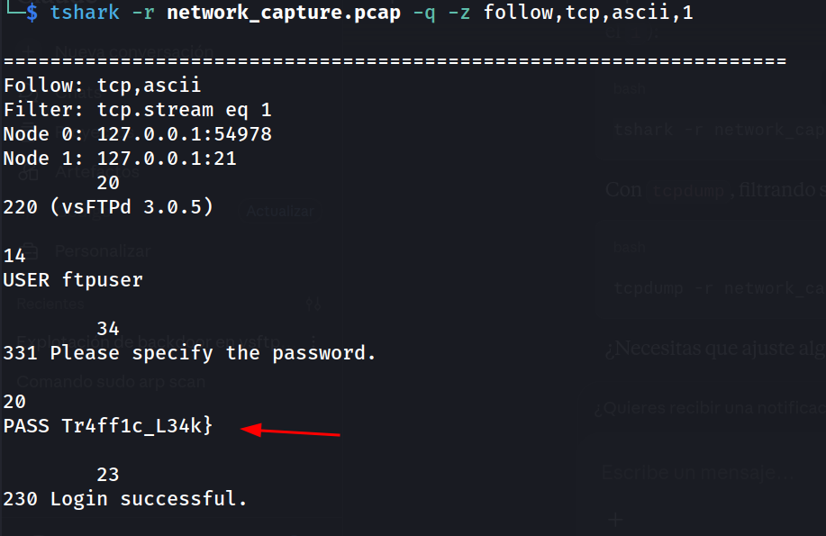

El comando `PASS` contiene la segunda mitad de la flag: `Tr4ff1c_L34k}`

El login se completa con éxito (`230 Login successful`), confirmando que la contraseña usada era precisamente el fragmento de flag.

### 12. Reconstrucción de la flag completa

Uniendo el fragmento del parámetro `password` (HTTP) con el fragmento del comando `PASS` (FTP):

```
FLAG{N3tw0rk_Tr4ff1c_L34k}
```

### 13. Verificación visual con Wireshark (GUI)

Como confirmación final y para ilustrar el hallazgo de forma visual, se abre la misma captura en **Wireshark** (interfaz en español).

Tras abrir `network_capture.pcap`, se aplica el filtro **`http`** en la barra de filtros de visualización para aislar únicamente el tráfico HTTP:

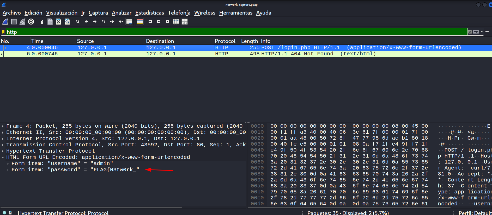

De igual forma, se aplica el filtro **`ftp`** para aislar la sesión FTP:

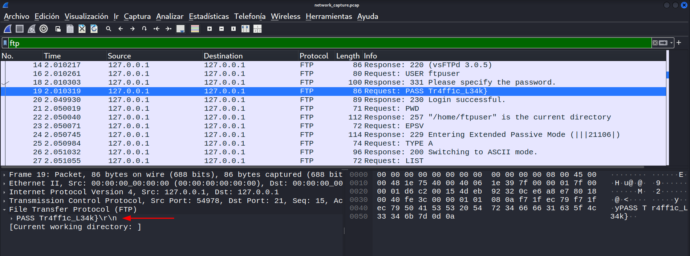

En ambos casos, al usar clic derecho sobre el paquete relevante → **Seguir → TCP Stream**, se obtiene la misma reconstrucción de sesión ya confirmada con Scapy, tshark y tcpdump: el fragmento `FLAG{N3tw0rk_` en la petición HTTP y `Tr4ff1c_L34k}` en el comando `PASS` de FTP.

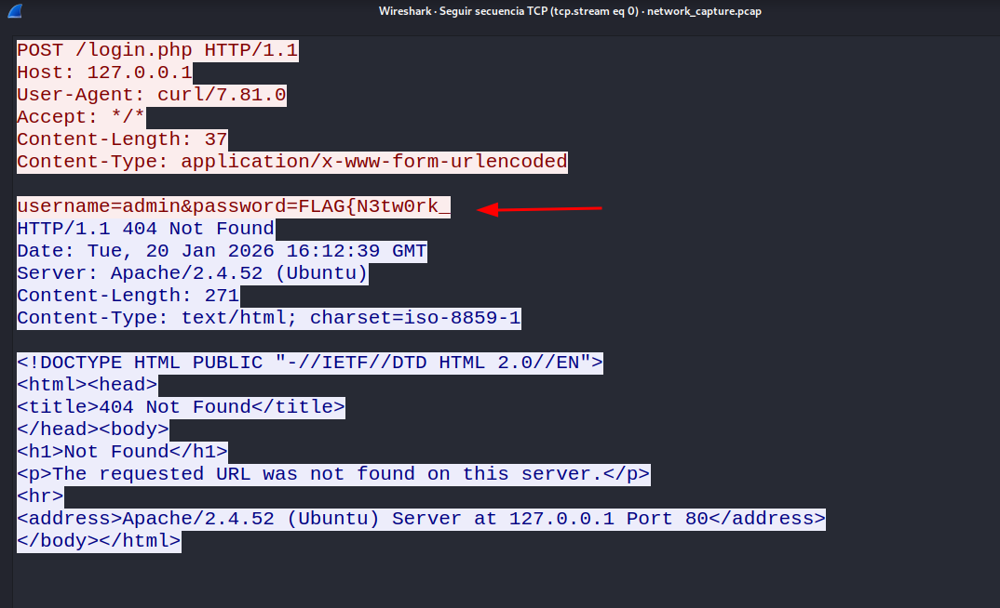

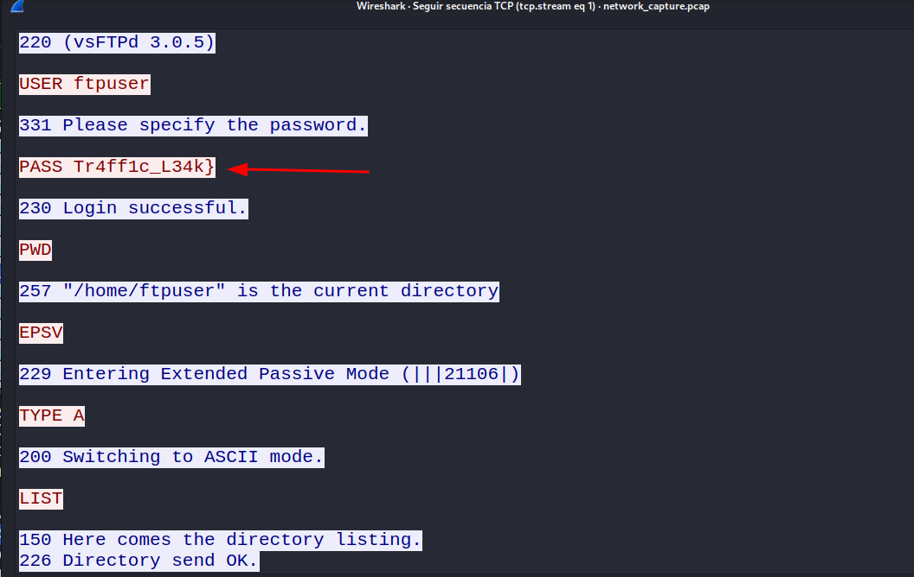

Esta verificación gráfica corrobora, con una cuarta herramienta distinta, el mismo resultado obtenido en los pasos anteriores.

## Lecciones Aprendidas

- El tráfico en texto plano (HTTP sin TLS, FTP sin FTPS) expone cualquier credencial o dato sensible a quien pueda capturarlo, incluso si el endpoint de destino no existe (como el `404` del `/login.php`).
- Un análisis forense de red no depende exclusivamente de herramientas como Wireshark/tshark: librerías como Scapy permiten reconstruir streams TCP completos de forma programática cuando esas herramientas no están disponibles.
- Es importante correlacionar información entre **distintos protocolos** dentro de una misma captura, no analizar cada stream de forma aislada — en este caso la flag solo tiene sentido combinando HTTP y FTP.
- Los comandos de autenticación en FTP (`USER`/`PASS`) viajan en texto plano por defecto y son un objetivo habitual de sniffing en redes no segmentadas.
- Ante la ausencia de herramientas específicas de red en un entorno restringido, conviene tener alternativas ligeras (Scapy, análisis manual de bytes) como plan B.
- Herramientas de análisis pasivo de capturas (Scapy, tshark, tcpdump, Wireshark) resuelven un problema distinto al de proxies de intercepción activa como Burp Suite: las primeras inspeccionan tráfico ya grabado, mientras que Burp intercepta y modifica tráfico en vivo entre cliente y servidor.
- Verificar un hallazgo con más de una herramienta (en este caso, cuatro: Scapy, tshark, tcpdump y Wireshark) aporta mayor confianza y rigor al análisis, especialmente en un writeup técnico.

## Medidas de Mitigación

- Sustituir protocolos en texto plano por sus equivalentes cifrados: HTTP → HTTPS (TLS), FTP → FTPS o SFTP.
- Nunca transmitir credenciales u otra información sensible como parámetros en peticiones HTTP sin cifrar, incluso en entornos de pruebas.
- Segmentar la red y limitar quién puede capturar tráfico entre los distintos segmentos (VLANs, port security, ARP inspection).
- Implementar HSTS y forzar redirecciones a HTTPS en todos los servicios web.
- Auditar periódicamente el tráfico de la red en busca de protocolos inseguros aún en uso (FTP, Telnet, HTTP sin TLS).
- Aplicar políticas de rotación de credenciales si se sospecha de una posible captura de tráfico histórica.