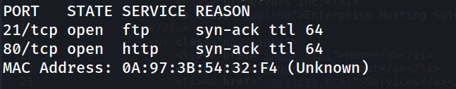
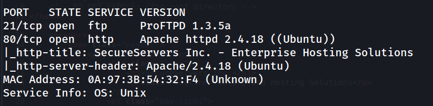
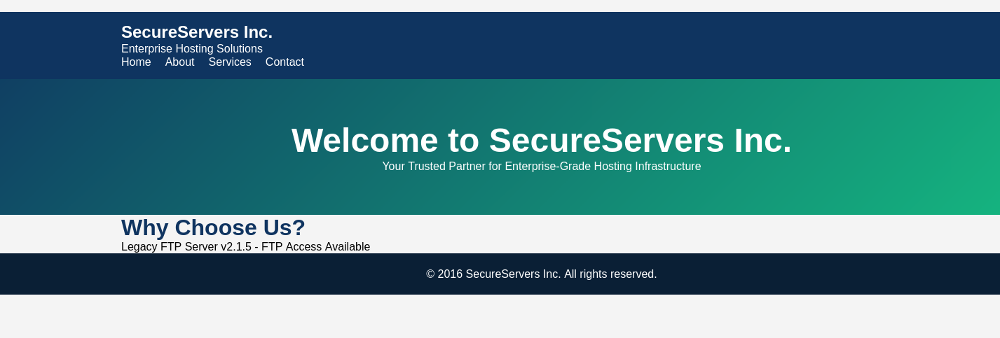
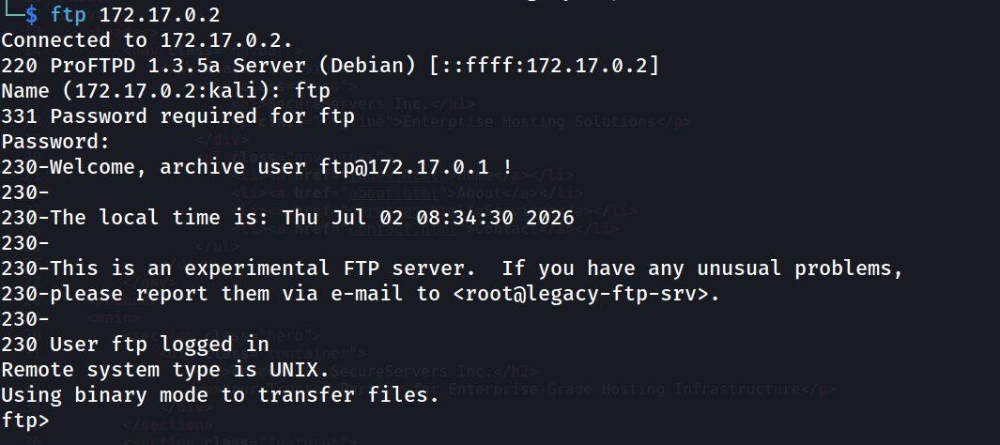
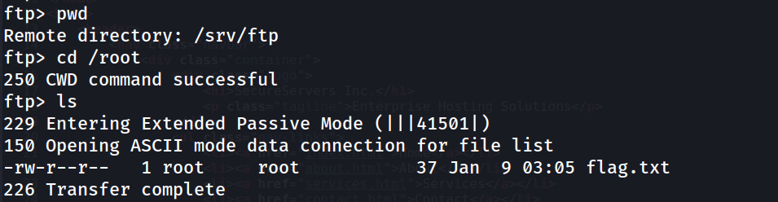
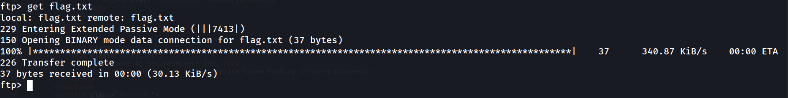
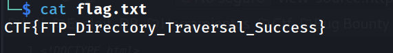

## Información General

|Campo|Valor|
|---|---|
|**Plataforma**|whoami-labs|
|**Dificultad**|Fácil|
|**Autor**|elc0ket|

## Técnicas usadas

- Escaneo de puertos y enumeración de servicios con `nmap`
- Análisis de código fuente HTML en busca de comentarios sensibles
- Extracción de credenciales expuestas en comentarios HTML
- Explotación de vulnerabilidad de Path Traversal en servidor FTP (ProFTPD 1.3.5a)
- Navegación fuera del directorio raíz FTP (`/srv/ftp`) hacia rutas del sistema (`/root`)
- Descarga de archivos sensibles vía FTP

## Reconocimiento

Escaneo inicial de puertos con `nmap`:

```bash
nmap -p- -sS --min-rate 5000 -n -vvv -Pn -oN ports 172.17.0.2
```



Enumeración de versiones y scripts por defecto:

```bash
nmap -p 21,80 -sC -sV -oN allports 172.17.0.2
```


## Fase 1 - Enumeración web

Al acceder al servicio HTTP se muestra una web corporativa genérica:

```
http://172.17.0.2/
```



## Fase 2 - Análisis del código fuente

Revisando el código fuente de la página se encuentran comentarios HTML con información crítica dejada por error en producción:


> [!warning] El código fuente expone credenciales FTP en texto plano (`ftp`/`ftp123`) y además revela explícitamente que el servidor "Legacy FTP Server v2.1.5" es vulnerable a Path Traversal. Este tipo de comentarios de depuración jamás debe llegar a un entorno de producción, ya que proporciona a un atacante tanto credenciales de acceso como la vulnerabilidad exacta a explotar.

## Fase 3 - Acceso al servidor FTP

Con las credenciales obtenidas, se procede a autenticar contra el servicio FTP:

```
ftp 172.17.0.2
```



## Fase 4 - Explotación de Path Traversal

Se confirma el directorio de trabajo inicial y se intenta navegar fuera de la jaula FTP hacia `/root`:



El comando `cd /root` responde con éxito (`250 CWD command successful`), confirmando que ProFTPD 1.3.5a no está restringiendo correctamente la navegación fuera del directorio raíz configurado (`/srv/ftp`), permitiendo el acceso directo al directorio `/root` del sistema.

## Fase 5 - Extracción de la flag

```
ftp> get flag.txt
```



```bash
cat flag.txt
```



## Resumen de ataque

1. Se identificaron dos servicios expuestos (FTP y HTTP) mediante escaneo con `nmap`.
2. El análisis del código fuente de la web reveló credenciales FTP en texto plano dejadas en comentarios HTML, junto con la versión del servicio y su vulnerabilidad conocida.
3. Con dichas credenciales se accedió al servicio FTP (ProFTPD 1.3.5a).
4. Se explotó una vulnerabilidad de Path Traversal que permitió navegar fuera del directorio raíz FTP (`/srv/ftp`) directamente hacia `/root`.
5. Se listó y descargó `flag.txt` desde `/root`, obteniendo la flag final.

## Medidas de mitigación

- Eliminar cualquier comentario de depuración, credenciales o información sensible del código fuente antes de desplegar a producción.
- No reutilizar credenciales por defecto o débiles (`ftp123`, `password123`) en servicios expuestos.
- Actualizar ProFTPD a una versión reciente que corrija las restricciones de directorio (`chroot`/jaula FTP) y aplicar `DefaultRoot` correctamente configurado para impedir la salida del directorio asignado.
- Deshabilitar el acceso FTP anónimo o de bajo privilegio si no es estrictamente necesario, y en su lugar usar SFTP/FTPS.
- Realizar auditorías periódicas de configuración de servicios legacy expuestos a Internet.
- Aplicar el principio de menor privilegio: el usuario `ftp` nunca debería tener capacidad de navegar hacia directorios del sistema como `/root`.

## Flags

```
CTF{FTP_Directory_Traversal_Success}
```


#HackingEtico #CTF #InfoSec